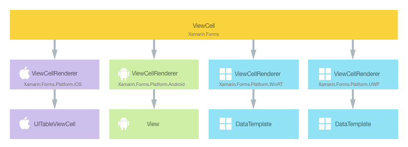
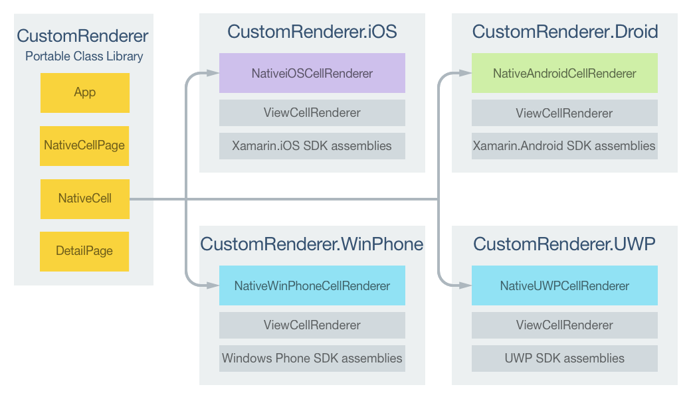
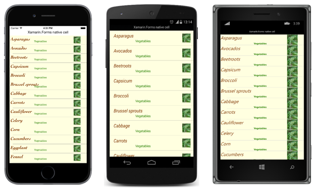

# Customizing a ViewCell

[ Download the sample](/samples/xamarin/xamarin-forms-samples/customrenderers-viewcell)

_A Xamarin.Forms ViewCell is a cell that can be added to a ListView or TableView, which contains a developer-defined view. This article demonstrates how to create a custom renderer for a ViewCell that's hosted inside a Xamarin.Forms ListView control. This stops the Xamarin.Forms layout calculations from being repeatedly called during ListView scrolling._

Every Xamarin.Forms cell has an accompanying renderer for each platform that creates an instance of a native control. When a [`ViewCell`](xref:Xamarin.Forms.ViewCell) is rendered by a Xamarin.Forms application, in iOS the `ViewCellRenderer` class is instantiated, which in turn instantiates a native `UITableViewCell` control. On the Android platform, the `ViewCellRenderer` class instantiates a native `View` control. On the Universal Windows Platform (UWP), the `ViewCellRenderer` class instantiates a native `DataTemplate`. For more information about the renderer and native control classes that Xamarin.Forms controls map to, see [Renderer Base Classes and Native Controls](~/xamarin-forms/app-fundamentals/custom-renderer/renderers.md).

The following diagram illustrates the relationship between the [`ViewCell`](xref:Xamarin.Forms.ViewCell) and the corresponding native controls that implement it:



The rendering process can be taken advantage of to implement platform-specific customizations by creating a custom renderer for a [`ViewCell`](xref:Xamarin.Forms.ViewCell) on each platform. The process for doing this is as follows:

1. [Create](#creating-the-custom-cell) a Xamarin.Forms custom cell.
1. [Consume](#consuming-the-custom-cell) the custom cell from Xamarin.Forms.
1. [Create](#creating-the-custom-renderer-on-each-platform) the custom renderer for the cell on each platform.

Each item will now be discussed in turn, to implement a `NativeCell` renderer that takes advantage of a platform-specific layout for each cell hosted inside a Xamarin.Forms [`ListView`](xref:Xamarin.Forms.ListView) control. This stops the Xamarin.Forms layout calculations from being repeatedly called during `ListView` scrolling.

## Creating the Custom Cell

A custom cell control can be created by subclassing the [`ViewCell`](xref:Xamarin.Forms.ViewCell) class, as shown in the following code example:

```csharp
public class NativeCell : ViewCell
{
  public static readonly BindableProperty NameProperty =
    BindableProperty.Create ("Name", typeof(string), typeof(NativeCell), "");

  public string Name {
    get { return (string)GetValue (NameProperty); }
    set { SetValue (NameProperty, value); }
  }

  public static readonly BindableProperty CategoryProperty =
    BindableProperty.Create ("Category", typeof(string), typeof(NativeCell), "");

  public string Category {
    get { return (string)GetValue (CategoryProperty); }
    set { SetValue (CategoryProperty, value); }
  }

  public static readonly BindableProperty ImageFilenameProperty =
    BindableProperty.Create ("ImageFilename", typeof(string), typeof(NativeCell), "");

  public string ImageFilename {
    get { return (string)GetValue (ImageFilenameProperty); }
    set { SetValue (ImageFilenameProperty, value); }
  }
}
```

The `NativeCell` class is created in the .NET Standard library project and defines the API for the custom cell. The custom cell exposes `Name`, `Category`, and `ImageFilename` properties that can be displayed through data binding. For more information about data binding, see [Data Binding Basics](~/xamarin-forms/xaml/xaml-basics/data-binding-basics.md).

## Consuming the Custom Cell

The `NativeCell` custom cell can be referenced in Xaml in the .NET Standard library project by declaring a namespace for its location and using the namespace prefix on the custom cell element. The following code example shows how the `NativeCell` custom cell can be consumed by a XAML page:

```xaml
<ContentPage ...
    xmlns:local="clr-namespace:CustomRenderer;assembly=CustomRenderer"
    ...>
    ...
    <ContentPage.Content>
          <StackLayout>
              <Label Text="Xamarin.Forms native cell" HorizontalTextAlignment="Center" />
              <ListView x:Name="listView" CachingStrategy="RecycleElement" ItemSelected="OnItemSelected">
                  <ListView.ItemTemplate>
                      <DataTemplate>
                          <local:NativeCell Name="{Binding Name}" Category="{Binding Category}" ImageFilename="{Binding ImageFilename}" />
                      </DataTemplate>
                  </ListView.ItemTemplate>
              </ListView>
          </StackLayout>
      </ContentPage.Content>
</ContentPage>
```

The `local` namespace prefix can be named anything. However, the `clr-namespace` and `assembly` values must match the details of the custom control. Once the namespace is declared, the prefix is used to reference the custom cell.

The following code example shows how the `NativeCell` custom cell can be consumed by a C# page:

```csharp
public class NativeCellPageCS : ContentPage
{
    ListView listView;

    public NativeCellPageCS()
    {
        listView = new ListView(ListViewCachingStrategy.RecycleElement)
        {
            ItemsSource = DataSource.GetList(),
            ItemTemplate = new DataTemplate(() =>
            {
                var nativeCell = new NativeCell();
                nativeCell.SetBinding(NativeCell.NameProperty, "Name");
                nativeCell.SetBinding(NativeCell.CategoryProperty, "Category");
                nativeCell.SetBinding(NativeCell.ImageFilenameProperty, "ImageFilename");

                return nativeCell;
            })
        };

        switch (Device.RuntimePlatform)
        {
            case Device.iOS:
                Padding = new Thickness(0, 20, 0, 0);
                break;
            case Device.Android:
            case Device.UWP:
                Padding = new Thickness(0);
                break;
        }

        Content = new StackLayout
        {
            Children = {
                new Label { Text = "Xamarin.Forms native cell", HorizontalTextAlignment = TextAlignment.Center },
                listView
            }
        };
        listView.ItemSelected += OnItemSelected;
    }
    ...
}
```

A Xamarin.Forms [`ListView`](xref:Xamarin.Forms.ListView) control is used to display a list of data, which is populated through the [`ItemSource`](xref:Xamarin.Forms.ItemsView`1.ItemsSource) property. The [`RecycleElement`](xref:Xamarin.Forms.ListViewCachingStrategy.RecycleElement) caching strategy attempts to minimize the `ListView` memory footprint and execution speed by recycling list cells. For more information, see [Caching Strategy](~/xamarin-forms/user-interface/listview/performance.md#caching-strategy).

Each row in the list contains three items of data – a name, a category, and an image filename. The layout of each row in the list is defined by the `DataTemplate` that's referenced through the [`ListView.ItemTemplate`](xref:Xamarin.Forms.ItemsView`1.ItemTemplate) bindable property. The `DataTemplate` defines that each row of data in the list will be a `NativeCell` that displays its `Name`, `Category`, and `ImageFilename` properties through data binding. For more information about the `ListView` control, see [ListView](~/xamarin-forms/user-interface/listview/index.md).

A custom renderer can now be added to each application project to customize the platform-specific layout for each cell.

## Creating the Custom Renderer on each Platform

The process for creating the custom renderer class is as follows:

1. Create a subclass of the `ViewCellRenderer` class that renders the custom cell.
1. Override the platform-specific method that renders the custom cell and write logic to customize it.
1. Add an `ExportRenderer` attribute to the custom renderer class to specify that it will be used to render the Xamarin.Forms custom cell. This attribute is used to register the custom renderer with Xamarin.Forms.

> [!NOTE]
> For most Xamarin.Forms elements, it is optional to provide a custom renderer in each platform project. If a custom renderer isn't registered, then the default renderer for the control's base class will be used. However, custom renderers are required in each platform project when rendering a [ViewCell](xref:Xamarin.Forms.ViewCell) element.

The following diagram illustrates the responsibilities of each project in the sample application, along with the relationships between them:



The `NativeCell` custom cell is rendered by platform-specific renderer classes, which all derive from the `ViewCellRenderer` class for each platform. This results in each `NativeCell` custom cell being rendered with platform-specific layout, as shown in the following screenshots:



The `ViewCellRenderer` class exposes platform-specific methods for rendering the custom cell. This is the `GetCell` method on the iOS platform, the `GetCellCore` method on the Android platform, and the `GetTemplate` method on UWP.

Each custom renderer class is decorated with an `ExportRenderer` attribute that registers the renderer with Xamarin.Forms. The attribute takes two parameters – the type name of the Xamarin.Forms cell being rendered, and the type name of the custom renderer. The `assembly` prefix to the attribute specifies that the attribute applies to the entire assembly.

The following sections discuss the implementation of each platform-specific custom renderer class.

### Creating the Custom Renderer on iOS

The following code example shows the custom renderer for the iOS platform:

```csharp
[assembly: ExportRenderer(typeof(NativeCell), typeof(NativeiOSCellRenderer))]
namespace CustomRenderer.iOS
{
    public class NativeiOSCellRenderer : ViewCellRenderer
    {
        NativeiOSCell cell;

        public override UITableViewCell GetCell(Cell item, UITableViewCell reusableCell, UITableView tv)
        {
            var nativeCell = (NativeCell)item;

            cell = reusableCell as NativeiOSCell;
            if (cell == null)
                cell = new NativeiOSCell(item.GetType().FullName, nativeCell);
            else
                cell.NativeCell.PropertyChanged -= OnNativeCellPropertyChanged;

            nativeCell.PropertyChanged += OnNativeCellPropertyChanged;
            cell.UpdateCell(nativeCell);
            return cell;
        }
        ...
    }
}
```

The `GetCell` method is called to build each cell to be displayed. Each cell is a `NativeiOSCell` instance, which defines the layout of the cell and its data. The operation of the `GetCell` method is dependent upon the [`ListView`](xref:Xamarin.Forms.ListView) caching strategy:

- When the [`ListView`](xref:Xamarin.Forms.ListView) caching strategy is [`RetainElement`](xref:Xamarin.Forms.ListViewCachingStrategy.RetainElement), the `GetCell` method will be invoked for each cell. A `NativeiOSCell` instance will be created for each `NativeCell` instance that's initially displayed on the screen. As the user scrolls through the `ListView`, `NativeiOSCell` instances will be re-used. For more information about iOS cell re-use, see [Cell Reuse](~/ios/user-interface/controls/tables/populating-a-table-with-data.md).

  > [!NOTE]
  > This custom renderer code will perform some cell re-use even when the [`ListView`](xref:Xamarin.Forms.ListView) is set to retain cells.

  The data displayed by each `NativeiOSCell` instance, whether newly created or re-used, will be updated with the data from each `NativeCell` instance by the `UpdateCell` method.

  > [!NOTE]
  > The `OnNativeCellPropertyChanged` method will never be invoked when the [`ListView`](xref:Xamarin.Forms.ListView) caching strategy is set to retain cells.

- When the [`ListView`](xref:Xamarin.Forms.ListView) caching strategy is [`RecycleElement`](xref:Xamarin.Forms.ListViewCachingStrategy.RecycleElement), the `GetCell` method will be invoked for each cell that's initially displayed on the screen. A `NativeiOSCell` instance will be created for each `NativeCell` instance that's initially displayed on the screen. The data displayed by each `NativeiOSCell` instance will be updated with the data from the `NativeCell` instance by the `UpdateCell` method. However, the `GetCell` method won't be invoked as the user scrolls through the `ListView`. Instead, the `NativeiOSCell` instances will be re-used. `PropertyChanged` events will be raised on the `NativeCell` instance when its data changes, and the `OnNativeCellPropertyChanged` event handler will update the data in each re-used `NativeiOSCell` instance.

The following code example shows the `OnNativeCellPropertyChanged` method that's invoked when a `PropertyChanged` event is raised:

```csharp
namespace CustomRenderer.iOS
{
    public class NativeiOSCellRenderer : ViewCellRenderer
    {
        ...

        void OnNativeCellPropertyChanged(object sender, PropertyChangedEventArgs e)
        {
            var nativeCell = (NativeCell)sender;
            if (e.PropertyName == NativeCell.NameProperty.PropertyName)
            {
                cell.HeadingLabel.Text = nativeCell.Name;
            }
            else if (e.PropertyName == NativeCell.CategoryProperty.PropertyName)
            {
                cell.SubheadingLabel.Text = nativeCell.Category;
            }
            else if (e.PropertyName == NativeCell.ImageFilenameProperty.PropertyName)
            {
                cell.CellImageView.Image = cell.GetImage(nativeCell.ImageFilename);
            }
        }
    }
}
```

This method updates the data being displayed by re-used `NativeiOSCell` instances. A check for the property that's changed is made, as the method can be called multiple times.

The `NativeiOSCell` class defines the layout for each cell, and is shown in the following code example:

```csharp
internal class NativeiOSCell : UITableViewCell, INativeElementView
{
  public UILabel HeadingLabel { get; set; }
  public UILabel SubheadingLabel { get; set; }
  public UIImageView CellImageView { get; set; }

  public NativeCell NativeCell { get; private set; }
  public Element Element => NativeCell;

  public NativeiOSCell(string cellId, NativeCell cell) : base(UITableViewCellStyle.Default, cellId)
  {
    NativeCell = cell;

    SelectionStyle = UITableViewCellSelectionStyle.Gray;
    ContentView.BackgroundColor = UIColor.FromRGB(255, 255, 224);
    CellImageView = new UIImageView();

    HeadingLabel = new UILabel()
    {
      Font = UIFont.FromName("Cochin-BoldItalic", 22f),
      TextColor = UIColor.FromRGB(127, 51, 0),
      BackgroundColor = UIColor.Clear
    };

    SubheadingLabel = new UILabel()
    {
      Font = UIFont.FromName("AmericanTypewriter", 12f),
      TextColor = UIColor.FromRGB(38, 127, 0),
      TextAlignment = UITextAlignment.Center,
      BackgroundColor = UIColor.Clear
    };

    ContentView.Add(HeadingLabel);
    ContentView.Add(SubheadingLabel);
    ContentView.Add(CellImageView);
  }

  public void UpdateCell(NativeCell cell)
  {
    HeadingLabel.Text = cell.Name;
    SubheadingLabel.Text = cell.Category;
    CellImageView.Image = GetImage(cell.ImageFilename);
  }

  public UIImage GetImage(string filename)
  {
    return (!string.IsNullOrWhiteSpace(filename)) ? UIImage.FromFile("Images/" + filename + ".jpg") : null;
  }

  public override void LayoutSubviews()
  {
    base.LayoutSubviews();

    HeadingLabel.Frame = new CGRect(5, 4, ContentView.Bounds.Width - 63, 25);
    SubheadingLabel.Frame = new CGRect(100, 18, 100, 20);
    CellImageView.Frame = new CGRect(ContentView.Bounds.Width - 63, 5, 33, 33);
  }
}
```

This class defines the controls used to render the cell's contents, and their layout. The class implements the [`INativeElementView`](xref:Xamarin.Forms.INativeElementView) interface, which is required when the [`ListView`](xref:Xamarin.Forms.ListView) uses the [`RecycleElement`](xref:Xamarin.Forms.ListViewCachingStrategy.RecycleElement) caching strategy. This interface specifies that the class must implement the [`Element`](xref:Xamarin.Forms.INativeElementView.Element) property, which should return the custom cell data for recycled cells.

The `NativeiOSCell` constructor initializes the appearance of the `HeadingLabel`, `SubheadingLabel`, and `CellImageView` properties. These properties are used to display the data stored in the `NativeCell` instance, with the `UpdateCell` method being called to set the value of each property. In addition, when the [`ListView`](xref:Xamarin.Forms.ListView) uses the [`RecycleElement`](xref:Xamarin.Forms.ListViewCachingStrategy.RecycleElement) caching strategy, the data displayed by the `HeadingLabel`, `SubheadingLabel`, and `CellImageView` properties can be updated by the `OnNativeCellPropertyChanged` method in the custom renderer.

Cell layout is performed by the `LayoutSubviews` override, which sets the coordinates of `HeadingLabel`, `SubheadingLabel`, and `CellImageView` within the cell.

### Creating the Custom Renderer on Android

The following code example shows the custom renderer for the Android platform:

```csharp
[assembly: ExportRenderer(typeof(NativeCell), typeof(NativeAndroidCellRenderer))]
namespace CustomRenderer.Droid
{
    public class NativeAndroidCellRenderer : ViewCellRenderer
    {
        NativeAndroidCell cell;

        protected override Android.Views.View GetCellCore(Cell item, Android.Views.View convertView, ViewGroup parent, Context context)
        {
            var nativeCell = (NativeCell)item;
            Console.WriteLine("\t\t" + nativeCell.Name);

            cell = convertView as NativeAndroidCell;
            if (cell == null)
            {
                cell = new NativeAndroidCell(context, nativeCell);
            }
            else
            {
                cell.NativeCell.PropertyChanged -= OnNativeCellPropertyChanged;
            }

            nativeCell.PropertyChanged += OnNativeCellPropertyChanged;

            cell.UpdateCell(nativeCell);
            return cell;
        }
        ...
    }
}
```

The `GetCellCore` method is called to build each cell to be displayed. Each cell is a `NativeAndroidCell` instance, which defines the layout of the cell and its data. The operation of the `GetCellCore` method is dependent upon the [`ListView`](xref:Xamarin.Forms.ListView) caching strategy:

- When the [`ListView`](xref:Xamarin.Forms.ListView) caching strategy is [`RetainElement`](xref:Xamarin.Forms.ListViewCachingStrategy.RetainElement), the `GetCellCore` method will be invoked for each cell. A `NativeAndroidCell` will be created for each `NativeCell` instance that's initially displayed on the screen. As the user scrolls through the `ListView`, `NativeAndroidCell` instances will be re-used. For more information about Android cell re-use, see [Row View Re-use](~/android/user-interface/layouts/list-view/populating.md).

  > [!NOTE]
  > Note that this custom renderer code will perform some cell re-use even when the [`ListView`](xref:Xamarin.Forms.ListView) is set to retain cells.

  The data displayed by each `NativeAndroidCell` instance, whether newly created or re-used, will be updated with the data from each `NativeCell` instance by the `UpdateCell` method.

  > [!NOTE]
  > Note that while the `OnNativeCellPropertyChanged` method will be invoked when the [`ListView`](xref:Xamarin.Forms.ListView) is set to retain cells, it will not update the `NativeAndroidCell` property values.

- When the [`ListView`](xref:Xamarin.Forms.ListView) caching strategy is [`RecycleElement`](xref:Xamarin.Forms.ListViewCachingStrategy.RecycleElement), the `GetCellCore` method will be invoked for each cell that's initially displayed on the screen. A `NativeAndroidCell` instance will be created for each `NativeCell` instance that's initially displayed on the screen. The data displayed by each `NativeAndroidCell` instance will be updated with the data from the `NativeCell` instance by the `UpdateCell` method. However, the `GetCellCore` method won't be invoked as the user scrolls through the `ListView`. Instead, the `NativeAndroidCell` instances will be re-used.  `PropertyChanged` events will be raised on the `NativeCell` instance when its data changes, and the `OnNativeCellPropertyChanged` event handler will update the data in each re-used `NativeAndroidCell` instance.

The following code example shows the `OnNativeCellPropertyChanged` method that's invoked when a `PropertyChanged` event is raised:

```csharp
namespace CustomRenderer.Droid
{
    public class NativeAndroidCellRenderer : ViewCellRenderer
    {
        ...

        void OnNativeCellPropertyChanged(object sender, PropertyChangedEventArgs e)
        {
            var nativeCell = (NativeCell)sender;
            if (e.PropertyName == NativeCell.NameProperty.PropertyName)
            {
                cell.HeadingTextView.Text = nativeCell.Name;
            }
            else if (e.PropertyName == NativeCell.CategoryProperty.PropertyName)
            {
                cell.SubheadingTextView.Text = nativeCell.Category;
            }
            else if (e.PropertyName == NativeCell.ImageFilenameProperty.PropertyName)
            {
                cell.SetImage(nativeCell.ImageFilename);
            }
        }
    }
}
```

This method updates the data being displayed by re-used `NativeAndroidCell` instances. A check for the property that's changed is made, as the method can be called multiple times.

The `NativeAndroidCell` class defines the layout for each cell, and is shown in the following code example:

```csharp
internal class NativeAndroidCell : LinearLayout, INativeElementView
{
  public TextView HeadingTextView { get; set; }
  public TextView SubheadingTextView { get; set; }
  public ImageView ImageView { get; set; }

  public NativeCell NativeCell { get; private set; }
  public Element Element => NativeCell;

  public NativeAndroidCell(Context context, NativeCell cell) : base(context)
  {
    NativeCell = cell;

    var view = (context as Activity).LayoutInflater.Inflate(Resource.Layout.NativeAndroidCell, null);
    HeadingTextView = view.FindViewById<TextView>(Resource.Id.HeadingText);
    SubheadingTextView = view.FindViewById<TextView>(Resource.Id.SubheadingText);
    ImageView = view.FindViewById<ImageView>(Resource.Id.Image);

    AddView(view);
  }

  public void UpdateCell(NativeCell cell)
  {
    HeadingTextView.Text = cell.Name;
    SubheadingTextView.Text = cell.Category;

    // Dispose of the old image
    if (ImageView.Drawable != null)
    {
      using (var image = ImageView.Drawable as BitmapDrawable)
      {
        if (image != null)
        {
          if (image.Bitmap != null)
          {
            image.Bitmap.Dispose();
          }
        }
      }
    }

    SetImage(cell.ImageFilename);
  }

  public void SetImage(string filename)
  {
    if (!string.IsNullOrWhiteSpace(filename))
    {
      // Display new image
      Context.Resources.GetBitmapAsync(filename).ContinueWith((t) =>
      {
        var bitmap = t.Result;
        if (bitmap != null)
        {
          ImageView.SetImageBitmap(bitmap);
          bitmap.Dispose();
        }
      }, TaskScheduler.FromCurrentSynchronizationContext());
    }
    else
    {
      // Clear the image
      ImageView.SetImageBitmap(null);
    }
  }
}
```

This class defines the controls used to render the cell's contents, and their layout. The class implements the [`INativeElementView`](xref:Xamarin.Forms.INativeElementView) interface, which is required when the [`ListView`](xref:Xamarin.Forms.ListView) uses the [`RecycleElement`](xref:Xamarin.Forms.ListViewCachingStrategy.RecycleElement) caching strategy. This interface specifies that the class must implement the [`Element`](xref:Xamarin.Forms.INativeElementView.Element) property, which should return the custom cell data for recycled cells.

The `NativeAndroidCell` constructor inflates the `NativeAndroidCell` layout, and initializes the `HeadingTextView`, `SubheadingTextView`, and `ImageView` properties to the controls in the inflated layout. These properties are used to display the data stored in the `NativeCell` instance, with the `UpdateCell` method being called to set the value of each property. In addition, when the [`ListView`](xref:Xamarin.Forms.ListView) uses the [`RecycleElement`](xref:Xamarin.Forms.ListViewCachingStrategy.RecycleElement) caching strategy, the data displayed by the `HeadingTextView`, `SubheadingTextView`, and `ImageView` properties can be updated by the `OnNativeCellPropertyChanged` method in the custom renderer.

The following code example shows the layout definition for the `NativeAndroidCell.axml` layout file:

```xml
<?xml version="1.0" encoding="utf-8"?>
<RelativeLayout xmlns:android="http://schemas.android.com/apk/res/android"
    android:layout_width="fill_parent"
    android:layout_height="wrap_content"
    android:padding="8dp"
    android:background="@drawable/CustomSelector">
    <LinearLayout
        android:id="@+id/Text"
        android:orientation="vertical"
        android:layout_width="wrap_content"
        android:layout_height="wrap_content"
        android:paddingLeft="10dip">
        <TextView
            android:id="@+id/HeadingText"
            android:layout_width="wrap_content"
            android:layout_height="wrap_content"
            android:textColor="#FF7F3300"
            android:textSize="20dip"
            android:textStyle="italic" />
        <TextView
            android:id="@+id/SubheadingText"
            android:layout_width="wrap_content"
            android:layout_height="wrap_content"
            android:textSize="14dip"
            android:textColor="#FF267F00"
            android:paddingLeft="100dip" />
    </LinearLayout>
    <ImageView
        android:id="@+id/Image"
        android:layout_width="48dp"
        android:layout_height="48dp"
        android:padding="5dp"
        android:src="@drawable/icon"
        android:layout_alignParentRight="true" />
</RelativeLayout>
```

This layout specifies that two `TextView` controls and an `ImageView` control are used to display the cell's content. The two `TextView` controls are vertically oriented within a `LinearLayout` control, with all the controls being contained within a `RelativeLayout`.

### Creating the Custom Renderer on UWP

The following code example shows the custom renderer for UWP:

```csharp
[assembly: ExportRenderer(typeof(NativeCell), typeof(NativeUWPCellRenderer))]
namespace CustomRenderer.UWP
{
    public class NativeUWPCellRenderer : ViewCellRenderer
    {
        public override Windows.UI.Xaml.DataTemplate GetTemplate(Cell cell)
        {
            return App.Current.Resources["ListViewItemTemplate"] as Windows.UI.Xaml.DataTemplate;
        }
    }
}
```

The `GetTemplate` method is called to return the cell to be rendered for each row of data in the list. It creates a `DataTemplate` for each `NativeCell` instance that will be displayed on the screen, with the `DataTemplate` defining the appearance and contents of the cell.

The `DataTemplate` is stored in the application-level resource dictionary, and is shown in the following code example:

```xaml
<DataTemplate x:Key="ListViewItemTemplate">
    <Grid Background="LightYellow">
        <Grid.Resources>
            <local:ConcatImageExtensionConverter x:Name="ConcatImageExtensionConverter" />
        </Grid.Resources>
        <Grid.RowDefinitions>
            <RowDefinition Height="Auto" />
            <RowDefinition Height="Auto" />
        </Grid.RowDefinitions>
        <Grid.ColumnDefinitions>
            <ColumnDefinition Width="0.40*" />
            <ColumnDefinition Width="0.40*"/>
            <ColumnDefinition Width="0.20*" />
        </Grid.ColumnDefinitions>
        <TextBlock Grid.ColumnSpan="2" Foreground="#7F3300" FontStyle="Italic" FontSize="22" VerticalAlignment="Top" Text="{Binding Name}" />
        <TextBlock Grid.RowSpan="2" Grid.Column="1" Foreground="#267F00" FontWeight="Bold" FontSize="12" VerticalAlignment="Bottom" Text="{Binding Category}" />
        <Image Grid.RowSpan="2" Grid.Column="2" HorizontalAlignment="Left" VerticalAlignment="Center" Source="{Binding ImageFilename, Converter={StaticResource ConcatImageExtensionConverter}}" Width="50" Height="50" />
        <Line Grid.Row="1" Grid.ColumnSpan="3" X1="0" X2="1" Margin="30,20,0,0" StrokeThickness="1" Stroke="LightGray" Stretch="Fill" VerticalAlignment="Bottom" />
    </Grid>
</DataTemplate>
```

The `DataTemplate` specifies the controls used to display the contents of the cell, and their layout and appearance. Two `TextBlock` controls and an `Image` control are used to display the cell's content through data binding. In addition, an instance of the `ConcatImageExtensionConverter` is used to concatenate the `.jpg` file extension to each image file name. This ensures that the `Image` control can load and render the image when it's `Source` property is set.

## Summary

This article has demonstrated how to create a custom renderer for a [`ViewCell`](xref:Xamarin.Forms.ViewCell) that's hosted inside a Xamarin.Forms [`ListView`](xref:Xamarin.Forms.ListView) control. This stops the Xamarin.Forms layout calculations from being repeatedly called during `ListView` scrolling.

## Related Links

- [ListView Performance](~/xamarin-forms/user-interface/listview/performance.md)
- [CustomRendererViewCell (sample)](/samples/xamarin/xamarin-forms-samples/customrenderers-viewcell)