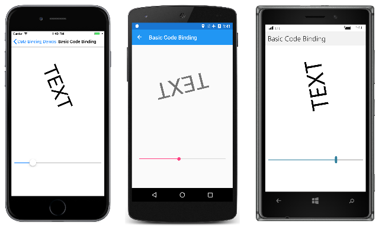
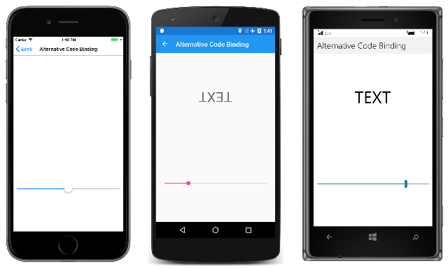
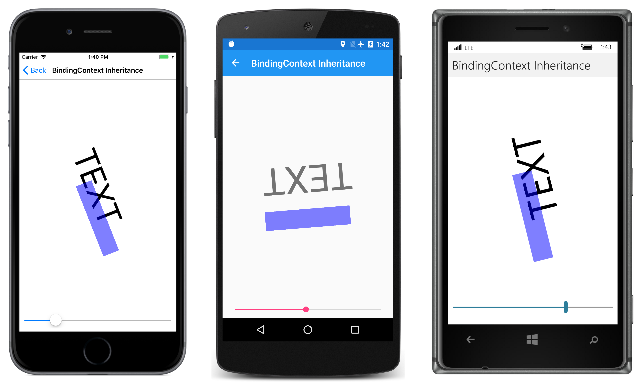

# Xamarin.Forms Basic Bindings

[ Download the sample](/samples/xamarin/xamarin-forms-samples/databindingdemos)

A Xamarin.Forms data binding links a pair of properties between two objects, at least one of which is usually a user-interface object. These two objects are called the *target* and the *source*:

- The *target* is the object (and property) on which the data binding is set.
- The *source* is the object (and property) referenced by the data binding.

This distinction can sometimes be a little confusing: In the simplest case, data flows from the source to the target, which means that the value of the target property is set from the value of the source property. However, in some cases, data can alternatively flow from the target to the source, or in both directions. To avoid confusion, keep in mind that the target is always the object on which the data binding is set even if it's providing data rather than receiving data.

## Bindings with a Binding Context

Although data bindings are usually specified entirely in XAML, it's instructive to see data bindings in code. The **Basic Code Binding** page contains a XAML file with a `Label` and a `Slider`:

```xaml
<ContentPage xmlns="http://xamarin.com/schemas/2014/forms"
             xmlns:x="http://schemas.microsoft.com/winfx/2009/xaml"
             x:Class="DataBindingDemos.BasicCodeBindingPage"
             Title="Basic Code Binding">
    <StackLayout Padding="10, 0">
        <Label x:Name="label"
               Text="TEXT"
               FontSize="48"
               HorizontalOptions="Center"
               VerticalOptions="CenterAndExpand" />

        <Slider x:Name="slider"
                Maximum="360"
                VerticalOptions="CenterAndExpand" />
    </StackLayout>
</ContentPage>
```

The `Slider` is set for a range of 0 to 360. The intent of this program is to rotate the `Label` by manipulating the `Slider`.

Without data bindings, you would set the `ValueChanged` event of the `Slider` to an event handler that accesses the `Value` property of the `Slider` and sets that value to the `Rotation` property of the `Label`. The data binding automates that job; the event handler and the code within it are no longer necessary.

You can set a binding on an instance of any class that derives from [`BindableObject`](xref:Xamarin.Forms.BindableObject), which includes `Element`, `VisualElement`, `View`, and `View` derivatives.  The binding is always set on the target object. The binding references the source object. To set the data binding, use the following two members of the target class:

- The [`BindingContext`](xref:Xamarin.Forms.BindableObject.BindingContext) property specifies the source object.
- The [`SetBinding`](xref:Xamarin.Forms.BindableObject.SetBinding(Xamarin.Forms.BindableProperty,Xamarin.Forms.BindingBase)) method specifies the target property and source property.

In this example, the `Label` is the binding target, and the `Slider` is the binding source. Changes in the `Slider` source affect the rotation of the `Label` target. Data flows from the source to the target.

The `SetBinding` method defined by `BindableObject` has an argument of type [`BindingBase`](xref:Xamarin.Forms.BindingBase) from which the [`Binding`](xref:Xamarin.Forms.Binding) class derives, but there are other `SetBinding` methods defined by the [`BindableObjectExtensions`](xref:Xamarin.Forms.BindableObjectExtensions) class. The code-behind file in the **Basic Code Binding** sample uses a simpler [`SetBinding`](xref:Xamarin.Forms.BindableObjectExtensions.SetBinding*) extension method from this class.

```csharp
public partial class BasicCodeBindingPage : ContentPage
{
    public BasicCodeBindingPage()
    {
        InitializeComponent();

        label.BindingContext = slider;
        label.SetBinding(Label.RotationProperty, "Value");
    }
}
```

The `Label` object is the binding target so that's the object on which this property is set and on which the method is called. The `BindingContext` property indicates the binding source, which is the `Slider`.

The `SetBinding` method is called on the binding target but specifies both the target property and the source property. The target property is specified as a `BindableProperty` object: `Label.RotationProperty`. The source property is specified as a string and indicates the `Value` property of `Slider`.

The `SetBinding` method reveals one of the most important rules of data bindings:

*The target property must be backed by a bindable property.*

This rule implies that the target object must be an instance of a class that derives from `BindableObject`. See the [**Bindable Properties**](~/xamarin-forms/xaml/bindable-properties.md) article for an overview of bindable objects and bindable properties.

There is no such rule for the source property, which is specified as a string. Internally, reflection is used to access the actual property. In this particular case, however, the `Value` property is also backed by a bindable property.

The code can be simplified somewhat: The `RotationProperty` bindable property is defined by `VisualElement`, and inherited by `Label` and `ContentPage` as well, so the class name isn't required in the `SetBinding` call:

```csharp
label.SetBinding(RotationProperty, "Value");
```

However, including the class name is a good reminder of the target object.

As you manipulate the `Slider`, the `Label` rotates accordingly:

[](basic-bindings-images/basiccodebinding-large.png#lightbox "Basic Code Binding")

The **Basic Xaml Binding** page is identical to **Basic Code Binding** except that it defines the entire data binding in XAML:

```xaml
<ContentPage xmlns="http://xamarin.com/schemas/2014/forms"
             xmlns:x="http://schemas.microsoft.com/winfx/2009/xaml"
             x:Class="DataBindingDemos.BasicXamlBindingPage"
             Title="Basic XAML Binding">
    <StackLayout Padding="10, 0">
        <Label Text="TEXT"
               FontSize="80"
               HorizontalOptions="Center"
               VerticalOptions="CenterAndExpand"
               BindingContext="{x:Reference Name=slider}"
               Rotation="{Binding Path=Value}" />

        <Slider x:Name="slider"
                Maximum="360"
                VerticalOptions="CenterAndExpand" />
    </StackLayout>
</ContentPage>
```

Just as in code, the data binding is set on the target object, which is the `Label`. Two XAML markup extensions are involved. These are instantly recognizable by the curly brace delimiters:

- The `x:Reference` markup extension is required to reference the source object, which is the `Slider` named `slider`.
- The `Binding` markup extension links the `Rotation` property of the `Label` to the `Value` property of the `Slider`.

See the article [XAML Markup Extensions](~/xamarin-forms/xaml/markup-extensions/index.md) for more information about XAML markup extensions. The `x:Reference` markup extension is supported by the [`ReferenceExtension`](xref:Xamarin.Forms.Xaml.ReferenceExtension) class; `Binding` is supported by the [`BindingExtension`](xref:Xamarin.Forms.Xaml.BindingExtension) class. As the XML namespace prefixes indicate, `x:Reference` is part of the XAML 2009 specification, while `Binding` is part of Xamarin.Forms. Notice that no quotation marks appear within the curly braces.

It's easy to forget the `x:Reference` markup extension when setting the `BindingContext`. It's common to mistakenly set the property directly to the name of the binding source like this:

```xaml
BindingContext="slider"
```

But that's not right. That markup sets the `BindingContext` property to a `string` object whose characters spell "slider"!

Notice that the source property is specified with the [`Path`](xref:Xamarin.Forms.Xaml.BindingExtension.Path) property of `BindingExtension`, which corresponds with the [`Path`](xref:Xamarin.Forms.Binding.Path) property of the [`Binding`](xref:Xamarin.Forms.Binding) class.

The markup shown on the **Basic XAML Binding** page can be simplified: XAML markup extensions such as `x:Reference` and `Binding` can have *content property* attributes defined, which for XAML markup extensions means that the property name doesn't need to appear. The `Name` property is the content property of `x:Reference`, and the `Path` property is the content property of `Binding`, which means that they can be eliminated from the expressions:

```xaml
<Label Text="TEXT"
       FontSize="80"
       HorizontalOptions="Center"
       VerticalOptions="CenterAndExpand"
       BindingContext="{x:Reference slider}"
       Rotation="{Binding Value}" />
```

## Bindings without a Binding Context

The `BindingContext` property is an important component of data bindings, but it is not always necessary. The source object can instead be specified in the `SetBinding` call or the `Binding` markup extension.

This is demonstrated in the **Alternative Code Binding** sample. The XAML file is similar to the **Basic Code Binding** sample except that the `Slider` is defined to control the `Scale` property of the `Label`. For that reason, the `Slider` is set for a range of &ndash;2 to 2:

```xaml
<ContentPage xmlns="http://xamarin.com/schemas/2014/forms"
             xmlns:x="http://schemas.microsoft.com/winfx/2009/xaml"
             x:Class="DataBindingDemos.AlternativeCodeBindingPage"
             Title="Alternative Code Binding">
    <StackLayout Padding="10, 0">
        <Label x:Name="label"
               Text="TEXT"
               FontSize="40"
               HorizontalOptions="Center"
               VerticalOptions="CenterAndExpand" />

        <Slider x:Name="slider"
                Minimum="-2"
                Maximum="2"
                VerticalOptions="CenterAndExpand" />
    </StackLayout>
</ContentPage>
```

The code-behind file sets the binding with the [`SetBinding`](xref:Xamarin.Forms.BindableObject.SetBinding(Xamarin.Forms.BindableProperty,Xamarin.Forms.BindingBase)) method defined by `BindableObject`. The argument is a [constructor](xref:Xamarin.Forms.Binding.%23ctor(System.String,Xamarin.Forms.BindingMode,Xamarin.Forms.IValueConverter,System.Object,System.String,System.Object)) for the [`Binding`](xref:Xamarin.Forms.Binding) class:

```csharp
public partial class AlternativeCodeBindingPage : ContentPage
{
    public AlternativeCodeBindingPage()
    {
        InitializeComponent();

        label.SetBinding(Label.ScaleProperty, new Binding("Value", source: slider));
    }
}
```

The `Binding` constructor has 6 parameters, so the `source` parameter is specified with a named argument. The argument is the `slider` object.

Running this program might be a little surprising:

[](basic-bindings-images/alternativecodebinding-large.png#lightbox "Alternative Code Binding")

The iOS screen on the left shows how the screen looks when the page first appears. Where is the `Label`?

The problem is that the `Slider` has an initial value of 0. This causes the `Scale` property of the `Label` to be also set to 0, overriding its default value of 1. This results in the `Label` being initially invisible. As the Android screenshot demonstrates, you can manipulate the `Slider` to make the `Label` appear again, but its initial disappearance is disconcerting.

You'll discover in the [next article](binding-mode.md) how to avoid this problem by initializing the `Slider` from the default value of the `Scale` property.

> [!NOTE]
> The [`VisualElement`](xref:Xamarin.Forms.VisualElement) class also defines [`ScaleX`](xref:Xamarin.Forms.VisualElement.ScaleX) and [`ScaleY`](xref:Xamarin.Forms.VisualElement.ScaleY) properties, which can scale the `VisualElement` differently in the horizontal and vertical directions.

The **Alternative XAML Binding** page shows the equivalent binding entirely in XAML:

```xaml
<ContentPage xmlns="http://xamarin.com/schemas/2014/forms"
             xmlns:x="http://schemas.microsoft.com/winfx/2009/xaml"
             x:Class="DataBindingDemos.AlternativeXamlBindingPage"
             Title="Alternative XAML Binding">
    <StackLayout Padding="10, 0">
        <Label Text="TEXT"
               FontSize="40"
               HorizontalOptions="Center"
               VerticalOptions="CenterAndExpand"
               Scale="{Binding Source={x:Reference slider},
                               Path=Value}" />

        <Slider x:Name="slider"
                Minimum="-2"
                Maximum="2"
                VerticalOptions="CenterAndExpand" />
    </StackLayout>
</ContentPage>
```

Now the `Binding` markup extension has two properties set, `Source` and `Path`, separated by a comma. They can appear on the same line if you prefer:

```xaml
Scale="{Binding Source={x:Reference slider}, Path=Value}" />
```

The `Source` property is set to an embedded `x:Reference` markup extension that otherwise has the same syntax as setting the `BindingContext`. Notice that no quotation marks appear within the curly braces, and that the two properties must be separated by a comma.

The content property of the `Binding` markup extension is `Path`, but the `Path=` part of the markup extension can only be eliminated if it is the first property in the expression. To eliminate the `Path=` part, you need to swap the two properties:

```xaml
Scale="{Binding Value, Source={x:Reference slider}}" />
```

Although XAML markup extensions are usually delimited by curly braces, they can also be expressed as object elements:

```xaml
<Label Text="TEXT"
       FontSize="40"
       HorizontalOptions="Center"
       VerticalOptions="CenterAndExpand">
    <Label.Scale>
        <Binding Source="{x:Reference slider}"
                 Path="Value" />
    </Label.Scale>
</Label>
```

Now the `Source` and `Path` properties are regular XAML attributes: The values appear within quotation marks and the attributes are not separated by a comma. The `x:Reference` markup extension can also become an object element:

```xaml
<Label Text="TEXT"
       FontSize="40"
       HorizontalOptions="Center"
       VerticalOptions="CenterAndExpand">
    <Label.Scale>
        <Binding Path="Value">
            <Binding.Source>
                <x:Reference Name="slider" />
            </Binding.Source>
        </Binding>
    </Label.Scale>
</Label>
```

This syntax isn't common, but sometimes it's necessary when complex objects are involved.

The examples shown so far set the `BindingContext` property and the `Source` property of `Binding` to an `x:Reference` markup extension to reference another view on the page. These two properties are of type `Object`, and they can be set to any object that includes properties that are suitable for binding sources.

In the articles ahead, you'll discover that you can set the `BindingContext` or `Source` property to an `x:Static` markup extension to reference the value of a static property or field, or a `StaticResource` markup extension to reference an object stored in a resource dictionary, or directly to an object, which is generally (but not always) an instance of a ViewModel.

The `BindingContext` property can also be set to a `Binding` object so that the `Source` and `Path` properties of `Binding` define the binding context.

## Binding Context Inheritance

In this article, you've seen that you can specify the source object using the `BindingContext` property or the `Source` property of the `Binding` object. If both are set, the `Source` property of the `Binding` takes precedence over the `BindingContext`.

The `BindingContext` property has an extremely important characteristic:

*The setting of the `BindingContext` property is inherited through the visual tree.*

As you'll see, this can be very handy for simplifying binding expressions, and in some cases &mdash; particularly in Model-View-ViewModel (MVVM) scenarios &mdash; it is essential.

The **Binding Context Inheritance** sample is a simple demonstration of the inheritance of the binding context:

```xaml
<ContentPage xmlns="http://xamarin.com/schemas/2014/forms"
             xmlns:x="http://schemas.microsoft.com/winfx/2009/xaml"
             x:Class="DataBindingDemos.BindingContextInheritancePage"
             Title="BindingContext Inheritance">
    <StackLayout Padding="10">

        <StackLayout VerticalOptions="FillAndExpand"
                     BindingContext="{x:Reference slider}">

            <Label Text="TEXT"
                   FontSize="80"
                   HorizontalOptions="Center"
                   VerticalOptions="EndAndExpand"
                   Rotation="{Binding Value}" />

            <BoxView Color="#800000FF"
                     WidthRequest="180"
                     HeightRequest="40"
                     HorizontalOptions="Center"
                     VerticalOptions="StartAndExpand"
                     Rotation="{Binding Value}" />
        </StackLayout>

        <Slider x:Name="slider"
                Maximum="360" />

    </StackLayout>
</ContentPage>
```

The `BindingContext` property of the `StackLayout` is set to the `slider` object. This binding context is inherited by both the `Label` and the `BoxView`, both of which have their `Rotation` properties set to the `Value` property of the `Slider`:

[](basic-bindings-images/bindingcontextinheritance-large.png#lightbox "Binding Context Inheritance")

In the [next article](binding-mode.md), you'll see how the *binding mode* can change the flow of data between target and source objects.

## Related Links

- [Data Binding Demos (sample)](/samples/xamarin/xamarin-forms-samples/databindingdemos)
- [Data binding chapter from Xamarin.Forms book](~/xamarin-forms/creating-mobile-apps-xamarin-forms/summaries/chapter16.md)

## Related Video

> [!Video https://learn.microsoft.com/shows/XamarinShow/XamarinForms-101-Data-Binding/player]

[!include[](~/essentials/includes/xamarin-show-essentials.md)]
