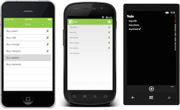
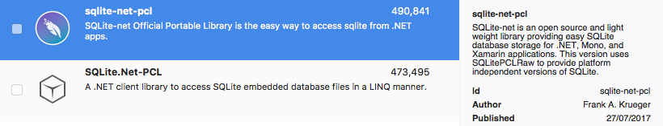
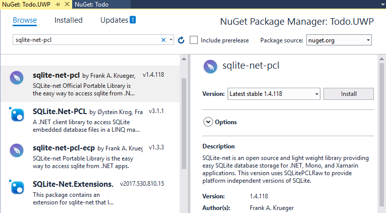

# Local Databases

_Xamarin.Forms supports database-driven applications using the SQLite database engine, which makes it possible to load and save objects in shared code. This article describes how Xamarin.Forms applications can read and write data to a local SQLite database using SQLite.Net._

## Overview

Xamarin.Forms applications can use the [SQLite.NET PCL NuGet](https://www.nuget.org/packages/sqlite-net-pcl/) package to incorporate database operations into shared code by referencing the `SQLite` classes that ship in the NuGet. Database operations can be defined in the .NET Standard library project of the Xamarin.Forms solution, with platform-specific projects returning a path to where the database will be stored.

The accompanying [sample application](https://github.com/xamarin/xamarin-forms-samples/tree/master/Todo) is a simple Todo-list application. The following screenshots show how the sample appears on each platform:

[](databases-images/todo-list.png#lightbox "TodoList First Page Screenshots") [](databases-images/todo-list.png#lightbox "TodoList First Page Screenshots")

<a name="Using_SQLite_with_PCL" />

## Using SQLite

This section shows how to add the SQLite.Net NuGet packages to a Xamarin.Forms solution, write methods to perform database operations, and use the [`DependencyService`](~/xamarin-forms/app-fundamentals/dependency-service/index.md) to determine a location to store the database on each platform.

<a name="XamarinForms_PCL_Project" />

### Xamarins.Forms PCL Project

To add SQLite support to a Xamarin.Forms PCL project, use NuGet's search function to find **sqlite-net-pcl** and install the package:


There are a number of NuGet packages with similar names, the correct package has these attributes:

- **Created by:** Frank A. Krueger
- **Id:** sqlite-net-pcl
- **NuGet link:** [sqlite-net-pcl](https://www.nuget.org/packages/sqlite-net-pcl/)

Once the reference has been added, write an interface to abstract the platform-specific functionality, which is to determine the location of the database file. The interface used in the sample defines a single method:

```csharp
public interface IFileHelper
{
  string GetLocalFilePath(string filename);
}
```

Once the interface has been defined, use the [`DependencyService`](~/xamarin-forms/app-fundamentals/dependency-service/index.md) to obtain an implementation and get a local file path (note that this interface has not been implemented yet). The following code gets an implementation in the `App.Database` property:

```csharp
static TodoItemDatabase database;

public static TodoItemDatabase Database
{
  get
  {
    if (database == null)
    {
      database = new TodoItemDatabase(DependencyService.Get<IFileHelper>().GetLocalFilePath("TodoSQLite.db3"));
    }
    return database;
  }
}
```

The `TodoItemDatabase` constructor is shown below:

```csharp
public TodoItemDatabase(string dbPath)
{
  database = new SQLiteAsyncConnection(dbPath);
  database.CreateTableAsync<TodoItem>().Wait();
}
```

This approach creates a single database connection that is kept open while the application runs, therefore avoiding the expense of opening and closing the database file each time a database operation is performed.

The remainder of the `TodoItemDatabase` class contains SQLite queries that run cross-platform. Example query code is shown below (more details on the syntax can be found in the
[Using SQLite.NET](~/cross-platform/app-fundamentals/index.md) article):

```csharp
public Task<List<TodoItem>> GetItemsAsync()
{
  return database.Table<TodoItem>().ToListAsync();
}

public Task<List<TodoItem>> GetItemsNotDoneAsync()
{
  return database.QueryAsync<TodoItem>("SELECT * FROM [TodoItem] WHERE [Done] = 0");
}

public Task<TodoItem> GetItemAsync(int id)
{
  return database.Table<TodoItem>().Where(i => i.ID == id).FirstOrDefaultAsync();
}

public Task<int> SaveItemAsync(TodoItem item)
{
  if (item.ID != 0)
  {
    return database.UpdateAsync(item);
  }
  else {
    return database.InsertAsync(item);
  }
}

public Task<int> DeleteItemAsync(TodoItem item)
{
  return database.DeleteAsync(item);
}
```

> [!NOTE]
> The advantage of using the asynchronous SQLite.Net API is that database operations are moved to background threads. In addition, there's no need to write additional concurrency handling code because the API takes care of it.

All the the data access code is written in the PCL project to be shared across all platforms. Only getting a local file path for the database requires platform-specific code, as outlined in the following sections.

<a name="PCL_iOS" />

### iOS Project

To configure the iOS application, add the same NuGet package to the iOS project using the *NuGet* window:



The only code required is the `IFileHelper` implementation that determines the data file path. The following code places the SQLite database file in the **Library/Databases** folder within the application's sandbox. See the [iOS Working with the File System](~/ios/app-fundamentals/file-system.md) documentation for more information on the different directories that are available for storage.

```csharp
[assembly: Dependency(typeof(FileHelper))]
namespace Todo.iOS
{
	public class FileHelper : IFileHelper
	{
		public string GetLocalFilePath(string filename)
		{
			string docFolder = Environment.GetFolderPath(Environment.SpecialFolder.Personal);
			string libFolder = Path.Combine(docFolder, "..", "Library", "Databases");

			if (!Directory.Exists(libFolder))
			{
				Directory.CreateDirectory(libFolder);
			}

			return Path.Combine(libFolder, filename);
		}
	}
}
```

Note that the code includes the `assembly:Dependency` attribute so that this implementation is discoverable by the `DependencyService`.

<a name="PCL_Android" />

### Android Project

To configure the Android application, add the same NuGet package to the Android project using the *NuGet* window:


Once this reference has been added, the only code required is the `IFileHelper` implementation that determines the data file path.

```csharp
[assembly: Dependency(typeof(FileHelper))]
namespace Todo.Droid
{
	public class FileHelper : IFileHelper
	{
		public string GetLocalFilePath(string filename)
		{
			string path = Environment.GetFolderPath(Environment.SpecialFolder.Personal);
			return Path.Combine(path, filename);
		}
	}
}
```

<a name="PCL_UWP" />

### Windows 10 Universal Windows Platform (UWP)

To configure the UWP application, add the same NuGet package to the UWP project using the *NuGet* window:



Once the reference is added, implement the `IFileHelper` interface using the platform-specific `Windows.Storage` API to determine the data file path.

```csharp
using Windows.Storage;
...

[assembly: Dependency(typeof(FileHelper))]
namespace Todo.UWP
{
	public class FileHelper : IFileHelper
	{
		public string GetLocalFilePath(string filename)
		{
			return Path.Combine(ApplicationData.Current.LocalFolder.Path, filename);
		}
	}
}

```

## Summary

Xamarin.Forms supports database-driven applications using the SQLite database engine, which makes it possible to load and save objects in shared code.

This article focused on **accessing** a SQLite database using Xamarin.Forms. For more information on working with SQLite.Net itself, refer to the [Data Access: Using SQLite.NET](~/cross-platform/app-fundamentals/index.md) documentation. Most SQLite.Net code is sharable across all platforms; only configuring the location of the SQLite database file requires platform-specific functionality.


## Related Links

- [Todo Sample](https://developer.xamarin.com/samples/xamarin-forms/Todo/)
- [Xamarin.Forms Samples](https://developer.xamarin.com/samples/xamarin-forms/all/)
- [Database Workbook](https://developer.xamarin.com/workbooks/xamarin-forms/application-fundamentals/database/database.workbook)
