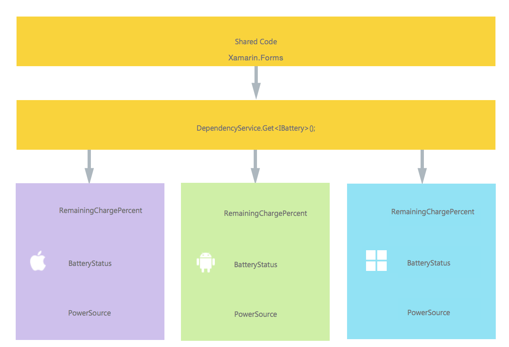
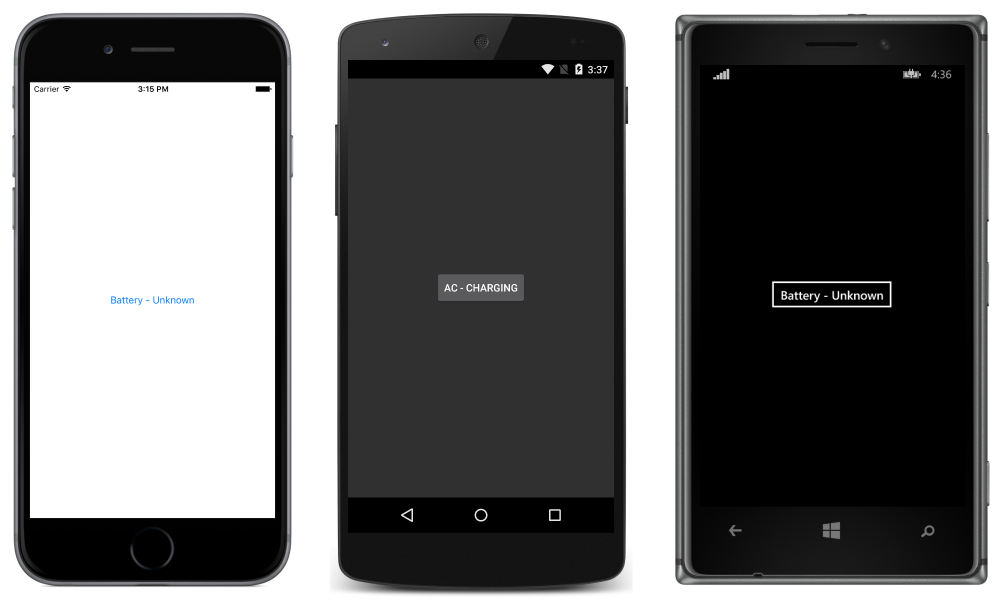

# Checking Battery Status

[ Download the sample](https://developer.xamarin.com/samples/DependencyService)

This article walks through the creation of an application that checks battery status. This article is based on the Battery Plugin by James Montemagno. For more information, see the [GitHub repo](https://github.com/jamesmontemagno/Xamarin.Plugins/tree/master/Battery).

Because Xamarin.Forms does not include functionality for checking the current battery status, this application will need to use [`DependencyService`](xref:Xamarin.Forms.DependencyService) to take advantage of native APIs.  This article will cover the following steps for using `DependencyService`:

- **[Creating the Interface](#Creating_the_Interface)** &ndash; understand how the interface is created in shared code.
- **[iOS Implementation](#iOS_Implementation)** &ndash; learn how to implement the interface in native code for iOS.
- **[Android Implementation](#Android_Implementation)** &ndash; learn how to implement the interface in native code for Android.
- **[Universal Windows Platform Implementation](#UWPImplementation)** &ndash; learn how to implement the interface in native code for the Universal Windows Platform (UWP).
- **[Implementing in Shared Code](#Implementing_in_Shared_Code)** &ndash; learn how to use `DependencyService` to call into the native implementation from shared code.

When completed, the application using `DependencyService` will have the following structure:



<a name="Creating_the_Interface" />

## Creating the Interface

First, create an interface in shared code that expresses the desired functionality. In the case of a battery checking application, the relevant information is the percentage of the battery remaining, whether the device is charging or not, and how the device is receiving power:

```csharp
namespace DependencyServiceSample
{
  public enum BatteryStatus
  {
    Charging,
    Discharging,
    Full,
    NotCharging,
    Unknown
  }

  public enum PowerSource
  {
    Battery,
    Ac,
    Usb,
    Wireless,
    Other
  }

  public interface IBattery
  {
    int RemainingChargePercent { get; }
    BatteryStatus Status { get; }
    PowerSource PowerSource { get; }
  }
}
```

Coding against this interface in the shared code will allow the Xamarin.Forms app to access the power management APIs on each platform.

> [!NOTE]
> Classes implementing the Interface must have a parameterless constructor to work with the `DependencyService`. Constructors can't be defined by interfaces.

<a name="iOS_Implementation" />

## iOS Implementation

The `IBattery` interface must be implemented in each platform-specific application project. The iOS implementation will use the native [`UIDevice`](xref:UIKit.UIDevice) APIs to access battery information. Note that the following class has a parameterless constructor so that the `DependencyService` can create new instances:

```csharp
using UIKit;
using Foundation;
using DependencyServiceSample.iOS;

namespace DependencyServiceSample.iOS
{
  public class BatteryImplementation : IBattery
  {
    public BatteryImplementation()
    {
      UIDevice.CurrentDevice.BatteryMonitoringEnabled = true;
    }

    public int RemainingChargePercent
    {
      get
      {
        return (int)(UIDevice.CurrentDevice.BatteryLevel * 100F);
      }
    }

    public BatteryStatus Status
    {
      get
      {
        switch (UIDevice.CurrentDevice.BatteryState)
        {
          case UIDeviceBatteryState.Charging:
            return BatteryStatus.Charging;
          case UIDeviceBatteryState.Full:
            return BatteryStatus.Full;
          case UIDeviceBatteryState.Unplugged:
            return BatteryStatus.Discharging;
          default:
            return BatteryStatus.Unknown;
        }
      }
    }

    public PowerSource PowerSource
    {
      get
      {
        switch (UIDevice.CurrentDevice.BatteryState)
        {
          case UIDeviceBatteryState.Charging:
            return PowerSource.Ac;
          case UIDeviceBatteryState.Full:
            return PowerSource.Ac;
          case UIDeviceBatteryState.Unplugged:
            return PowerSource.Battery;
          default:
            return PowerSource.Other;
        }
      }
    }
  }
}
```

Finally, add this `[assembly]` attribute above the class (and outside any namespaces that have been defined), including any required `using` statements:

```csharp
using UIKit;
using Foundation;
using DependencyServiceSample.iOS;//necessary for registration outside of namespace

[assembly: Xamarin.Forms.Dependency (typeof (BatteryImplementation))]
namespace DependencyServiceSample.iOS
{
  public class BatteryImplementation : IBattery {
    ...
```

This attribute registers the class as an implementation of the `IBattery` interface, which means that `DependencyService.Get<IBattery>` can be used in  shared code to create an instance of it:

<a name="Android_Implementation" />

## Android Implementation

The Android implementation uses the [`Android.OS.BatteryManager`](https://developer.xamarin.com/api/type/Android.OS.BatteryManager/) API. This implementation is more complex than the iOS version, requiring checks to handle lack of battery permissions:

```csharp
using System;
using Android;
using Android.Content;
using Android.App;
using Android.OS;
using BatteryStatus = Android.OS.BatteryStatus;
using DependencyServiceSample.Droid;

namespace DependencyServiceSample.Droid
{
  public class BatteryImplementation : IBattery
  {
    private BatteryBroadcastReceiver batteryReceiver;
    public BatteryImplementation() { }

    public int RemainingChargePercent
    {
      get
      {
        try
        {
          using (var filter = new IntentFilter(Intent.ActionBatteryChanged))
          {
            using (var battery = Application.Context.RegisterReceiver(null, filter))
            {
              var level = battery.GetIntExtra(BatteryManager.ExtraLevel, -1);
              var scale = battery.GetIntExtra(BatteryManager.ExtraScale, -1);

              return (int)Math.Floor(level * 100D / scale);
            }
          }
        }
        catch
        {
          System.Diagnostics.Debug.WriteLine ("Ensure you have android.permission.BATTERY_STATS");
          throw;
        }

      }
    }

    public DependencyServiceSample.BatteryStatus Status
    {
      get
      {
        try
        {
          using (var filter = new IntentFilter(Intent.ActionBatteryChanged))
          {
            using (var battery = Application.Context.RegisterReceiver(null, filter))
            {
              int status = battery.GetIntExtra(BatteryManager.ExtraStatus, -1);
              var isCharging = status == (int)BatteryStatus.Charging || status == (int)BatteryStatus.Full;

              var chargePlug = battery.GetIntExtra(BatteryManager.ExtraPlugged, -1);
              var usbCharge = chargePlug == (int)BatteryPlugged.Usb;
              var acCharge = chargePlug == (int)BatteryPlugged.Ac;
              bool wirelessCharge = false;
              wirelessCharge = chargePlug == (int)BatteryPlugged.Wireless;

              isCharging = (usbCharge || acCharge || wirelessCharge);
              if (isCharging)
                return DependencyServiceSample.BatteryStatus.Charging;

              switch(status)
              {
                case (int)BatteryStatus.Charging:
                  return DependencyServiceSample.BatteryStatus.Charging;
                case (int)BatteryStatus.Discharging:
                  return DependencyServiceSample.BatteryStatus.Discharging;
                case (int)BatteryStatus.Full:
                  return DependencyServiceSample.BatteryStatus.Full;
                case (int)BatteryStatus.NotCharging:
                  return DependencyServiceSample.BatteryStatus.NotCharging;
                default:
                  return DependencyServiceSample.BatteryStatus.Unknown;
              }
            }
          }
        }
        catch
        {
          System.Diagnostics.Debug.WriteLine ("Ensure you have android.permission.BATTERY_STATS");
          throw;
        }
      }
    }

    public PowerSource PowerSource
    {
      get
      {
        try
        {
          using (var filter = new IntentFilter(Intent.ActionBatteryChanged))
          {
            using (var battery = Application.Context.RegisterReceiver(null, filter))
            {
              int status = battery.GetIntExtra(BatteryManager.ExtraStatus, -1);
              var isCharging = status == (int)BatteryStatus.Charging || status == (int)BatteryStatus.Full;

              var chargePlug = battery.GetIntExtra(BatteryManager.ExtraPlugged, -1);
              var usbCharge = chargePlug == (int)BatteryPlugged.Usb;
              var acCharge = chargePlug == (int)BatteryPlugged.Ac;

              bool wirelessCharge = false;
              wirelessCharge = chargePlug == (int)BatteryPlugged.Wireless;

              isCharging = (usbCharge || acCharge || wirelessCharge);

              if (!isCharging)
                return DependencyServiceSample.PowerSource.Battery;
              else if (usbCharge)
                return DependencyServiceSample.PowerSource.Usb;
              else if (acCharge)
                return DependencyServiceSample.PowerSource.Ac;
              else if (wirelessCharge)
                return DependencyServiceSample.PowerSource.Wireless;
              else
                return DependencyServiceSample.PowerSource.Other;
            }
          }
        }
        catch
        {
          System.Diagnostics.Debug.WriteLine ("Ensure you have android.permission.BATTERY_STATS");
          throw;
        }
      }
    }
  }
}
```

Add this `[assembly]` attribute above the class (and outside any namespaces that have been defined), including any required `using` statements:

```csharp
...
using BatteryStatus = Android.OS.BatteryStatus;
using DependencyServiceSample.Droid; //enables registration outside of namespace

[assembly: Xamarin.Forms.Dependency (typeof (BatteryImplementation))]
namespace DependencyServiceSample.Droid
{
  public class BatteryImplementation : IBattery {
    ...
```

This attribute registers the class as an implementation of the `IBattery` interface, which means that `DependencyService.Get<IBattery>` can be used in the shared code can create an instance of it.

<a name="UWPImplementation" />

## Universal Windows Platform Implementation

The UWP implementation uses the `Windows.Devices.Power` APIs to obtain battery status information:

```csharp
using DependencyServiceSample.UWP;
using Xamarin.Forms;

[assembly: Dependency(typeof(BatteryImplementation))]
namespace DependencyServiceSample.UWP
{
    public class BatteryImplementation : IBattery
    {
        private BatteryStatus status = BatteryStatus.Unknown;
        Windows.Devices.Power.Battery battery;

        public BatteryImplementation()
        {
        }

        private Windows.Devices.Power.Battery DefaultBattery
        {
            get
            {
                return battery ?? (battery = Windows.Devices.Power.Battery.AggregateBattery);
            }
        }

        public int RemainingChargePercent
        {
            get
            {
                var finalReport = DefaultBattery.GetReport();
                var finalPercent = -1;

                if (finalReport.RemainingCapacityInMilliwattHours.HasValue && finalReport.FullChargeCapacityInMilliwattHours.HasValue)
                {
                    finalPercent = (int)((finalReport.RemainingCapacityInMilliwattHours.Value /
                        (double)finalReport.FullChargeCapacityInMilliwattHours.Value) * 100);
                }
                return finalPercent;
            }
        }

        public BatteryStatus Status
        {
            get
            {
                var report = DefaultBattery.GetReport();
                var percentage = RemainingChargePercent;

                if (percentage >= 1.0)
                {
                    status = BatteryStatus.Full;
                }
                else if (percentage < 0)
                {
                    status = BatteryStatus.Unknown;
                }
                else
                {
                    switch (report.Status)
                    {
                        case Windows.System.Power.BatteryStatus.Charging:
                            status = BatteryStatus.Charging;
                            break;
                        case Windows.System.Power.BatteryStatus.Discharging:
                            status = BatteryStatus.Discharging;
                            break;
                        case Windows.System.Power.BatteryStatus.Idle:
                            status = BatteryStatus.NotCharging;
                            break;
                        case Windows.System.Power.BatteryStatus.NotPresent:
                            status = BatteryStatus.Unknown;
                            break;
                    }
                }
                return status;
            }
        }

        public PowerSource PowerSource
        {
            get
            {
                if (status == BatteryStatus.Full || status == BatteryStatus.Charging)
                {
                    return PowerSource.Ac;
                }
                return PowerSource.Battery;
            }
        }
    }
}
```

The `[assembly]` attribute above the namespace declaration registers the class as an implementation of the `IBattery` interface, which means that `DependencyService.Get<IBattery>` can be used in shared code to create an instance of it.

<a name="Implementing_in_Shared_Code" />

## Implementing in Shared Code

Now that the interface has been implemented for each platform, the shared application can be written to take advantage of it. The application will consist of a page with a button that when tapped updates its text with the current battery status. It uses the `DependencyService` to get an instance of the `IBattery` interface. At runtime, this instance will be the platform-specific implementation that has full access to the native SDK.

```csharp
public MainPage ()
{
    var button = new Button {
        Text = "Click for battery info",
        VerticalOptions = LayoutOptions.CenterAndExpand,
        HorizontalOptions = LayoutOptions.CenterAndExpand,
    };
    button.Clicked += (sender, e) => {
        var bat = DependencyService.Get<IBattery>();

        switch (bat.PowerSource){
          case PowerSource.Battery:
            button.Text = "Battery - ";
            break;
          case PowerSource.Ac:
            button.Text = "AC - ";
            break;
          case PowerSource.Usb:
            button.Text = "USB - ";
            break;
          case PowerSource.Wireless:
            button.Text = "Wireless - ";
            break;
          case PowerSource.Other:
          default:
            button.Text = "Other - ";
            break;
        }
        switch (bat.Status){
          case BatteryStatus.Charging:
            button.Text += "Charging";
            break;
          case BatteryStatus.Discharging:
            button.Text += "Discharging";
            break;
          case BatteryStatus.NotCharging:
            button.Text += "Not Charging";
            break;
          case BatteryStatus.Full:
            button.Text += "Full";
            break;
          case BatteryStatus.Unknown:
          default:
            button.Text += "Unknown";
            break;
        }
    };
    Content = button;
}
```

Running this application on iOS, Android, or UWP and pressing the button will result in the button text updating to reflect the current power status of the device.




## Related Links

- [DependencyService (sample)](https://developer.xamarin.com/samples/DependencyService)
- [Using DependencyService (sample)](https://developer.xamarin.com/samples/UsingDependencyService/)
- [Xamarin.Forms Samples](https://github.com/xamarin/xamarin-forms-samples)
