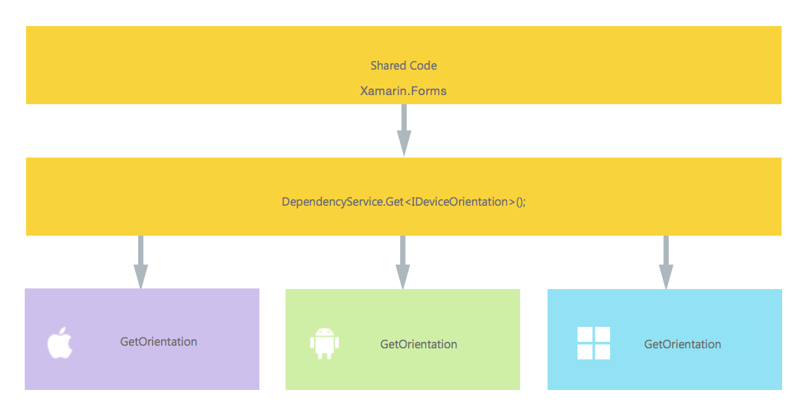
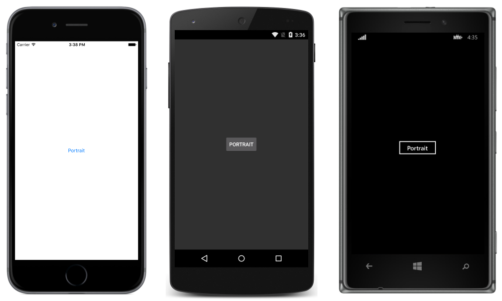

# Checking Device Orientation

[ Download the sample](https://developer.xamarin.com/samples/UsingDependencyService)

This article will guide you to use [`DependencyService`](xref:Xamarin.Forms.DependencyService) to check the device orientation from shared code using the native APIs on each platform. This walkthrough is based on the existing `DeviceOrientation` plugin by Ali Özgür. See the [GitHub repo](https://github.com/aliozgur/Xamarin.Plugins/tree/master/DeviceOrientation) for more information.

- **[Creating the Interface](#Creating_the_Interface)** &ndash; understand how to the interface is created in shared code.
- **[iOS Implementation](#iOS_Implementation)** &ndash; learn how to implement the interface in native code for iOS.
- **[Android Implementation](#Android_Implementation)** &ndash; learn how to implement the interface in native code for Android.
- **[UWP Implementation](#WindowsImplementation)** &ndash; learn how to implement the interface in native code for the Universal Windows Platform (UWP).
- **[Implementing in Shared Code](#Implementing_in_Shared_Code)** &ndash; learn how to use `DependencyService` to call into the native implementation from shared code.

The application using `DependencyService` will have the following structure:



> [!NOTE]
> It is possible to detect whether the device is in portrait or landscape orientation in shared code, as demonstrated in [Device Orientation](~/xamarin-forms/user-interface/layouts/device-orientation.md#Reacting_to_Changes_in_Orientation). The method described in this article uses native features to get more information about orientation, including whether the device is upside down.

<a name="Creating_the_Interface" />

## Creating the Interface

First, create an interface in the shared code that expresses the functionality you plan to implement. For this example, the interface contains a single method:

```csharp
namespace DependencyServiceSample.Abstractions
{
    public enum DeviceOrientations
    {
        Undefined,
        Landscape,
        Portrait
    }

    public interface IDeviceOrientation
    {
        DeviceOrientations GetOrientation();
    }
}
```

Coding against this interface in the shared code will allow the Xamarin.Forms app to access the device orientation APIs on each platform.

> [!NOTE]
> Classes implementing the interface must have a parameterless constructor to work with the `DependencyService`.

<a name="iOS_Implementation" />

## iOS Implementation

The Interface must be implemented in each platform-specific application project. Note that the class has a parameterless constructor so that the `DependencyService` can create new instances:

```csharp
using UIKit;
using Foundation;

namespace DependencyServiceSample.iOS
{
    public class DeviceOrientationImplementation : IDeviceOrientation
    {
        public DeviceOrientationImplementation(){ }

        public DeviceOrientations GetOrientation()
        {
            var currentOrientation = UIApplication.SharedApplication.StatusBarOrientation;
            bool isPortrait = currentOrientation == UIInterfaceOrientation.Portrait
                || currentOrientation == UIInterfaceOrientation.PortraitUpsideDown;

            return isPortrait ? DeviceOrientations.Portrait: DeviceOrientations.Landscape;
        }
    }
}
```

Finally, add this `[assembly]` attribute above the class (and outside any namespaces that have been defined), including any required `using` statements:

```csharp
using UIKit;
using Foundation;
using DependencyServiceSample.iOS; //enables registration outside of namespace

[assembly: Xamarin.Forms.Dependency (typeof (DeviceOrientationImplementation))]
namespace DependencyServiceSample.iOS {
    ...
```

This attribute registers the class as an implementation of the `IDeviceOrientation` Interface, which means that `DependencyService.Get<IDeviceOrientation>` can be used in the shared code to create an instance of it.

<a name="Android_Implementation" />

## Android Implementation

The following code implements `IDeviceOrientation` on Android:

```csharp
using DependencyServiceSample.Droid;
using Android.Hardware;

namespace DependencyServiceSample.Droid
{
    public class DeviceOrientationImplementation : IDeviceOrientation
    {
        public DeviceOrientationImplementation() { }

        public static void Init() { }

        public DeviceOrientations GetOrientation()
        {
            IWindowManager windowManager = Android.App.Application.Context.GetSystemService(Context.WindowService).JavaCast<IWindowManager>();

            var rotation = windowManager.DefaultDisplay.Rotation;
            bool isLandscape = rotation == SurfaceOrientation.Rotation90 || rotation == SurfaceOrientation.Rotation270;
            return isLandscape ? DeviceOrientations.Landscape : DeviceOrientations.Portrait;
        }
    }
}
```

Add this `[assembly]` attribute above the class (and outside any namespaces that have been defined), including any required `using` statements:

```csharp
using DependencyServiceSample.Droid; //enables registration outside of namespace
using Android.Hardware;

[assembly: Xamarin.Forms.Dependency (typeof (DeviceOrientationImplementation))]
namespace DependencyServiceSample.Droid {
    ...
```

This attribute registers the class as an implementation of the `IDeviceOrientaiton` Interface, which means that `DependencyService.Get<IDeviceOrientation>` can be used in the shared code can create an instance of it.

<a name="WindowsImplementation" />

## Universal Windows Platform Implementation

The following code implements the `IDeviceOrientation` interface on the Universal Windows Platform:

```csharp
namespace DependencyServiceSample.WindowsPhone
{
    public class DeviceOrientationImplementation : IDeviceOrientation
    {
        public DeviceOrientationImplementation() { }

        public DeviceOrientations GetOrientation()
        {
            var orientation = Windows.UI.ViewManagement.ApplicationView.GetForCurrentView().Orientation;
            if (orientation == Windows.UI.ViewManagement.ApplicationViewOrientation.Landscape) {
                return DeviceOrientations.Landscape;
            }
            else {
                return DeviceOrientations.Portrait;
            }
        }
    }
}
```

Add the `[assembly]` attribute above the class (and outside any namespaces that have been defined), including any required `using` statements:

```csharp
using DependencyServiceSample.WindowsPhone; //enables registration outside of namespace

[assembly: Dependency(typeof(DeviceOrientationImplementation))]
namespace DependencyServiceSample.WindowsPhone {
    ...
```

This attribute registers the class as an implementation of the `DeviceOrientationImplementation` Interface, which means that `DependencyService.Get<IDeviceOrientation>` can be used in the shared code can create an instance of it.

<a name="Implementing_in_Shared_Code" />

## Implementing in Shared Code

Now we can write and test shared code that accesses the `IDeviceOrientation` interface. This simple page includes a button that updates its own text based on the device orientation. It uses the `DependencyService` to get an instance of the `IDeviceOrientation` interface &ndash; at runtime this instance will be the platform-specific implementation that has full access to the native SDK:

```csharp
public MainPage ()
{
    var orient = new Button {
        Text = "Get Orientation",
        VerticalOptions = LayoutOptions.CenterAndExpand,
        HorizontalOptions = LayoutOptions.CenterAndExpand,
    };
    orient.Clicked += (sender, e) => {
       var orientation = DependencyService.Get<IDeviceOrientation>().GetOrientation();
       switch(orientation){
           case DeviceOrientations.Undefined:
                orient.Text = "Undefined";
                break;
           case DeviceOrientations.Landscape:
                orient.Text = "Landscape";
                break;
           case DeviceOrientations.Portrait:
                orient.Text = "Portrait";
                break;
       }
    };
    Content = orient;
}
```

Running this application on iOS, Android, or the Windows platforms and pressing the button will result in the button's text updating with the device's orientation.




## Related Links

- [Using DependencyService (sample)](https://developer.xamarin.com/samples/UsingDependencyService)
- [DependencyService (sample)](https://developer.xamarin.com/samples/DependencyService/DependencyServiceSample/)
- [Xamarin.Forms Samples](https://github.com/xamarin/xamarin-forms-samples)
