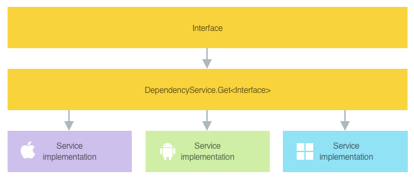

# Xamarin.Forms DependencyService Introduction

[ Download the sample](/samples/xamarin/xamarin-forms-samples/dependencyservice/)

The [`DependencyService`](xref:Xamarin.Forms.DependencyService) class is a service locator that enables Xamarin.Forms applications to invoke native platform functionality from shared code.

The process for using the [`DependencyService`](xref:Xamarin.Forms.DependencyService) to invoke native platform functionality is to:

1. Create an interface for the native platform functionality, in shared code. For more information, see [Create an interface](#create-an-interface).
1. Implement the interface in the required platform projects. For more information, see [Implement the interface on each platform](#implement-the-interface-on-each-platform).
1. Register the platform implementations with the [`DependencyService`](xref:Xamarin.Forms.DependencyService). This enables Xamarin.Forms to locate the platform implementations at runtime. For more information, see [Register the platform implementations](#register-the-platform-implementations).
1. Resolve the platform implementations from shared code, and invoke them. For more information, see [Resolve the platform implementations](#resolve-the-platform-implementations).

The following diagram shows how native platform functionality is invoked in a Xamarin.Forms application:



## Create an interface

The first step in being able to invoke native platform functionality from shared code, is to create an interface that defines the API for interacting with the native platform functionality. This interface should be placed in your shared code project.

The following example shows an interface for an API that can be used to retrieve the orientation of a device:

```csharp
public interface IDeviceOrientationService
{
    DeviceOrientation GetOrientation();
}
```

## Implement the interface on each platform

After creating the interface that defines the API for interacting with the native platform functionality, the interface must be implemented in each platform project.

### iOS

The following code example shows the implementation of the `IDeviceOrientationService` interface on iOS:

```csharp
namespace DependencyServiceDemos.iOS
{
    public class DeviceOrientationService : IDeviceOrientationService
    {
        public DeviceOrientation GetOrientation()
        {
            UIInterfaceOrientation orientation = UIApplication.SharedApplication.StatusBarOrientation;

            bool isPortrait = orientation == UIInterfaceOrientation.Portrait ||
                orientation == UIInterfaceOrientation.PortraitUpsideDown;
            return isPortrait ? DeviceOrientation.Portrait : DeviceOrientation.Landscape;
        }
    }
}
```

### Android

The following code example shows the implementation of the `IDeviceOrientationService` interface on Android:

```csharp
namespace DependencyServiceDemos.Droid
{
    public class DeviceOrientationService : IDeviceOrientationService
    {
        public DeviceOrientation GetOrientation()
        {
            IWindowManager windowManager = Android.App.Application.Context.GetSystemService(Context.WindowService).JavaCast<IWindowManager>();

            SurfaceOrientation orientation = windowManager.DefaultDisplay.Rotation;
            bool isLandscape = orientation == SurfaceOrientation.Rotation90 ||
                orientation == SurfaceOrientation.Rotation270;
            return isLandscape ? DeviceOrientation.Landscape : DeviceOrientation.Portrait;
        }
    }
}
```

### Universal Windows Platform

The following code example shows the implementation of the `IDeviceOrientationService` interface on the Universal Windows Platform (UWP):

```csharp
namespace DependencyServiceDemos.UWP
{
    public class DeviceOrientationService : IDeviceOrientationService
    {
        public DeviceOrientation GetOrientation()
        {
            ApplicationViewOrientation orientation = ApplicationView.GetForCurrentView().Orientation;
            return orientation == ApplicationViewOrientation.Landscape ? DeviceOrientation.Landscape : DeviceOrientation.Portrait;
        }
    }
}
```

## Register the platform implementations

After implementing the interface in each platform project, the platform implementations must be registered with the [`DependencyService`](xref:Xamarin.Forms.DependencyService), so that Xamarin.Forms can locate them at runtime. This is typically performed with the [`DependencyAttribute`](xref:Xamarin.Forms.DependencyAttribute), which indicates that the specified type provides an implementation of the interface.

The following example shows using the [`DependencyAttribute`](xref:Xamarin.Forms.DependencyAttribute) to register the iOS implementation of the `IDeviceOrientationService` interface:

```csharp
using Xamarin.Forms;

[assembly: Dependency(typeof(DependencyServiceDemos.iOS.DeviceOrientationService))]
namespace DependencyServiceDemos.iOS
{
    public class DeviceOrientationService : IDeviceOrientationService
    {
        public DeviceOrientation GetOrientation()
        {
            ...
        }
    }
}
```

In this example, the [`DependencyAttribute`](xref:Xamarin.Forms.DependencyAttribute) registers the `DeviceOrientationService` with the [`DependencyService`](xref:Xamarin.Forms.DependencyService). Similarly, the implementations of the `IDeviceOrientationService` interface on other platforms should be registered with the [`DependencyAttribute`](xref:Xamarin.Forms.DependencyAttribute).

For more information about registering platform implementations with the [`DependencyService`](xref:Xamarin.Forms.DependencyService), see [Xamarin.Forms DependencyService Registration and Resolution](registration-and-resolution.md).

## Resolve the platform implementations

Following registration of platform implementations with the [`DependencyService`](xref:Xamarin.Forms.DependencyService), the implementations must be resolved before being invoked. This is typically performed in shared code using the [`DependencyService.Get<T>`](xref:Xamarin.Forms.DependencyService.Get*) method.

The following code shows an example of calling the [`Get<T>`](xref:Xamarin.Forms.DependencyService.Get*) method to resolve the `IDeviceOrientationService` interface, and then invoking its `GetOrientation` method:

```csharp
IDeviceOrientationService service = DependencyService.Get<IDeviceOrientationService>();
DeviceOrientation orientation = service.GetOrientation();
```

Alternatively, this code can be condensed into a single line:

```csharp
DeviceOrientation orientation = DependencyService.Get<IDeviceOrientationService>().GetOrientation();
```

For more information about resolving platform implementations with the [`DependencyService`](xref:Xamarin.Forms.DependencyService), see [Xamarin.Forms DependencyService Registration and Resolution](registration-and-resolution.md).

## Related links

- [DependencyService Demos (sample)](/samples/xamarin/xamarin-forms-samples/dependencyservice/)
- [Xamarin.Forms DependencyService Registration and Resolution](registration-and-resolution.md)