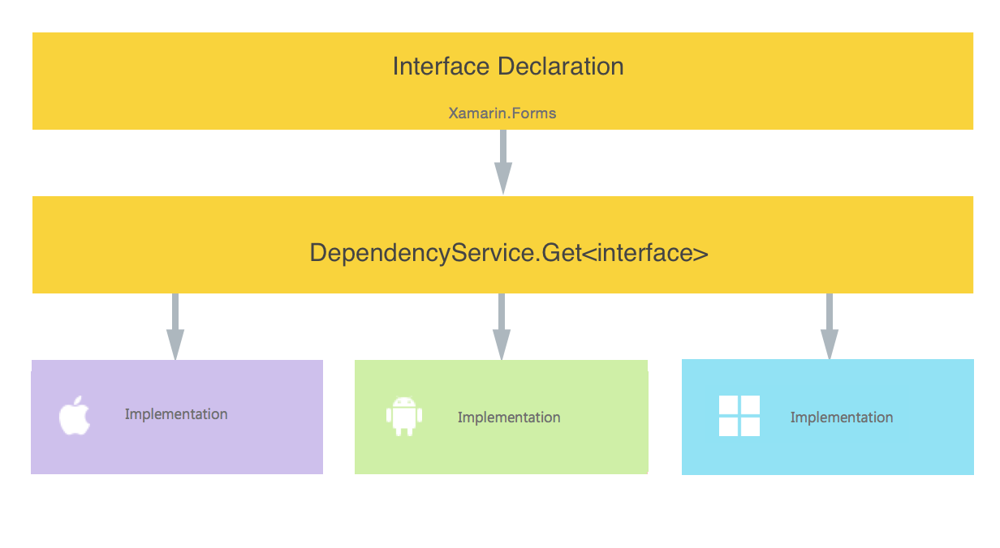
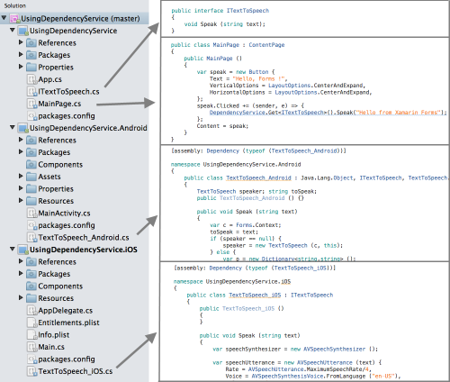

# Introduction to DependencyService

[ Download the sample](https://developer.xamarin.com/samples/xamarin-forms/UsingDependencyService/)

## Overview

[`DependencyService`](xref:Xamarin.Forms.DependencyService) allows apps to call into platform-specific functionality from shared code. This functionality enables Xamarin.Forms apps to do anything that a native app can do.

`DependencyService` is a service locator. In practice, an interface is defined and `DependencyService` finds the correct implementation of that interface from the various platform projects.

> [!NOTE]
> By default, the [`DependencyService`](xref:Xamarin.Forms.DependencyService) will only resolve platform implementations that have parameterless constructors. However, a dependency resolution method can be injected into Xamarin.Forms that uses a dependency injection container or factory methods to resolve platform implementations. This approach can be used to resolve platform implementations that have constructors with parameters. For more information, see [Dependency resolution in Xamarin.Forms](~/xamarin-forms/internals/dependency-resolution.md).

## How DependencyService Works

Xamarin.Forms apps need four components to use `DependencyService`:

- **Interface** &ndash; The required functionality is defined by an interface in shared code.
- **Implementation Per Platform** &ndash; Classes that implement the interface must be added to each platform project.
- **Registration** &ndash; Each implementing class must be registered with `DependencyService` via a metadata attribute. Registration enables `DependencyService` to find the implementing class and supply it in place of the interface at run time.
- **Call to DependencyService** &ndash; Shared code needs to explicitly call `DependencyService` to ask for implementations of the interface.

Note that implementations must be provided for each platform project in your solution. Platform projects without implementations will fail at runtime.

The structure of the application is explained by the following diagram:



### Interface

The interface you design will define how you interact with platform-specific functionality. Be careful if you are developing a component to be shared as a component or NuGet package. API design can make or break a package. The example below specifies a simple interface for speaking text that allows for flexibility in specifying the words to be spoken but leaves the implementation to be customized for each platform:

```csharp
public interface ITextToSpeech {
    void Speak ( string text ); //note that interface members are public by default
}
```

### Implementation per Platform

Once a suitable interface has been designed, that interface must be implemented in the project for each platform that you are targeting. For example, the following class implements the `ITextToSpeech` interface on iOS:

```csharp
namespace UsingDependencyService.iOS
{
    public class TextToSpeech_iOS : ITextToSpeech
    {
        public void Speak (string text)
        {
            var speechSynthesizer = new AVSpeechSynthesizer ();

            var speechUtterance = new AVSpeechUtterance (text) {
                Rate = AVSpeechUtterance.MaximumSpeechRate/4,
                Voice = AVSpeechSynthesisVoice.FromLanguage ("en-US"),
                Volume = 0.5f,
                PitchMultiplier = 1.0f
            };

            speechSynthesizer.SpeakUtterance (speechUtterance);
        }
    }
}
```

### Registration

Each implementation of the interface needs to be registered with `DependencyService`
with a metadata attribute. The following code registers the implementation for iOS:

```csharp
[assembly: Dependency (typeof (TextToSpeech_iOS))]
namespace UsingDependencyService.iOS
{
  ...
}
```

Putting it all together, the platform-specific implementation looks like this:

```csharp
[assembly: Dependency (typeof (TextToSpeech_iOS))]
namespace UsingDependencyService.iOS
{
    public class TextToSpeech_iOS : ITextToSpeech
    {
        public void Speak (string text)
        {
            var speechSynthesizer = new AVSpeechSynthesizer ();

            var speechUtterance = new AVSpeechUtterance (text) {
                Rate = AVSpeechUtterance.MaximumSpeechRate/4,
                Voice = AVSpeechSynthesisVoice.FromLanguage ("en-US"),
                Volume = 0.5f,
                PitchMultiplier = 1.0f
            };

            speechSynthesizer.SpeakUtterance (speechUtterance);
        }
    }
}
```

Note: that the registration is performed at the namespace level, not the class level.

#### Universal Windows Platform .NET Native Compilation

UWP projects that use the .NET Native compilation option should follow a
[slightly different configuration](~/xamarin-forms/platform/windows/installation/index.md#target-invocation-exception)
when initializing Xamarin.Forms. .NET Native compilation also requires slightly
different registration for dependency services.

In the **App.xaml.cs** file, manually register each dependency service
defined in the UWP project using the `Register<T>` method, as shown
below:

```csharp
Xamarin.Forms.Forms.Init(e, assembliesToInclude);
// register the dependencies in the same
Xamarin.Forms.DependencyService.Register<TextToSpeechImplementation>();
```

Note: manual registration using `Register<T>` is only effective in Release
builds using .NET Native compilation. If you omit this line, Debug builds
will still work, but Release builds will fail to load the dependency service.

### Call to DependencyService

Once the project has been set up with a common interface and implementations for each platform, use `DependencyService` to get the right implementation at runtime:

```csharp
DependencyService.Get<ITextToSpeech>().Speak("Hello from Xamarin Forms");
```

`DependencyService.Get<T>` will find the correct implementation of interface `T`.

### Solution Structure

The [sample UsingDependencyService solution](https://developer.xamarin.com/samples/UsingDependencyService/) is shown below for iOS and Android, with the code changes outlined above highlighted.

 [](introduction-images/solution.png#lightbox "DependencyService Sample Solution Structure")

> [!NOTE]
> You **must** provide an implementation in every platform project. If no Interface implementation is registered, then the `DependencyService` will be unable to resolve the `Get<T>()` method at runtime.

## Related Links

- [DependencyServiceSample](https://developer.xamarin.com/samples/xamarin-forms/UsingDependencyService/)
- [Xamarin.Forms Samples](https://developer.xamarin.com/samples/xamarin-forms/all/)
