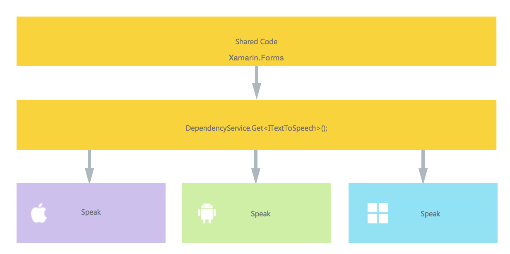
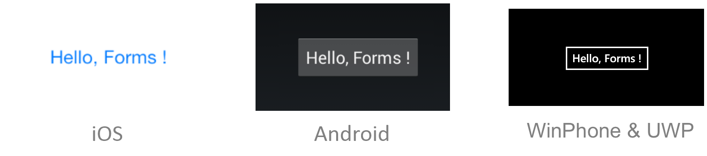

# Implementing Text-to-Speech

[ Download the sample](https://developer.xamarin.com/samples/xamarin-forms/UsingDependencyService/)

This article will guide you as you create a cross-platform app that uses [`DependencyService`](xref:Xamarin.Forms.DependencyService) to access native text-to-speech APIs:

- **[Creating the Interface](#Creating_the_Interface)** &ndash; understand how the interface is created in shared code.
- **[iOS Implementation](#iOS_Implementation)** &ndash; learn how to implement the interface in native code for iOS.
- **[Android Implementation](#Android_Implementation)** &ndash; learn how to implement the interface in native code for Android.
- **[UWP Implementation](#WindowsImplementation)** &ndash; learn how to implement the interface in native code for the Universal Windows Platform (UWP).
- **[Implementing in Shared Code](#Implementing_in_Shared_Code)** &ndash; learn how to use `DependencyService` to call into the native implementation from shared code.

The application using `DependencyService` will have the following structure:



<a name="Creating_the_Interface" />

## Creating the Interface

First, create an interface in the shared code that expresses the functionality you plan to implement. For this example, the interface contains a single method, `Speak`:

```csharp
public interface ITextToSpeech
{
    void Speak (string text);
}
```

Coding against this interface in the shared code will allow the Xamarin.Forms app to access the speech APIs on each platform.

> [!NOTE]
> Classes implementing the interface must have a parameterless constructor to work with the `DependencyService`.

<a name="iOS_Implementation" />

## iOS Implementation

The interface must be implemented in each platform-specific application project. Note that the class has a parameterless constructor so that the `DependencyService` can create new instances.

```csharp
[assembly: Dependency(typeof(TextToSpeechImplementation))]
namespace DependencyServiceSample.iOS
{

    public class TextToSpeechImplementation : ITextToSpeech
    {
        public TextToSpeechImplementation() { }

        public void Speak(string text)
        {
            var speechSynthesizer = new AVSpeechSynthesizer();
            var speechUtterance = new AVSpeechUtterance(text)
            {
                Rate = AVSpeechUtterance.MaximumSpeechRate / 4,
                Voice = AVSpeechSynthesisVoice.FromLanguage("en-US"),
                Volume = 0.5f,
                PitchMultiplier = 1.0f
            };

            speechSynthesizer.SpeakUtterance(speechUtterance);
        }
    }
}
```

The `[assembly]` attribute registers the class as an implementation of the `ITextToSpeech` interface, which means that `DependencyService.Get<ITextToSpeech>()` can be used in the shared code to create an instance of it.

<a name="Android_Implementation" />

## Android Implementation

The Android code is more complex than the iOS version. It requires access to the current Android context, which is exposed by the `MainActivity.Instance` property:

```csharp
public class MainActivity : global::Xamarin.Forms.Platform.Android.FormsAppCompatActivity
{
    internal static MainActivity Instance { get; private set; }

    protected override void OnCreate(Bundle bundle)
    {
        ...
    }
}
```

It also requires the implementing class to inherit from Android-specific `Java.Lang.Object` and to implement the `IOnInitListener` interface as well.

```csharp
[assembly: Dependency(typeof(TextToSpeechImplementation))]
namespace DependencyServiceSample.Droid
{
    public class TextToSpeechImplementation : Java.Lang.Object, ITextToSpeech, TextToSpeech.IOnInitListener
    {
        TextToSpeech speaker;
        string toSpeak;

        public void Speak(string text)
        {
            toSpeak = text;
            if (speaker == null)
            {
                speaker = new TextToSpeech(MainActivity.Instance, this);
            }
            else
            {
                speaker.Speak(toSpeak, QueueMode.Flush, null, null);
            }
        }

        public void OnInit(OperationResult status)
        {
            if (status.Equals(OperationResult.Success))
            {
                speaker.Speak(toSpeak, QueueMode.Flush, null, null);
            }
        }
    }
}
```

The `[assembly]` attribute registers the class as an implementation of the `ITextToSpeech` interface, which means that `DependencyService.Get<ITextToSpeech>()` can be used in the shared code to create an instance of it.

<a name="WindowsImplementation" />

## Universal Windows Platform Implementation

The Universal Windows Platform has a speech API in the `Windows.Media.SpeechSynthesis` namespace. The only caveat is to remember to tick the **Microphone** capability in the manifest, otherwise access to the speech APIs are blocked.

```csharp
[assembly:Dependency(typeof(TextToSpeechImplementation))]
public class TextToSpeechImplementation : ITextToSpeech
{
    public async void Speak(string text)
    {
        var mediaElement = new MediaElement();
        var synth = new Windows.Media.SpeechSynthesis.SpeechSynthesizer();
        var stream = await synth.SynthesizeTextToStreamAsync(text);

        mediaElement.SetSource(stream, stream.ContentType);
        mediaElement.Play();
    }
}
```

The `[assembly]` attribute registers the class as an implementation of the `ITextToSpeech` interface, which means that `DependencyService.Get<ITextToSpeech>()` can be used in the shared code to create an instance of it.

<a name="Implementing_in_Shared_Code" />

## Implementing in Shared Code

Now we can write and test shared code that accesses the text-to-speech interface. This simple page includes a button that triggers the speech functionality. It uses the `DependencyService` to get an instance of the `ITextToSpeech` interface &ndash; at runtime this instance will be the platform-specific implementation that has full access to the native SDK.

```csharp
public MainPage ()
{
    var speak = new Button {
        Text = "Hello, Forms !",
        VerticalOptions = LayoutOptions.CenterAndExpand,
        HorizontalOptions = LayoutOptions.CenterAndExpand,
    };
    speak.Clicked += (sender, e) => {
        DependencyService.Get<ITextToSpeech>().Speak("Hello from Xamarin Forms");
    };
    Content = speak;
}
```

Running this application on iOS, Android, or the UWP and pressing the button will result in the application speaking to you, using the native speech SDK on each platform.

 


## Related Links

- [Using DependencyService (sample)](https://developer.xamarin.com/samples/xamarin-forms/UsingDependencyService/)
- [DependencyServiceSample](https://developer.xamarin.com/samples/xamarin-forms/DependencyService/DependencyServiceSample/)
