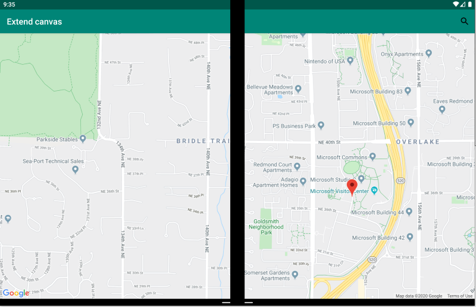
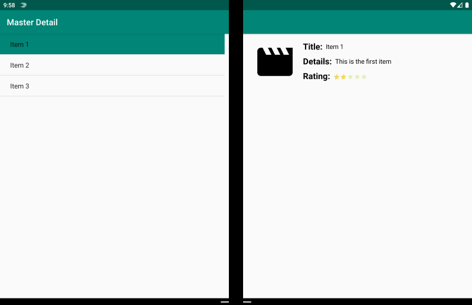
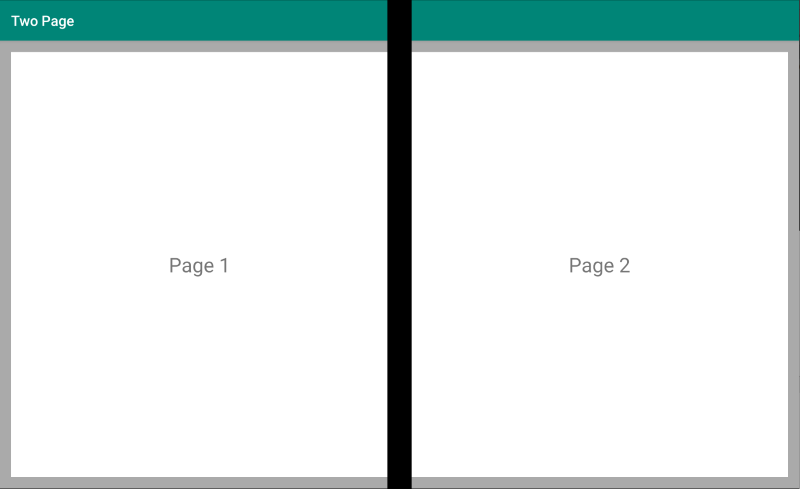
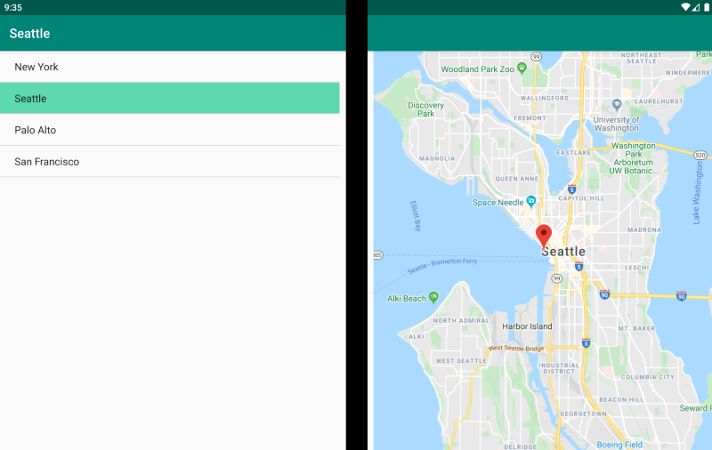
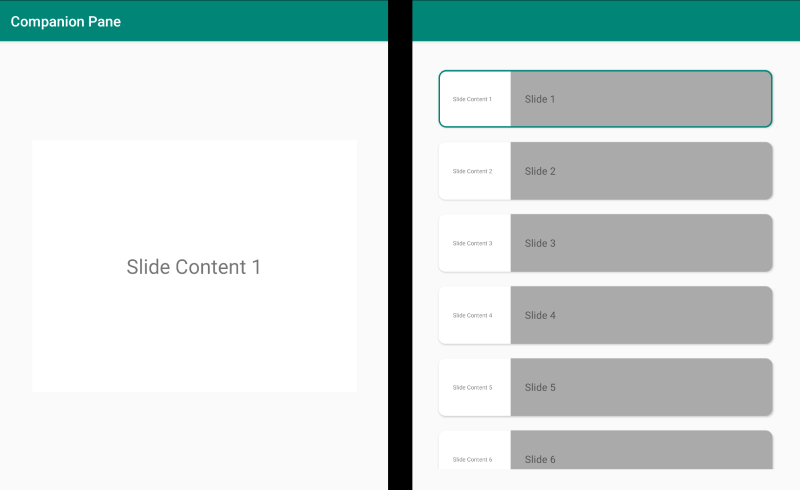

# Xamarin.Forms dual-screen design patterns

[ Download the sample](/samples/xamarin/xamarin-forms-samples/userinterface-dualscreendemos/)

This guide introduces our recommended design patterns for dual-screen devices with code and samples to assist you in creating interfaces that provide engaging and useful user experiences.

## Extended canvas pattern

The extended canvas pattern treats both screens as one large canvas for displaying a map, image, spreadsheet, or other such content that benefits from spreading to consume the maximum space:



```xaml
<ContentPage xmlns:local="clr-namespace:Xamarin.Duo.Forms.Samples"
             xmlns="http://xamarin.com/schemas/2014/forms"
             xmlns:x="http://schemas.microsoft.com/winfx/2009/xaml"
             xmlns:d="http://xamarin.com/schemas/2014/forms/design"
             xmlns:mc="http://schemas.openxmlformats.org/markup-compatibility/2006"
             mc:Ignorable="d"
             x:Class="Xamarin.Duo.Forms.Samples.ExtendCanvas">
    <Grid>
        <WebView x:Name="webView"
                 HorizontalOptions="FillAndExpand"
                 VerticalOptions="FillAndExpand" />
        <SearchBar x:Name="searchBar"
                   Placeholder="Find a place..."
                   BackgroundColor="DarkGray"
                   Opacity="0.8"
                   HorizontalOptions="FillAndExpand"
                   VerticalOptions="Start" />
    </Grid>
</ContentPage>
```

In this example. the `Grid` and inner content will expand to consume all of the screen available, whether displayed on a single screen, or spanned across two screens.

## Master-detail pattern

The master-detail pattern is for when the master view, typically a list on the left, provides content from which a user selects to view details about that item on the right:



```xaml
<ContentPage xmlns:local="clr-namespace:Xamarin.Duo.Forms.Samples"
             xmlns="http://xamarin.com/schemas/2014/forms"
             xmlns:x="http://schemas.microsoft.com/winfx/2009/xaml"
             xmlns:dualScreen="clr-namespace:Xamarin.Forms.DualScreen;assembly=Xamarin.Forms.DualScreen"
             x:Class="Xamarin.Duo.Forms.Samples.MasterDetail">
    <dualScreen:TwoPaneView MinWideModeWidth="4000"
                            MinTallModeHeight="4000">
        <dualScreen:TwoPaneView.Pane1>
            <local:Master x:Name="masterPage" />
        </dualScreen:TwoPaneView.Pane1>
        <dualScreen:TwoPaneView.Pane2>
            <local:Details x:Name="detailsPage" />
        </dualScreen:TwoPaneView.Pane2>
    </dualScreen:TwoPaneView>
</ContentPage>
```

In this example, you can make use of `TwoPaneView` to set a list on one pane, and a detail view on the other.

## Two page pattern

The two page pattern is ideal for content that lends itself to a two-up layout, such as a document reader, notes, or an art-board:



```xaml
<Grid x:Name="layout">
    <CollectionView x:Name="cv"
                    BackgroundColor="LightGray">
        <CollectionView.ItemsLayout>
            <GridItemsLayout SnapPointsAlignment="Start"
                             SnapPointsType="MandatorySingle"
                             Orientation="Horizontal"
                             HorizontalItemSpacing="{Binding Source={x:Reference mainPage}, Path=HingeWidth}" />
        </CollectionView.ItemsLayout>
        <CollectionView.ItemTemplate>
            <DataTemplate>
                <Frame BackgroundColor="LightGray"
                       Padding="0"
                       Margin="0"
                       WidthRequest="{Binding Source={x:Reference mainPage}, Path=ContentWidth}"
                       HeightRequest="{Binding Source={x:Reference mainPage}, Path=ContentHeight}">
                    <Frame Margin="20"
                           BackgroundColor="White">
                        <Label FontSize="Large"
                               Text="{Binding .}"
                               VerticalTextAlignment="Center"
                               HorizontalTextAlignment="Center"
                               HorizontalOptions="Center"
                               VerticalOptions="Center" />
                    </Frame>
                </Frame>
            </DataTemplate>
        </CollectionView.ItemTemplate>
    </CollectionView>
</Grid>
```

The [`CollectionView`](xref:Xamarin.Forms.CollectionView), with a grid layout that splits on the hinge width, makes for an ideal approach to deliver this dual-screen experience.

## Dual view pattern

The dual view pattern may look just like the "Two page" view, but the distinction is in the content and user scenario. In this pattern, you are comparing content side by side, perhaps to edit a document or photo, to compare different restaurant menus, or to diff a merge conflict for code files:



```xaml
<ContentPage xmlns:local="clr-namespace:Xamarin.Duo.Forms.Samples"
             xmlns="http://xamarin.com/schemas/2014/forms"
             xmlns:x="http://schemas.microsoft.com/winfx/2009/xaml"
             xmlns:dualScreen="clr-namespace:Xamarin.Forms.DualScreen;assembly=Xamarin.Forms.DualScreen"
             x:Class="Xamarin.Duo.Forms.Samples.DualViewListPage">
    <dualScreen:TwoPaneView>
        <dualScreen:TwoPaneView.Pane1>
            <CollectionView x:Name="mapList"
                            SelectionMode="Single">
                <CollectionView.ItemTemplate>
                    <DataTemplate>
                        <Grid Padding="10,5,10,5">
                            <Frame Visual="Material"
                                   BorderColor="LightGray">
                                <StackLayout Padding="5">
                                    <Label FontSize="Title"
                                           Text="{Binding Title}" />
                                </StackLayout>
                            </Frame>
                        </Grid>
                    </DataTemplate>
                </CollectionView.ItemTemplate>
            </CollectionView>
        </dualScreen:TwoPaneView.Pane1>
        <dualScreen:TwoPaneView.Pane2>
            <local:DualViewMap x:Name="mapPage" />
        </dualScreen:TwoPaneView.Pane2>
    </dualScreen:TwoPaneView>
</ContentPage>
```

## Companion pattern

The companion pattern demonstrates how you might use the second screen to provide a second level of content related to the primary view, like in the case of a drawing app, a game, or media editing:



```xaml
<ContentPage xmlns:local="clr-namespace:Xamarin.Duo.Forms.Samples"
             xmlns="http://xamarin.com/schemas/2014/forms"
             xmlns:x="http://schemas.microsoft.com/winfx/2009/xaml"
             xmlns:dualscreen="clr-namespace:Xamarin.Forms.DualScreen;assembly=Xamarin.Forms.DualScreen"
             x:Name="mainPage"
             x:Class="Xamarin.Duo.Forms.Samples.CompanionPane"
             BackgroundColor="LightGray"
             Visual="Material">
    <dualscreen:TwoPaneView x:Name="twoPaneView"
                            MinWideModeWidth="4000"
                            MinTallModeHeight="4000">
        <dualscreen:TwoPaneView.Pane1>
            <CarouselView x:Name="cv"
                          BackgroundColor="LightGray"
                          IsScrollAnimated="False" >
                <CarouselView.ItemTemplate>
                    <DataTemplate>
                        <Frame BackgroundColor="LightGray"
                               Padding="0"
                               Margin="0"
                               WidthRequest="{Binding Source={x:Reference twoPaneView}, Path=Pane1.Width}"
                               HeightRequest="{Binding Source={x:Reference twoPaneView}, Path=Pane1.Height}">
                            <Frame Margin="20"
                                   BackgroundColor="White">
                                <Label FontSize="Large"
                                       Text="{Binding ., StringFormat='Slide Content {0}'}"
                                       VerticalTextAlignment="Center"
                                       HorizontalTextAlignment="Center"
                                       HorizontalOptions="Center"
                                       VerticalOptions="Center" />
                            </Frame>
                        </Frame>
                    </DataTemplate>
                </CarouselView.ItemTemplate>
            </CarouselView>
        </dualscreen:TwoPaneView.Pane1>
        <dualscreen:TwoPaneView.Pane2>
            <CollectionView x:Name="indicators"
                            SelectionMode="Single"
                            Margin="20, 20, 20, 20"
                            BackgroundColor="LightGray"
                            WidthRequest="{Binding Source={x:Reference twoPaneView}, Path=Pane2.Width}"
                            ItemsSource="{Binding Source={x:Reference cv}, Path=ItemsSource}">
                <CollectionView.Resources>
                    <ResourceDictionary>
                        <Style TargetType="Frame">
                            <Setter Property="VisualStateManager.VisualStateGroups">
                                <VisualStateGroupList>
                                    <VisualStateGroup x:Name="CommonStates">
                                        <VisualState x:Name="Normal">
                                            <VisualState.Setters>
                                                <Setter Property="Padding"
                                                        Value="0" />
                                            </VisualState.Setters>
                                        </VisualState>
                                        <VisualState x:Name="Selected">
                                            <VisualState.Setters>
                                                <Setter Property="BorderColor"
                                                        Value="Green" />
                                                <Setter Property="Padding"
                                                        Value="1" />
                                            </VisualState.Setters>
                                        </VisualState>
                                    </VisualStateGroup>
                                </VisualStateGroupList>
                            </Setter>
                        </Style>
                    </ResourceDictionary>
                </CollectionView.Resources>
                <CollectionView.ItemsLayout>
                    <LinearItemsLayout Orientation="Vertical"
                                       ItemSpacing="10" />
                </CollectionView.ItemsLayout>
                <CollectionView.ItemTemplate>
                    <DataTemplate>
                        <Frame WidthRequest="{Binding Source={x:Reference twoPaneView}, Path=Pane2.Width}"
                               CornerRadius="10"
                               HeightRequest="60"
                               BackgroundColor="White"
                               Margin="0">
                            <StackLayout HorizontalOptions="Fill"
                                         VerticalOptions="Fill"
                                         Orientation="Horizontal">
                                <Label FontSize="Micro"
                                       Padding="20,0,20,0"
                                       VerticalTextAlignment="Center"
                                       WidthRequest="140" Text="{Binding ., StringFormat='Slide Content {0}'}" />
                                <Label FontSize="Small"
                                       Padding="20,0,20,0"
                                       VerticalTextAlignment="Center"
                                       HorizontalOptions="FillAndExpand"
                                       BackgroundColor="DarkGray"
                                       Grid.Column="1"
                                       Text="{Binding ., StringFormat='Slide {0}'}" />
                            </StackLayout>
                        </Frame>
                    </DataTemplate>
                </CollectionView.ItemTemplate>
            </CollectionView>
        </dualscreen:TwoPaneView.Pane2>
    </dualscreen:TwoPaneView>
</ContentPage>
```

## Related links

- [DualScreen (sample)](/samples/xamarin/xamarin-forms-samples/userinterface-dualscreendemos/)
- [Create apps for dual screen devices](index.md)