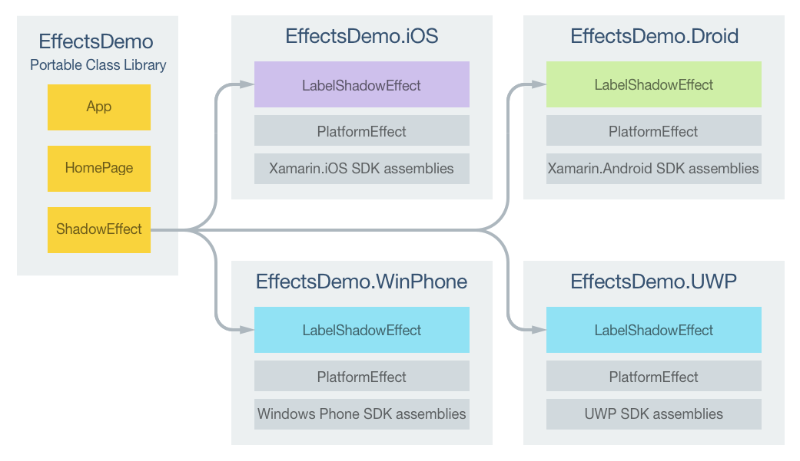

# Passing Effect Parameters as Attached Properties

[ Download the sample](/samples/xamarin/xamarin-forms-samples/effects-shadoweffectruntimechange)

_Attached properties can be used to define effect parameters that respond to runtime property changes. This article demonstrates using attached properties to pass parameters to an effect, and changing a parameter at runtime._

The process for creating effect parameters that respond to runtime property changes is as follows:

1. Create a `static` class that contains an attached property for each parameter to be passed to the effect.
1. Add an additional attached property to the class that will be used to control the addition or removal of the effect to the control that the class will be attached to. Ensure that this attached property registers a `propertyChanged` delegate that will be executed when the value of the property changes.
1. Create `static` getters and setters for each attached property.
1. Implement logic in the `propertyChanged` delegate to add and remove the effect.
1. Implement a nested class inside the `static` class, named after the effect, which subclasses the `RoutingEffect` class. For the constructor, call the base class constructor, passing in a concatenation of the resolution group name, and the unique ID that was specified on each platform-specific effect class.

Parameters can then be passed to the effect by adding the attached properties, and property values, to the appropriate control. In addition, parameters can be changed at runtime by specifying a new attached property value.

> [!NOTE]
> An attached property is a special type of bindable property, defined in one class but attached to other objects, and recognizable in XAML as attributes that contain a class and a property name separated by a period. For more information, see [Attached Properties](~/xamarin-forms/xaml/attached-properties.md).

The sample application demonstrates a `ShadowEffect` that adds a shadow to the text displayed by a [`Label`](xref:Xamarin.Forms.Label) control. In addition, the color of the shadow can be changed at runtime. The following diagram illustrates the responsibilities of each project in the sample application, along with the relationships between them:



A [`Label`](xref:Xamarin.Forms.Label) control on the `HomePage` is customized by the `LabelShadowEffect` in each platform-specific project. Parameters are passed to each `LabelShadowEffect` through attached properties in the `ShadowEffect` class. Each `LabelShadowEffect` class derives from the `PlatformEffect` class for each platform. This results in a shadow being added to the text displayed by the `Label` control, as shown in the following screenshots:


## Creating Effect Parameters

A `static` class should be created to represent effect parameters, as demonstrated in the following code example:

```csharp
public static class ShadowEffect
{
  public static readonly BindableProperty HasShadowProperty =
    BindableProperty.CreateAttached ("HasShadow", typeof(bool), typeof(ShadowEffect), false, propertyChanged: OnHasShadowChanged);
  public static readonly BindableProperty ColorProperty =
    BindableProperty.CreateAttached ("Color", typeof(Color), typeof(ShadowEffect), Color.Default);
  public static readonly BindableProperty RadiusProperty =
    BindableProperty.CreateAttached ("Radius", typeof(double), typeof(ShadowEffect), 1.0);
  public static readonly BindableProperty DistanceXProperty =
    BindableProperty.CreateAttached ("DistanceX", typeof(double), typeof(ShadowEffect), 0.0);
  public static readonly BindableProperty DistanceYProperty =
    BindableProperty.CreateAttached ("DistanceY", typeof(double), typeof(ShadowEffect), 0.0);

  public static bool GetHasShadow (BindableObject view)
  {
    return (bool)view.GetValue (HasShadowProperty);
  }

  public static void SetHasShadow (BindableObject view, bool value)
  {
    view.SetValue (HasShadowProperty, value);
  }
  ...

  static void OnHasShadowChanged (BindableObject bindable, object oldValue, object newValue)
  {
    var view = bindable as View;
    if (view == null) {
      return;
    }

    bool hasShadow = (bool)newValue;
    if (hasShadow) {
      view.Effects.Add (new LabelShadowEffect ());
    } else {
      var toRemove = view.Effects.FirstOrDefault (e => e is LabelShadowEffect);
      if (toRemove != null) {
        view.Effects.Remove (toRemove);
      }
    }
  }

  class LabelShadowEffect : RoutingEffect
  {
    public LabelShadowEffect () : base ("MyCompany.LabelShadowEffect")
    {
    }
  }
}
```

The `ShadowEffect` contains five attached properties, with `static` getters and setters for each attached property. Four of these properties represent parameters to be passed to each platform-specific `LabelShadowEffect`. The `ShadowEffect` class also defines a `HasShadow` attached property that is used to control the addition or removal of the effect to the control that the `ShadowEffect` class is attached to. This attached property registers the `OnHasShadowChanged` method that will be executed when the value of the property changes. This method adds or removes the effect based on the value of the `HasShadow` attached property.

The nested `LabelShadowEffect` class, which subclasses the [`RoutingEffect`](xref:Xamarin.Forms.RoutingEffect) class, supports effect addition and removal. The `RoutingEffect` class represents a platform-independent effect that wraps an inner effect that is usually platform-specific. This simplifies the effect removal process, since there is no compile-time access to the type information for a platform-specific effect. The `LabelShadowEffect` constructor calls the base class constructor, passing in a parameter consisting of a concatenation of the resolution group name, and the unique ID that was specified on each platform-specific effect class. This enables effect addition and removal in the `OnHasShadowChanged` method, as follows:

- **Effect addition** – a new instance of the `LabelShadowEffect` is added to the control's [`Effects`](xref:Xamarin.Forms.Element.Effects) collection. This replaces using the [`Effect.Resolve`](xref:Xamarin.Forms.Effect.Resolve(System.String)) method to add the effect.
- **Effect removal**  – the first instance of the `LabelShadowEffect` in the control's [`Effects`](xref:Xamarin.Forms.Element.Effects) collection is retrieved and removed.

## Consuming the Effect

Each platform-specific `LabelShadowEffect` can be consumed by adding the attached properties to a [`Label`](xref:Xamarin.Forms.Label) control, as demonstrated in the following XAML code example:

```xaml
<Label Text="Label Shadow Effect" ...
       local:ShadowEffect.HasShadow="true" local:ShadowEffect.Radius="5"
       local:ShadowEffect.DistanceX="5" local:ShadowEffect.DistanceY="5">
  <local:ShadowEffect.Color>
    <OnPlatform x:TypeArguments="Color">
        <On Platform="iOS" Value="Black" />
        <On Platform="Android" Value="White" />
        <On Platform="UWP" Value="Red" />
    </OnPlatform>
  </local:ShadowEffect.Color>
</Label>
```

The equivalent [`Label`](xref:Xamarin.Forms.Label) in C# is shown in the following code example:

```csharp
var label = new Label {
  Text = "Label Shadow Effect",
  ...
};

Color color = Color.Default;
switch (Device.RuntimePlatform)
{
    case Device.iOS:
        color = Color.Black;
        break;
    case Device.Android:
        color = Color.White;
        break;
    case Device.UWP:
        color = Color.Red;
        break;
}

ShadowEffect.SetHasShadow (label, true);
ShadowEffect.SetRadius (label, 5);
ShadowEffect.SetDistanceX (label, 5);
ShadowEffect.SetDistanceY (label, 5);
ShadowEffect.SetColor (label, color));
```

Setting the `ShadowEffect.HasShadow` attached property to `true` executes the `ShadowEffect.OnHasShadowChanged` method that adds or removes the `LabelShadowEffect` to the [`Label`](xref:Xamarin.Forms.Label) control. In both code examples, the `ShadowEffect.Color` attached property provides platform-specific color values. For more information, see [Device Class](~/xamarin-forms/platform/device.md).

In addition, a [`Button`](xref:Xamarin.Forms.Button) allows the shadow color to be changed at runtime. When the `Button` is clicked, the following code changes the shadow color by setting the `ShadowEffect.Color` attached property:

```csharp
ShadowEffect.SetColor (label, Color.Teal);
```

### Consuming the Effect with a Style

Effects that can be consumed by adding attached properties to a control can also be consumed by a style. The following XAML code example shows an *explicit* style for the shadow effect, that can be applied to [`Label`](xref:Xamarin.Forms.Label) controls:

```xaml
<Style x:Key="ShadowEffectStyle" TargetType="Label">
  <Style.Setters>
    <Setter Property="local:ShadowEffect.HasShadow" Value="True" />
    <Setter Property="local:ShadowEffect.Radius" Value="5" />
    <Setter Property="local:ShadowEffect.DistanceX" Value="5" />
    <Setter Property="local:ShadowEffect.DistanceY" Value="5" />
  </Style.Setters>
</Style>
```

The [`Style`](xref:Xamarin.Forms.Style) can be applied to a [`Label`](xref:Xamarin.Forms.Label) by setting its [`Style`](xref:Xamarin.Forms.NavigableElement.Style) property to the `Style` instance using the `StaticResource` markup extension, as demonstrated in the following code example:

```xaml
<Label Text="Label Shadow Effect" ... Style="{StaticResource ShadowEffectStyle}" />
```

For more information about styles, see [Styles](~/xamarin-forms/user-interface/styles/index.md).

## Creating the Effect on each Platform

The following sections discuss the platform-specific implementation of the `LabelShadowEffect` class.

### iOS Project

The following code example shows the `LabelShadowEffect` implementation for the iOS project:

```csharp
[assembly:ResolutionGroupName ("MyCompany")]
[assembly:ExportEffect (typeof(LabelShadowEffect), "LabelShadowEffect")]
namespace EffectsDemo.iOS
{
    public class LabelShadowEffect : PlatformEffect
    {
        protected override void OnAttached ()
        {
            try {
                UpdateRadius ();
                UpdateColor ();
                UpdateOffset ();
                Control.Layer.ShadowOpacity = 1.0f;
            } catch (Exception ex) {
                Console.WriteLine ("Cannot set property on attached control. Error: ", ex.Message);
            }
        }

        protected override void OnDetached ()
        {
        }
        ...

        void UpdateRadius ()
        {
            Control.Layer.ShadowRadius = (nfloat)ShadowEffect.GetRadius (Element);
        }

        void UpdateColor ()
        {
            Control.Layer.ShadowColor = ShadowEffect.GetColor (Element).ToCGColor ();
        }

        void UpdateOffset ()
        {
            Control.Layer.ShadowOffset = new CGSize (
                (double)ShadowEffect.GetDistanceX (Element),
                (double)ShadowEffect.GetDistanceY (Element));
        }
    }
```

The `OnAttached` method calls methods that retrieve the attached property values using the `ShadowEffect` getters, and which set `Control.Layer` properties to the property values to create the shadow. This functionality is wrapped in a `try`/`catch` block in case the control that the effect is attached to does not have the `Control.Layer` properties. No implementation is provided by the `OnDetached` method because no cleanup is necessary.

#### Responding to Property Changes

If any of the `ShadowEffect` attached property values change at runtime, the effect needs to respond by displaying the changes. An overridden version of the `OnElementPropertyChanged` method, in the platform-specific effect class, is the place to respond to bindable property changes, as demonstrated in the following code example:

```csharp
public class LabelShadowEffect : PlatformEffect
{
  ...
  protected override void OnElementPropertyChanged (PropertyChangedEventArgs args)
  {
    if (args.PropertyName == ShadowEffect.RadiusProperty.PropertyName) {
      UpdateRadius ();
    } else if (args.PropertyName == ShadowEffect.ColorProperty.PropertyName) {
      UpdateColor ();
    } else if (args.PropertyName == ShadowEffect.DistanceXProperty.PropertyName ||
               args.PropertyName == ShadowEffect.DistanceYProperty.PropertyName) {
      UpdateOffset ();
    }
  }
  ...
}
```

The `OnElementPropertyChanged` method updates the radius, color, or offset of the shadow, provided that the appropriate `ShadowEffect` attached property value has changed. A check for the property that's changed should always be made, as this override can be called many times.

### Android Project

The following code example shows the `LabelShadowEffect` implementation for the Android project:

```csharp
[assembly:ResolutionGroupName ("MyCompany")]
[assembly:ExportEffect (typeof(LabelShadowEffect), "LabelShadowEffect")]
namespace EffectsDemo.Droid
{
    public class LabelShadowEffect : PlatformEffect
    {
        Android.Widget.TextView control;
        Android.Graphics.Color color;
        float radius, distanceX, distanceY;

        protected override void OnAttached ()
        {
            try {
                control = Control as Android.Widget.TextView;
                UpdateRadius ();
                UpdateColor ();
                UpdateOffset ();
                UpdateControl ();
            } catch (Exception ex) {
                Console.WriteLine ("Cannot set property on attached control. Error: ", ex.Message);
            }
        }

        protected override void OnDetached ()
        {
        }
        ...

        void UpdateControl ()
        {
            if (control != null) {
                control.SetShadowLayer (radius, distanceX, distanceY, color);
            }
        }

        void UpdateRadius ()
        {
            radius = (float)ShadowEffect.GetRadius (Element);
        }

        void UpdateColor ()
        {
            color = ShadowEffect.GetColor (Element).ToAndroid ();
        }

        void UpdateOffset ()
        {
            distanceX = (float)ShadowEffect.GetDistanceX (Element);
            distanceY = (float)ShadowEffect.GetDistanceY (Element);
        }
    }
```

The `OnAttached` method calls methods that retrieve the attached property values using the `ShadowEffect` getters, and calls a method that calls the [`TextView.SetShadowLayer`](xref:Android.Widget.TextView.SetShadowLayer*) method to create a shadow using the property values. This functionality is wrapped in a `try`/`catch` block in case the control that the effect is attached to does not have the `Control.Layer` properties. No implementation is provided by the `OnDetached` method because no cleanup is necessary.

#### Responding to Property Changes

If any of the `ShadowEffect` attached property values change at runtime, the effect needs to respond by displaying the changes. An overridden version of the `OnElementPropertyChanged` method, in the platform-specific effect class, is the place to respond to bindable property changes, as demonstrated in the following code example:

```csharp
public class LabelShadowEffect : PlatformEffect
{
  ...
  protected override void OnElementPropertyChanged (PropertyChangedEventArgs args)
  {
    if (args.PropertyName == ShadowEffect.RadiusProperty.PropertyName) {
      UpdateRadius ();
      UpdateControl ();
    } else if (args.PropertyName == ShadowEffect.ColorProperty.PropertyName) {
      UpdateColor ();
      UpdateControl ();
    } else if (args.PropertyName == ShadowEffect.DistanceXProperty.PropertyName ||
               args.PropertyName == ShadowEffect.DistanceYProperty.PropertyName) {
      UpdateOffset ();
      UpdateControl ();
    }
  }
  ...
}
```

The `OnElementPropertyChanged` method updates the radius, color, or offset of the shadow, provided that the appropriate `ShadowEffect` attached property value has changed. A check for the property that's changed should always be made, as this override can be called many times.

### Universal Windows Platform Project

The following code example shows the `LabelShadowEffect` implementation for the Universal Windows Platform (UWP) project:

```csharp
[assembly: ResolutionGroupName ("MyCompany")]
[assembly: ExportEffect (typeof(LabelShadowEffect), "LabelShadowEffect")]
namespace EffectsDemo.UWP
{
    public class LabelShadowEffect : PlatformEffect
    {
        Label shadowLabel;
        bool shadowAdded = false;

        protected override void OnAttached ()
        {
            try {
                if (!shadowAdded) {
                    var textBlock = Control as Windows.UI.Xaml.Controls.TextBlock;

                    shadowLabel = new Label ();
                    shadowLabel.Text = textBlock.Text;
                    shadowLabel.FontAttributes = FontAttributes.Bold;
                    shadowLabel.HorizontalOptions = LayoutOptions.Center;
                    shadowLabel.VerticalOptions = LayoutOptions.CenterAndExpand;

                    UpdateColor ();
                    UpdateOffset ();

                    ((Grid)Element.Parent).Children.Insert (0, shadowLabel);
                    shadowAdded = true;
                }
            } catch (Exception ex) {
                Debug.WriteLine ("Cannot set property on attached control. Error: ", ex.Message);
            }
        }

        protected override void OnDetached ()
        {
        }
        ...

        void UpdateColor ()
        {
            shadowLabel.TextColor = ShadowEffect.GetColor (Element);
        }

        void UpdateOffset ()
        {
            shadowLabel.TranslationX = ShadowEffect.GetDistanceX (Element);
            shadowLabel.TranslationY = ShadowEffect.GetDistanceY (Element);
        }
    }
}
```

The Universal Windows Platform doesn't provide a shadow effect, and so the `LabelShadowEffect` implementation on both platforms simulates one by adding a second offset [`Label`](xref:Xamarin.Forms.Label) behind the primary `Label`. The `OnAttached` method creates the new `Label` and sets some layout properties on the `Label`. It then calls methods that retrieve the attached property values using the `ShadowEffect` getters, and creates the shadow by setting the [`TextColor`](xref:Xamarin.Forms.Label.TextColor), [`TranslationX`](xref:Xamarin.Forms.VisualElement.TranslationX), and [`TranslationY`](xref:Xamarin.Forms.VisualElement.TranslationY) properties to control the color and location of the `Label`. The `shadowLabel` is then inserted offset behind the primary `Label`. This functionality is wrapped in a `try`/`catch` block in case the control that the effect is attached to does not have the `Control.Layer` properties. No implementation is provided by the `OnDetached` method because no cleanup is necessary.

#### Responding to Property Changes

If any of the `ShadowEffect` attached property values change at runtime, the effect needs to respond by displaying the changes. An overridden version of the `OnElementPropertyChanged` method, in the platform-specific effect class, is the place to respond to bindable property changes, as demonstrated in the following code example:

```csharp
public class LabelShadowEffect : PlatformEffect
{
  ...
  protected override void OnElementPropertyChanged (PropertyChangedEventArgs args)
  {
    if (args.PropertyName == ShadowEffect.ColorProperty.PropertyName) {
      UpdateColor ();
    } else if (args.PropertyName == ShadowEffect.DistanceXProperty.PropertyName ||
                      args.PropertyName == ShadowEffect.DistanceYProperty.PropertyName) {
      UpdateOffset ();
    }
  }
  ...
}
```

The `OnElementPropertyChanged` method updates the color or offset of the shadow, provided that the appropriate `ShadowEffect` attached property value has changed. A check for the property that's changed should always be made, as this override can be called many times.

## Summary

This article has demonstrated using attached properties to pass parameters to an effect, and changing a parameter at runtime. Attached properties can be used to define effect parameters that respond to runtime property changes.

## Related Links

- [Custom Renderers](~/xamarin-forms/app-fundamentals/custom-renderer/index.md)
- [Effect](xref:Xamarin.Forms.Effect)
- [PlatformEffect](xref:Xamarin.Forms.PlatformEffect`2)
- [RoutingEffect](xref:Xamarin.Forms.RoutingEffect)
- [Shadow Effect (sample)](/samples/xamarin/xamarin-forms-samples/effects-shadoweffectruntimechange)