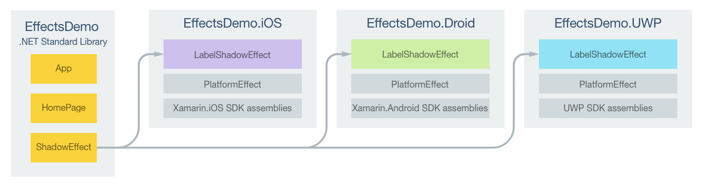

# Passing Effect Parameters as Common Language Runtime Properties

[ Download the sample](/samples/xamarin/xamarin-forms-samples/effects-shadoweffect)

_Common Language Runtime (CLR) properties can be used to define effect parameters that don't respond to runtime property changes. This article demonstrates using CLR properties to pass parameters to an effect._

The process for creating effect parameters that don't respond to runtime property changes is as follows:

1. Create a `public` class that subclasses the [`RoutingEffect`](xref:Xamarin.Forms.RoutingEffect) class. The `RoutingEffect` class represents a platform-independent effect that wraps an inner effect that is usually platform-specific.
1. Create a constructor that calls the base class constructor, passing in a concatenation of the resolution group name, and the unique ID that was specified on each platform-specific effect class.
1. Add properties to the class for each parameter to be passed to the effect.

Parameters can then be passed to the effect by specifying values for each property when instantiating the effect.

The sample application demonstrates a `ShadowEffect` that adds a shadow to the text displayed by a [`Label`](xref:Xamarin.Forms.Label) control. The following diagram illustrates the responsibilities of each project in the sample application, along with the relationships between them:



A [`Label`](xref:Xamarin.Forms.Label) control on the `HomePage` is customized by the `LabelShadowEffect` in each platform-specific project. Parameters are passed to each `LabelShadowEffect` through properties in the `ShadowEffect` class. Each `LabelShadowEffect` class derives from the `PlatformEffect` class for each platform. This results in a shadow being added to the text displayed by the `Label` control, as shown in the following screenshots:


## Creating Effect Parameters

A `public` class that subclasses the [`RoutingEffect`](xref:Xamarin.Forms.RoutingEffect) class should be created to represent effect parameters, as demonstrated in the following code example:

```csharp
public class ShadowEffect : RoutingEffect
{
  public float Radius { get; set; }

  public Color Color { get; set; }

  public float DistanceX { get; set; }

  public float DistanceY { get; set; }

  public ShadowEffect () : base ("MyCompany.LabelShadowEffect")
  {            
  }
}
```

The `ShadowEffect` contains four properties that represent parameters to be passed to each platform-specific `LabelShadowEffect`. The class constructor calls the base class constructor, passing in a parameter consisting of a concatenation of the resolution group name, and the unique ID that was specified on each platform-specific effect class. Therefore, a new instance of the `MyCompany.LabelShadowEffect` will be added to a control's [`Effects`](xref:Xamarin.Forms.Element.Effects) collection when a `ShadowEffect` is instantiated.

## Consuming the Effect

The following XAML code example shows a [`Label`](xref:Xamarin.Forms.Label) control to which the `ShadowEffect` is attached:

```xaml
<Label Text="Label Shadow Effect" ...>
  <Label.Effects>
    <local:ShadowEffect Radius="5" DistanceX="5" DistanceY="5">
      <local:ShadowEffect.Color>
        <OnPlatform x:TypeArguments="Color">
            <On Platform="iOS" Value="Black" />
            <On Platform="Android" Value="White" />
            <On Platform="UWP" Value="Red" />
        </OnPlatform>
      </local:ShadowEffect.Color>
    </local:ShadowEffect>
  </Label.Effects>
</Label>
```

The equivalent [`Label`](xref:Xamarin.Forms.Label) in C# is shown in the following code example:

```csharp
var label = new Label {
  Text = "Label Shadow Effect",
  ...
};

Color color = Color.Default;
switch (Device.RuntimePlatform)
{
    case Device.iOS:
        color = Color.Black;
        break;
    case Device.Android:
        color = Color.White;
        break;
    case Device.UWP:
        color = Color.Red;
        break;
}

label.Effects.Add (new ShadowEffect {
  Radius = 5,
  Color = color,
  DistanceX = 5,
  DistanceY = 5
});
```

In both code examples, an instance of the `ShadowEffect` class is instantiated with values being specified for each property, before being added to the control's [`Effects`](xref:Xamarin.Forms.Element.Effects) collection. Note that the `ShadowEffect.Color` property uses platform-specific color values. For more information, see [Device Class](~/xamarin-forms/platform/device.md).

## Creating the Effect on each Platform

The following sections discuss the platform-specific implementation of the `LabelShadowEffect` class.

### iOS Project

The following code example shows the `LabelShadowEffect` implementation for the iOS project:

```csharp
[assembly:ResolutionGroupName ("MyCompany")]
[assembly:ExportEffect (typeof(LabelShadowEffect), "LabelShadowEffect")]
namespace EffectsDemo.iOS
{
    public class LabelShadowEffect : PlatformEffect
    {
        protected override void OnAttached ()
        {
            try {
                var effect = (ShadowEffect)Element.Effects.FirstOrDefault (e => e is ShadowEffect);
                if (effect != null) {
                    Control.Layer.ShadowRadius = effect.Radius;
                    Control.Layer.ShadowColor = effect.Color.ToCGColor ();
                    Control.Layer.ShadowOffset = new CGSize (effect.DistanceX, effect.DistanceY);
                    Control.Layer.ShadowOpacity = 1.0f;
                }
            } catch (Exception ex) {
                Console.WriteLine ("Cannot set property on attached control. Error: ", ex.Message);
            }
        }

        protected override void OnDetached ()
        {
        }
    }
}
```

The `OnAttached` method retrieves the `ShadowEffect` instance, and sets `Control.Layer` properties to the specified property values to create the shadow. This functionality is wrapped in a `try`/`catch` block in case the control that the effect is attached to does not have the `Control.Layer` properties. No implementation is provided by the `OnDetached` method because no cleanup is necessary.

### Android Project

The following code example shows the `LabelShadowEffect` implementation for the Android project:

```csharp
[assembly:ResolutionGroupName ("MyCompany")]
[assembly:ExportEffect (typeof(LabelShadowEffect), "LabelShadowEffect")]
namespace EffectsDemo.Droid
{
    public class LabelShadowEffect : PlatformEffect
    {
        protected override void OnAttached ()
        {
            try {
                var control = Control as Android.Widget.TextView;
                var effect = (ShadowEffect)Element.Effects.FirstOrDefault (e => e is ShadowEffect);
                if (effect != null) {
                    float radius = effect.Radius;
                    float distanceX = effect.DistanceX;
                    float distanceY = effect.DistanceY;
                    Android.Graphics.Color color = effect.Color.ToAndroid ();
                    control.SetShadowLayer (radius, distanceX, distanceY, color);
                }
            } catch (Exception ex) {
                Console.WriteLine ("Cannot set property on attached control. Error: ", ex.Message);
            }
        }

        protected override void OnDetached ()
        {
        }
    }
}
```

The `OnAttached` method retrieves the `ShadowEffect` instance, and calls the [`TextView.SetShadowLayer`](xref:Android.Widget.TextView.SetShadowLayer*) method to create a shadow using the specified property values. This functionality is wrapped in a `try`/`catch` block in case the control that the effect is attached to does not have the `Control.Layer` properties. No implementation is provided by the `OnDetached` method because no cleanup is necessary.

### Universal Windows Platform Project

The following code example shows the `LabelShadowEffect` implementation for the Universal Windows Platform (UWP) project:

```csharp
[assembly: ResolutionGroupName ("Xamarin")]
[assembly: ExportEffect (typeof(LabelShadowEffect), "LabelShadowEffect")]
namespace EffectsDemo.UWP
{
    public class LabelShadowEffect : PlatformEffect
    {
        bool shadowAdded = false;

        protected override void OnAttached ()
        {
            try {
                if (!shadowAdded) {
                    var effect = (ShadowEffect)Element.Effects.FirstOrDefault (e => e is ShadowEffect);
                    if (effect != null) {
                        var textBlock = Control as Windows.UI.Xaml.Controls.TextBlock;
                        var shadowLabel = new Label ();
                        shadowLabel.Text = textBlock.Text;
                        shadowLabel.FontAttributes = FontAttributes.Bold;
                        shadowLabel.HorizontalOptions = LayoutOptions.Center;
                        shadowLabel.VerticalOptions = LayoutOptions.CenterAndExpand;
                        shadowLabel.TextColor = effect.Color;
                        shadowLabel.TranslationX = effect.DistanceX;
                        shadowLabel.TranslationY = effect.DistanceY;

                        ((Grid)Element.Parent).Children.Insert (0, shadowLabel);
                        shadowAdded = true;
                    }
                }
            } catch (Exception ex) {
                Debug.WriteLine ("Cannot set property on attached control. Error: ", ex.Message);
            }
        }

        protected override void OnDetached ()
        {
        }
    }
}
```

The Universal Windows Platform doesn't provide a shadow effect, and so the `LabelShadowEffect` implementation on both platforms simulates one by adding a second offset [`Label`](xref:Xamarin.Forms.Label) behind the primary `Label`. The `OnAttached` method retrieves the `ShadowEffect` instance, creates the new `Label`, and sets some layout properties on the `Label`. It then creates the shadow by setting the [`TextColor`](xref:Xamarin.Forms.Label.TextColor), [`TranslationX`](xref:Xamarin.Forms.VisualElement.TranslationX), and [`TranslationY`](xref:Xamarin.Forms.VisualElement.TranslationY) properties to control the color and location of the `Label`. The `shadowLabel` is then inserted offset behind the primary `Label`. This functionality is wrapped in a `try`/`catch` block in case the control that the effect is attached to does not have the `Control.Layer` properties. No implementation is provided by the `OnDetached` method because no cleanup is necessary.

## Summary

This article has demonstrated using CLR properties to pass parameters to an effect. CLR properties can be used to define effect parameters that don't respond to runtime property changes.

## Related Links

- [Custom Renderers](~/xamarin-forms/app-fundamentals/custom-renderer/index.md)
- [Effect](xref:Xamarin.Forms.Effect)
- [PlatformEffect](xref:Xamarin.Forms.PlatformEffect`2)
- [RoutingEffect](xref:Xamarin.Forms.RoutingEffect)
- [Shadow Effect (sample)](/samples/xamarin/xamarin-forms-samples/effects-shadoweffect)