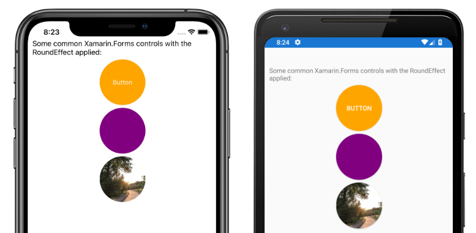

# Xamarin.Forms Reusable RoundEffect

[ Download the sample](/samples/xamarin/xamarin-forms-samples/effects-roundeffect/)

> [!IMPORTANT]
> It's no longer necessary to use a `RoundEffect` to render a control as a circle. The latest recommended approach is to clip the control using an `EllipseGeometry`. For more information, see [Clip with a Geometry](~/xamarin-forms/user-interface/shapes/geometries.md#clip-with-a-geometry).

The RoundEffect simplifies rendering any control that derives from `VisualElement` as a circle. This effect can be used to create circular images, buttons, and other controls:

[](example-roundeffect-images/round-effect.png#lightbox)

## Create a shared RoutingEffect

An effect class must be created in the shared project to create a cross-platform effect. The sample application creates an empty `RoundEffect` class that derives from the `RoutingEffect` class:

```csharp
public class RoundEffect : RoutingEffect
{
    public RoundEffect() : base($"Xamarin.{nameof(RoundEffect)}")
    {
    }
}
```

This class allows the shared project to resolve the references to the effect in code or XAML but does not provide any functionality. The effect must have implementations for each platform.

## Implement the Android effect

The Android platform project defines a `RoundEffect` class that derives from `PlatformEffect`. This class is tagged with `assembly` attributes that allow Xamarin.Forms to resolve the effect class:

```csharp
[assembly: ResolutionGroupName("Xamarin")]
[assembly: ExportEffect(typeof(RoundEffectDemo.Droid.RoundEffect), nameof(RoundEffectDemo.Droid.RoundEffect))]
namespace RoundEffectDemo.Droid
{
    public class RoundEffect : PlatformEffect
    {
        // ...
    }
}
```

The Android platform uses the concept of an `OutlineProvider` to define the edges of a control. The sample project includes a `CornerRadiusProvider` class that derives from the `ViewOutlineProvider` class:

```csharp
class CornerRadiusOutlineProvider : ViewOutlineProvider
{
    Element element;

    public CornerRadiusOutlineProvider(Element formsElement)
    {
        element = formsElement;
    }

    public override void GetOutline(Android.Views.View view, Outline outline)
    {
        float scale = view.Resources.DisplayMetrics.Density;
        double width = (double)element.GetValue(VisualElement.WidthProperty) * scale;
        double height = (double)element.GetValue(VisualElement.HeightProperty) * scale;
        float minDimension = (float)Math.Min(height, width);
        float radius = minDimension / 2f;
        Rect rect = new Rect(0, 0, (int)width, (int)height);
        outline.SetRoundRect(rect, radius);
    }
}
```

This class uses the `Width` and `Height` properties of the Xamarin.Forms `Element` instance to calculate a radius that is half of the shortest dimension.

Once an outline provider is defined the `RoundEffect` class can consume it to implement the effect:

```csharp
public class RoundEffect : PlatformEffect
{
    ViewOutlineProvider originalProvider;
    Android.Views.View effectTarget;

    protected override void OnAttached()
    {
        try
        {
            effectTarget = Control ?? Container;
            originalProvider = effectTarget.OutlineProvider;
            effectTarget.OutlineProvider = new CornerRadiusOutlineProvider(Element);
            effectTarget.ClipToOutline = true;
        }
        catch (Exception ex)
        {
            Console.WriteLine($"Failed to set corner radius: {ex.Message}");
        }
    }

    protected override void OnDetached()
    {
        if(effectTarget != null)
        {
            effectTarget.OutlineProvider = originalProvider;
            effectTarget.ClipToOutline = false;
        }
    }
}
```

The `OnAttached` method is called when the effect is attached to an element. The existing `OutlineProvider` object is saved so it can be restored when the effect is detached. A new instance of the `CornerRadiusOutlineProvider` is used as the `OutlineProvider` and `ClipToOutline` is set to true to clip overflowing elements to the outline borders.

The `OnDetatched` method is called when the effect is removed from an element and restores the original `OutlineProvider` value.

> [!NOTE]
> Depending on the element type, the `Control` property may or may not be null. If the `Control` property is not null, the rounded corners can be applied directly to the control. However, if it is null the rounded corners must be applied to the `Container` object. The `effectTarget` field allows the effect to be applied to the appropriate object.

## Implement the iOS effect

The iOS platform project defines a `RoundEffect` class that derives from `PlatformEffect`. This class is tagged with `assembly` attributes that allow Xamarin.Forms to resolve the effect class:

```csharp
[assembly: ResolutionGroupName("Xamarin")]
[assembly: ExportEffect(typeof(RoundEffectDemo.iOS.RoundEffect), nameof(RoundEffectDemo.iOS.RoundEffect))]
namespace RoundEffectDemo.iOS
{
    public class RoundEffect : PlatformEffect
    {
        // ...
    }
```

On iOS, controls have a `Layer` property, which has a `CornerRadius` property. The `RoundEffect` class implementation on iOS calculates the appropriate corner radius and updates the layer's `CornerRadius` property:

```csharp
public class RoundEffect : PlatformEffect
{
    nfloat originalRadius;
    UIKit.UIView effectTarget;

    protected override void OnAttached()
    {
        try
        {
            effectTarget = Control ?? Container;
            originalRadius = effectTarget.Layer.CornerRadius;
            effectTarget.ClipsToBounds = true;
            effectTarget.Layer.CornerRadius = CalculateRadius();
        }
        catch (Exception ex)
        {
            Console.WriteLine($"Failed to set corner radius: {ex.Message}");
        }
    }

    protected override void OnDetached()
    {
        if (effectTarget != null)
        {
            effectTarget.ClipsToBounds = false;
            if (effectTarget.Layer != null)
            {
                effectTarget.Layer.CornerRadius = originalRadius;
            }
        }
    }

    float CalculateRadius()
    {
        double width = (double)Element.GetValue(VisualElement.WidthRequestProperty);
        double height = (double)Element.GetValue(VisualElement.HeightRequestProperty);
        float minDimension = (float)Math.Min(height, width);
        float radius = minDimension / 2f;

        return radius;
    }
}
```

The `CalculateRadius` method calculates a radius based on the minimum dimension of the Xamarin.Forms `Element`. The `OnAttached` method is called when the effect is attached to a control, and updates the layer's `CornerRadius` property. It sets the `ClipToBounds` property to `true` so overflowing elements are clipped to the borders of the control. The `OnDetatched` method is called when the effect is removed from a control and reverses these changes, restoring the original corner radius.

> [!NOTE]
> Depending on the element type, the `Control` property may or may not be null. If the `Control` property is not null, the rounded corners can be applied directly to the control. However, if it is null the rounded corners must be applied to the `Container` object. The `effectTarget` field allows the effect to be applied to the appropriate object.

## Consume the effect

Once the effect is implemented across platforms, it can be consumed by Xamarin.Forms controls. A common application of the `RoundEffect` is making an `Image` object circular. The following XAML shows the effect being applied to an `Image` instance:

```xaml
<Image Source=outdoors"
       HeightRequest="100"
       WidthRequest="100">
    <Image.Effects>
        <local:RoundEffect />
    </Image.Effects>
</Image>
```

The effect can also be applied in code:

```csharp
var image = new Image
{
    Source = ImageSource.FromFile("outdoors"),
    HeightRequest = 100,
    WidthRequest = 100
};
image.Effects.Add(new RoundEffect());
```

The `RoundEffect` class can be applied to any control that derives from `VisualElement`.

> [!NOTE]
> For the effect to calculate the correct radius, the control it's applied to must have explicit sizing. Therefore, the `HeightRequest` and `WidthRequest` properties should be defined. If the affected control appears in a `StackLayout`, its `HorizontalOptions` property should not use one of the **Expand** values such as `LayoutOptions.CenterAndExpand` or it will not have accurate dimensions.

## Related links

- [RoundEffect sample application](/samples/xamarin/xamarin-forms-samples/effects-roundeffect/)
- [Introduction to Effects](~/xamarin-forms/app-fundamentals/effects/introduction.md)
- [Creating an Effect](~/xamarin-forms/app-fundamentals/effects/creating.md)