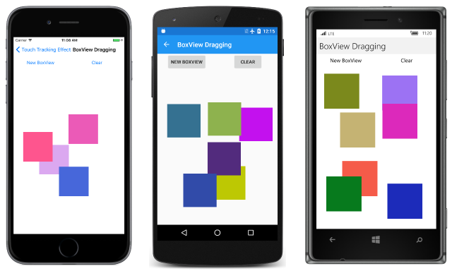
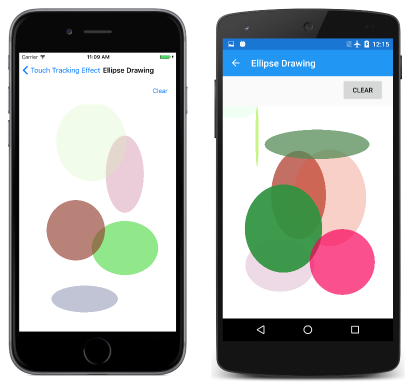
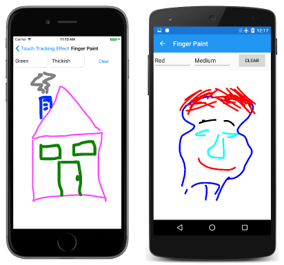
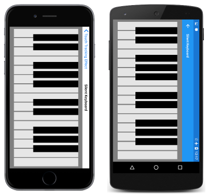

# Invoking Events from Effects

[ Download the sample](/samples/xamarin/xamarin-forms-samples/effects-touchtrackingeffect/)

_An effect can define and invoke an event, signaling changes in the underlying native view. This article shows how to implement low-level multi-touch finger tracking, and how to generate events that signal touch activity._

The effect described in this article provides access to low-level touch events. These low-level events are not available through the existing `GestureRecognizer` classes, but they are vital to some types of applications. For example, a finger-paint application needs to track individual fingers as they move on the screen. A music keyboard needs to detect taps and releases on the individual keys, as well as a finger gliding from one key to another in a glissando.

An effect is ideal for multi-touch finger tracking because it can be attached to any Xamarin.Forms element.

## Platform Touch Events

The iOS, Android, and Universal Windows Platform all include a low-level API that allows applications to detect touch activity. These platforms all distinguish between three basic types of touch events:

- *Pressed*, when a finger touches the screen
- *Moved*, when a finger touching the screen moves
- *Released*, when the finger is released from the screen

In a multi-touch environment, multiple fingers can touch the screen at the same time. The various platforms include an identification (ID) number that applications can use to distinguish between multiple fingers.

In iOS, the `UIView` class defines three overridable methods, `TouchesBegan`, `TouchesMoved`, and `TouchesEnded` corresponding to these three basic events. The article [Multi-Touch Finger Tracking](~/ios/app-fundamentals/touch/touch-tracking.md) describes how to use these methods. However, an iOS program does not need to override a class that derives from `UIView` to use these methods. The iOS `UIGestureRecognizer` also defines these same three methods, and you can attach an instance of a class that derives from `UIGestureRecognizer` to any `UIView` object.

In Android, the `View` class defines an overridable method named `OnTouchEvent` to process all the touch activity. The type of the touch activity is defined by enumeration members `Down`, `PointerDown`, `Move`, `Up`, and `PointerUp` as described in the article [Multi-Touch Finger Tracking](~/android/app-fundamentals/touch/touch-tracking.md). The Android `View` also defines an event named `Touch` that allows an event handler to be attached to any `View` object.

In the Universal Windows Platform (UWP), the `UIElement` class defines events named `PointerPressed`, `PointerMoved`, and `PointerReleased`. These are described in the article [Handle Pointer Input article on MSDN](/windows/uwp/input-and-devices/handle-pointer-input/) and the API documentation for the [`UIElement`](/uwp/api/windows.ui.xaml.uielement/) class.

The `Pointer` API in the Universal Windows Platform is intended to unify mouse, touch, and pen input. For that reason, the `PointerMoved` event is invoked when the mouse moves across an element even when a mouse button is not pressed. The `PointerRoutedEventArgs` object that accompanies these events has a property named `Pointer` that has a property named `IsInContact` which indicates if a mouse button is pressed or a finger is in contact with the screen.

In addition, the UWP defines two more events named `PointerEntered` and `PointerExited`. These indicate when a mouse or finger moves from one element to another. For example, consider two adjacent elements named A and B. Both elements have installed handlers for the pointer events. When a finger presses on A, the `PointerPressed` event is invoked. As the finger moves, A invokes `PointerMoved` events. If the finger moves from A to B, A invokes a `PointerExited` event and B invokes a `PointerEntered` event. If the finger is then released, B invokes a `PointerReleased` event.

The iOS and Android platforms are different from the UWP: The view that first gets the call to `TouchesBegan` or `OnTouchEvent` when a finger touches the view continues to get all the touch activity even if the finger moves to different views. The UWP can behave similarly if the application captures the pointer: In the `PointerEntered` event handler, the element calls `CapturePointer` and then gets all touch activity from that finger.

The UWP approach proves to be very useful for some types of applications, for example, a music keyboard. Each key can handle the touch events for that key and detect when a finger has slid from one key to another using the `PointerEntered` and `PointerExited` events.

For that reason, the touch-tracking effect described in this article implements the UWP approach.

## The Touch-Tracking Effect API

The [**Touch Tracking Effect Demos**](/samples/xamarin/xamarin-forms-samples/effects-touchtrackingeffect/) sample contains the classes (and an enumeration) that implement the low-level touch-tracking. These types belong to the namespace `TouchTracking` and begin with the word `Touch`. The **TouchTrackingEffectDemos** .NET Standard library project includes the `TouchActionType` enumeration for the type of touch events:

```csharp
public enum TouchActionType
{
    Entered,
    Pressed,
    Moved,
    Released,
    Exited,
    Cancelled
}
```

All the platforms also include an event that indicates that the touch event has been cancelled.

The `TouchEffect` class in the .NET Standard library derives from `RoutingEffect` and defines an event named `TouchAction` and a method named `OnTouchAction` that invokes the `TouchAction` event:

```csharp
public class TouchEffect : RoutingEffect
{
    public event TouchActionEventHandler TouchAction;

    public TouchEffect() : base("XamarinDocs.TouchEffect")
    {
    }

    public bool Capture { set; get; }

    public void OnTouchAction(Element element, TouchActionEventArgs args)
    {
        TouchAction?.Invoke(element, args);
    }
}
```

Also notice the `Capture` property. To capture touch events, an application must set this property to `true` prior to a `Pressed` event. Otherwise, the touch events behave like those in the Universal Windows Platform.

The `TouchActionEventArgs` class in the .NET Standard library contains all the information that accompanies each event:

```csharp
public class TouchActionEventArgs : EventArgs
{
    public TouchActionEventArgs(long id, TouchActionType type, Point location, bool isInContact)
    {
        Id = id;
        Type = type;
        Location = location;
        IsInContact = isInContact;
    }

    public long Id { private set; get; }

    public TouchActionType Type { private set; get; }

    public Point Location { private set; get; }

    public bool IsInContact { private set; get; }
}
```

An application can use the `Id` property for tracking individual fingers. Notice the `IsInContact` property. This property is always `true` for `Pressed` events and `false` for `Released` events. It's also always `true` for `Moved` events on iOS and Android. The `IsInContact` property might be `false` for `Moved` events on the Universal Windows Platform when the program is running on the desktop and the mouse pointer moves without a button pressed.

You can use the `TouchEffect` class in your own applications by including the file in the solution's .NET Standard library project, and by adding an instance to the `Effects` collection of any Xamarin.Forms element. Attach a handler to the `TouchAction` event to obtain the touch events.

To use `TouchEffect` in your own application, you'll also need the platform implementations included in **TouchTrackingEffectDemos** solution.

## The Touch-Tracking Effect Implementations

The iOS, Android, and UWP implementations of the `TouchEffect` are described below beginning with the simplest implementation (UWP) and ending with the iOS implementation because it is more structurally complex than the others.

### The UWP Implementation

The UWP implementation of `TouchEffect` is the simplest. As usual, the class derives from `PlatformEffect` and includes two assembly attributes:

```csharp
[assembly: ResolutionGroupName("XamarinDocs")]
[assembly: ExportEffect(typeof(TouchTracking.UWP.TouchEffect), "TouchEffect")]

namespace TouchTracking.UWP
{
    public class TouchEffect : PlatformEffect
    {
        ...
    }
}
```

The `OnAttached` override saves some information as fields and attaches handlers to all the pointer events:

```csharp
public class TouchEffect : PlatformEffect
{
    FrameworkElement frameworkElement;
    TouchTracking.TouchEffect effect;
    Action<Element, TouchActionEventArgs> onTouchAction;

    protected override void OnAttached()
    {
        // Get the Windows FrameworkElement corresponding to the Element that the effect is attached to
        frameworkElement = Control == null ? Container : Control;

        // Get access to the TouchEffect class in the .NET Standard library
        effect = (TouchTracking.TouchEffect)Element.Effects.
                    FirstOrDefault(e => e is TouchTracking.TouchEffect);

        if (effect != null && frameworkElement != null)
        {
            // Save the method to call on touch events
            onTouchAction = effect.OnTouchAction;

            // Set event handlers on FrameworkElement
            frameworkElement.PointerEntered += OnPointerEntered;
            frameworkElement.PointerPressed += OnPointerPressed;
            frameworkElement.PointerMoved += OnPointerMoved;
            frameworkElement.PointerReleased += OnPointerReleased;
            frameworkElement.PointerExited += OnPointerExited;
            frameworkElement.PointerCanceled += OnPointerCancelled;
        }
    }
    ...
}    
```

The `OnPointerPressed` handler invokes the effect event by calling the `onTouchAction` field in the `CommonHandler` method:

```csharp
public class TouchEffect : PlatformEffect
{
    ...
    void OnPointerPressed(object sender, PointerRoutedEventArgs args)
    {
        CommonHandler(sender, TouchActionType.Pressed, args);

        // Check setting of Capture property
        if (effect.Capture)
        {
            (sender as FrameworkElement).CapturePointer(args.Pointer);
        }
    }
    ...
    void CommonHandler(object sender, TouchActionType touchActionType, PointerRoutedEventArgs args)
    {
        PointerPoint pointerPoint = args.GetCurrentPoint(sender as UIElement);
        Windows.Foundation.Point windowsPoint = pointerPoint.Position;  

        onTouchAction(Element, new TouchActionEventArgs(args.Pointer.PointerId,
                                                        touchActionType,
                                                        new Point(windowsPoint.X, windowsPoint.Y),
                                                        args.Pointer.IsInContact));
    }
}
```

`OnPointerPressed` also checks the value of the `Capture` property in the effect class in the .NET Standard library and calls `CapturePointer` if it is `true`.

 The other UWP event handlers are even simpler:

```csharp
public class TouchEffect : PlatformEffect
{
    ...
    void OnPointerEntered(object sender, PointerRoutedEventArgs args)
    {
        CommonHandler(sender, TouchActionType.Entered, args);
    }
    ...
}
```

### The Android Implementation

The Android and iOS implementations are necessarily more complex because they must implement the `Exited` and `Entered` events when a finger moves from one element to another. Both implementations are structured similarly.

The Android `TouchEffect` class installs a handler for the `Touch` event:

```csharp
view = Control == null ? Container : Control;
...
view.Touch += OnTouch;
```

The class also defines two static dictionaries:

```csharp
public class TouchEffect : PlatformEffect
{
    ...
    static Dictionary<Android.Views.View, TouchEffect> viewDictionary =
        new Dictionary<Android.Views.View, TouchEffect>();

    static Dictionary<int, TouchEffect> idToEffectDictionary =
        new Dictionary<int, TouchEffect>();
    ...
```

The `viewDictionary` gets a new entry every time the `OnAttached` override is called:

```csharp
viewDictionary.Add(view, this);
```

The entry is removed from the dictionary in `OnDetached`. Every instance of `TouchEffect` is associated with a particular view that the effect is attached to. The static dictionary allows any `TouchEffect` instance to enumerate through all the other views and their corresponding `TouchEffect` instances. This is necessary to allow for transferring the events from one view to another.

Android assigns an ID code to touch events that allows an application to track individual fingers. The `idToEffectDictionary` associates this ID code with a `TouchEffect` instance. An item is added to this dictionary when the `Touch` handler is called for a finger press:

```csharp
void OnTouch(object sender, Android.Views.View.TouchEventArgs args)
{
    ...
    switch (args.Event.ActionMasked)
    {
        case MotionEventActions.Down:
        case MotionEventActions.PointerDown:
            FireEvent(this, id, TouchActionType.Pressed, screenPointerCoords, true);

            idToEffectDictionary.Add(id, this);

            capture = libTouchEffect.Capture;
            break;

```

The item is removed from the `idToEffectDictionary` when the finger is released from the screen. The `FireEvent` method simply accumulates all the information necessary to call the `OnTouchAction` method:

```csharp
void FireEvent(TouchEffect touchEffect, int id, TouchActionType actionType, Point pointerLocation, bool isInContact)
{
    // Get the method to call for firing events
    Action<Element, TouchActionEventArgs> onTouchAction = touchEffect.libTouchEffect.OnTouchAction;

    // Get the location of the pointer within the view
    touchEffect.view.GetLocationOnScreen(twoIntArray);
    double x = pointerLocation.X - twoIntArray[0];
    double y = pointerLocation.Y - twoIntArray[1];
    Point point = new Point(fromPixels(x), fromPixels(y));

    // Call the method
    onTouchAction(touchEffect.formsElement,
        new TouchActionEventArgs(id, actionType, point, isInContact));
}
```

All the other touch types are processed in two different ways: If the `Capture` property is `true`, the touch event is a fairly simple translation to the `TouchEffect` information. It gets more complicated when `Capture` is `false` because the touch events might need to be moved from one view to another. This is the responsibility of the `CheckForBoundaryHop` method, which is called during move events. This method makes use of both static dictionaries. It enumerates through the `viewDictionary` to determine the view that the finger is currently touching, and it uses `idToEffectDictionary` to store the current `TouchEffect` instance (and hence, the current view) associated with a particular ID:

```csharp
void CheckForBoundaryHop(int id, Point pointerLocation)
{
    TouchEffect touchEffectHit = null;

    foreach (Android.Views.View view in viewDictionary.Keys)
    {
        // Get the view rectangle
        try
        {
            view.GetLocationOnScreen(twoIntArray);
        }
        catch // System.ObjectDisposedException: Cannot access a disposed object.
        {
            continue;
        }
        Rectangle viewRect = new Rectangle(twoIntArray[0], twoIntArray[1], view.Width, view.Height);

        if (viewRect.Contains(pointerLocation))
        {
            touchEffectHit = viewDictionary[view];
        }
    }

    if (touchEffectHit != idToEffectDictionary[id])
    {
        if (idToEffectDictionary[id] != null)
        {
            FireEvent(idToEffectDictionary[id], id, TouchActionType.Exited, pointerLocation, true);
        }
        if (touchEffectHit != null)
        {
            FireEvent(touchEffectHit, id, TouchActionType.Entered, pointerLocation, true);
        }
        idToEffectDictionary[id] = touchEffectHit;
    }
}
```

If there's been a change in the `idToEffectDictionary`, the method potentially calls `FireEvent` for `Exited` and `Entered` to transfer from one view to another. However, the finger might have been moved to an area occupied by a view without an attached `TouchEffect`, or from that area to a view with the effect attached.

Notice the `try` and `catch` block when the view is accessed. In a page that is navigated to that then navigates back to the home page, the `OnDetached` method is not called and items remain in the `viewDictionary` but Android considers them disposed.

### The iOS Implementation

The iOS implementation is similar to the Android implementation except that the iOS `TouchEffect` class must instantiate a derivative of `UIGestureRecognizer`. This is a class in the iOS project named `TouchRecognizer`. This class maintains two static dictionaries that store `TouchRecognizer` instances:

```csharp
static Dictionary<UIView, TouchRecognizer> viewDictionary =
    new Dictionary<UIView, TouchRecognizer>();

static Dictionary<long, TouchRecognizer> idToTouchDictionary =
    new Dictionary<long, TouchRecognizer>();
```

Much of the structure of this `TouchRecognizer` class is similar to the Android `TouchEffect` class.

> [!IMPORTANT]
> Many of the views in `UIKit` do not have touch enabled by default. Touch can be enabled by adding `view.UserInteractionEnabled = true;` to the `OnAttached` override in the `TouchEffect` class in the iOS project. This should occur after the `UIView` is obtained that corresponds to the element the effect is attached to.

## Putting the Touch Effect to Work

The [**TouchTrackingEffectDemos**](/samples/xamarin/xamarin-forms-samples/effects-touchtrackingeffect/) program contains five pages that test the touch-tracking effect for common tasks.

The **BoxView Dragging** page allows you to add `BoxView` elements to an `AbsoluteLayout` and then drag them around the screen. The [XAML file](https://github.com/xamarin/xamarin-forms-samples/blob/master/Effects/TouchTrackingEffect/TouchTrackingEffect/TouchTrackingEffect/BoxViewDraggingPage.xaml) instantiates two `Button` views for adding `BoxView` elements to the `AbsoluteLayout` and clearing the `AbsoluteLayout`.

The method in the [code-behind file](https://github.com/xamarin/xamarin-forms-samples/blob/master/Effects/TouchTrackingEffect/TouchTrackingEffect/TouchTrackingEffect/BoxViewDraggingPage.xaml.cs) that adds a new `BoxView` to the `AbsoluteLayout` also adds a `TouchEffect` object to the `BoxView` and attaches an event handler to the effect:

```csharp
void AddBoxViewToLayout()
{
    BoxView boxView = new BoxView
    {
        WidthRequest = 100,
        HeightRequest = 100,
        Color = new Color(random.NextDouble(),
                          random.NextDouble(),
                          random.NextDouble())
    };

    TouchEffect touchEffect = new TouchEffect();
    touchEffect.TouchAction += OnTouchEffectAction;
    boxView.Effects.Add(touchEffect);
    absoluteLayout.Children.Add(boxView);
}
```

The `TouchAction` event handler processes all the touch events for all the `BoxView` elements, but it needs to exercise some caution: It can't allow two fingers on a single `BoxView` because the program only implements dragging, and the two fingers would interfere with each other. For this reason, the page defines an embedded class for each finger currently being tracked:

```csharp
class DragInfo
{
    public DragInfo(long id, Point pressPoint)
    {
        Id = id;
        PressPoint = pressPoint;
    }

    public long Id { private set; get; }

    public Point PressPoint { private set; get; }
}

Dictionary<BoxView, DragInfo> dragDictionary = new Dictionary<BoxView, DragInfo>();
```

The `dragDictionary` contains an entry for every `BoxView` currently being dragged.

The `Pressed` touch action adds an item to this dictionary, and the `Released` action removes it. The `Pressed` logic must check if there's already an item in the dictionary for that `BoxView`. If so, the `BoxView` is already being dragged and the new event is a second finger on that same `BoxView`. For the `Moved` and `Released` actions, the event handler must check if the dictionary has an entry for that `BoxView` and that the touch `Id` property for that dragged `BoxView` matches the one in the dictionary entry:

```csharp
void OnTouchEffectAction(object sender, TouchActionEventArgs args)
{
    BoxView boxView = sender as BoxView;

    switch (args.Type)
    {
        case TouchActionType.Pressed:
            // Don't allow a second touch on an already touched BoxView
            if (!dragDictionary.ContainsKey(boxView))
            {
                dragDictionary.Add(boxView, new DragInfo(args.Id, args.Location));

                // Set Capture property to true
                TouchEffect touchEffect = (TouchEffect)boxView.Effects.FirstOrDefault(e => e is TouchEffect);
                touchEffect.Capture = true;
            }
            break;

        case TouchActionType.Moved:
            if (dragDictionary.ContainsKey(boxView) && dragDictionary[boxView].Id == args.Id)
            {
                Rectangle rect = AbsoluteLayout.GetLayoutBounds(boxView);
                Point initialLocation = dragDictionary[boxView].PressPoint;
                rect.X += args.Location.X - initialLocation.X;
                rect.Y += args.Location.Y - initialLocation.Y;
                AbsoluteLayout.SetLayoutBounds(boxView, rect);
            }
            break;

        case TouchActionType.Released:
            if (dragDictionary.ContainsKey(boxView) && dragDictionary[boxView].Id == args.Id)
            {
                dragDictionary.Remove(boxView);
            }
            break;
    }
}
```

The `Pressed` logic sets the `Capture` property of the `TouchEffect` object to `true`. This has the effect of delivering all subsequent events for that finger to the same event handler.

The `Moved` logic moves the `BoxView` by altering the `LayoutBounds` attached property. The `Location` property of the event arguments is always relative to the `BoxView` being dragged, and if the `BoxView` is being dragged at a constant rate, the `Location` properties of the consecutive events will be approximately the same. For example, if a finger presses the `BoxView` in its center, the `Pressed` action stores a `PressPoint` property of (50, 50), which remains the same for subsequent events. If the `BoxView` is dragged diagonally at a constant rate, the subsequent `Location` properties during the `Moved` action might be values of (55, 55), in which case the `Moved` logic adds 5 to the horizontal and vertical position of the `BoxView`. This moves the `BoxView` so that its center is again directly under the finger.

You can move multiple `BoxView` elements simultaneously using different fingers.

[](touch-tracking-images/boxviewdragging-large.png#lightbox "Triple screenshot of the BoxView Dragging page")

### Subclassing the View

Often, it's easier for a Xamarin.Forms element to handle its own touch events. The **Draggable BoxView Dragging** page functions the same as the **BoxView Dragging** page, but the elements that the user drags are instances of a [`DraggableBoxView`](https://github.com/xamarin/xamarin-forms-samples/blob/master/Effects/TouchTrackingEffect/TouchTrackingEffect/TouchTrackingEffect/DraggableBoxView.cs) class that derives from `BoxView`:

```csharp
class DraggableBoxView : BoxView
{
    bool isBeingDragged;
    long touchId;
    Point pressPoint;

    public DraggableBoxView()
    {
        TouchEffect touchEffect = new TouchEffect
        {
            Capture = true
        };
        touchEffect.TouchAction += OnTouchEffectAction;
        Effects.Add(touchEffect);
    }

    void OnTouchEffectAction(object sender, TouchActionEventArgs args)
    {
        switch (args.Type)
        {
            case TouchActionType.Pressed:
                if (!isBeingDragged)
                {
                    isBeingDragged = true;
                    touchId = args.Id;
                    pressPoint = args.Location;
                }
                break;

            case TouchActionType.Moved:
                if (isBeingDragged && touchId == args.Id)
                {
                    TranslationX += args.Location.X - pressPoint.X;
                    TranslationY += args.Location.Y - pressPoint.Y;
                }
                break;

            case TouchActionType.Released:
                if (isBeingDragged && touchId == args.Id)
                {
                    isBeingDragged = false;
                }
                break;
        }
    }
}
```

The constructor creates and attaches the `TouchEffect`, and sets the `Capture` property when that object is first instantiated. No dictionary is required because the class itself stores `isBeingDragged`, `pressPoint`, and `touchId` values associated with each finger. The `Moved` handling alters the `TranslationX` and `TranslationY` properties so the logic will work even if the parent of the `DraggableBoxView` is not an `AbsoluteLayout`.

### Integrating with SkiaSharp

The next two demonstrations require graphics, and they use SkiaSharp for this purpose. You might want to learn about [Using SkiaSharp in Xamarin.Forms](~/xamarin-forms/user-interface/graphics/skiasharp/index.md) before you study these examples. The first two articles ("SkiaSharp Drawing Basics" and "SkiaSharp Lines and Paths") cover everything that you'll need here.

The **Ellipse Drawing** page allows you to draw an ellipse by swiping your finger on the screen. Depending how you move your finger, you can draw the ellipse from the upper-left to the lower-right, or from any other corner to the opposite corner. The ellipse is drawn with a random color and opacity.

[](touch-tracking-images/ellipsedrawing-large.png#lightbox "Triple screenshot of the Ellipse Drawing page")

If you then touch one of the ellipses, you can drag it to another location. This requires a technique known as "hit-testing," which involves searching for the graphical object at a particular point. The SkiaSharp ellipses are not Xamarin.Forms elements, so they cannot perform their own `TouchEffect` processing. The `TouchEffect` must apply to the entire `SKCanvasView` object.

The [EllipseDrawPage.xaml](https://github.com/xamarin/xamarin-forms-samples/blob/master/Effects/TouchTrackingEffect/TouchTrackingEffect/TouchTrackingEffect/EllipseDrawingPage.xaml) file instantiates the `SKCanvasView` in a single-cell `Grid`. The `TouchEffect` object is attached to that `Grid`:

```xaml
<Grid x:Name="canvasViewGrid"
        Grid.Row="1"
        BackgroundColor="White">

    <skia:SKCanvasView x:Name="canvasView"
                        PaintSurface="OnCanvasViewPaintSurface" />
    <Grid.Effects>
        <tt:TouchEffect Capture="True"
                        TouchAction="OnTouchEffectAction" />
    </Grid.Effects>
</Grid>
```

In Android and the Universal Windows Platform, the `TouchEffect` can be attached directly to the `SKCanvasView`, but on iOS that doesn't work. Notice that the `Capture` property is set to `true`.

Each ellipse that SkiaSharp renders is represented by an object of type `EllipseDrawingFigure`:

```csharp
class EllipseDrawingFigure
{
    SKPoint pt1, pt2;

    public EllipseDrawingFigure()
    {
    }

    public SKColor Color { set; get; }

    public SKPoint StartPoint
    {
        set
        {
            pt1 = value;
            MakeRectangle();
        }
    }

    public SKPoint EndPoint
    {
        set
        {
            pt2 = value;
            MakeRectangle();
        }
    }

    void MakeRectangle()
    {
        Rectangle = new SKRect(pt1.X, pt1.Y, pt2.X, pt2.Y).Standardized;
    }

    public SKRect Rectangle { set; get; }

    // For dragging operations
    public Point LastFingerLocation { set; get; }

    // For the dragging hit-test
    public bool IsInEllipse(SKPoint pt)
    {
        SKRect rect = Rectangle;

        return (Math.Pow(pt.X - rect.MidX, 2) / Math.Pow(rect.Width / 2, 2) +
                Math.Pow(pt.Y - rect.MidY, 2) / Math.Pow(rect.Height / 2, 2)) < 1;
    }
}
```

The `StartPoint` and `EndPoint` properties are used when the program is processing touch input; the `Rectangle` property is used for drawing the ellipse. The `LastFingerLocation` property comes into play when the ellipse is being dragged, and the `IsInEllipse` method aids in hit-testing. The method returns `true` if the point is inside the ellipse.

The [code-behind file](https://github.com/xamarin/xamarin-forms-samples/blob/master/Effects/TouchTrackingEffect/TouchTrackingEffect/TouchTrackingEffect/EllipseDrawingPage.xaml.cs) maintains three collections:

```csharp
Dictionary<long, EllipseDrawingFigure> inProgressFigures = new Dictionary<long, EllipseDrawingFigure>();
List<EllipseDrawingFigure> completedFigures = new List<EllipseDrawingFigure>();
Dictionary<long, EllipseDrawingFigure> draggingFigures = new Dictionary<long, EllipseDrawingFigure>();
```

The `draggingFigure` dictionary contains a subset of the `completedFigures` collection. The SkiaSharp `PaintSurface` event handler simply renders the objects in these the `completedFigures` and `inProgressFigures` collections:

```csharp
SKPaint paint = new SKPaint
{
    Style = SKPaintStyle.Fill
};
...
void OnCanvasViewPaintSurface(object sender, SKPaintSurfaceEventArgs args)
{
    SKCanvas canvas = args.Surface.Canvas;
    canvas.Clear();

    foreach (EllipseDrawingFigure figure in completedFigures)
    {
        paint.Color = figure.Color;
        canvas.DrawOval(figure.Rectangle, paint);
    }
    foreach (EllipseDrawingFigure figure in inProgressFigures.Values)
    {
        paint.Color = figure.Color;
        canvas.DrawOval(figure.Rectangle, paint);
    }
}
```

The trickiest part of the touch processing is the `Pressed` handling. This is where the hit-testing is performed, but if the code detects an ellipse under the user's finger, that ellipse can only be dragged if it's not currently being dragged by another finger. If there is no ellipse under the user's finger, then the code begins the process of drawing a new ellipse:

```csharp
case TouchActionType.Pressed:
    bool isDragOperation = false;

    // Loop through the completed figures
    foreach (EllipseDrawingFigure fig in completedFigures.Reverse<EllipseDrawingFigure>())
    {
        // Check if the finger is touching one of the ellipses
        if (fig.IsInEllipse(ConvertToPixel(args.Location)))
        {
            // Tentatively assume this is a dragging operation
            isDragOperation = true;

            // Loop through all the figures currently being dragged
            foreach (EllipseDrawingFigure draggedFigure in draggingFigures.Values)
            {
                // If there's a match, we'll need to dig deeper
                if (fig == draggedFigure)
                {
                    isDragOperation = false;
                    break;
                }
            }

            if (isDragOperation)
            {
                fig.LastFingerLocation = args.Location;
                draggingFigures.Add(args.Id, fig);
                break;
            }
        }
    }

    if (isDragOperation)
    {
        // Move the dragged ellipse to the end of completedFigures so it's drawn on top
        EllipseDrawingFigure fig = draggingFigures[args.Id];
        completedFigures.Remove(fig);
        completedFigures.Add(fig);
    }
    else // start making a new ellipse
    {
        // Random bytes for random color
        byte[] buffer = new byte[4];
        random.NextBytes(buffer);

        EllipseDrawingFigure figure = new EllipseDrawingFigure
        {
            Color = new SKColor(buffer[0], buffer[1], buffer[2], buffer[3]),
            StartPoint = ConvertToPixel(args.Location),
            EndPoint = ConvertToPixel(args.Location)
        };
        inProgressFigures.Add(args.Id, figure);
    }
    canvasView.InvalidateSurface();
    break;
```

The other SkiaSharp example is the **Finger Paint** page. You can select a stroke color and stroke width from two `Picker` views and then draw with one or more fingers:

[](touch-tracking-images/fingerpaint-large.png#lightbox "Triple screenshot of the Finger Paint page")

This example also requires a separate class to represent each line painted on the screen:

```csharp
class FingerPaintPolyline
{
    public FingerPaintPolyline()
    {
        Path = new SKPath();
    }

    public SKPath Path { set; get; }

    public Color StrokeColor { set; get; }

    public float StrokeWidth { set; get; }
}
```

An `SKPath` object is used to render each line. The [FingerPaint.xaml.cs](https://github.com/xamarin/xamarin-forms-samples/blob/master/Effects/TouchTrackingEffect/TouchTrackingEffect/TouchTrackingEffect/FingerPaintPage.xaml.cs) file maintains two collections of these objects, one for those polylines currently being drawn and another for the completed polylines:

```csharp
Dictionary<long, FingerPaintPolyline> inProgressPolylines = new Dictionary<long, FingerPaintPolyline>();
List<FingerPaintPolyline> completedPolylines = new List<FingerPaintPolyline>();
```

The `Pressed` processing creates a new `FingerPaintPolyline`, calls `MoveTo` on the path object to store the initial point, and adds that object to the `inProgressPolylines` dictionary. The `Moved` processing calls `LineTo` on the path object with the new finger position, and the `Released` processing transfers the completed polyline from `inProgressPolylines` to `completedPolylines`. Once again, the actual SkiaSharp drawing code is relatively simple:

```csharp
SKPaint paint = new SKPaint
{
    Style = SKPaintStyle.Stroke,
    StrokeCap = SKStrokeCap.Round,
    StrokeJoin = SKStrokeJoin.Round
};
...
void OnCanvasViewPaintSurface(object sender, SKPaintSurfaceEventArgs args)
{
    SKCanvas canvas = args.Surface.Canvas;
    canvas.Clear();

    foreach (FingerPaintPolyline polyline in completedPolylines)
    {
        paint.Color = polyline.StrokeColor.ToSKColor();
        paint.StrokeWidth = polyline.StrokeWidth;
        canvas.DrawPath(polyline.Path, paint);
    }

    foreach (FingerPaintPolyline polyline in inProgressPolylines.Values)
    {
        paint.Color = polyline.StrokeColor.ToSKColor();
        paint.StrokeWidth = polyline.StrokeWidth;
        canvas.DrawPath(polyline.Path, paint);
    }
}
```

### Tracking View-to-View Touch

All the previous examples have set the `Capture` property of the `TouchEffect` to `true`, either when the `TouchEffect` was created or when the `Pressed` event occurred. This ensures that the same element receives all the events associated with the finger that first pressed the view. The final sample does *not* set `Capture` to `true`. This causes different behavior when a finger in contact with the screen moves from one element to another. The element that the finger moves from receives an event with a `Type` property set to `TouchActionType.Exited` and the second element receives an event with a `Type` setting of `TouchActionType.Entered`.

This type of touch processing is very useful for a music keyboard. A key should be able to detect when it's pressed, but also when a finger slides from one key to another.

The **Silent Keyboard** page defines small [`WhiteKey`](https://github.com/xamarin/xamarin-forms-samples/blob/master/Effects/TouchTrackingEffect/TouchTrackingEffect/TouchTrackingEffect/WhiteKey.cs) and [`BlackKey`](https://github.com/xamarin/xamarin-forms-samples/blob/master/Effects/TouchTrackingEffect/TouchTrackingEffect/TouchTrackingEffect/BlackKey.cs) classes that derive from [`Key`](https://github.com/xamarin/xamarin-forms-samples/blob/master/Effects/TouchTrackingEffect/TouchTrackingEffect/TouchTrackingEffect/Key.cs), which derives from `BoxView`.

The `Key` class is ready to be used in an actual music program. It defines public properties named `IsPressed` and `KeyNumber`, which is intended to be set to the key code established by the MIDI standard. The `Key` class also defines an event named `StatusChanged`, which is invoked when the `IsPressed` property changes.

Multiple fingers are allowed on each key. For this reason, the `Key` class maintains a `List` of the touch ID numbers of all the fingers currently touching that key:

```csharp
List<long> ids = new List<long>();
```

The `TouchAction` event handler adds an ID to the `ids` list for both a `Pressed` event type and an `Entered` type, but only when the `IsInContact` property is `true` for the `Entered` event. The ID is removed from the `List` for a `Released` or `Exited` event:

```csharp
void OnTouchEffectAction(object sender, TouchActionEventArgs args)
{
    switch (args.Type)
    {
      case TouchActionType.Pressed:
          AddToList(args.Id);
          break;

        case TouchActionType.Entered:
            if (args.IsInContact)
            {
                AddToList(args.Id);
            }
            break;

        case TouchActionType.Moved:
            break;

        case TouchActionType.Released:
        case TouchActionType.Exited:
            RemoveFromList(args.Id);
            break;
    }
}

```

The `AddToList` and `RemoveFromList` methods both check if the `List` has changed between empty and non-empty, and if so, invokes the `StatusChanged` event.

The various `WhiteKey` and `BlackKey` elements are arranged in the page's [XAML file](https://github.com/xamarin/xamarin-forms-samples/blob/master/Effects/TouchTrackingEffect/TouchTrackingEffect/TouchTrackingEffect/SilentKeyboardPage.xaml), which looks best when the phone is held in a landscape mode:

[](touch-tracking-images/silentkeyboard-large.png#lightbox "Triple screenshot of the Silent Keyboard page")

If you sweep your finger across the keys, you'll see by the slight changes in color that the touch events are transferred from one key to another.

## Summary

This article has demonstrated how to invoke events in an effect, and how to write and use an effect that implements low-level multi-touch processing.

## Related Links

- [Multi-Touch Finger Tracking in iOS](~/ios/app-fundamentals/touch/touch-tracking.md)
- [Multi-Touch Finger Tracking in Android](~/android/app-fundamentals/touch/touch-tracking.md)
- [Touch Tracking Effect (sample)](/samples/xamarin/xamarin-forms-samples/effects-touchtrackingeffect/)