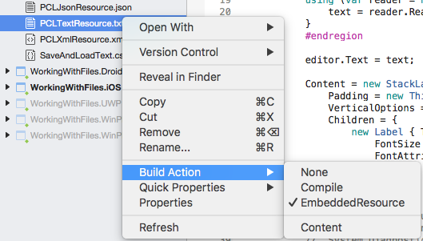
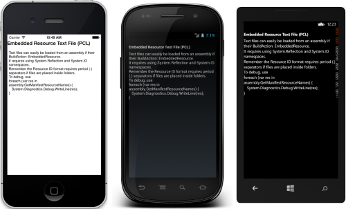
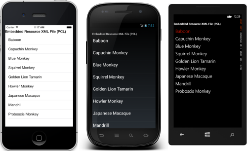

# Files

_File handling with Xamarin.Forms can be done using embedded resources or writing against the native filesystem APIs._

## Overview

Xamarin.Forms code runs on multiple platforms - each of which has its own filesystem. This means that reading and writing files is most easily done using the native file APIs on each platform. Alternatively, embedded resources are a simpler solution to distribute data files with an app.

This document covers the following common file handling scenarios:

-  [ **Files embedded as resources**](#Loading_Files_Embedded_as_Resources) - Files can be shipped as part of an application and loaded using the Reflection API.
-  [ **Saving and loading files**](#Loading_and_Saving_Files) - User-writable-storage can be implemented natively and then accessed using the  `DependencyService` .


A third-party component call **PCLStorage** can also be used to read and write files to user-accessible-storage from PCL code.

For information on handling image files, refer to the [Working with Images](~/xamarin-forms/user-interface/images.md) page.

<a name="Loading_Files_Embedded_as_Resources" />

## Loading Files Embedded as Resources

To embed a file into a **PCL** assembly, create or add a file and ensure that **Build Action: EmbeddedResource**.

# [Visual Studio](#tab/vswin)

[](files-images/vs-embeddedresource.png#lightbox "Setting EmbeddedResource BuildAction")

# [Visual Studio for Mac](#tab/vsmac)

[](files-images/xs-embeddedresource.png#lightbox "Setting EmbeddedResource BuildAction")

-----

`GetManifestResourceStream` is used to access the embedded file using its **Resource ID**. By default the resource ID is the filename prefixed with the default namespace for the project it is embedded in - in this case the assembly is **WorkingWithFiles** and the filename is **PCLTextResource.txt**, so the resource ID is `WorkingWithFiles.PCLTextResource.txt`.

```csharp
var assembly = IntrospectionExtensions.GetTypeInfo(typeof(LoadResourceText)).Assembly;
Stream stream = assembly.GetManifestResourceStream("WorkingWithFiles.PCLTextResource.txt");
string text = "";
using (var reader = new System.IO.StreamReader (stream)) {
    text = reader.ReadToEnd ();
}
```

The `text` variable can then be used to display the text or otherwise use it in code. This screenshot of the [sample app](https://developer.xamarin.com/samples/xamarin-forms/WorkingWithFiles/) shows the text rendered in a `Label` control.

 [](files-images/pcltext.png#lightbox "Embedded Text File in PCL Displayed in App")

Loading and deserializing an XML is equally simple. The following code shows an XML file being loaded and deserialized from a resource, then bound to a `ListView` for display. The XML file contains an array of `Monkey` objects (the class is defined in the sample code).

```csharp
var assembly = IntrospectionExtensions.GetTypeInfo(typeof(LoadResourceText)).Assembly;
Stream stream = assembly.GetManifestResourceStream("WorkingWithFiles.PCLXmlResource.xml");
List<Monkey> monkeys;
using (var reader = new System.IO.StreamReader (stream)) {
    var serializer = new XmlSerializer(typeof(List<Monkey>));
    monkeys = (List<Monkey>)serializer.Deserialize(reader);
}
var listView = new ListView ();
listView.ItemsSource = monkeys;
```

 [](files-images/pclxml.png#lightbox "Embedded XML File in PCL Displayed in ListView")

<a name="Embedding_in_Shared_Projects" />

### Embedding in Shared Projects

Shared Projects can also contain files as embedded resources, however because the contents of a Shared Project are compiled into the referencing projects, the prefix used for embedded file resource IDs can change. This means the resource ID for each embedded file may be different for each platform.

There are two solutions to this issue with Shared Projects:

-  **Synchronize the Projects** - Edit the project properties for each platform to use the  **same** assembly name and default namespace. This value can then be "hardcoded" as the prefix for embedded resource IDs in the Shared Project.
-  **#if compiler directives** - Use compiler directives to set the correct resource ID prefix and use that value to dynamically construct the correct resource ID.


Code illustrating the second option is shown below. Compiler directives are used to select the hardcoded resource prefix (which is normally the same as the default namespace for the referencing project). The `resourcePrefix` variable is then used to create a valid resource ID by concatenating it with the embedded resource filename.

```csharp
#if __IOS__
var resourcePrefix = "WorkingWithFiles.iOS.";
#endif
#if __ANDROID__
var resourcePrefix = "WorkingWithFiles.Droid.";
#endif
#if WINDOWS_PHONE
var resourcePrefix = "WorkingWithFiles.WinPhone.";
#endif

Debug.WriteLine("Using this resource prefix: " + resourcePrefix);
// note that the prefix includes the trailing period '.' that is required
var assembly = IntrospectionExtensions.GetTypeInfo(typeof(SharedPage)).Assembly;
Stream stream = assembly.GetManifestResourceStream
    (resourcePrefix + "SharedTextResource.txt");
```

<a name="Organizing_Resources" />

### Organizing Resources

The above examples assume that the file is embedded in the root of the PCL project, in which case the resource ID is of the form **Namespace.Filename.Extension**, such as `WorkingWithFiles.PCLTextResource.txt` and `WorkingWithFiles.iOS.SharedTextResource.txt`.

It is possible to organize embedded resources in folders. When an embedded resource is placed in a folder, the folder name becomes part of the resource ID (separated by periods), so that the resource ID format becomes **Namespace.Folder.Filename.Extension**. Placing the files used in the sample app into a folder **MyFolder** would make the corresponding resource IDs `WorkingWithFiles.MyFolder.PCLTextResource.txt` and `WorkingWithFiles.iOS.MyFolder.SharedTextResource.txt`.

<a name="Debugging_Embedded_Resources" />

### Debugging Embedded Resources

Because it is sometimes difficult to understand why a particular resource isn't being loaded, the following debug code can be added temporarily to an application to help confirm the resources are correctly configured. It will output all known resources embedded in the given assembly to the **Errors** pad to help debug resource loading issues.

```csharp
using System.Reflection;
// ...
// use for debugging, not in released app code!
var assembly = IntrospectionExtensions.GetTypeInfo(typeof(SharedPage)).Assembly;
foreach (var res in assembly.GetManifestResourceNames()) {
    System.Diagnostics.Debug.WriteLine("found resource: " + res);
}
```

<a name="Loading_and_Saving_Files" />

## Saving and Loading Files

Because Xamarin.Forms runs on multiple platforms, each with its own filesystem, there is no single approach for loading and saving files created by the user. To demonstrate how to save and load text files the sample app includes a screen that saves and loads some user input - the finished screen is shown below:

 [](files-images/saveandload.png#lightbox "Saving and Loading Files in App")

Each platform has a slightly different directory structure, and different filesystem capabilities - for example Xamarin.iOS and Xamarin.Android support most `System.IO` functionality but Windows Phone only supports `IsolatedStorage` and [ `Windows.Storage`](http://msdn.microsoft.com/library/windowsphone/develop/jj681698(v=vs.105).aspx) APIs.

To get around this problem, the sample app defines an Interface in the Xamarin.Forms PCL to load and save files. It provides a simple API to load and save text files that will be stored on the device.

```csharp
public interface ISaveAndLoad {
    void SaveText (string filename, string text);
    string LoadText (string filename);
}
```

The PCL code then uses the [DependencyService](~/xamarin-forms/app-fundamentals/dependency-service/index.md) to obtain a reference to a native implementation of the interface. This allows the portable code to delegate the loading and saving of files to class written in each of the platform-specific projects. In the sample, the **Save** and **Load** buttons are written as shown:

```csharp
var saveButton = new Button {Text = "Save"};
saveButton.Clicked += (sender, e) => {
    DependencyService.Get<ISaveAndLoad>().SaveText("temp.txt", input.Text);
};
var loadButton = new Button {Text = "Load"};
loadButton.Clicked += (sender, e) => {
    output.Text = DependencyService.Get<ISaveAndLoad>().LoadText("temp.txt");
};
```

An implementation then needs to be added to each of the platform-specific projects before files can actually be saved and loaded.

### iOS and Android

The implementation of the interface for Xamarin.iOS and Xamarin.Android projects can be identical. The code is shown below, including the `[assembly: Dependency (typeof (SaveAndLoad))]` attribute which is required for the `DependencyService` to work.

```csharp
[assembly: Dependency (typeof (SaveAndLoad))]
namespace WorkingWithFiles {
    public class SaveAndLoad : ISaveAndLoad {
        public void SaveText (string filename, string text) {
            var documentsPath = Environment.GetFolderPath (Environment.SpecialFolder.Personal);
            var filePath = Path.Combine (documentsPath, filename);
            System.IO.File.WriteAllText (filePath, text);
        }
        public string LoadText (string filename) {
            var documentsPath = Environment.GetFolderPath (Environment.SpecialFolder.Personal);
            var filePath = Path.Combine (documentsPath, filename);
            return System.IO.File.ReadAllText (filePath);
        }
    }
}
```

### Universal Windows Platform (UWP), Windows 8.1 and Windows Phone 8.1

These platforms have a different filesystem API –
[`Windows.Storage`](/windows/uwp/files/quickstart-reading-and-writing-files/) – that is used to save and load files.
The `ISaveAndLoad` interface can be implemented as shown below:

```csharp
using System;
using System.Threading.Tasks;
using Windows.Storage;
using WinApp;
using WorkingWithFiles;
using Xamarin.Forms;

[assembly: Dependency(typeof(SaveAndLoad_WinApp))]

namespace WindowsApp
{
    // https://msdn.microsoft.com/library/windows/apps/xaml/hh758325.aspx
    public class SaveAndLoad_WinApp : ISaveAndLoad
    {
        public async Task SaveTextAsync(string filename, string text)
        {
            StorageFolder localFolder = ApplicationData.Current.LocalFolder;
            StorageFile sampleFile = await localFolder.CreateFileAsync(filename, CreationCollisionOption.ReplaceExisting);
            await FileIO.WriteTextAsync(sampleFile, text);
        }
        public async Task<string> LoadTextAsync(string filename)
        {
            StorageFolder storageFolder = ApplicationData.Current.LocalFolder;
            StorageFile sampleFile = await storageFolder.GetFileAsync(filename);
            string text = await Windows.Storage.FileIO.ReadTextAsync(sampleFile);
            return text;
        }
    }
}
```


<a name="Saving_and_Loading_in_Shared_Projects" />

### Saving and Loading in Shared Projects

Because Shared Projects support compiler directives it's possible to include
all the platform-specific code in a single class file inside the Shared Project
(without using the `DependencyService`).
A single `SaveAndLoad` class could be written that contains both implementations
above, selectively compiled into the referencing projects using compiler
directives like `#if WINDOWS_PHONE`, `#if __IOS__`, and `#if __ANDROID__`.

## Additional Information

PCL-based Xamarin.Forms projects can also take advantage of the
[PCLStorage NuGet](http://www.nuget.org/packages/pclstorage) ([code &amp; documentation](https://pclstorage.codeplex.com/))
to help implement file operations in a cross-platform way.


## Summary

This document has shown some simple file operations for loading embedded resources and saving and loading text on the device. Developers can implement their own native file APIs using the `DependencyService`, making it as complex as required to handle their file-manipulation requirements.


## Related Links

- [FilesSample](https://developer.xamarin.com/samples/xamarin-forms/WorkingWithFiles/)
- [Create, write, and read a file (UWP)](/windows/uwp/files/quickstart-reading-and-writing-files/)
- [Xamarin.Forms Samples](https://github.com/xamarin/xamarin-forms-samples)
- [Files Workbook](https://developer.xamarin.com/workbooks/xamarin-forms/application-fundamentals/files/files.workbook)
