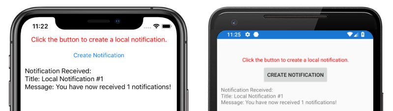
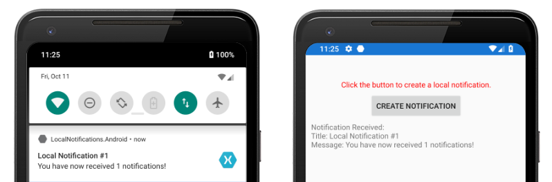
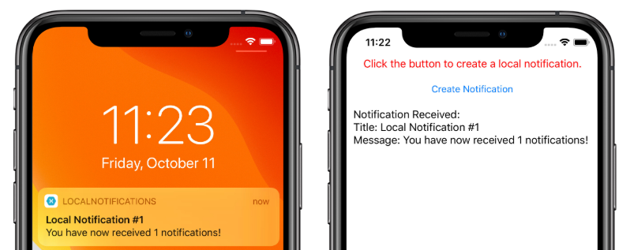

# Local notifications in Xamarin.Forms

[ Download the sample](/samples/xamarin/xamarin-forms-samples/local-notifications)

Local notifications are alerts sent by applications installed on a mobile device. Local notifications are often used for features such as:

- Calendar events
- Reminders
- Location-based triggers

Each platform handles the creation, display, and consumption of local notifications differently. This article explains how to create a cross-platform abstraction to send, schedule, and receive local notifications with Xamarin.Forms.

[](local-notifications-images/local-notifications-msg.png#lightbox)

## Create a cross-platform interface

The Xamarin.Forms application should create and consume notifications without concern for the underlying platform implementations. The following `INotificationManager` interface is implemented in the shared code library, and defines a cross-platform API that the application can use to interact with notifications:

```csharp
public interface INotificationManager
{
    event EventHandler NotificationReceived;
    void Initialize();
    void SendNotification(string title, string message, DateTime? notifyTime = null);
    void ReceiveNotification(string title, string message);
}
```

This interface will be implemented in each platform project. The `NotificationReceived` event allows the application to handle incoming notifications. The `Initialize` method should perform any native platform logic needed to prepare the notification system. The `SendNotification` method should send a notification, at an optional `DateTime`. The `ReceiveNotification` method should be called by the underlying platform when a message is received.

## Consume the interface in Xamarin.Forms

Once an interface has been created, it can be consumed in the shared Xamarin.Forms project even though platform implementations haven't been created yet. The sample application contains a `ContentPage` called **MainPage.xaml** with the following content:

```xaml
<StackLayout Margin="0,35,0,0"
             x:Name="stackLayout">
    <Label Text="Click the button below to create a local notification."
           TextColor="Red"
           HorizontalOptions="Center"
           VerticalOptions="Start" />
    <Button Text="Create Notification"
            HorizontalOptions="Center"
            VerticalOptions="Start"
            Clicked="OnSendClick" />
    <Label Text="Click the button below to schedule a local notification for in 10 seconds time."
           TextColor="Red"
           HorizontalOptions="Center"
           VerticalOptions="Start" />
    <Button Text="Create Notification"
            HorizontalOptions="Center"
            VerticalOptions="Start"
            Clicked="OnScheduleClick" />
</StackLayout>
```

The layout contains `Label` elements that explain instructions, and `Button` elements that send or schedule a notification when tapped.

The `MainPage` class code-behind handles the sending and receiving of notifications:

```csharp
public partial class MainPage : ContentPage
{
    INotificationManager notificationManager;
    int notificationNumber = 0;

    public MainPage()
    {
        InitializeComponent();

        notificationManager = DependencyService.Get<INotificationManager>();
        notificationManager.NotificationReceived += (sender, eventArgs) =>
        {
            var evtData = (NotificationEventArgs)eventArgs;
            ShowNotification(evtData.Title, evtData.Message);
        };
    }

    void OnSendClick(object sender, EventArgs e)
    {
        notificationNumber++;
        string title = $"Local Notification #{notificationNumber}";
        string message = $"You have now received {notificationNumber} notifications!";
        notificationManager.SendNotification(title, message);
    }

    void OnScheduleClick(object sender, EventArgs e)
    {
        notificationNumber++;
        string title = $"Local Notification #{notificationNumber}";
        string message = $"You have now received {notificationNumber} notifications!";
        notificationManager.SendNotification(title, message, DateTime.Now.AddSeconds(10));
    }

    void ShowNotification(string title, string message)
    {
        Device.BeginInvokeOnMainThread(() =>
        {
            var msg = new Label()
            {
                Text = $"Notification Received:\nTitle: {title}\nMessage: {message}"
            };
            stackLayout.Children.Add(msg);
        });
    }
}
```

The `MainPage` class constructor uses the Xamarin.Forms `DependencyService` to retrieve a platform-specific instance of the `INotificationManager`. The `OnSendClick` and `OnScheduleClicked` methods use the `INotificationManager` instance to send and schedule new notifications. The `ShowNotification` method is called from the event handler attached to the `NotificationReceived` event, and will insert a new `Label` into the page when the event is invoked.

The `NotificationReceived` event handler casts its event arguments to `NotificationEventArgs`. This type is defined in the shared Xamarin.Forms project:

```csharp
public class NotificationEventArgs : EventArgs
{
    public string Title { get; set; }
    public string Message { get; set; }
}
```

For more information about the Xamarin.Forms `DependencyService`, see [Xamarin.Forms DependencyService](~/xamarin-forms/app-fundamentals/dependency-service/introduction.md).

## Create the Android interface implementation

For the Xamarin.Forms application to send and receive notifications on Android, the application must provide an implementation of the `INotificationManager` interface.

### Create the AndroidNotificationManager class

The `AndroidNotificationManager` class implements the `INotificationManager` interface:

```csharp
using System;
using Android.App;
using Android.Content;
using Android.Graphics;
using Android.OS;
using AndroidX.Core.App;
using Xamarin.Forms;
using AndroidApp = Android.App.Application;

[assembly: Dependency(typeof(LocalNotifications.Droid.AndroidNotificationManager))]
namespace LocalNotifications.Droid
{
    public class AndroidNotificationManager : INotificationManager
    {
        const string channelId = "default";
        const string channelName = "Default";
        const string channelDescription = "The default channel for notifications.";

        public const string TitleKey = "title";
        public const string MessageKey = "message";

        bool channelInitialized = false;
        int messageId = 0;
        int pendingIntentId = 0;

        NotificationManager manager;

        public event EventHandler NotificationReceived;

        public static AndroidNotificationManager Instance { get; private set; }

        public AndroidNotificationManager() => Initialize();

        public void Initialize()
        {
            if (Instance == null)
            {
                CreateNotificationChannel();
                Instance = this;
            }
        }

        public void SendNotification(string title, string message, DateTime? notifyTime = null)
        {
            if (!channelInitialized)
            {
                CreateNotificationChannel();
            }

            if (notifyTime != null)
            {
                Intent intent = new Intent(AndroidApp.Context, typeof(AlarmHandler));
                intent.PutExtra(TitleKey, title);
                intent.PutExtra(MessageKey, message);

                PendingIntent pendingIntent = PendingIntent.GetBroadcast(AndroidApp.Context, pendingIntentId++, intent, PendingIntentFlags.CancelCurrent);
                long triggerTime = GetNotifyTime(notifyTime.Value);
                AlarmManager alarmManager = AndroidApp.Context.GetSystemService(Context.AlarmService) as AlarmManager;
                alarmManager.Set(AlarmType.RtcWakeup, triggerTime, pendingIntent);
            }
            else
            {
                Show(title, message);
            }
        }

        public void ReceiveNotification(string title, string message)
        {
            var args = new NotificationEventArgs()
            {
                Title = title,
                Message = message,
            };
            NotificationReceived?.Invoke(null, args);
        }

        public void Show(string title, string message)
        {
            Intent intent = new Intent(AndroidApp.Context, typeof(MainActivity));
            intent.PutExtra(TitleKey, title);
            intent.PutExtra(MessageKey, message);

            PendingIntent pendingIntent = PendingIntent.GetActivity(AndroidApp.Context, pendingIntentId++, intent, PendingIntentFlags.UpdateCurrent);

            NotificationCompat.Builder builder = new NotificationCompat.Builder(AndroidApp.Context, channelId)
                .SetContentIntent(pendingIntent)
                .SetContentTitle(title)
                .SetContentText(message)
                .SetLargeIcon(BitmapFactory.DecodeResource(AndroidApp.Context.Resources, Resource.Drawable.xamagonBlue))
                .SetSmallIcon(Resource.Drawable.xamagonBlue)
                .SetDefaults((int)NotificationDefaults.Sound | (int)NotificationDefaults.Vibrate);

            Notification notification = builder.Build();
            manager.Notify(messageId++, notification);
        }

        void CreateNotificationChannel()
        {
            manager = (NotificationManager)AndroidApp.Context.GetSystemService(AndroidApp.NotificationService);

            if (Build.VERSION.SdkInt >= BuildVersionCodes.O)
            {
                var channelNameJava = new Java.Lang.String(channelName);
                var channel = new NotificationChannel(channelId, channelNameJava, NotificationImportance.Default)
                {
                    Description = channelDescription
                };
                manager.CreateNotificationChannel(channel);
            }

            channelInitialized = true;
        }

        long GetNotifyTime(DateTime notifyTime)
        {
            DateTime utcTime = TimeZoneInfo.ConvertTimeToUtc(notifyTime);
            double epochDiff = (new DateTime(1970, 1, 1) - DateTime.MinValue).TotalSeconds;
            long utcAlarmTime = utcTime.AddSeconds(-epochDiff).Ticks / 10000;
            return utcAlarmTime; // milliseconds
        }
    }
}
```

The `assembly` attribute above the namespace registers the `INotificationManager` interface implementation with the `DependencyService`.

Android allows applications to define multiple channels for notifications. The `Initialize` method creates a basic channel the sample application uses to send notifications. The `SendNotification` method defines the platform-specific logic required to create and send a notification. The `ReceiveNotification` method is called by the Android OS when a message is received, and invokes the event handler.

The `SendNotification` method creates a local notification immediately, or at an exact `DateTime`. A notification can be scheduled for an exact `DateTime` using the `AlarmManager` class, and the notification will be received by an object that derives from the `BroadcastReceiver` class:

```csharp
[BroadcastReceiver(Enabled = true, Label = "Local Notifications Broadcast Receiver")]
public class AlarmHandler : BroadcastReceiver
{
    public override void OnReceive(Context context, Intent intent)
    {
        if (intent?.Extras != null)
        {
            string title = intent.GetStringExtra(AndroidNotificationManager.TitleKey);
            string message = intent.GetStringExtra(AndroidNotificationManager.MessageKey);

            AndroidNotificationManager manager = AndroidNotificationManager.Instance ?? new AndroidNotificationManager();
            manager.Show(title, message);
        }
    }
}
```

> [!IMPORTANT]
> By default, notifications scheduled using the `AlarmManager` class will not survive device restart. However, you can design your application to automatically reschedule notifications if the device is restarted. For more information, [Start an alarm when the device restarts](https://developer.android.com/training/scheduling/alarms#boot) in [Schedule repeating alarms](https://developer.android.com/training/scheduling/alarms) on developer.android.com, and the [sample](/samples/xamarin/xamarin-forms-samples/local-notifications). For information about background processing on Android, see [Guide to background processing](https://developer.android.com/guide/background) on developer.android.com.

For more information about broadcast receivers, see [Broadcast Receivers in Xamarin.Android](~/android/app-fundamentals/broadcast-receivers.md).

### Handle incoming notifications on Android

The `MainActivity` class must detect incoming notifications and notify the `AndroidNotificationManager` instance. The `Activity` attribute on the `MainActivity` class should specify a `LaunchMode` value of `LaunchMode.SingleTop`:

```csharp
[Activity(
        //...
        LaunchMode = LaunchMode.SingleTop]
    public class MainActivity : global::Xamarin.Forms.Platform.Android.FormsAppCompatActivity
    {
        // ...
    }
```

The `SingleTop` mode prevents multiple instances of an `Activity` from being started while the application is in the foreground. This `LaunchMode` may not be appropriate for applications that launch multiple activities in more complex notification scenarios. For more information about `LaunchMode` enumeration values, see [Android Activity LaunchMode](https://developer.android.com/guide/topics/manifest/activity-element#lmode).

In the `MainActivity` class is modified to receive incoming notifications:

```csharp
protected override void OnCreate(Bundle savedInstanceState)
{
    // ...

    global::Xamarin.Forms.Forms.Init(this, savedInstanceState);
    LoadApplication(new App());
    CreateNotificationFromIntent(Intent);
}

protected override void OnNewIntent(Intent intent)
{
    CreateNotificationFromIntent(intent);
}

void CreateNotificationFromIntent(Intent intent)
{
    if (intent?.Extras != null)
    {
        string title = intent.GetStringExtra(AndroidNotificationManager.TitleKey);
        string message = intent.GetStringExtra(AndroidNotificationManager.MessageKey);
        DependencyService.Get<INotificationManager>().ReceiveNotification(title, message);
    }
}
```

The `CreateNotificationFromIntent` method extracts notification data from the `intent` argument and provides it to the `AndroidNotificationManager` using the `ReceiveNotification` method. The `CreateNotificationFromIntent` method is called from both the `OnCreate` method and the `OnNewIntent` method:

- When the application is started by notification data, the `Intent` data will be passed to the `OnCreate` method.
- If the application is already in the foreground, the `Intent` data will be passed to the `OnNewIntent` method.

Android offers many advanced options for notifications. For more information, see [Notifications in Xamarin.Android](~/android/app-fundamentals/notifications/index.md).

## Create the iOS interface implementation

For the Xamarin.Forms application to send and receive notifications on iOS, the application must provide an implementation of the `INotificationManager`.

### Create the iOSNotificationManager class

The `iOSNotificationManager` class implements the `INotificationManager` interface:

```csharp
using System;
using Foundation;
using UserNotifications;
using Xamarin.Forms;

[assembly: Dependency(typeof(LocalNotifications.iOS.iOSNotificationManager))]
namespace LocalNotifications.iOS
{
    public class iOSNotificationManager : INotificationManager
    {
        int messageId = 0;
        bool hasNotificationsPermission;
        public event EventHandler NotificationReceived;

        public void Initialize()
        {
            // request the permission to use local notifications
            UNUserNotificationCenter.Current.RequestAuthorization(UNAuthorizationOptions.Alert, (approved, err) =>
            {
                hasNotificationsPermission = approved;
            });
        }

        public void SendNotification(string title, string message, DateTime? notifyTime = null)
        {
            // EARLY OUT: app doesn't have permissions
            if (!hasNotificationsPermission)
            {
                return;
            }

            messageId++;

            var content = new UNMutableNotificationContent()
            {
                Title = title,
                Subtitle = "",
                Body = message,
                Badge = 1
            };            

            UNNotificationTrigger trigger;
            if (notifyTime != null)
            {
                // Create a calendar-based trigger.
                trigger = UNCalendarNotificationTrigger.CreateTrigger(GetNSDateComponents(notifyTime.Value), false);
            }
            else
            {
                // Create a time-based trigger, interval is in seconds and must be greater than 0.
                trigger = UNTimeIntervalNotificationTrigger.CreateTrigger(0.25, false);
            }                      

            var request = UNNotificationRequest.FromIdentifier(messageId.ToString(), content, trigger);
            UNUserNotificationCenter.Current.AddNotificationRequest(request, (err) =>
            {
                if (err != null)
                {
                    throw new Exception($"Failed to schedule notification: {err}");
                }
            });
        }

        public void ReceiveNotification(string title, string message)
        {
            var args = new NotificationEventArgs()
            {
                Title = title,
                Message = message
            };
            NotificationReceived?.Invoke(null, args);
        }

        NSDateComponents GetNSDateComponents(DateTime dateTime)
        {
            return new NSDateComponents
            {
                Month = dateTime.Month,
                Day = dateTime.Day,
                Year = dateTime.Year,
                Hour = dateTime.Hour,
                Minute = dateTime.Minute,
                Second = dateTime.Second
            };
        }
    }
}
```

The `assembly` attribute above the namespace registers the `INotificationManager` interface implementation with the `DependencyService`.

On iOS, you must request permission to use notifications before attempting to schedule a notification. The `Initialize` method requests authorization to use local notifications. The `SendNotification` method defines the logic required to create and send a notification. The `ReceiveNotification` method will be called by iOS when a message is received, and invokes the event handler.

> [!NOTE]
> The `SendNotification` method creates a local notification immediately, using a `UNTimeIntervalNotificationTrigger` object, or at an exact `DateTime` using a `UNCalendarNotificationTrigger` object.

### Handle incoming notifications on iOS

On iOS, you must create a delegate that subclasses `UNUserNotificationCenterDelegate` to handle incoming messages. The sample application defines an `iOSNotificationReceiver` class:

```csharp
public class iOSNotificationReceiver : UNUserNotificationCenterDelegate
{
    public override void WillPresentNotification(UNUserNotificationCenter center, UNNotification notification, Action<UNNotificationPresentationOptions> completionHandler)
    {
        ProcessNotification(notification);
        completionHandler(UNNotificationPresentationOptions.Alert);
    }

    void ProcessNotification(UNNotification notification)
    {
        string title = notification.Request.Content.Title;
        string message = notification.Request.Content.Body;

        DependencyService.Get<INotificationManager>().ReceiveNotification(title, message);
    }    
}
```

This class uses the `DependencyService` to get an instance of the `iOSNotificationManager` class and provides incoming notification data to the `ReceiveNotification` method.

The `AppDelegate` class must specify an `iOSNotificationReceiver` object as the `UNUserNotificationCenter` delegate during application startup. This occurs in the `FinishedLaunching` method:

```csharp
public override bool FinishedLaunching(UIApplication app, NSDictionary options)
{
    global::Xamarin.Forms.Forms.Init();

    UNUserNotificationCenter.Current.Delegate = new iOSNotificationReceiver();

    LoadApplication(new App());
    return base.FinishedLaunching(app, options);
}
```

iOS offers many advanced options for notifications. For more information, see [Notifications in Xamarin.iOS](~/ios/platform/user-notifications/index.md).

## Test the application

Once the platform projects contain a registered implementation of the `INotificationManager` interface, the application can be tested on both platforms. Run the application and click either of the **Create Notification** buttons to create a notification.

On Android, notifications will appear in the notification area. When the notification is tapped, the application receives the notification and displays a message:



On iOS, incoming notifications are automatically received by the application without requiring user input. The application receives the notification and displays a message:



## Related links

- [Sample project](/samples/xamarin/xamarin-forms-samples/local-notifications)
- [Notifications in Xamarin.Android](~/android/app-fundamentals/notifications/index.md)
- [Broadcast Receivers in Xamarin.Android](~/android/app-fundamentals/broadcast-receivers.md)
- [Notifications in Xamarin.iOS](~/ios/platform/user-notifications/index.md)
- [Xamarin.Forms DependencyService](~/xamarin-forms/app-fundamentals/dependency-service/introduction.md)
