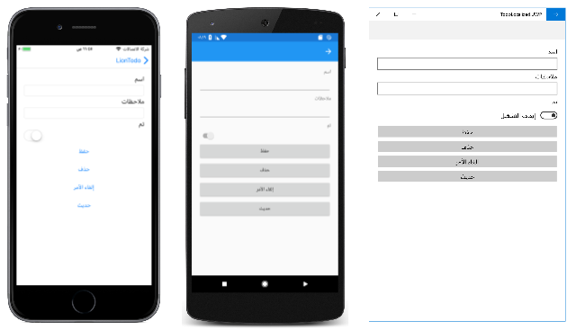
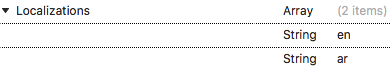

# Right-to-left localization

[ Download the sample](https://developer.xamarin.com/samples/xamarin-forms/TodoLocalizedRTL/)

_Right-to-left localization adds support for right-to-left flow direction to Xamarin.Forms applications._

> [!NOTE]
> Right-to-left localization requires the use of iOS 9 or higher, and API 17 or higher on Android.

Flow direction is the direction in which the UI elements on the page are scanned by the eye. Some languages, such as Arabic and Hebrew, require that UI elements are laid out in a right-to-left flow direction. This can be achieved by setting the [`VisualElement.FlowDirection`](xref:Xamarin.Forms.VisualElement.FlowDirection) property. This property gets or sets the direction in which UI elements flow within any parent element that controls their layout, and should be set to one of the [`FlowDirection`](xref:Xamarin.Forms.FlowDirection) enumeration values:

- [`LeftToRight`](xref:Xamarin.Forms.FlowDirection.LeftToRight)
- [`RightToLeft`](xref:Xamarin.Forms.FlowDirection.RightToLeft)
- [`MatchParent`](xref:Xamarin.Forms.FlowDirection.MatchParent)

Setting the [`FlowDirection`](xref:Xamarin.Forms.VisualElement.FlowDirection) property to [`RightToLeft`](xref:Xamarin.Forms.FlowDirection.RightToLeft) on an element generally sets the alignment to the right, the reading order to right-to-left, and the layout of the control to flow from right-to-left:

[](rtl-images/TodoItemPage-Arabic-Large.png#lightbox "TodoItemPage in Arabic with a right-to-left flow direction")

> [!TIP]
> You should only set the [`FlowDirection`](xref:Xamarin.Forms.VisualElement.FlowDirection) property on initial layout. Changing this value at runtime causes an expensive layout process that will affect performance.

The default [`FlowDirection`](xref:Xamarin.Forms.VisualElement.FlowDirection) property value for an element without a parent is [`LeftToRight`](xref:Xamarin.Forms.FlowDirection.LeftToRight), while the default `FlowDirection` for an element with a parent is [`MatchParent`](xref:Xamarin.Forms.FlowDirection.MatchParent). Therefore, an element inherits the `FlowDirection` property value from its parent in the visual tree, and any element can override the value it gets from its parent.

> [!TIP]
> When localizing an app for right-to-left languages, set the [`FlowDirection`](xref:Xamarin.Forms.VisualElement.FlowDirection) property on a page or root layout. This causes all of the elements contained within the page, or root layout, to respond appropriately to the flow direction.

## Respecting device flow direction

Respecting the device's flow direction based on the selected language and region is an explicit developer choice and does not happen automatically. It can be achieved by setting the [`FlowDirection`](xref:Xamarin.Forms.VisualElement.FlowDirection) property on a page, or root layout, to the `static` [`Device.FlowDirection`](xref:Xamarin.Forms.Device.FlowDirection) value:

```xaml
<ContentPage ... FlowDirection="{x:Static Device.FlowDirection}"> />
```

```csharp
this.FlowDirection = Device.FlowDirection;
```

All child elements of the page, or root layout, will by default then inherit the [`Device.FlowDirection`](xref:Xamarin.Forms.Device.FlowDirection) value.

## Platform setup

Specific platform setup is required to enable right-to-left locales.

### iOS

The required right-to-left locale should be added as a supported language to the array items for the `CFBundleLocalizations` key in **Info.plist**. The following example shows Arabic having been added to the array for the `CFBundleLocalizations` key:

```xml
<key>CFBundleLocalizations</key>
<array>
    <string>en</string>
    <string>ar</string>
</array>
```



For more information, see [Localization Basics in iOS](https://docs.microsoft.com/xamarin/ios/app-fundamentals/localization/#localization-basics-in-ios).

Right-to-left localization can then be tested by changing the language and region on the device/simulator to a right-to-left locale that was specified in **Info.plist**.

> [!WARNING]
> Please note that when changing the language and region to a right-to-left locale on iOS, any [`DatePicker`](xref:Xamarin.Forms.DatePicker) views will throw an exception if you do not include the resources required for the locale. For example, when testing an app in Arabic that has a `DatePicker`, ensure that **mideast** is selected in the **Internationalization** section of the **iOS Build** pane.

### Android

The app's **AndroidManifest.xml** file should be updated so that the `<uses-sdk>` node sets the `android:minSdkVersion` attribute to 17, and the `<application>` node sets the `android:supportsRtl` attribute to `true`:

```xml
<?xml version="1.0" encoding="utf-8"?>
<manifest ... >
    <uses-sdk android:minSdkVersion="17" ... />
    <application ... android:supportsRtl="true">
    </application>
</manifest>
```

Right-to-left localization can then be tested by changing the device/emulator to use the right-to-left language, or by enabling **Force RTL layout direction** in **Settings > Developer Options**.

### Universal Windows Platform (UWP)

The required language resources should be specified in the `<Resources>` node of the **Package.appxmanifest** file. The following example shows Arabic having been added to the `<Resources>` node:

```xml
<Resources>
    <Resource Language="x-generate"/>
    <Resource Language="en" />
    <Resource Language="ar" />
</Resources>
```

In addition, UWP requires that the app's default culture is explicitly defined in the .NET Standard library. This can be accomplished by setting the `NeutralResourcesLanguage` attribute in `AssemblyInfo.cs`, or in another class, to the default culture:

```csharp
using System.Resources;

[assembly: NeutralResourcesLanguage("en")]
```

Right-to-left localization can then be tested by changing the language and region on the device to the appropriate right-to-left locale.

## Limitations

Xamarin.Forms right-to-left localization currently has a number of limitations:

- [`NavigationPage`](xref:Xamarin.Forms.NavigationPage) button location, toolbar item location, and transition animation is controlled by the device locale, rather than the [`FlowDirection`](xref:Xamarin.Forms.VisualElement.FlowDirection) property.
- [`CarouselPage`](xref:Xamarin.Forms.CarouselPage) swipe direction does not flip.
- [`Image`](xref:Xamarin.Forms.Image) visual content does not flip.
- [`DisplayAlert`](xref:Xamarin.Forms.Page.DisplayAlert(System.String,System.String,System.String)) and [`DisplayActionSheet`](xref:Xamarin.Forms.Page.DisplayActionSheet(System.String,System.String,System.String,System.String[])) orientation is controlled by the device locale, rather than the [`FlowDirection`](xref:Xamarin.Forms.VisualElement.FlowDirection) property.
- [`WebView`](xref:Xamarin.Forms.WebView) content does not respect the [`FlowDirection`](xref:Xamarin.Forms.VisualElement.FlowDirection) property.
- A `TextDirection` property needs to be added, to control text alignment.

### iOS

- [`Stepper`](xref:Xamarin.Forms.Stepper) orientation is controlled by the device locale, rather than the [`FlowDirection`](xref:Xamarin.Forms.VisualElement.FlowDirection) property.
- [`EntryCell`](xref:Xamarin.Forms.EntryCell) text alignment is controlled by the device locale, rather than the [`FlowDirection`](xref:Xamarin.Forms.VisualElement.FlowDirection) property.
- [`ContextActions`](xref:Xamarin.Forms.Cell.ContextActions) gestures and alignment are not reversed.

### Android

- [`SearchBar`](xref:Xamarin.Forms.SearchBar) orientation is controlled by the device locale, rather than the [`FlowDirection`](xref:Xamarin.Forms.VisualElement.FlowDirection) property.
- [`ContextActions`](xref:Xamarin.Forms.Cell.ContextActions) placement is controlled by the device locale, rather than the [`FlowDirection`](xref:Xamarin.Forms.VisualElement.FlowDirection) property.

### UWP

- [`Editor`](xref:Xamarin.Forms.Editor) text alignment is controlled by the device locale, rather than the [`FlowDirection`](xref:Xamarin.Forms.VisualElement.FlowDirection) property.
- [`FlowDirection`](xref:Xamarin.Forms.VisualElement.FlowDirection) property is not inherited by [`MasterDetailPage`](xref:Xamarin.Forms.MasterDetailPage) children.
- [`ContextActions`](xref:Xamarin.Forms.Cell.ContextActions) text alignment is controlled by the device locale, rather than the [`FlowDirection`](xref:Xamarin.Forms.VisualElement.FlowDirection) property.

## Right to left language support with Xamarin.University

> [!VIDEO https://youtube.com/embed/f2lQ5yw3iiU]

**Xamarin.Forms 3.0 Right-to-Left Support, by [Xamarin University](https://university.xamarin.com/)**

## Related links

- [TodoLocalizedRTL Sample App](https://developer.xamarin.com/samples/xamarin-forms/TodoLocalizedRTL/)
