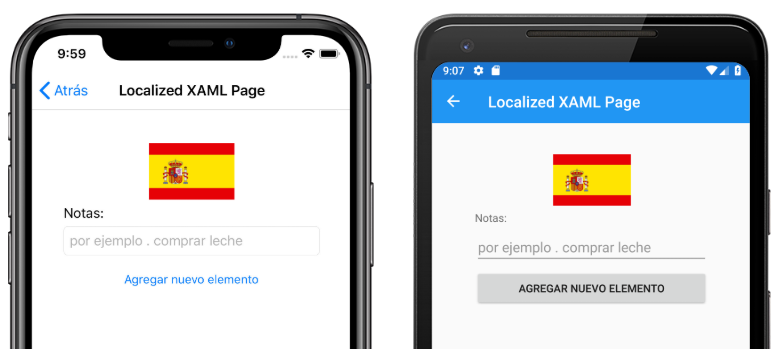
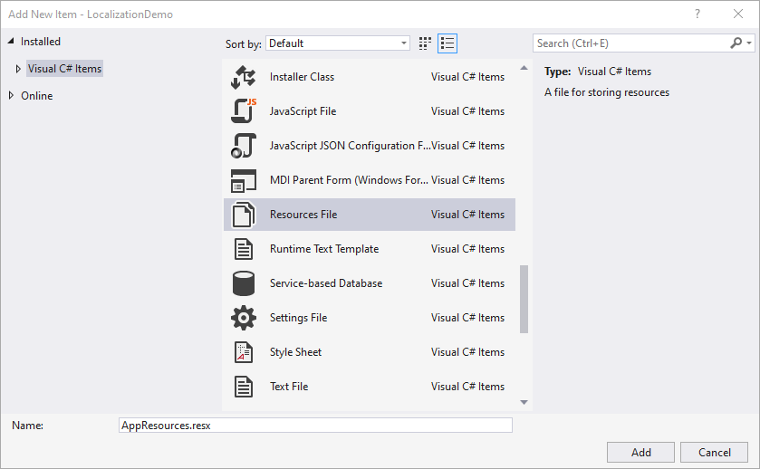
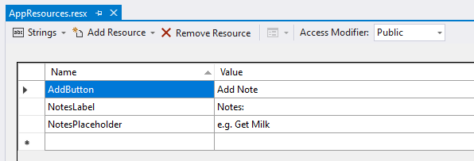
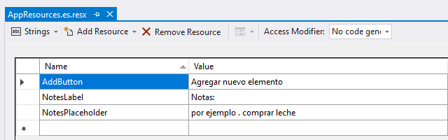
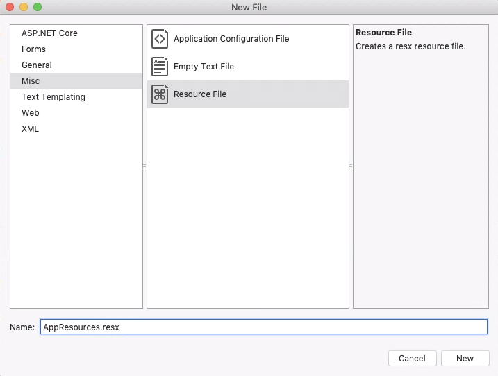
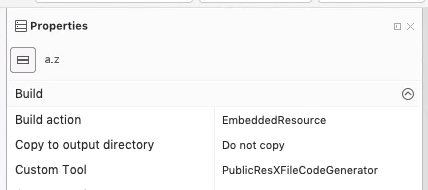
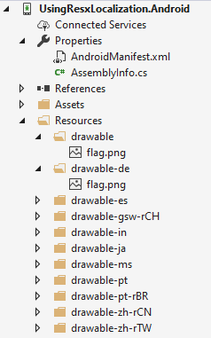
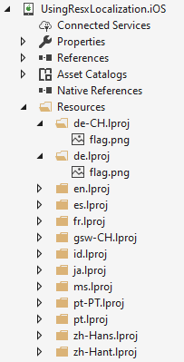
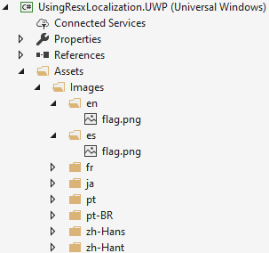

# Xamarin.Forms String and Image Localization

[ Download the sample](/samples/xamarin/xamarin-forms-samples/usingresxlocalization)

Localization is the process of adapting an application to meet the specific language or cultural requirements of a target market. To accomplish localization, the text and images in an application may need to be translated into multiple languages. A localized application automatically displays translated text based on the culture settings of the mobile device:



The .NET framework includes a built-in mechanism for localizing applications using [Resx resource files](/dotnet/framework/resources/creating-resource-files-for-desktop-apps). A resource file stores text and other content as name/value pairs that allow the application to retrieve content for a provided key. Resource files allow localized content to be separated from application code.

Using resource files to localize Xamarin.Forms applications requires you to perform the following steps:

1. [Create Resx files](#create-resx-files) containing translated text.
1. [Specify the default culture](#specify-the-default-culture) in the shared project.
1. [Localize text in Xamarin.Forms](#localize-text-in-xamarinforms).
1. [Localize images](#localize-images) based on culture settings for each platform.
1. [Localize the application name](#localize-the-application-name) on each platform.
1. [Test localization](#test-localization) on each platform.

## Create Resx files

Resource files are XML files with a **.resx** extension that are compiled into binary resource (.resources) files during the build process. Visual Studio 2019 generates a class that provides an API used to retrieve resources. A localized application typically contains a default resource file with all strings used in the application, as well as resource files for each supported language. The sample application has a **Resx** folder in the shared project that contains the resource files, and its default resource file called **AppResources.resx**.

Resource files contain the following information for each item:

- **Name** specifies the key used to access the text in code.
- **Value** specifies the translated text.
- **Comment** is an optional field containing additional information.

::: zone pivot="windows"

A resource file is added with the **Add New Item** dialog in Visual Studio 2019:



Once the file is added, rows can be added for each text resource:



The **Access Modifier** drop down setting determines how Visual Studio generates the class used to access resources. Setting the Access Modifier to **Public** or **Internal** results in a generated class with the specified accessibility level. Setting the Access Modifier to **No code generation** does not generate a class file. The default resource file should be configured to generate a class file, which results in a file with the **.designer.cs** extension being added to the project.

Once the default resource file is created, additional files can be created for each culture the application supports. Each additional resource file should include the translation culture in the filename and should have the **Access Modifier** set to **No code generation**.

At runtime, the application attempts to resolve a resource request in order of specificity. For example, if the device culture is **en-US** the application looks for resource files in this order:

1. AppResources.en-US.resx
1. AppResources.en.resx
1. AppResources.resx (default)

The following screenshot shows a Spanish translation file named **AppResources.es.resx**:



The translation file uses the same **Name** values specified in the default file but contains Spanish language strings in the **Value** column. Additionally, the **Access Modifier** is set to **No code generation**.

::: zone-end
::: zone pivot="macos"

A resource file is added with the **Add New File** dialog in Visual Studio 2019 for Mac:



Once a default resource file has been created, text can be added by creating `data` elements within the `root` element in the resource file:

```xml
<?xml version="1.0" encoding="utf-8"?>
<root>
    ...
    <data name="AddButton" xml:space="preserve">
        <value>Add Note</value>
    </data>
    <data name="NotesLabel" xml:space="preserve">
        <value>Notes:</value>
    </data>
    <data name="NotesPlaceholder" xml:space="preserve">
        <value>e.g. Get Milk</value>
    </data>
</root>
```

A **.designer.cs** class file can be created by setting a **Custom Tool** property in the resource file options:



Setting the **Custom Tool** to **PublicResXFileCodeGenerator** will result in generated class with `public` access. Setting the **Custom Tool** to **InternalResXFileCodeGenerator** will result in a generated class with `internal` access. An empty **Custom Tool** value will not generate a class. The generated class name will match the resource file name. For example, the **AppResources.resx** file will result in the creation of an `AppResources` class in a file called **AppResources.designer.cs**.

Additional resource files can be created for each supported culture. Each language file should include the translation culture in the filename so a file targeting **es-MX** should be named **AppResources.es-MX.resx**.

At runtime, the application attempts to resolve a resource request in order of specificity. For example, if the device culture is **en-US** the application looks for resource files in this order:

1. AppResources.en-US.resx
1. AppResources.en.resx
1. AppResources.resx (default)

Language translation files should have the same **Name** values specified as the default file. The following XML shows the Spanish translation file named **AppResources.es.resx**:

```xml
<?xml version="1.0" encoding="utf-8"?>
<root>
    ...
    <data name="NotesLabel" xml:space="preserve">
        <value>Notas:</value>
    </data>
    <data name="NotesPlaceholder" xml:space="preserve">
        <value>por ejemplo . comprar leche</value>
    </data>
    <data name="AddButton" xml:space="preserve">
        <value>Agregar nuevo elemento</value>
    </data>
</root>
```

::: zone-end

## Specify the default culture

For resource files to work correctly, the application must have an `NeutralResourcesLanguage` attribute specified. In the project containing the resource files, the **AssemblyInfo.cs** file should be customized to specify the default culture. The following code shows how to set the `NeutralResourcesLanguage` to **en-US** in the **AssemblyInfo.cs** file:

```csharp
using System.Resources;

// The resources from the neutral language .resx file are stored directly
// within the library assembly. For that reason, changing en-US to a different
// language in this line will not by itself change the language shown in the
// app. See the discussion of UltimateResourceFallbackLocation in the
// documentation for additional information:
// https://learn.microsoft.com/dotnet/api/system.resources.neutralresourceslanguageattribute
[assembly: NeutralResourcesLanguage("en-US")]
```

> [!WARNING]
> If you do not specify the `NeutralResourcesLanguage` attribute, the `ResourceManager` class returns `null` values for any cultures without a specific resource file. When the default culture is specified, the `ResourceManager` returns results from the default Resx file for unsupported cultures. Therefore, it is recommended that you always specify the `NeutralResourcesLanguage` so that text is displayed for unsupported cultures.

Once a default resource file has been created and the default culture specified in the **AssemblyInfo.cs** file, the application can retrieve localized strings at runtime.

For more information about resource files, see [Create resource files for .NET apps](/dotnet/framework/resources/creating-resource-files-for-desktop-apps).

## Specify supported languages on iOS

On iOS, you must declare all supported languages in the **Info.plist** file for your project. In the **Info.plist** file, use the **Source** view to set an array for the `CFBundleLocalizations` key, and provide values that correspond to the Resx files. In addition, ensure you set an expected language via the `CFBundleDevelopmentRegion` key:


Alternatively, open the **Info.plist** file in an XML editor and add the following:

```xml
<key>CFBundleLocalizations</key>
<array>
    <string>de</string>
    <string>es</string>
    <string>fr</string>
    <string>ja</string>
    <string>pt</string> <!-- Brazil -->
    <string>pt-PT</string> <!-- Portugal -->
    <string>ru</string>
    <string>zh-Hans</string>
    <string>zh-Hant</string>
</array>
<key>CFBundleDevelopmentRegion</key>
<string>en</string>
```

> [!NOTE]
> Apple treats Portuguese slightly differently than you might expect. For more information, see [Adding Languages](https://developer.apple.com/library/archive/documentation/MacOSX/Conceptual/BPInternational/LocalizingYourApp/LocalizingYourApp.html#//apple_ref/doc/uid/10000171i-CH5-SW2) on developer.apple.com.

For more information, see [Specifying default and supported languages in Info.plist](~/ios/app-fundamentals/localization/index.md#specifying-default-and-supported-languages-in-infoplist).

## Specify supported languages on UWP

This is only necessary if you generate an App Bundle when you package the app for sideloading or the store. When you generate a UWP App Bundle, when the bundle is installed, it will only load the resources related to the install device's language settings. Therefore, if the device only has English, then only English resources will be installed with the app. For more information and instructions, see [Windows 8.1 Store apps: Ensure that resources are installed on a device regardless of whether a device requires them](/previous-versions/dn482043(v=vs.140)#option-1-add-a-configuration-file-to-your-solution).

## Localize text in Xamarin.Forms

Text is localized in Xamarin.Forms using the generated `AppResources` class. This class is named based on the default resource file name. Since the sample project resource file is named **AppResources.resx**, Visual Studio generates a matching class called `AppResources`. Static properties are generated in the `AppResources` class for each row in the resource file. The following static properties are generated in the sample application's `AppResources` class:

- AddButton
- NotesLabel
- NotesPlaceholder

Accessing these values as [x:Static](~/xamarin-forms/xaml/xaml-basics/xaml-markup-extensions.md#the-xstatic-markup-extension) properties allows localized text to be displayed in XAML:

```xaml
<ContentPage ...
             xmlns:resources="clr-namespace:LocalizationDemo.Resx">
    <Label Text="{x:Static resources:AppResources.NotesLabel}" />
    <Entry Placeholder="{x:Static resources:AppResources.NotesPlaceholder}" />
    <Button Text="{x:Static resources:AppResources.AddButton}" />
</ContentPage>
```

Localized text can also be retrieved in code:

```csharp
public LocalizedCodePage()
{
    Label notesLabel = new Label
    {
        Text = AppResources.NotesLabel,
        // ...
    };

    Entry notesEntry = new Entry
    {
        Placeholder = AppResources.NotesPlaceholder,
        //...
    };

    Button addButton = new Button
    {
        Text = AppResources.AddButton,
        // ...
    };

    Content = new StackLayout
    {
        Children = {
            notesLabel,
            notesEntry,
            addButton
        }
    };
}
```

The properties in the `AppResources` class use the current value of the `System.Globalization.CultureInfo.CurrentUICulture` to determine which culture resource file to retrieve values from.

## Localize images

In addition to storing text, Resx files are capable of storing more than just text, they can also store images and binary data. However, mobile devices have a range of screen sizes and densities and each mobile platform has functionality for displaying density-dependent images. Therefore, platform image localization functionality should be used instead of storing images in resource files.

### Localize images on Android

On Android, localized drawables (images) are stored using a naming convention for folders in the **Resources** directory. Folders are named **drawable** with a suffix for the target language. For example, the Spanish-language folder is named **drawable-es**.

When a four-letter locale code is required, Android requires an additional **r** following the dash. For example, the Mexico locale (es-MX) folder should be named **drawable-es-rMX**. The image file names in each locale folder should be identical:



For more information, see [Android Localization](~/android/app-fundamentals/localization.md).

### Localize images on iOS

On iOS, localized images are stored using a naming convention for folders in the **Resources** directory. The default folder is named **Base.lproj**. Language-specific folders are named with the language or locale name, followed by **.lproj**. For example, the Spanish-language folder is named **es.lproj**.

Four-letter local codes work just like two-letter language codes. For example, the Mexico locale (es-MX) folder should be named **es-MX.lproj**. The image file names in each locale folder should be identical:



> [!NOTE]
> iOS supports creating a localized Asset Catalog instead of using the .lproj folder structure. However, these must be created and managed in Xcode.

For more information, see [iOS Localization](~/ios/app-fundamentals/localization/index.md).

### Localize images on UWP

On UWP, localized images are stored using a naming convention for folders in the **Assets/Images** directory. Folders are named with the language or locale. For example, the Spanish-language folder is named **es** and the Mexico locale folder should be named **es-MX**. The image file names in each locale folder should be identical:



For more information, see [UWP Localization](/windows/uwp/design/globalizing/globalizing-portal/).

### Consume localized images

Since each platform stores images with a unique file structure, the XAML uses the `OnPlatform` class to set the `ImageSource` property based on the current platform:

```xaml
<Image>
    <Image.Source>
        <OnPlatform x:TypeArguments="ImageSource">
            <On Platform="iOS, Android" Value="flag.png" />
            <On Platform="UWP" Value="Assets/Images/flag.png" />
        </OnPlatform>
    </Image.Source>
</Image>
```

> [!NOTE]
> The `OnPlatform` markup extension offers a more concise way of specifying platform-specific values. For more information, see [OnPlatform markup extension](~/xamarin-forms/xaml/markup-extensions/consuming.md#onplatform-markup-extension).

The image source can be set based on the `Device.RuntimePlatform` property in code:

```csharp
string imgSrc = Device.RuntimePlatform == Device.UWP ? "Assets/Images/flag.png" : "flag.png";
Image flag = new Image
{
    Source = ImageSource.FromFile(imgSrc),
    WidthRequest = 100
};
```

## Localize the application name

The application name is specified per-platform and does not use Resx resource files. To localize the application name on Android, see [Localize app name on Android](~/android/app-fundamentals/localization.md#stringsxml-file-format). To localize the application name on iOS, see [Localize app name on iOS](~/ios/app-fundamentals/localization/index.md#app-name). To localize the application name on UWP, see [Localize strings in the UWP package manifest](/windows/uwp/app-resources/localize-strings-ui-manifest).

## Test localization

Testing localization is best accomplished by changing your device language. It is possible to set the value of `System.Globalization.CultureInfo.CurrentUICulture` in code but behavior is inconsistent across platforms so this is not recommended for testing.

On iOS, in the settings app, you can set the language for each app specifically without changing your device language.

On Android, the language settings are detected and cached when the application starts. If you change languages, you may need to exit and restart the application to see the changes applied.

## Related links

- [Localization Sample Project](/samples/xamarin/xamarin-forms-samples/usingresxlocalization)
- [Create resource files for .NET apps](/dotnet/framework/resources/creating-resource-files-for-desktop-apps)
- [Cross-Platform Localization](~/cross-platform/app-fundamentals/localization.md)
- [Using the CultureInfo class (MSDN)](/dotnet/api/system.globalization.cultureinfo)
- [Android Localization](~/android/app-fundamentals/localization.md)
- [iOS Localization](~/ios/app-fundamentals/localization/index.md)
- [UWP Localization](/windows/uwp/design/globalizing/globalizing-portal/)
- [Locating and Using Resources for a Specific Culture (MSDN)](/previous-versions/visualstudio/visual-studio-2008/s9ckwb4b(v=vs.90))
