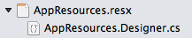
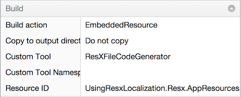
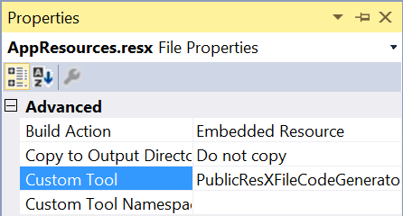
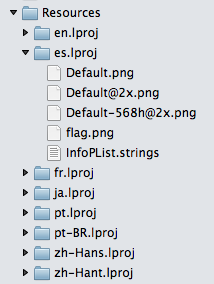
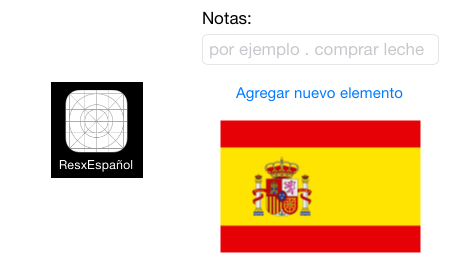
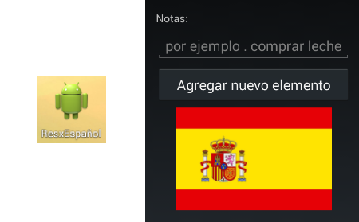

# Localization

[ Download the sample](https://developer.xamarin.com/samples/xamarin-forms/UsingResxLocalization/)

_Xamarin.Forms apps can be localized using .NET resources files._

## Overview

The built-in mechanism for localizing .NET applications uses [RESX files](http://msdn.microsoft.com/library/ekyft91f(v=vs.90).aspx) and the classes in the `System.Resources` and `System.Globalization` namespaces. The RESX files containing translated strings are embedded in the Xamarin.Forms assembly, along with a compiler-generated class that provides strongly-typed access to the translations. The translated text can then be retrieved in code.

### Sample Code

There are two samples associated with this document:

* [UsingResxLocalization](https://github.com/xamarin/xamarin-forms-samples/tree/master/UsingResxLocalization) is a very simple demonstration of the concepts explained. The code snippets shown below are all from this sample.
* [TodoLocalized](https://github.com/xamarin/xamarin-forms-samples/tree/master/TodoLocalized) is a basic working app that uses these localization techniques.

#### Shared Projects are not recommended

The TodoLocalized sample includes a [Shared Project demo](https://github.com/xamarin/xamarin-forms-samples/tree/master/TodoLocalized/SharedProject/) however due to limitations of the build system the resource files do not get a **.designer.cs** file generated which breaks the ability to access translated strings strongly-typed in code.

The remainder of this document relates to projects using the Xamarin.Forms .NET Standard library template.

## Globalizing Xamarin.Forms Code

**Globalizing** an application is the process of making it "world ready." This means writing code that is capable of displaying different languages.

One of the key parts of globalizing an application is building the user-interface so that there is no *hard-coded* text. Instead, anything displayed to the user should be retrieved from a set of strings that have been translated into their chosen language.

In this document we'll examine how to use RESX files to store those strings and retrieve them for display depending on the user's preference.

The samples target English, French, Spanish, German, Chinese, Japanese, Russian, and Brazilian Portuguese languages. Applications can be translated into as few or as many languages as required.

> [!NOTE]
> On the Universal Windows Platform, RESW files should be used for push notification localization, rather than RESX files. For more information, see [UWP Localization](/windows/uwp/design/globalizing/globalizing-portal/).

### Adding Resources

The first step in globalizing a Xamarin.Forms .NET Standard library application is adding the RESX resource files that will be used to store all the text used in the app. We need to add a RESX file that contains the default text, and then add additional RESX files for each language we wish to support.

#### Base Language Resource

The base resources (RESX) file will contain the default language strings (the samples assume English is the default language). Add the file to the Xamarin.Forms common code project by right-clicking on the project and choosing **Add > New File...**.

Choose a meaningful name such as **AppResources** and press **OK**.

[](text-images/resx-new-file.png#lightbox "New File Dialog")

Two files will be added to the project:

* **AppResources.resx** file where translatable strings are stored in an XML format.
* **AppResources.designer.cs** file that declares a partial class to contain references to all the elements created in the RESX XML file.

The solution tree will show the files as related. The RESX file *should* be edited to add new translatable strings; the **.designer.cs** file should *not* be edited.



##### String Visibility

By default when strongly-typed references to strings are generated, they will be
`internal` to the assembly. This is because the default build tool for RESX files
generates the **.designer.cs** file with `internal` properties.

Select the **AppResources.resx** file and show the
**Properties** pad to see where this build tool is configure. The screenshot below
shows the **Custom Tool: ResXFileCodeGenerator**.


# [Visual Studio](#tab/windows)

[](text-images/vs-resx-internal.png#lightbox)

# [Visual Studio for Mac](#tab/macos)

[](text-images/xs-resx-internal.png#lightbox)

-----

To make the strongly-typed string properties `public`, you must manually
change the configuration to **Custom Tool: PublicResXFileCodeGenerator**,
as shown in the screenshot below:


# [Visual Studio](#tab/windows)

[](text-images/vs-resx-public.png#lightbox)

# [Visual Studio for Mac](#tab/macos)

[](text-images/xs-resx-internal.png#lightbox)


[](text-images/xs-resx-public.png#lightbox)

-----

This change is optional, and is only required if you wish to reference
localized strings across different assemblies (for example, if you put the RESX
files in a different assembly to your code). The sample for this topic
leaves the strings `internal` because they are defined in the same Xamarin.Forms
.NET Standard library assembly where they are used.

You only need to set the custom tool on the base RESX file as shown above;
you do not need to set *any* build tool on the language-specific RESX files
discussed in the following sections.

##### Editing the RESX file

Unfortunately there is no built-in RESX editor in Visual Studio for Mac. Adding new translatable strings requires the addition of a new XML `data` element for each string. Each `data` element can contain the following:

* `name` attribute (required) is the key for this translatable string. It must be a valid C# property name - so no spaces or special characters are allowed.
* `value` element (required), which is the actual string that is displayed in the application.
* `comment` element (optional) can contain instructions for the translator that explains how this string is used.
* `xml:space` attribute (optional) to control how spacing in the string is preserved.

Some example `data` elements are shown here:

```xml
<data name="NotesLabel" xml:space="preserve">
    <value>Notes:</value>
    <comment>label for input field</comment>
</data>
<data name="NotesPlaceholder" xml:space="preserve">
    <value>eg. buy milk</value>
    <comment>example input for notes field</comment>
</data>
<data name="AddButton" xml:space="preserve">
    <value>Add new item</value>
</data>
```

As the application is written, every piece of text displayed to the user should be
added to the base RESX resources file in a new `data` element. It is recommended
that you include `comment`s as much as possible to ensure a high-quality translation.

> [!NOTE]
> Visual Studio (including the free Community edition) contains a
> basic RESX editor. If you have access to a Windows computer, that can be a convenient
> way to add and edit strings in RESX files.

#### Language-Specific Resources

Typically, the actual translation of the default text strings won't happen until
large chunks of the application have been written (in which case the default RESX
file will contain lots of strings). It is still a good idea to add the
language-specific resources early in the development cycle, optionally populating
with machine-translated text to help test the localization code.

One additional RESX file is added for each language we wish to support.
Language-specific resource files must follow a specific naming convention:
use the same filename as the base resources file (eg. **AppResources**)
followed by a period (.) and then the language code. Simple examples include:

* **AppResources.fr.resx** - French language translations.
* **AppResources.es.resx** - Spanish language translations.
* **AppResources.de.resx** - German language translations.
* **AppResources.ja.resx** - Japanese language translations.
* **AppResources.zh-Hans.resx** - Chinese (Simplified) language translations.
* **AppResources.zh-Hant.resx** - Chinese (Traditional) language translations.
* **AppResources.pt.resx** - Portuguese language translations.
* **AppResources.pt-BR.resx** - Brazilian Portuguese language translations.

The general pattern is to use two-letter language codes, but there are some examples
(such as Chinese) where a different format is used, and other examples (such as
  Brazilian Portuguese) where a four character locale identifier is required.

These language-specific resources files *do not* require a **.designer.cs** partial
class so they can be added as regular XML files, with the **Build Action: EmbeddedResource**
set. This screenshot shows a solution containing language-specific resource files:


As an application is developed and the base RESX file has text added, you should send it out to translators who will translate each `data` element and return a language-specific resource file (using the naming convention shown) to be included in the app. Some 'machine translated' examples are shown below:

**AppResources.es.resx (Spanish)**

```xml
<data name="AddButton" xml:space="preserve">
    <value>Escribir un artículo</value>
    <comment>this string appears on a button to add a new item to the list</comment>
</data>
```

**AppResources.ja.resx (Japanese)**

```xml
<data name="AddButton" xml:space="preserve">
    <value>新しい項目を追加</value>
    <comment>this string appears on a button to add a new item to the list</comment>
</data>
```

**AppResources.pt-BR.resx (Brazilian Portuguese)**

```xml
<data name="AddButton" xml:space="preserve">
    <value>adicionar novo item</value>
    <comment>this string appears on a button to add a new item to the list</comment>
</data>
```

Only the `value` element needs to be updated by the translator - the `comment` is not intended to be translated. Remember: when editing XML files to escape reserved characters like `<`, `>`, `&` with `&lt;`, `&gt;`, and `&amp;` if they appear in the `value` or `comment`.

<a name="incode" />

### Using Resources in Code

Strings in the RESX resource files will be available to use in your user interface code using the `AppResources` class. The `name` assigned to each string in the RESX file becomes a property on that class which can be referenced in Xamarin.Forms code as shown below:

```csharp
var myLabel = new Label ();
var myEntry = new Entry ();
var myButton = new Button ();
// populate UI with translated text values from resources
myLabel.Text = AppResources.NotesLabel;
myEntry.Placeholder = AppResources.NotesPlaceholder;
myButton.Text = AppResources.AddButton;
```

The user interface on iOS, Android, and the Universal Windows Platform (UWP) renders as you'd expect, except now it's possible to translate the app into multiple languages because the text is being loaded from a resource rather than being hard-coded. Here is a screenshot showing the UI on each platform prior to translation:


### Troubleshooting

#### Testing a Specific Language

It can be tricky to switch the simulator or a device to different languages,
particularly during development when you want to test different cultures quickly.

You can force a specific language to be loaded by setting the `Culture` as shown
in this code snippet:

```csharp
// force a specific culture, useful for quick testing
AppResources.Culture =  new CultureInfo("fr-FR");
```

This approach – setting the culture directly on the `AppResources` class –
can also be used to implement a language-selector inside your app (rather than
using the device's locale).

#### Loading Embedded Resources

The following code snippet is useful when trying to debug issues with embedded
resources (such as RESX files). Add this code to your app (early in the app lifecycle)
and it will list all the resources embedded in the assembly, showing the full resource identifier:

```csharp
using System.Reflection;
// ...
// NOTE: use for debugging, not in released app code!
var assembly = typeof(EmbeddedImages).GetTypeInfo().Assembly; // "EmbeddedImages" should be a class in your app
foreach (var res in assembly.GetManifestResourceNames())
{
    System.Diagnostics.Debug.WriteLine("found resource: " + res);
}
```

In the **AppResources.Designer.cs** file (around *line 33*), the full
*resource manager name* is specified (eg. `"UsingResxLocalization.Resx.AppResources"`)
similar to the code below:

```csharp
System.Resources.ResourceManager temp =
        new System.Resources.ResourceManager(
                "UsingResxLocalization.Resx.AppResources",
                typeof(AppResources).GetTypeInfo().Assembly);
```

Check the **Application Output** for the results of the debug code shown above,
to confirm the correct resources are listed (ie. `"UsingResxLocalization.Resx.AppResources"`).

If not, the `AppResources` class will be unable to load its resources.
Check the following to resolve issues where the resources cannot be found:

* The default namespace for the project matches the root namespace in the **AppResources.Designer.cs** file.
* If the **AppResources.resx** file is located in a subdirectory, the subdirectory name should be part of the namespace *and* part of the resource identifier.
* The **AppResources.resx** file has **Build Action: EmbeddedResource**.
* The **Project Options > Source Code > .NET Naming Policies > Use Visual Studio-style resources names** is ticked. You can untick this if you prefer, however the namespaces used when referencing your RESX resources will need to updated throughout the app.

#### Doesn't work in DEBUG mode (Android only)

If the translated strings are working in your RELEASE Android builds but not while debugging,
right-click on the **Android Project** and select **Options > Build > Android Build** and
ensure that the **Fast assembly deployment** is NOT ticked. This option causes problems
with loading resources and should not be used if you are testing localized apps.

### Displaying the Correct Language

So far we've examined how to write code so that translations can be provided, but not how to actually make them appear. Xamarin.Forms code can take advantage of .NET's resources to load the correct language translations, but we need to query the operating system on each platform to determine which language the user has selected.

Because some platform-specific code is required to obtain the user's language preference, use a [dependency service](~/xamarin-forms/app-fundamentals/dependency-service/index.md) to expose that information in the Xamarin.Forms app and implement it for each platform.

First, define an interface to expose the user's preferred culture, similar to the code below:

```csharp
public interface ILocalize
{
    CultureInfo GetCurrentCultureInfo ();
    void SetLocale (CultureInfo ci);
}
```

Second, use the [DependencyService](~/xamarin-forms/app-fundamentals/dependency-service/index.md) in the Xamarin.Forms `App` class to call the interface and set our RESX resources culture to the correct value. Notice that we don't need to manually set this value for the Universal Windows Platform, since the resources framework automatically recognizes the selected language on those platforms.

```csharp
if (Device.RuntimePlatform == Device.iOS || Device.RuntimePlatform == Device.Android)
{
    var ci = DependencyService.Get<ILocalize>().GetCurrentCultureInfo();
    Resx.AppResources.Culture = ci; // set the RESX for resource localization
    DependencyService.Get<ILocalize>().SetLocale(ci); // set the Thread for locale-aware methods
}
```

The resource `Culture` needs to be set when the application first loads so that
the correct language strings are used. You may optionally update this value
according to platform-specific events that may be raised on iOS or Android if
the user updates their language preferences while the app is running.

The implementations for the `ILocalize` interface are shown in the
[Platform-specific Code](#Platform-specific_Code) section below. These implementations
take advantage of this `PlatformCulture` helper class:

```csharp
public class PlatformCulture
{
    public PlatformCulture (string platformCultureString)
    {
        if (String.IsNullOrEmpty(platformCultureString))
        {
            throw new ArgumentException("Expected culture identifier", "platformCultureString"); // in C# 6 use nameof(platformCultureString)
        }
        PlatformString = platformCultureString.Replace("_", "-"); // .NET expects dash, not underscore
        var dashIndex = PlatformString.IndexOf("-", StringComparison.Ordinal);
        if (dashIndex > 0)
        {
            var parts = PlatformString.Split('-');
            LanguageCode = parts[0];
            LocaleCode = parts[1];
        }
        else
        {
            LanguageCode = PlatformString;
            LocaleCode = "";
        }
    }
    public string PlatformString { get; private set; }
    public string LanguageCode { get; private set; }
    public string LocaleCode { get; private set; }
    public override string ToString()
    {
        return PlatformString;
    }
}
```

<a name="Platform-specific_Code" />

### Platform-Specific Code

The code to detect which language to display must be platform-specific because
iOS, Android, and UWP all expose this information in slightly
different ways. The code for the `ILocalize` dependency service is provided below
for each platform, along with additional platform-specific requirements to ensure
localized text is rendered correctly.

The platform-specific code must also handle cases where the operating system
allows the user to configure a locale identifier that is not supported by
.NET's `CultureInfo` class. In these cases custom code must be written
to detect unsupported locales and substitute the best .NET-compatible locale.

#### iOS Application Project

iOS users select their preferred language separately from date and time formatting
culture. To load the correct resources to localize a Xamarin.Forms app we just
need to query the `NSLocale.PreferredLanguages` array for the first element.

The following implementation of the `ILocalize` dependency service should be
placed in the iOS application project. Because iOS uses underscores instead of
dashes (which is the .NET standard representation) the code replaces the
underscore before instantiating the `CultureInfo` class:

```csharp
[assembly:Dependency(typeof(UsingResxLocalization.iOS.Localize))]

namespace UsingResxLocalization.iOS
{
public class Localize : UsingResxLocalization.ILocalize
    {
        public void SetLocale (CultureInfo ci)
        {
            Thread.CurrentThread.CurrentCulture = ci;
            Thread.CurrentThread.CurrentUICulture = ci;
        }
        public CultureInfo GetCurrentCultureInfo ()
        {
            var netLanguage = "en";
            if (NSLocale.PreferredLanguages.Length > 0)
            {
                var pref = NSLocale.PreferredLanguages [0];
                netLanguage = iOSToDotnetLanguage(pref);
            }
            // this gets called a lot - try/catch can be expensive so consider caching or something
            System.Globalization.CultureInfo ci = null;
            try
            {
                ci = new System.Globalization.CultureInfo(netLanguage);
            }
            catch (CultureNotFoundException e1)
            {
                // iOS locale not valid .NET culture (eg. "en-ES" : English in Spain)
                // fallback to first characters, in this case "en"
                try
                {
                    var fallback = ToDotnetFallbackLanguage(new PlatformCulture(netLanguage));
                    ci = new System.Globalization.CultureInfo(fallback);
                }
                catch (CultureNotFoundException e2)
                {
                    // iOS language not valid .NET culture, falling back to English
                    ci = new System.Globalization.CultureInfo("en");
                }
            }
            return ci;
        }
        string iOSToDotnetLanguage(string iOSLanguage)
        {
            var netLanguage = iOSLanguage;
            //certain languages need to be converted to CultureInfo equivalent
            switch (iOSLanguage)
            {
                case "ms-MY":   // "Malaysian (Malaysia)" not supported .NET culture
                case "ms-SG":    // "Malaysian (Singapore)" not supported .NET culture
                    netLanguage = "ms"; // closest supported
                    break;
                case "gsw-CH":  // "Schwiizertüütsch (Swiss German)" not supported .NET culture
                    netLanguage = "de-CH"; // closest supported
                    break;
                // add more application-specific cases here (if required)
                // ONLY use cultures that have been tested and known to work
            }
            return netLanguage;
        }
        string ToDotnetFallbackLanguage (PlatformCulture platCulture)
        {
            var netLanguage = platCulture.LanguageCode; // use the first part of the identifier (two chars, usually);
            switch (platCulture.LanguageCode)
            {
                case "pt":
                    netLanguage = "pt-PT"; // fallback to Portuguese (Portugal)
                    break;
                case "gsw":
                    netLanguage = "de-CH"; // equivalent to German (Switzerland) for this app
                    break;
                // add more application-specific cases here (if required)
                // ONLY use cultures that have been tested and known to work
            }
            return netLanguage;
        }
    }
}
```

> [!NOTE]
> The `try/catch` blocks in the `GetCurrentCultureInfo` method
> mimic the fallback behavior typically used with locale specifiers – if the
> exact match is not found, look for a close match based just on the language (first
> block of characters in the locale).
>
> In the case of Xamarin.Forms, some locales are valid in iOS but do not correspond
> to a valid `CultureInfo` in .NET, and the code above attempts to handle this.
>
> For example, the iOS **Settings > General Language &amp; Region** screen
> allows you to set your phone **Language** to **English** but the **Region**
> to **Spain**, which results in a locale string of `"en-ES"`. When
> the `CultureInfo` creation fails, the code falls back to using just
> the first two letters to select the display language.
>
> Developers should modify the `iOSToDotnetLanguage` and `ToDotnetFallbackLanguage`
> methods to handle specific cases required for their supported languages.


There are some system-defined user-interface elements that are automatically
translated by iOS, such as the **Done** button on the `Picker` control. To
force iOS to translate these elements we need to indicate which languages we
support in the **Info.plist** file. You can add these values via
**Info.plist > Source** as shown here:


Alternatively, open the **Info.plist** file in an XML editor and edit the values directly:

```xml
<key>CFBundleLocalizations</key>
<array>
    <string>de</string>
    <string>es</string>
    <string>fr</string>
    <string>ja</string>
    <string>pt</string> <!-- Brazil -->
    <string>pt-PT</string> <!-- Portugal -->
    <string>ru</string>
    <string>zh-Hans</string>
    <string>zh-Hant</string>
</array>
<key>CFBundleDevelopmentRegion</key>
<string>en</string>
```

Once you've implemented the dependency service and updated **Info.plist**, the iOS app will be able to display localized text.

> [!NOTE]
> Note that Apple treats Portuguese slightly differently than you'd expect.
> From [their docs](https://developer.apple.com/library/ios/documentation/MacOSX/Conceptual/BPInternational/LocalizingYourApp/LocalizingYourApp.html#//apple_ref/doc/uid/10000171i-CH5-SW2): _"use pt as the language ID for Portuguese as it is used in Brazil and pt-PT as the language ID for Portuguese as it is used in Portugal"_.
> This means when Portuguese language is chosen in a non-standard locale, the fallback
> language will be Brazilian Portuguese on iOS, unless code is written to change
> this behavior (such as the `ToDotnetFallbackLanguage` above).

For more information about iOS Localization, see [iOS Localization](~/ios/app-fundamentals/localization/index.md).

#### Android Application Project

Android exposes the currently selected locale via `Java.Util.Locale.Default`,
and also uses an underscore separator instead of a dash (which is replaced by
the following code). Add this dependency service implementation to the Android application project:

```csharp
[assembly:Dependency(typeof(UsingResxLocalization.Android.Localize))]

namespace UsingResxLocalization.Android
{
    public class Localize : UsingResxLocalization.ILocalize
    {
        public void SetLocale(CultureInfo ci)
        {
            Thread.CurrentThread.CurrentCulture = ci;
            Thread.CurrentThread.CurrentUICulture = ci;
        }
        public CultureInfo GetCurrentCultureInfo()
        {
            var netLanguage = "en";
            var androidLocale = Java.Util.Locale.Default;
            netLanguage = AndroidToDotnetLanguage(androidLocale.ToString().Replace("_", "-"));
            // this gets called a lot - try/catch can be expensive so consider caching or something
            System.Globalization.CultureInfo ci = null;
            try
            {
                ci = new System.Globalization.CultureInfo(netLanguage);
            }
            catch (CultureNotFoundException e1)
            {
                // iOS locale not valid .NET culture (eg. "en-ES" : English in Spain)
                // fallback to first characters, in this case "en"
                try
                {
                    var fallback = ToDotnetFallbackLanguage(new PlatformCulture(netLanguage));
                    ci = new System.Globalization.CultureInfo(fallback);
                }
                catch (CultureNotFoundException e2)
                {
                    // iOS language not valid .NET culture, falling back to English
                    ci = new System.Globalization.CultureInfo("en");
                }
            }
            return ci;
        }
        string AndroidToDotnetLanguage(string androidLanguage)
        {
            var netLanguage = androidLanguage;
            //certain languages need to be converted to CultureInfo equivalent
            switch (androidLanguage)
            {
                case "ms-BN":   // "Malaysian (Brunei)" not supported .NET culture
                case "ms-MY":   // "Malaysian (Malaysia)" not supported .NET culture
                case "ms-SG":   // "Malaysian (Singapore)" not supported .NET culture
                    netLanguage = "ms"; // closest supported
                    break;
                case "in-ID":  // "Indonesian (Indonesia)" has different code in  .NET
                    netLanguage = "id-ID"; // correct code for .NET
                    break;
                case "gsw-CH":  // "Schwiizertüütsch (Swiss German)" not supported .NET culture
                    netLanguage = "de-CH"; // closest supported
                    break;
                    // add more application-specific cases here (if required)
                    // ONLY use cultures that have been tested and known to work
            }
            return netLanguage;
        }
        string ToDotnetFallbackLanguage(PlatformCulture platCulture)
        {
            var netLanguage = platCulture.LanguageCode; // use the first part of the identifier (two chars, usually);
            switch (platCulture.LanguageCode)
            {
                case "gsw":
                    netLanguage = "de-CH"; // equivalent to German (Switzerland) for this app
                    break;
                    // add more application-specific cases here (if required)
                    // ONLY use cultures that have been tested and known to work
            }
            return netLanguage;
        }
    }
}
```

> [!NOTE]
> The `try/catch` blocks in the `GetCurrentCultureInfo` method
> mimic the fallback behavior typically used with locale specifiers – if the
> exact match is not found, look for a close match based just on the language (first
> block of characters in the locale).
>
> In the case of Xamarin.Forms, some locales are valid in Android but do not correspond
> to a valid `CultureInfo` in .NET, and the code above attempts to handle this.
>
> Developers should modify the `iOSToDotnetLanguage` and `ToDotnetFallbackLanguage`
> methods to handle specific cases required for their supported languages.

Once this code has been added to the Android application project, it will be able
to automatically display translated strings.

> [!NOTE]
>️ **WARNING:** If the translated strings are working in your
> RELEASE Android builds but not while debugging, right-click on the **Android Project**
> and select **Options > Build > Android Build** and ensure that the
> **Fast assembly deployment** is NOT ticked. This option causes problems
> with loading resources and should not be used if you are testing localized apps.

For more information about Android localization, see [Android Localization](~/android/app-fundamentals/localization.md).

#### Universal Windows Platform

Universal Windows Platform (UWP) projects do not require the dependency service. Instead, this platform automatically sets the resource's culture correctly.

##### AssemblyInfo.cs

Expand the Properties node in the .NET Standard library project and double-click on the **AssemblyInfo.cs** file. Add the following line to the file to set the neutral resources assembly language to English:

```csharp
[assembly: NeutralResourcesLanguage("en")]
```

This informs the resource manager of the app's default culture, therefore ensuring that the strings defined in the language neutral RESX file (**AppResources.resx**) will be displayed when the app is running in one the English locales.

### Example

After updating the platform-specific projects as shown above and recompiling the app with translated RESX files, updated translations will be available in each app. Here is a screenshot from the sample code translated into Simplified Chinese:


For more information about UWP localization, see [UWP Localization](/windows/uwp/design/globalizing/globalizing-portal/).

## Localizing XAML

When building a Xamarin.Forms user interface in XAML the markup would look similar to this, with strings embedded directly in the XML:

```xaml
<Label Text="Notes:" />
<Entry Placeholder="eg. buy milk" />
<Button Text="Add to list" />
```

Ideally, we could translate user interface controls directly in the XAML, which we can do by creating a *markup extension*. The code for a markup extension that exposes the RESX resources to XAML is shown below. This class should be added to the Xamarin.Forms common code (along with the XAML pages):

```csharp
using System;
using System.Globalization;
using System.Reflection;
using System.Resources;
using Xamarin.Forms;
using Xamarin.Forms.Xaml;

namespace UsingResxLocalization
{
    // You exclude the 'Extension' suffix when using in XAML
    [ContentProperty("Text")]
    public class TranslateExtension : IMarkupExtension
    {
        readonly CultureInfo ci = null;
        const string ResourceId = "UsingResxLocalization.Resx.AppResources";

        static readonly Lazy<ResourceManager> ResMgr = new Lazy<ResourceManager>(
            () => new ResourceManager(ResourceId, IntrospectionExtensions.GetTypeInfo(typeof(TranslateExtension)).Assembly));

        public string Text { get; set; }

        public TranslateExtension()
        {
            if (Device.RuntimePlatform == Device.iOS || Device.RuntimePlatform == Device.Android)
            {
                ci = DependencyService.Get<ILocalize>().GetCurrentCultureInfo();
            }
        }

        public object ProvideValue(IServiceProvider serviceProvider)
        {
            if (Text == null)
                return string.Empty;

            var translation = ResMgr.Value.GetString(Text, ci);
            if (translation == null)
            {
#if DEBUG
                throw new ArgumentException(
                    string.Format("Key '{0}' was not found in resources '{1}' for culture '{2}'.", Text, ResourceId, ci.Name),
                    "Text");
#else
                translation = Text; // HACK: returns the key, which GETS DISPLAYED TO THE USER
#endif
            }
            return translation;
        }
    }
}
```

The following bullets explain the important elements in the code above:

* The class is named `TranslateExtension`, but by convention we can refer to is as **Translate** in our markup.
* The class implements `IMarkupExtension`, which is required by Xamarin.Forms for it to work.
* `"UsingResxLocalization.Resx.AppResources"` is the resource identifier for our RESX resources. It is comprised of our default namespace, the folder where the resource files are located and the default RESX filename.
* The `ResourceManager` class is created using `IntrospectionExtensions.GetTypeInfo(typeof(TranslateExtension)).Assembly)` to determine the current assembly to load resources from, and cached in the static `ResMgr` field. It's created as a `Lazy` type so that its creation is deferred until it's first used in the `ProvideValue` method.
* `ci` uses the dependency service to get the user's chosen language from the native operating system.
* `GetString` is the method that retrieves the actual translated string from the resources files. On the Universal Windows Platform, `ci` will be null because the `ILocalize` interface isn't implemented on those platforms. This is equivalent to calling the `GetString` method with only the first parameter. Instead, the resources framework will automatically recognize the locale and will retrieve the translated string from the appropriate RESX file.
* Error handling has been included to help debug missing resources by throwing an exception (in `DEBUG` mode only).

The following XAML snippet shows how to use the markup extension. There are two steps to make it work:

1. Declare the custom `xmlns:i18n` namespace in the root node. The `namespace` and `assembly` must match the project settings exactly - in this example they are identical but could be different in your project.
2. Use `{Binding}` syntax on attributes that would normally contain text to call the `Translate` markup extension. The resource key is the only required parameter.

```xaml
<?xml version="1.0" encoding="UTF-8"?>
<ContentPage xmlns="http://xamarin.com/schemas/2014/forms"
        xmlns:x="http://schemas.microsoft.com/winfx/2009/xaml"
        x:Class="UsingResxLocalization.FirstPageXaml"
        xmlns:i18n="clr-namespace:UsingResxLocalization;assembly=UsingResxLocalization">
    <StackLayout Padding="0, 20, 0, 0">
        <Label Text="{i18n:Translate NotesLabel}" />
        <Entry Placeholder="{i18n:Translate NotesPlaceholder}" />
        <Button Text="{i18n:Translate AddButton}" />
    </StackLayout>
</ContentPage>
```

The following more verbose syntax is also valid for the markup extension:

```xaml
<Button Text="{i18n:TranslateExtension Text=AddButton}" />
```

## Localizing Platform-Specific Elements

Although we can handle the translation of the user interface in Xamarin.Forms code, there are some elements that must be done in each platform-specific project. This section will cover how to localize:

* Application Name
* Images

The sample project includes a localized image called **flag.png**, which is referenced in C# as follows:

```csharp
var flag = new Image();
switch (Device.RuntimePlatform)
{
    case Device.iOS:
    case Device.Android:
        flag.Source = ImageSource.FromFile("flag.png");
        break;
    case Device.UWP:
        flag.Source = ImageSource.FromFile("Assets/Images/flag.png");
        break;
}
```

The flag image is also referenced in the XAML like this:

```xaml
<Image>
  <Image.Source>
    <OnPlatform x:TypeArguments="ImageSource">
        <On Platform="iOS, Android" Value="flag.png" />
        <On Platform="UWP" Value="Assets/Images/flag.png" />
    </OnPlatform>
  </Image.Source>
</Image>
```

All platforms will automatically resolve image references like these to localized versions of the images, as long as the project structures explained below are implemented.

### iOS Application Project

iOS uses a naming standard called Localization Projects or **.lproj** directories to contain image and string resources. These directories can contain localized versions of images used in the app, and also the **InfoPlist.strings** file that can be used to localize the app name. For more information about iOS Localization, see [iOS Localization](~/ios/app-fundamentals/localization/index.md).

#### Images

This screenshot shows the iOS sample app with language-specific **.lproj** directories. The Spanish directory called **es.lproj**, contains localized versions of the default image, as well as **flag.png**:



Each language directory contains a copy of **flag.png**, localized for that language. If no image is supplied, the operating system will default to the image in the default language directory. For full Retina support, you should supply **@2x** and **@3x** copies of each image.

#### App Name

The contents of the **InfoPlist.strings** is just a single key-value to configure the app name:

```csharp
"CFBundleDisplayName" = "ResxEspañol";
```

When the application is run, the app name and the image are both localized:



### Android Application Project

Android follows a different scheme for storing localized images using different **drawable** and **strings** directories with a language code suffix. When a four-letter locale code is required (such as zh-TW or pt-BR), note that Android requires an additional **r** following the dash/preceding the locale code (eg. zh-rTW or pt-rBR). For more information about Android localization, see [Android Localization](~/android/app-fundamentals/localization.md).

#### Images

This screenshot shows the Android sample with a some localized drawables and strings:


Note that Android does not use zh-Hans and zh-Hant codes for Simplified and Traditional Chinese; instead, it only supports country-specific codes zh-CN and zh-TW.

To support different resolution images for high-density screens, create additional language folders with `-*dpi` suffixes, such as **drawables-es-mdpi**, **drawables-es-xdpi**, **drawables-es-xxdpi**, etc. See [Providing Alternative Android Resources](http://developer.android.com/guide/topics/resources/providing-resources.html#AlternativeResources) for more information.

#### App Name

The contents of the **strings.xml** is just a single key-value to configure the app name:

```xml
<?xml version="1.0" encoding="utf-8"?>
<resources>
    <string name="app_name">ResxEspañol</string>
</resources>
```

Update the **MainActivity.cs** in the Android app project so that the `Label` references the strings XML.

```csharp
[Activity (Label = "@string/app_name", MainLauncher = true,
        ConfigurationChanges = ConfigChanges.ScreenSize | ConfigChanges.Orientation)]
```

The app now localizes the app name and image. Here's a screenshot of the result (in Spanish):



### Universal Windows Platform Application Projects

The Universal Windows Platform possesses a resource infrastructure that simplifies the localization of images and the app name. For more information about UWP localization, see [UWP Localization](/windows/uwp/design/globalizing/globalizing-portal/).

#### Images

Images can be localized by placing them in a resource-specific folder, as demonstrated in the following screenshot:


At runtime the Windows resource infrastructure will select the appropriate image based on the user's locale.

## Summary

Xamarin.Forms applications can be localized using RESX files and .NET globalization classes. Apart from a small amount of platform-specific code to detect what language the user prefers, most of the localization effort is centralized in the common code.

Images are generally handled in a platform-specific way to take advantage of the multi-resolution support provided in both iOS and Android.

## Related Links

- [RESX Localization Sample](https://developer.xamarin.com/samples/xamarin-forms/UsingResxLocalization/)
- [TodoLocalized Sample App](https://developer.xamarin.com/samples/xamarin-forms/TodoLocalized/)
- [Cross-Platform Localization](~/cross-platform/app-fundamentals/localization.md)
- [iOS Localization](~/ios/app-fundamentals/localization/index.md)
- [Android Localization](~/android/app-fundamentals/localization.md)
- [UWP Localization](/windows/uwp/design/globalizing/globalizing-portal/)
- [Using the CultureInfo class (MSDN)](http://msdn.microsoft.com/library/87k6sx8t%28v=vs.90%29.aspx)
- [Locating and Using Resources for a Specific Culture (MSDN)](http://msdn.microsoft.com/library/s9ckwb4b%28v=vs.90%29.aspx)
