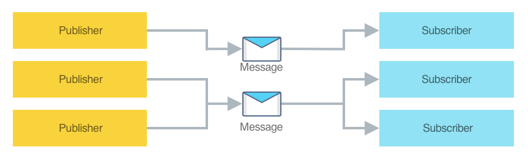

# Xamarin.Forms MessagingCenter

[ Download the sample](/samples/xamarin/xamarin-forms-samples/usingmessagingcenter)

The publish-subscribe pattern is a messaging pattern in which publishers send messages without having knowledge of any receivers, known as subscribers. Similarly, subscribers listen for specific messages, without having knowledge of any publishers.

Events in .NET implement the publish-subscribe pattern, and are the most simple and straightforward approach for a communication layer between components if loose coupling is not required, such as a control and the page that contains it. However, the publisher and subscriber lifetimes are coupled by object references to each other, and the subscriber type must have a reference to the publisher type. This can create memory management issues, especially when there are short lived objects that subscribe to an event of a static or long-lived object. If the event handler isn't removed, the subscriber will be kept alive by the reference to it in the publisher, and this will prevent or delay the garbage collection of the subscriber.

The Xamarin.Forms [`MessagingCenter`](xref:Xamarin.Forms.MessagingCenter) class implements the publish-subscribe pattern, allowing message-based communication between components that are inconvenient to link by object and type references. This mechanism allows publishers and subscribers to communicate without having a reference to each other, helping to reduce dependencies between them.

The [`MessagingCenter`](xref:Xamarin.Forms.MessagingCenter) class provides multicast publish-subscribe functionality. This means that there can be multiple publishers that publish a single message, and there can be multiple subscribers listening for the same message:



Publishers send messages using the [`MessagingCenter.Send`](xref:Xamarin.Forms.MessagingCenter.Send*) method, while subscribers listen for messages using the [`MessagingCenter.Subscribe`](xref:Xamarin.Forms.MessagingCenter.Subscribe*) method. In addition, subscribers can also unsubscribe from message subscriptions, if required, with the [`MessagingCenter.Unsubscribe`](xref:Xamarin.Forms.MessagingCenter.Unsubscribe*) method.

> [!IMPORTANT]
> Internally, the [`MessagingCenter`](xref:Xamarin.Forms.MessagingCenter) class uses weak references. This means that it will not keep objects alive, and will allow them to be garbage collected. Therefore, it should only be necessary to unsubscribe from a message when a class no longer wishes to receive the message.

## Publish a message

[`MessagingCenter`](xref:Xamarin.Forms.MessagingCenter) messages are strings. Publishers notify subscribers of a message with one of the [`MessagingCenter.Send`](xref:Xamarin.Forms.MessagingCenter.Send*) overloads. The following code example publishes a `Hi` message:

```csharp
MessagingCenter.Send<MainPage>(this, "Hi");
```

In this example the [`Send`](xref:Xamarin.Forms.MessagingCenter.Send*) method specifies a generic argument that represents the sender. To receive the message, a subscriber must also specify the same generic argument, indicating that they are listening for a message from that sender. In addition, this example specifies two method arguments:

- The first argument specifies the sender instance.
- The second argument specifies the message.

Payload data can also be sent with a message:

```csharp
MessagingCenter.Send<MainPage, string>(this, "Hi", "John");
```

In this example, the [`Send`](xref:Xamarin.Forms.MessagingCenter.Send*) method specifies two generic arguments. The first is the type that's sending the message, and the second is the type of the payload data being sent. To receive the message, a subscriber must also specify the same generic arguments. This enables multiple messages that share a message identity but send different payload data types to be received by different subscribers. In addition, this example specifies a third method argument that represents the payload data to be sent to the subscriber. In this case the payload data is a `string`.

The [`Send`](xref:Xamarin.Forms.MessagingCenter.Send*) method will publish the message, and any payload data, using a fire-and-forget approach. Therefore, the message is sent even if there are no subscribers registered to receive the message. In this situation, the sent message is ignored.

## Subscribe to a message

Subscribers can register to receive a message using one of the [`MessagingCenter.Subscribe`](xref:Xamarin.Forms.MessagingCenter.Subscribe*) overloads. The following code example shows an example of this:

```csharp
MessagingCenter.Subscribe<MainPage> (this, "Hi", (sender) =>
{
    // Do something whenever the "Hi" message is received
});
```

In this example, the [`Subscribe`](xref:Xamarin.Forms.MessagingCenter.Subscribe*) method subscribes the `this` object to `Hi` messages that are sent by the `MainPage` type, and executes a callback delegate in response to receiving the message. The callback delegate, specified as a lambda expression, could be code that updates the UI, saves some data, or triggers some other operation.

> [!NOTE]
> A subscriber might not need to handle every instance of a published message, and this can be controlled by the generic type arguments that are specified on the [`Subscribe`](xref:Xamarin.Forms.MessagingCenter.Subscribe*) method.

The following example shows how to subscribe to a message that contains payload data:

```csharp
MessagingCenter.Subscribe<MainPage, string>(this, "Hi", async (sender, arg) =>
{
    await DisplayAlert("Message received", "arg=" + arg, "OK");
});
```

In this example, the [`Subscribe`](xref:Xamarin.Forms.MessagingCenter.Subscribe*) method subscribes to `Hi` messages that are sent by the `MainPage` type, whose payload data is a `string`. A callback delegate is executed in response to receiving such a message, that displays the payload data in an alert.

> [!IMPORTANT]
> The delegate that's executed by the `Subscribe` method will be executed on the same thread that publishes the message using the `Send` method.

## Unsubscribe from a message

Subscribers can unsubscribe from messages they no longer want to receive. This is achieved with one of the [`MessagingCenter.Unsubscribe`](xref:Xamarin.Forms.MessagingCenter.Unsubscribe*) overloads:

```csharp
MessagingCenter.Unsubscribe<MainPage>(this, "Hi");
```

In this example, the [`Unsubscribe`](xref:Xamarin.Forms.MessagingCenter.Unsubscribe*) method unsubscribes the `this` object from the `Hi` message sent by the `MainPage` type.

Messages containing payload data should be unsubscribed from using the [`Unsubscribe`](xref:Xamarin.Forms.MessagingCenter.Unsubscribe*) overload that specifies two generic arguments:

```csharp
MessagingCenter.Unsubscribe<MainPage, string>(this, "Hi");
```

In this example, the [`Unsubscribe`](xref:Xamarin.Forms.MessagingCenter.Unsubscribe*) method unsubscribes the `this` object from the `Hi` message sent by the `MainPage` type, whose payload data is a `string`.

## Related links

- [MessagingCenterSample](/samples/xamarin/xamarin-forms-samples/usingmessagingcenter)