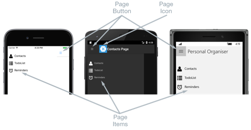

# Xamarin.Forms FlyoutPage

[ Download the sample](/samples/xamarin/xamarin-forms-samples/navigation-flyoutpage)

A flyout page typically displays a list of items, as shown in the following screenshots:

[](flyoutpage-images/flyoutpage-components-large.png#lightbox "Flyout Page Components")

The location of the list of items is identical on each platform, and selecting one of the items will navigate to the corresponding detail page. In addition, the flyout page also features a navigation bar that contains a button that can be used to navigate to the active detail page:

- On iOS, the navigation bar is present at the top of the page and has a button that navigates to the detail page. In addition, the active detail page can be navigated to by swiping the flyout to the left.
- On Android, the navigation bar is present at the top of the page and displays a title, an icon, and a button that navigates to the detail page. The icon is defined in the `[Activity]` attribute that decorates the `MainActivity` class in the Android platform-specific project. In addition, the active detail page can be navigated to by swiping the flyout page to the left, by tapping the detail page at the far right of the screen, and by tapping the *Back* button at the bottom of the screen.
- On the Universal Windows Platform (UWP), the navigation bar is present at the top of the page and has a button that navigates to the detail page.

A detail page displays data that corresponds to the item selected on the flyout page, and the main components of the detail page are shown in the following screenshots:


The detail page contains a navigation bar, whose contents are platform-dependent:

- On iOS, the navigation bar is present at the top of the page and displays a title, and has a button that returns to the flyout page, provided that the detail page instance is wrapped in the [`NavigationPage`](xref:Xamarin.Forms.NavigationPage) instance. In addition, the flyout page can be returned to by swiping the detail page to the right.
- On Android, a navigation bar is present at the top of the page and displays a title, an icon, and a button that returns to the flyout page. The icon is defined in the `[Activity]` attribute that decorates the `MainActivity` class in the Android platform-specific project.
- On UWP, the navigation bar is present at the top of the page and displays a title, and has a button that returns to the flyout page.

## Navigation behavior

The behavior of the navigation experience between flyout and detail pages is platform dependent:

- On iOS, the detail page *slides* to the right as the flyout page slides from the left, and the left part of the detail page is still visible.
- On Android, the detail and flyout pages are *overlaid* on each other.
- On UWP, the flyout page slides from the left over part of the detail page, provided that the [`FlyoutLayoutBehavior`](xref:Xamarin.Forms.FlyoutPage.FlyoutLayoutBehavior) property is set to `Popover`.

Similar behavior will be observed in landscape mode, except that the flyout page on iOS and Android has a similar width as the flyout page in portrait mode, so more of the detail page will be visible.

For information about controlling the navigation behavior, see [Control the detail page layout behavior](#control-the-detail-page-layout-behavior).

## Create a FlyoutPage

A [`FlyoutPage`](xref:Xamarin.Forms.FlyoutPage) contains [`Flyout`](xref:Xamarin.Forms.FlyoutPage.Flyout) and [`Detail`](xref:Xamarin.Forms.FlyoutPage.Detail) properties that are both of type [`Page`](xref:Xamarin.Forms.Page), which are used to get and set the flyout and detail pages respectively.

> [!IMPORTANT]
> A [`FlyoutPage`](xref:Xamarin.Forms.FlyoutPage) is designed to be a root page, and using it as a child page in other page types could result in unexpected and inconsistent behavior. In addition, it's recommended that the flyout page of a `FlyoutPage` should always be a [`ContentPage`](xref:Xamarin.Forms.ContentPage) instance, and that the detail page should only be populated with [`TabbedPage`](xref:Xamarin.Forms.TabbedPage), [`NavigationPage`](xref:Xamarin.Forms.NavigationPage), and `ContentPage` instances. This will help to ensure a consistent user experience across all platforms.

The following XAML code example shows a [`FlyoutPage`](xref:Xamarin.Forms.FlyoutPage) that sets the [`Flyout`](xref:Xamarin.Forms.FlyoutPage.Flyout) and [`Detail`](xref:Xamarin.Forms.FlyoutPage.Detail) properties:

```xaml
<FlyoutPage xmlns="http://xamarin.com/schemas/2014/forms"
            xmlns:x="http://schemas.microsoft.com/winfx/2009/xaml"
            xmlns:local="clr-namespace:FlyoutPageNavigation;assembly=FlyoutPageNavigation"
            x:Class="FlyoutPageNavigation.MainPage">
    <FlyoutPage.Flyout>
        <local:FlyoutMenuPage x:Name="flyoutPage" />
    </FlyoutPage.Flyout>
    <FlyoutPage.Detail>
        <NavigationPage>
            <x:Arguments>
                <local:ContactsPage />
            </x:Arguments>
        </NavigationPage>
    </FlyoutPage.Detail>
</FlyoutPage>
```

The following code example shows the equivalent [`FlyoutPage`](xref:Xamarin.Forms.FlyoutPage) created in C#:

```csharp
public class MainPageCS : FlyoutPage
{
    FlyoutMenuPageCS flyoutPage;

    public MainPageCS()
    {
        flyoutPage = new FlyoutMenuPageCS();
        Flyout = flyoutPage;
        Detail = new NavigationPage(new ContactsPageCS());
        ...
    }
    ...
}    
```

The [`Flyout`](xref:Xamarin.Forms.FlyoutPage.Flyout) property is set to a [`ContentPage`](xref:Xamarin.Forms.ContentPage) instance. The [`Detail`](xref:Xamarin.Forms.FlyoutPage.Detail) property is set to a [`NavigationPage`](xref:Xamarin.Forms.NavigationPage) containing a `ContentPage` instance.

### Create the flyout page

The following XAML code example shows the declaration of the `FlyoutMenuPage` object, which is referenced through the [`Flyout`](xref:Xamarin.Forms.FlyoutPage.Flyout) property:

```xaml
<ContentPage xmlns="http://xamarin.com/schemas/2014/forms"
             xmlns:x="http://schemas.microsoft.com/winfx/2009/xaml"
             xmlns:local="using:FlyoutPageNavigation"
             x:Class="FlyoutPageNavigation.FlyoutMenuPage"
             Padding="0,40,0,0"
             IconImageSource="hamburger.png"
             Title="Personal Organiser">
    <StackLayout>
        <ListView x:Name="listView" x:FieldModifier="public">
            <ListView.ItemsSource>
                <x:Array Type="{x:Type local:FlyoutPageItem}">
                    <local:FlyoutPageItem Title="Contacts" IconSource="contacts.png" TargetType="{x:Type local:ContactsPage}" />
                    <local:FlyoutPageItem Title="TodoList" IconSource="todo.png" TargetType="{x:Type local:TodoListPage}" />
                    <local:FlyoutPageItem Title="Reminders" IconSource="reminders.png" TargetType="{x:Type local:ReminderPage}" />
                </x:Array>
            </ListView.ItemsSource>
            <ListView.ItemTemplate>
                <DataTemplate>
                    <ViewCell>
                        <Grid Padding="5,10">
                            <Grid.ColumnDefinitions>
                                <ColumnDefinition Width="30"/>
                                <ColumnDefinition Width="*" />
                            </Grid.ColumnDefinitions>
                            <Image Source="{Binding IconSource}" />
                            <Label Grid.Column="1" Text="{Binding Title}" />
                        </Grid>
                    </ViewCell>
                </DataTemplate>
            </ListView.ItemTemplate>
        </ListView>
    </StackLayout>
</ContentPage>
```

The page consists of a [`ListView`](xref:Xamarin.Forms.ListView) that's populated with data in XAML by setting its [`ItemsSource`](xref:Xamarin.Forms.ItemsView`1.ItemsSource) property to an array of `FlyoutPageItem` objects. Each `FlyoutPageItem` defines `Title`, `IconSource`, and `TargetType` properties.

A [`DataTemplate`](xref:Xamarin.Forms.DataTemplate) is assigned to the [`ListView.ItemTemplate`](xref:Xamarin.Forms.ItemsView`1.ItemTemplate) property, to display each `FlyoutPageItem`. The `DataTemplate` contains a [`ViewCell`](xref:Xamarin.Forms.ViewCell) that consists of an [`Image`](xref:Xamarin.Forms.Image) and a [`Label`](xref:Xamarin.Forms.Label). The [`Image`](xref:Xamarin.Forms.Image) displays the `IconSource` property value, and the [`Label`](xref:Xamarin.Forms.Label) displays the `Title` property value, for each `FlyoutPageItem`.

The page has its [`Title`](xref:Xamarin.Forms.Page.Title) and [`IconImageSource`](xref:Xamarin.Forms.Page.IconImageSource) properties set. The icon will appear on the detail page, provided that the detail page has a title bar. This must be enabled on iOS by wrapping the detail page instance in a [`NavigationPage`](xref:Xamarin.Forms.NavigationPage) instance.

> [!NOTE]
> The [`Flyout`](xref:Xamarin.Forms.FlyoutPage.Flyout) page must have its [`Title`](xref:Xamarin.Forms.Page.Title) property set, or an exception will occur.

The following code example shows the equivalent page created in C#:

```csharp
public class FlyoutMenuPageCS : ContentPage
{
    ListView listView;
    public ListView ListView { get { return listView; } }

    public FlyoutMenuPageCS()
    {
        var flyoutPageItems = new List<FlyoutPageItem>();
        flyoutPageItems.Add(new FlyoutPageItem
        {
            Title = "Contacts",
            IconSource = "contacts.png",
            TargetType = typeof(ContactsPageCS)
        });
        flyoutPageItems.Add(new FlyoutPageItem
        {
            Title = "TodoList",
            IconSource = "todo.png",
            TargetType = typeof(TodoListPageCS)
        });
        flyoutPageItems.Add(new FlyoutPageItem
        {
            Title = "Reminders",
            IconSource = "reminders.png",
            TargetType = typeof(ReminderPageCS)
        });

        listView = new ListView
        {
            ItemsSource = flyoutPageItems,
            ItemTemplate = new DataTemplate(() =>
            {
                var grid = new Grid { Padding = new Thickness(5, 10) };
                grid.ColumnDefinitions.Add(new ColumnDefinition { Width = new GridLength(30) });
                grid.ColumnDefinitions.Add(new ColumnDefinition { Width = GridLength.Star });

                var image = new Image();
                image.SetBinding(Image.SourceProperty, "IconSource");
                var label = new Label { VerticalOptions = LayoutOptions.FillAndExpand };
                label.SetBinding(Label.TextProperty, "Title");

                grid.Children.Add(image);
                grid.Children.Add(label, 1, 0);

                return new ViewCell { View = grid };
            }),
            SeparatorVisibility = SeparatorVisibility.None
        };

        IconImageSource = "hamburger.png";
        Title = "Personal Organiser";
        Padding = new Thickness(0, 40, 0, 0);
        Content = new StackLayout
        {
            Children = { listView }
        };
    }
}
```

The following screenshots show the flyout page on each platform:


### Create and display the detail page

The `FlyoutMenuPage` instance contains a `ListView` property that exposes its [`ListView`](xref:Xamarin.Forms.ListView) instance so that the `MainPage` [`FlyoutPage`](xref:Xamarin.Forms.FlyoutPage) instance can register an event-handler to handle the [`ItemSelected`](xref:Xamarin.Forms.ListView.ItemSelected) event. This enables the `MainPage` instance to set the [`Detail`](xref:Xamarin.Forms.FlyoutPage.Detail) property to the page that represents the selected `ListView` item. The following code example shows the event-handler:

```csharp
public partial class MainPage : FlyoutPage
{
    public MainPage()
    {
        ...
        flyoutPage.listView.ItemSelected += OnItemSelected;
    }

    void OnItemSelected(object sender, SelectedItemChangedEventArgs e)
    {
        var item = e.SelectedItem as FlyoutPageItem;
        if (item != null)
        {
            Detail = new NavigationPage((Page)Activator.CreateInstance(item.TargetType));
            flyoutPage.listView.SelectedItem = null;
            IsPresented = false;
        }
    }
}
```

The `OnItemSelected` method performs the following actions:

- It retrieves the [`SelectedItem`](xref:Xamarin.Forms.ListView.SelectedItem) from the [`ListView`](xref:Xamarin.Forms.ListView) instance, and provided that it's not `null`, sets the detail page to a new instance of the page type stored in the `TargetType` property of the `FlyoutPageItem`. The page type is wrapped in a [`NavigationPage`](xref:Xamarin.Forms.NavigationPage) instance to ensure that the icon referenced through the [`IconImageSource`](xref:Xamarin.Forms.Page.IconImageSource) property on the `FlyoutMenuPage` is shown on the detail page in iOS.
- The selected item in the [`ListView`](xref:Xamarin.Forms.ListView) is set to `null` to ensure that none of the `ListView` items will be selected next time the `FlyoutMenuPage` is presented.
- The detail page is presented to the user by setting the [`FlyoutPage.IsPresented`](xref:Xamarin.Forms.FlyoutPage.IsPresented) property to `false`. This property controls whether the flyout or detail page is presented. It should be set to `true` to display the flyout page, and to `false` to display the detail page.

The following screenshots show the `ContactPage` detail page, which is shown after it's been selected on the flyout page:


### Control the detail page layout behavior

How the [`FlyoutPage`](xref:Xamarin.Forms.FlyoutPage) manages the flyout and detail pages depends on whether the application is running on a phone or tablet, the orientation of the device, and the value of the [`FlyoutLayoutBehavior`](xref:Xamarin.Forms.FlyoutPage.FlyoutLayoutBehavior) property. This property determines how the detail page will be displayed. It's possible values are:

- `Default` – The pages are displayed using the platform default.
- `Popover` – The detail page covers, or partially covers the flyout page.
- `Split` – The flyout page is displayed on the left and the detail page is on the right.
- `SplitOnLandscape` – A split screen is used when the device is in landscape orientation.
- `SplitOnPortrait` – A split screen is used when the device is in portrait orientation.

The following XAML code example demonstrates how to set the [`FlyoutLayoutBehavior`](xref:Xamarin.Forms.FlyoutPage.FlyoutLayoutBehavior) property on a [`FlyoutPage`](xref:Xamarin.Forms.FlyoutPage):

```xaml
<FlyoutPage xmlns="http://xamarin.com/schemas/2014/forms"
            xmlns:x="http://schemas.microsoft.com/winfx/2009/xaml"
            x:Class="FlyoutPageNavigation.MainPage"
            FlyoutLayoutBehavior="Popover">
  ...
</FlyoutPage>
```

The following code example shows the equivalent [`FlyoutPage`](xref:Xamarin.Forms.FlyoutPage) created in C#:

```csharp
public class MainPageCS : FlyoutPage
{
    FlyoutMenuPageCS flyoutPage;

    public MainPageCS()
    {
        ...
        FlyoutLayoutBehavior = FlyoutLayoutBehavior.Popover;
    }
}
```

> [!IMPORTANT]
> The value of the [`FlyoutLayoutBehavior`](xref:Xamarin.Forms.FlyoutPage.FlyoutLayoutBehavior) property only affects applications running on tablets or the desktop. Applications running on phones always have the `Popover` behavior.

## Related links

- [Page Varieties (chapter 25)](https://developer.xamarin.com/r/xamarin-forms/book/)
- [FlyoutPage (sample)](/samples/xamarin/xamarin-forms-samples/navigation-flyoutpage)
- [FlyoutPage API](xref:Xamarin.Forms.FlyoutPage)
