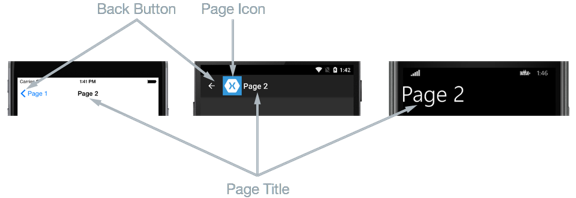
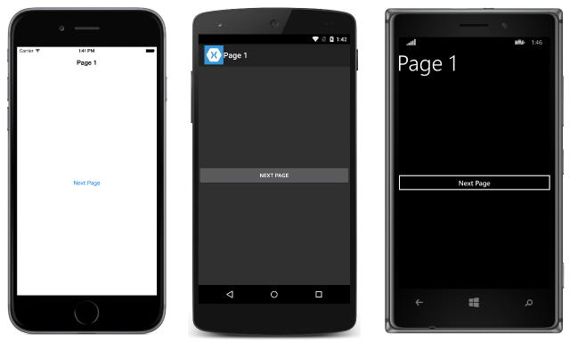
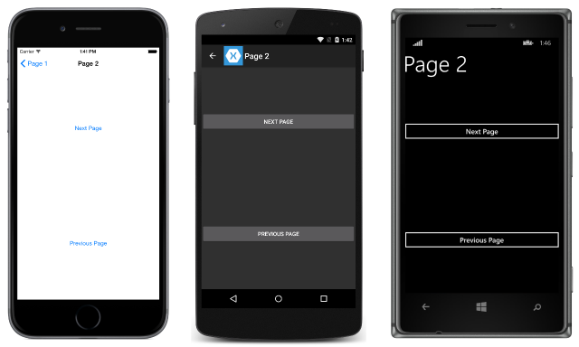
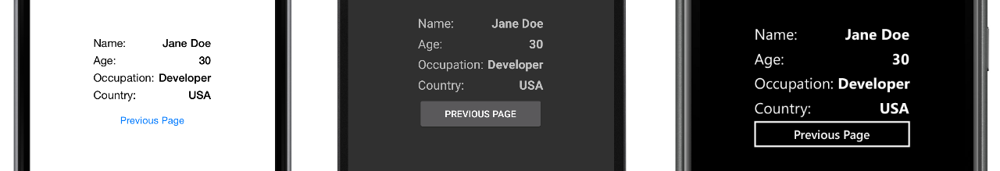

# Hierarchical Navigation

[ Download the sample](/samples/xamarin/xamarin-forms-samples/navigation-hierarchical)

_The NavigationPage class provides a hierarchical navigation experience where the user is able to navigate through pages, forwards and backwards, as desired. The class implements navigation as a last-in, first-out (LIFO) stack of Page objects. This article demonstrates how to use the NavigationPage class to perform navigation in a stack of pages._

To move from one page to another, an application will push a new page onto the navigation stack, where it will become the active page, as shown in the following diagram:


To return back to the previous page, the application will pop the current page from the navigation stack, and the new topmost page becomes the active page, as shown in the following diagram:


Navigation methods are exposed by the [`Navigation`](xref:Xamarin.Forms.NavigableElement.Navigation) property on any [`Page`](xref:Xamarin.Forms.Page) derived types. These methods provide the ability to push pages onto the navigation stack, to pop pages from the navigation stack, and to perform stack manipulation.

## Performing Navigation

In hierarchical navigation, the [`NavigationPage`](xref:Xamarin.Forms.NavigationPage) class is used to navigate through a stack of [`ContentPage`](xref:Xamarin.Forms.ContentPage) objects. The following screenshots show the main components of the `NavigationPage` on each platform:



The layout of a [`NavigationPage`](xref:Xamarin.Forms.NavigationPage) is dependent on the platform:

- On iOS, a navigation bar is present at the top of the page that displays a title, and that has a *Back* button that returns to the previous page.
- On Android, a navigation bar is present at the top of the page that displays a title, an icon, and a *Back* button that returns to the previous page. The icon is defined in the `[Activity]` attribute that decorates the `MainActivity` class in the Android platform-specific project.
- On the Universal Windows Platform, a navigation bar is present at the top of the page that displays a title.

On all the platforms, the value of the [`Page.Title`](xref:Xamarin.Forms.Page.Title) property will be displayed as the page title. In addition, the `IconColor` property can be set to a [`Color`](xref:Xamarin.Forms.Color) that's applied to the icon in the navigation bar.

> [!NOTE]
> It's recommended that a `NavigationPage` should be populated with `ContentPage` instances only.

### Creating the Root Page

The first page added to a navigation stack is referred to as the *root* page of the application, and the following code example shows how this is accomplished:

```csharp
public App ()
{
  MainPage = new NavigationPage (new Page1Xaml ());
}
```

This causes the `Page1Xaml` [`ContentPage`](xref:Xamarin.Forms.ContentPage) instance to be pushed onto the navigation stack, where it becomes the active page and the root page of the application. This is shown in the following screenshots:



> [!NOTE]
> The [`RootPage`](xref:Xamarin.Forms.NavigationPage.RootPage) property of a [`NavigationPage`](xref:Xamarin.Forms.NavigationPage) instance provides access to the first page in the navigation stack.

### Pushing Pages to the Navigation Stack

To navigate to `Page2Xaml`, it is necessary to invoke the [`PushAsync`](xref:Xamarin.Forms.NavigationPage.PushAsync*) method on the [`Navigation`](xref:Xamarin.Forms.NavigableElement.Navigation) property of the current page, as demonstrated in the following code example:

```csharp
async void OnNextPageButtonClicked (object sender, EventArgs e)
{
  await Navigation.PushAsync (new Page2Xaml ());
}
```

This causes the `Page2Xaml` instance to be pushed onto the navigation stack, where it becomes the active page. This is shown in the following screenshots:



When the [`PushAsync`](xref:Xamarin.Forms.NavigationPage.PushAsync*) method is invoked, the following events occur:

- The page calling `PushAsync` has its [`OnDisappearing`](xref:Xamarin.Forms.Page.OnDisappearing) override invoked.
- The page being navigated to has its [`OnAppearing`](xref:Xamarin.Forms.Page.OnAppearing) override invoked.
- The `PushAsync` task completes.

However, the precise order in which these events occur is platform dependent. For more information, see [Chapter 24](https://aka.ms/xamformsebook) of Charles Petzold's Xamarin.Forms book.

> [!NOTE]
> Calls to the [`OnDisappearing`](xref:Xamarin.Forms.Page.OnDisappearing) and [`OnAppearing`](xref:Xamarin.Forms.Page.OnAppearing) overrides cannot be treated as guaranteed indications of page navigation. For example, on iOS, the `OnDisappearing` override is called on the active page when the application terminates.

### Popping Pages from the Navigation Stack

The active page can be popped from the navigation stack by pressing the *Back* button on the device, regardless of whether this is a physical button on the device or an on-screen button.

To programmatically return to the original page, the `Page2Xaml` instance must invoke the [`PopAsync`](xref:Xamarin.Forms.NavigationPage.PopAsync) method, as demonstrated in the following code example:

```csharp
async void OnPreviousPageButtonClicked (object sender, EventArgs e)
{
  await Navigation.PopAsync ();
}
```

This causes the `Page2Xaml` instance to be removed from the navigation stack, with the new topmost page becoming the active page. When the [`PopAsync`](xref:Xamarin.Forms.NavigationPage.PopAsync) method is invoked, the following events occur:

- The page calling `PopAsync` has its [`OnDisappearing`](xref:Xamarin.Forms.Page.OnDisappearing) override invoked.
- The page being returned to has its [`OnAppearing`](xref:Xamarin.Forms.Page.OnAppearing) override invoked.
- The `PopAsync` task returns.

However, the precise order in which these events occur is platform dependent. For more information see [Chapter 24](https://aka.ms/xamformsebook) of Charles Petzold's Xamarin.Forms book.

As well as [`PushAsync`](xref:Xamarin.Forms.NavigationPage.PushAsync*) and [`PopAsync`](xref:Xamarin.Forms.NavigationPage.PopAsync) methods, the [`Navigation`](xref:Xamarin.Forms.NavigableElement.Navigation) property of each page also provides a [`PopToRootAsync`](xref:Xamarin.Forms.NavigationPage.PopToRootAsync) method, which is shown in the following code example:

```csharp
async void OnRootPageButtonClicked (object sender, EventArgs e)
{
  await Navigation.PopToRootAsync ();
}
```

This method pops all but the root [`Page`](xref:Xamarin.Forms.Page) off the navigation stack, therefore making the root page of the application the active page.

### Animating Page Transitions

The [`Navigation`](xref:Xamarin.Forms.NavigableElement.Navigation) property of each page also provides overridden push and pop methods that include a `boolean` parameter that controls whether to display a page animation during navigation, as shown in the following code example:

```csharp
async void OnNextPageButtonClicked (object sender, EventArgs e)
{
  // Page appearance not animated
  await Navigation.PushAsync (new Page2Xaml (), false);
}

async void OnPreviousPageButtonClicked (object sender, EventArgs e)
{
  // Page appearance not animated
  await Navigation.PopAsync (false);
}

async void OnRootPageButtonClicked (object sender, EventArgs e)
{
  // Page appearance not animated
  await Navigation.PopToRootAsync (false);
}
```

Setting the `boolean` parameter to `false` disables the page-transition animation, while setting the parameter to `true` enables the page-transition animation, provided that it is supported by the underlying platform. However, the push and pop methods that lack this parameter enable the animation by default.

## Passing Data when Navigating

Sometimes it's necessary for a page to pass data to another page during navigation. Two techniques for accomplishing this are passing data through a page constructor, and by setting the new page's [`BindingContext`](xref:Xamarin.Forms.BindableObject.BindingContext) to the data. Each will now be discussed in turn.

### Passing Data through a Page Constructor

The simplest technique for passing data to another page during navigation is through a page constructor parameter, which is shown in the following code example:

```csharp
public App ()
{
  MainPage = new NavigationPage (new MainPage (DateTime.Now.ToString ("u")));
}
```

This code creates a `MainPage` instance, passing in the current date and time in ISO8601 format, which is wrapped in a [`NavigationPage`](xref:Xamarin.Forms.NavigationPage) instance.

The `MainPage` instance receives the data through a constructor parameter, as shown in the following code example:

```csharp
public MainPage (string date)
{
  InitializeComponent ();
  dateLabel.Text = date;
}
```

The data is then displayed on the page by setting the [`Label.Text`](xref:Xamarin.Forms.Label.Text) property, as shown in the following screenshots:


### Passing Data through a BindingContext

An alternative approach for passing data to another page during navigation is by setting the new page's [`BindingContext`](xref:Xamarin.Forms.BindableObject.BindingContext) to the data, as shown in the following code example:

```csharp
async void OnNavigateButtonClicked (object sender, EventArgs e)
{
  var contact = new Contact {
    Name = "Jane Doe",
    Age = 30,
    Occupation = "Developer",
    Country = "USA"
  };

  var secondPage = new SecondPage ();
  secondPage.BindingContext = contact;
  await Navigation.PushAsync (secondPage);
}
```

This code sets the [`BindingContext`](xref:Xamarin.Forms.BindableObject.BindingContext) of the `SecondPage` instance to the `Contact` instance, and then navigates to the `SecondPage`.

The `SecondPage` then uses data binding to display the `Contact` instance data, as shown in the following XAML code example:

```xaml
<ContentPage xmlns="http://xamarin.com/schemas/2014/forms"
             xmlns:x="http://schemas.microsoft.com/winfx/2009/xaml"
             x:Class="PassingData.SecondPage"
             Title="Second Page">
    <ContentPage.Content>
        <StackLayout HorizontalOptions="Center" VerticalOptions="Center">
            <StackLayout Orientation="Horizontal">
                <Label Text="Name:" HorizontalOptions="FillAndExpand" />
                <Label Text="{Binding Name}" FontSize="Medium" FontAttributes="Bold" />
            </StackLayout>
            ...
            <Button x:Name="navigateButton" Text="Previous Page" Clicked="OnNavigateButtonClicked" />
        </StackLayout>
    </ContentPage.Content>
</ContentPage>
```

The following code example shows how the data binding can be accomplished in C#:

```csharp
public class SecondPageCS : ContentPage
{
  public SecondPageCS ()
  {
    var nameLabel = new Label {
      FontSize = Device.GetNamedSize (NamedSize.Medium, typeof(Label)),
      FontAttributes = FontAttributes.Bold
    };
    nameLabel.SetBinding (Label.TextProperty, "Name");
    ...
    var navigateButton = new Button { Text = "Previous Page" };
    navigateButton.Clicked += OnNavigateButtonClicked;

    Content = new StackLayout {
      HorizontalOptions = LayoutOptions.Center,
      VerticalOptions = LayoutOptions.Center,
      Children = {
        new StackLayout {
          Orientation = StackOrientation.Horizontal,
          Children = {
            new Label{ Text = "Name:", FontSize = Device.GetNamedSize (NamedSize.Medium, typeof(Label)), HorizontalOptions = LayoutOptions.FillAndExpand },
            nameLabel
          }
        },
        ...
        navigateButton
      }
    };
  }

  async void OnNavigateButtonClicked (object sender, EventArgs e)
  {
    await Navigation.PopAsync ();
  }
}
```

The data is then displayed on the page by a series of [`Label`](xref:Xamarin.Forms.Label) controls, as shown in the following screenshots:



For more information about data binding, see [Data Binding Basics](~/xamarin-forms/xaml/xaml-basics/data-binding-basics.md).

## Manipulating the Navigation Stack

The [`Navigation`](xref:Xamarin.Forms.NavigableElement.Navigation) property exposes a [`NavigationStack`](xref:Xamarin.Forms.INavigation.NavigationStack) property from which the pages in the navigation stack can be obtained. While Xamarin.Forms maintains access to the navigation stack, the `Navigation` property provides the [`InsertPageBefore`](xref:Xamarin.Forms.INavigation.InsertPageBefore*) and [`RemovePage`](xref:Xamarin.Forms.INavigation.RemovePage*) methods for manipulating the stack by inserting pages or removing them.

The [`InsertPageBefore`](xref:Xamarin.Forms.INavigation.InsertPageBefore*) method inserts a specified page in the navigation stack before an existing specified page, as shown in the following diagram:


The [`RemovePage`](xref:Xamarin.Forms.INavigation.RemovePage*) method removes the specified page from the navigation stack, as shown in the following diagram:


These methods enable a custom navigation experience, such as replacing a login page with a new page, following a successful login. The following code example demonstrates this scenario:

```csharp
async void OnLoginButtonClicked (object sender, EventArgs e)
{
  ...
  var isValid = AreCredentialsCorrect (user);
  if (isValid) {
    App.IsUserLoggedIn = true;
    Navigation.InsertPageBefore (new MainPage (), this);
    await Navigation.PopAsync ();
  } else {
    // Login failed
  }
}

```

Provided that the user's credentials are correct, the `MainPage` instance is inserted into the navigation stack before the current page. The [`PopAsync`](xref:Xamarin.Forms.NavigationPage.PopAsync) method then removes the current page from the navigation stack, with the `MainPage` instance becoming the active page.

## Displaying Views in the Navigation Bar

Any Xamarin.Forms [`View`](xref:Xamarin.Forms.View) can be displayed in the navigation bar of a [`NavigationPage`](xref:Xamarin.Forms.NavigationPage). This is accomplished by setting the [`NavigationPage.TitleView`](xref:Xamarin.Forms.NavigationPage.TitleViewProperty) attached property to a `View`. This attached property can be set on any [`Page`](xref:Xamarin.Forms.Page), and when the `Page` is pushed onto a `NavigationPage`, the `NavigationPage` will respect the value of the property.

The following example, taken from the [Title View sample](/samples/xamarin/xamarin-forms-samples/navigation-titleview), shows how to set the [`NavigationPage.TitleView`](xref:Xamarin.Forms.NavigationPage.TitleViewProperty) attached property from XAML:

```xaml
<ContentPage xmlns="http://xamarin.com/schemas/2014/forms"
             xmlns:x="http://schemas.microsoft.com/winfx/2009/xaml"
             x:Class="NavigationPageTitleView.TitleViewPage">
    <NavigationPage.TitleView>
        <Slider HeightRequest="44" WidthRequest="300" />
    </NavigationPage.TitleView>
    ...
</ContentPage>
```

Here is the equivalent C# code:

```csharp
public class TitleViewPage : ContentPage
{
    public TitleViewPage()
    {
        var titleView = new Slider { HeightRequest = 44, WidthRequest = 300 };
        NavigationPage.SetTitleView(this, titleView);
        ...
    }
}
```

This results in a [`Slider`](xref:Xamarin.Forms.Slider) being displayed in the navigation bar on the [`NavigationPage`](xref:Xamarin.Forms.NavigationPage):

[](hierarchical-images/titleview-large.png#lightbox "Slider TitleView")

> [!IMPORTANT]
> Many views won't appear in the navigation bar unless the size of the view is specified with the [`WidthRequest`](xref:Xamarin.Forms.VisualElement.WidthRequest) and [`HeightRequest`](xref:Xamarin.Forms.VisualElement.HeightRequest) properties. Alternatively, the view can be wrapped in a [`StackLayout`](xref:Xamarin.Forms.StackLayout) with the [`HorizontalOptions`](xref:Xamarin.Forms.View.HorizontalOptions) and [`VerticalOptions`](xref:Xamarin.Forms.View.VerticalOptions) properties set to appropriate values.

Note that, because the [`Layout`](xref:Xamarin.Forms.Layout) class derives from the [`View`](xref:Xamarin.Forms.View) class, the [`TitleView`](xref:Xamarin.Forms.NavigationPage.TitleViewProperty) attached property can be set to display a layout class that contains multiple views. On iOS and the Universal Windows Platform (UWP), the height of the navigation bar can't be changed, and so clipping will occur if the view displayed in the navigation bar is larger than the default size of the navigation bar. However, on Android, the height of the navigation bar can be changed by setting the [`NavigationPage.BarHeight`](xref:Xamarin.Forms.PlatformConfiguration.AndroidSpecific.AppCompat.NavigationPage.BarHeightProperty) bindable property to a `double` representing the new height. For more information, see [Setting the Navigation Bar Height on a NavigationPage](~/xamarin-forms/platform/android/navigationpage-bar-height.md).

Alternatively, an extended navigation bar can be suggested by placing some of the content in the navigation bar, and some in a view at the top of the page content that you color match to the navigation bar. In addition, on iOS the separator line and shadow that's at the bottom of the navigation bar can be removed by setting the [`NavigationPage.HideNavigationBarSeparator`](xref:Xamarin.Forms.PlatformConfiguration.iOSSpecific.NavigationPage.HideNavigationBarSeparatorProperty) bindable property to `true`. For more information, see [Hiding the Navigation Bar Separator on a NavigationPage](~/xamarin-forms/platform/ios/navigation-bar-separator.md).

> [!NOTE]
> The [`BackButtonTitle`](xref:Xamarin.Forms.NavigationPage.BackButtonTitleProperty), [`Title`](xref:Xamarin.Forms.Page.Title), [`TitleIcon`](xref:Xamarin.Forms.NavigationPage.TitleIconProperty), and [`TitleView`](xref:Xamarin.Forms.NavigationPage.TitleViewProperty) properties can all define values that occupy space on the navigation bar. While the navigation bar size varies by platform and screen size, setting all of these properties will result in conflicts due to the limited space available. Instead of attempting to use a combination of these properties, you may find that you can better achieve your desired navigation bar design by only setting the `TitleView` property.

### Limitations

There are a number of limitations to be aware of when displaying a [`View`](xref:Xamarin.Forms.View) in the navigation bar of a [`NavigationPage`](xref:Xamarin.Forms.NavigationPage):

- On iOS, views placed in the navigation bar of a `NavigationPage` appear in a different position depending on whether large titles are enabled. For more information about enabling large titles, see [Displaying Large Titles](~/xamarin-forms/platform/ios/page-large-title.md).
- On Android, placing views in the navigation bar of a `NavigationPage` can only be accomplished in apps that use app-compat.
- It's not recommended to place large and complex views, such as [`ListView`](xref:Xamarin.Forms.ListView) and [`TableView`](xref:Xamarin.Forms.TableView), in the navigation bar of a `NavigationPage`.

## Related Links

- [Page Navigation (chapter 24)](https://developer.xamarin.com/r/xamarin-forms/book/)
- [Hierarchical (sample)](/samples/xamarin/xamarin-forms-samples/navigation-hierarchical)
- [PassingData (sample)](/samples/xamarin/xamarin-forms-samples/navigation-passingdata)
- [LoginFlow (sample)](/samples/xamarin/xamarin-forms-samples/navigation-loginflow)
- [TitleView (sample)](/samples/xamarin/xamarin-forms-samples/navigation-titleview)
- [How to Create a Sign In Screen Flow in Xamarin.Forms video](https://www.youtube.com/watch?v=qKQ7pyyG1fo)
- [NavigationPage](xref:Xamarin.Forms.NavigationPage)