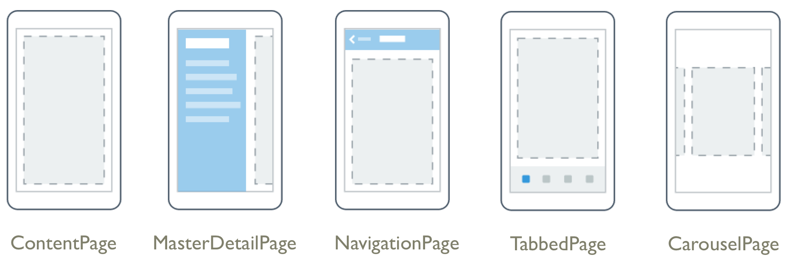

# Xamarin.Forms Navigation

_Xamarin.Forms provides a number of different page navigation experiences, depending upon the Page type being used._

Alternatively, Xamarin.Forms Shell applications use a URI-based navigation experience that doesn't enforce a set navigation hierarchy. For more information, see [Xamarin.Forms Shell Navigation](~/xamarin-forms/app-fundamentals/shell/navigation.md).

## [Hierarchical Navigation](hierarchical.md)

The [`NavigationPage`](xref:Xamarin.Forms.NavigationPage) class provides a hierarchical navigation experience where the user is able to navigate through pages, forwards and backwards, as desired. The class implements navigation as a last-in, first-out (LIFO) stack of [`Page`](xref:Xamarin.Forms.Page) objects.

## [TabbedPage](tabbed-page.md)

The Xamarin.Forms [`TabbedPage`](xref:Xamarin.Forms.TabbedPage) consists of a list of tabs and a larger detail area, with each tab loading content into the detail area.

## [CarouselPage](carousel-page.md)

The Xamarin.Forms [`CarouselPage`](xref:Xamarin.Forms.CarouselPage) is a page that users can swipe from side to side to navigate through pages of content, like a gallery.

## [FlyoutPage](flyoutpage.md)

The Xamarin.Forms [`FlyoutPage`](xref:Xamarin.Forms.FlyoutPage) is a page that manages two pages of related information – a flyout page that presents items, and a detail page that presents details about items on the flyout page.

## [Modal Pages](modal.md)

Xamarin.Forms also provides support for modal pages. A modal page encourages users to complete a self-contained task that cannot be navigated away from until the task is completed or cancelled.
