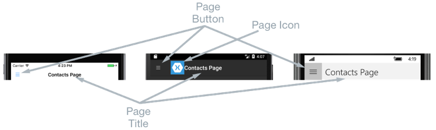
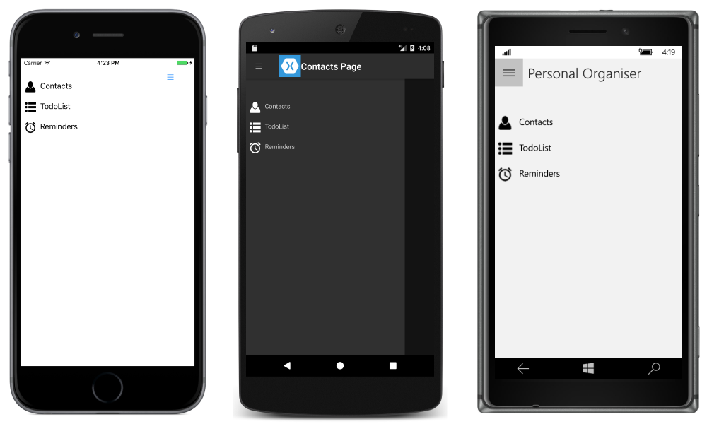
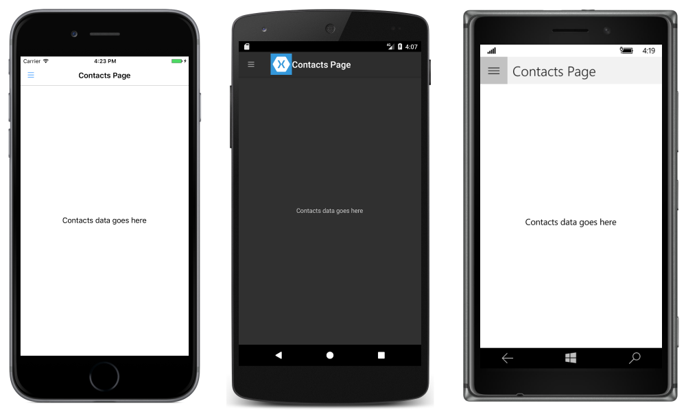

# Xamarin.Forms Master-Detail Page

[ Download the sample](https://developer.xamarin.com/samples/xamarin-forms/Navigation/MasterDetailPage/)

_The Xamarin.Forms MasterDetailPage is a page that manages two related pages of information – a master page that presents items, and a detail page that presents details about items on the master page. This article explains how to use a MasterDetailPage and navigate between its pages of information._

## Overview

A master page typically displays a list of items, as shown in the following screenshots:

[](master-detail-page-images/masterpage-components-large.png#lightbox "Master Page Components")

The location of the list of items is identical on each platform, and selecting one of the items will navigate to the corresponding detail page. In addition, the master page also features a navigation bar that contains a button that can be used to navigate to the active detail page:

- On iOS, the navigation bar is present at the top of the page and has a button that navigates to the detail page. In addition, the active detail page can be navigated to by swiping the master page to the left.
- On Android, the navigation bar is present at the top of the page and displays a title, an icon, and a button that navigates to the detail page. The icon is defined in the `[Activity]` attribute that decorates the `MainActivity` class in the Android platform-specific project. In addition, the active detail page can be navigated to by swiping the master page to the left, by tapping the detail page at the far right of the screen, and by tapping the *Back* button at the bottom of the screen.
- On the Universal Windows Platform (UWP), the navigation bar is present at the top of the page and has a button that navigates to the detail page.

A detail page displays data that corresponds to the item selected on the master page, and the main components of the detail page are shown in the following screenshots:



The detail page contains a navigation bar, whose contents are platform-dependent:

- On iOS, the navigation bar is present at the top of the page and displays a title, and has a button that returns to the master page, provided that the detail page instance is wrapped in the [`NavigationPage`](xref:Xamarin.Forms.NavigationPage) instance. In addition, the master page can be returned to by swiping the detail page to the right.
- On Android, a navigation bar is present at the top of the page and displays a title, an icon, and a button that returns to the master page. The icon is defined in the `[Activity]` attribute that decorates the `MainActivity` class in the Android platform-specific project.
- On UWP, the navigation bar is present at the top of the page and displays a title, and has a button that returns to the master page.

### Navigation Behavior

The behavior of the navigation experience between master and detail pages is platform dependent:

- On iOS, the detail page *slides* to the right as the master page slides from the left, and the left part of the detail page is still visible.
- On Android, the detail and master pages are *overlaid* on each other.
- On UWP, the detail and master pages are *swapped*.

Similar behavior will be observed in landscape mode, except that the master page on iOS and Android has a similar width as the master page in portrait mode, so more of the detail page will be visible.

For information about controlling the navigation behavior, see [Controlling the Detail Page Display Behavior](#Controlling_the_Detail_Page_Display_Behavior).

## Creating a MasterDetailPage

A [`MasterDetailPage`](xref:Xamarin.Forms.MasterDetailPage) contains [`Master`](xref:Xamarin.Forms.MasterDetailPage.Master) and [`Detail`](xref:Xamarin.Forms.MasterDetailPage.Detail) properties that are both of type [`Page`](xref:Xamarin.Forms.Page), which are used to get and set the master and detail pages respectively.

> [!IMPORTANT]
> A [`MasterDetailPage`](xref:Xamarin.Forms.MasterDetailPage) is designed to be a root page, and using it as a child page in other page types could result in unexpected and inconsistent behavior. In addition, it's recommended that the master page of a [`MasterDetailPage`](xref:Xamarin.Forms.MasterDetailPage) should always be a [`ContentPage`](xref:Xamarin.Forms.ContentPage) instance, and that the detail page should only be populated with [`TabbedPage`](xref:Xamarin.Forms.TabbedPage), [`NavigationPage`](xref:Xamarin.Forms.NavigationPage), and `ContentPage` instances. This will help to ensure a consistent user experience across all platforms.

The following XAML code example shows a [`MasterDetailPage`](xref:Xamarin.Forms.MasterDetailPage) that sets the [`Master`](xref:Xamarin.Forms.MasterDetailPage.Master) and [`Detail`](xref:Xamarin.Forms.MasterDetailPage.Detail) properties:

```xaml
<MasterDetailPage xmlns="http://xamarin.com/schemas/2014/forms"
                  xmlns:x="http://schemas.microsoft.com/winfx/2009/xaml"
                  xmlns:local="clr-namespace:MasterDetailPageNavigation;assembly=MasterDetailPageNavigation"
                  x:Class="MasterDetailPageNavigation.MainPage">
    <MasterDetailPage.Master>
        <local:MasterPage x:Name="masterPage" />
    </MasterDetailPage.Master>
    <MasterDetailPage.Detail>
        <NavigationPage>
            <x:Arguments>
                <local:ContactsPage />
            </x:Arguments>
        </NavigationPage>
    </MasterDetailPage.Detail>
</MasterDetailPage>
```

The following code example shows the equivalent [`MasterDetailPage`](xref:Xamarin.Forms.MasterDetailPage) created in C#:

```csharp
public class MainPageCS : MasterDetailPage
{
    MasterPageCS masterPage;

    public MainPageCS ()
    {
        masterPage = new MasterPageCS ();
        Master = masterPage;
        Detail = new NavigationPage (new ContactsPageCS ());
        ...
    }
    ...
}
```

The [`MasterDetailPage.Master`](xref:Xamarin.Forms.MasterDetailPage.Master) property is set to a [`ContentPage`](xref:Xamarin.Forms.ContentPage) instance. The [`MasterDetailPage.Detail`](xref:Xamarin.Forms.MasterDetailPage.Detail) property is set to a [`NavigationPage`](xref:Xamarin.Forms.NavigationPage) containing a `ContentPage` instance.

### Creating the Master Page

The following XAML code example shows the declaration of the `MasterPage` object, which is referenced through the [`MasterDetailPage.Master`](xref:Xamarin.Forms.MasterDetailPage.Master) property:

```xaml
<ContentPage xmlns="http://xamarin.com/schemas/2014/forms"
             xmlns:x="http://schemas.microsoft.com/winfx/2009/xaml"
             xmlns:local="using:MasterDetailPageNavigation"
             x:Class="MasterDetailPageNavigation.MasterPage"
             Padding="0,40,0,0"
             Icon="hamburger.png"
             Title="Personal Organiser">
    <StackLayout>
        <ListView x:Name="listView" x:FieldModifier="public">
           <ListView.ItemsSource>
                <x:Array Type="{x:Type local:MasterPageItem}">
                    <local:MasterPageItem Title="Contacts" IconSource="contacts.png" TargetType="{x:Type local:ContactsPage}" />
                    <local:MasterPageItem Title="TodoList" IconSource="todo.png" TargetType="{x:Type local:TodoListPage}" />
                    <local:MasterPageItem Title="Reminders" IconSource="reminders.png" TargetType="{x:Type local:ReminderPage}" />
                </x:Array>
            </ListView.ItemsSource>
            <ListView.ItemTemplate>
                <DataTemplate>
                    <ViewCell>
                        <Grid Padding="5,10">
                            <Grid.ColumnDefinitions>
                                <ColumnDefinition Width="30"/>
                                <ColumnDefinition Width="*" />
                            </Grid.ColumnDefinitions>
                            <Image Source="{Binding IconSource}" />
                            <Label Grid.Column="1" Text="{Binding Title}" />
                        </Grid>
                    </ViewCell>
                </DataTemplate>
            </ListView.ItemTemplate>
        </ListView>
    </StackLayout>
</ContentPage>
```

The page consists of a [`ListView`](xref:Xamarin.Forms.ListView) that's populated with data in XAML by setting its [`ItemsSource`](xref:Xamarin.Forms.ItemsView`1.ItemsSource) property to an array of `MasterPageItem` instances. Each `MasterPageItem` defines `Title`, `IconSource`, and `TargetType` properties.

A [`DataTemplate`](xref:Xamarin.Forms.DataTemplate) is assigned to the [`ListView.ItemTemplate`](xref:Xamarin.Forms.ItemsView`1.ItemTemplate) property, to display each `MasterPageItem`. The `DataTemplate` contains a [`ViewCell`](xref:Xamarin.Forms.ViewCell) that consists of an [`Image`](xref:Xamarin.Forms.Image) and a [`Label`](xref:Xamarin.Forms.Label). The [`Image`](xref:Xamarin.Forms.Image) displays the `IconSource` property value, and the [`Label`](xref:Xamarin.Forms.Label) displays the `Title` property value, for each `MasterPageItem`.

The page has its [`Title`](xref:Xamarin.Forms.Page.Title) and [`Icon`](xref:Xamarin.Forms.Page.Icon) properties set. The icon will appear on the detail page, provided that the detail page has a title bar. This must be enabled on iOS by wrapping the detail page instance in a [`NavigationPage`](xref:Xamarin.Forms.NavigationPage) instance.

> [!NOTE]
> The [`MasterDetailPage.Master`](xref:Xamarin.Forms.MasterDetailPage.Master) page must have its [`Title`](xref:Xamarin.Forms.Page.Title) property set, or an exception will occur.

The following code example shows the equivalent page created in C#:

```csharp
public class MasterPageCS : ContentPage
{
  public ListView ListView { get { return listView; } }

  ListView listView;

  public MasterPageCS ()
  {
    var masterPageItems = new List<MasterPageItem> ();
    masterPageItems.Add (new MasterPageItem {
      Title = "Contacts",
      IconSource = "contacts.png",
      TargetType = typeof(ContactsPageCS)
    });
    masterPageItems.Add (new MasterPageItem {
      Title = "TodoList",
      IconSource = "todo.png",
      TargetType = typeof(TodoListPageCS)
    });
    masterPageItems.Add (new MasterPageItem {
      Title = "Reminders",
      IconSource = "reminders.png",
      TargetType = typeof(ReminderPageCS)
    });

    listView = new ListView {
      ItemsSource = masterPageItems,
      ItemTemplate = new DataTemplate (() => {
        var grid = new Grid { Padding = new Thickness(5, 10) };
        grid.ColumnDefinitions.Add(new ColumnDefinition { Width = new GridLength(30) });
        grid.ColumnDefinitions.Add(new ColumnDefinition { Width = GridLength.Star });

        var image = new Image();
        image.SetBinding(Image.SourceProperty, "IconSource");
        var label = new Label { VerticalOptions = LayoutOptions.FillAndExpand };
        label.SetBinding(Label.TextProperty, "Title");

        grid.Children.Add(image);
        grid.Children.Add(label, 1, 0);

        return new ViewCell { View = grid };
      }),
      SeparatorVisibility = SeparatorVisibility.None
    };

    Icon = "hamburger.png";
    Title = "Personal Organiser";
    Content = new StackLayout
    {
      Children = { listView }
    };
  }
}
```

The following screenshots show the master page on each platform:



### Creating and Displaying the Detail Page

The `MasterPage` instance contains a `ListView` property that exposes its [`ListView`](xref:Xamarin.Forms.ListView) instance so that the `MainPage` [`MasterDetailPage`](xref:Xamarin.Forms.MasterDetailPage) instance can register an event-handler to handle the [`ItemSelected`](xref:Xamarin.Forms.ListView.ItemSelected) event. This enables the `MainPage` instance to set the [`Detail`](xref:Xamarin.Forms.MasterDetailPage.Detail) property to the page that represents the selected `ListView` item. The following code example shows the event-handler:

```csharp
public partial class MainPage : MasterDetailPage
{
    public MainPage ()
    {
        ...
        masterPage.listView.ItemSelected += OnItemSelected;
    }

    void OnItemSelected (object sender, SelectedItemChangedEventArgs e)
    {
        var item = e.SelectedItem as MasterPageItem;
        if (item != null) {
            Detail = new NavigationPage ((Page)Activator.CreateInstance (item.TargetType));
            masterPage.listView.SelectedItem = null;
            IsPresented = false;
        }
    }
}
```

The `OnItemSelected` method performs the following actions:

- It retrieves the [`SelectedItem`](xref:Xamarin.Forms.ListView.SelectedItem) from the [`ListView`](xref:Xamarin.Forms.ListView) instance, and provided that it's not `null`, sets the detail page to a new instance of the page type stored in the `TargetType` property of the `MasterPageItem`. The page type is wrapped in a [`NavigationPage`](xref:Xamarin.Forms.NavigationPage) instance to ensure that the icon referenced through the [`Icon`](xref:Xamarin.Forms.Page.Icon) property on the `MasterPage` is shown on the detail page in iOS.
- The selected item in the [`ListView`](xref:Xamarin.Forms.ListView) is set to `null` to ensure that none of the `ListView` items will be selected next time the `MasterPage` is presented.
- The detail page is presented to the user by setting the [`MasterDetailPage.IsPresented`](xref:Xamarin.Forms.MasterDetailPage.IsPresented) property to `false`. This property controls whether the master or detail page is presented. It should be set to `true` to display the master page, and to `false` to display the detail page.

The following screenshots show the `ContactPage` detail page, which is shown after it's been selected on the master page:



<a name="Controlling_the_Detail_Page_Display_Behavior" />

### Controlling the Detail Page Display Behavior

How the [`MasterDetailPage`](xref:Xamarin.Forms.MasterDetailPage) manages the master and detail pages depends on whether the application is running on a phone or tablet, the orientation of the device, and the value of the [`MasterBehavior`](xref:Xamarin.Forms.MasterDetailPage.MasterBehavior) property. This property determines how the detail page will be displayed. It's possible values are:

- **Default** – The pages are displayed using the platform default.
- **Popover** – The detail page covers, or partially covers the master page.
- **Split** – The master page is displayed on the left and the detail page is on the right.
- **SplitOnLandscape** – A split screen is used when the device is in landscape orientation.
- **SplitOnPortrait** – A split screen is used when the device is in portrait orientation.

The following XAML code example demonstrates how to set the [`MasterBehavior`](xref:Xamarin.Forms.MasterDetailPage.MasterBehavior) property on a [`MasterDetailPage`](xref:Xamarin.Forms.MasterDetailPage):

```xaml
<?xml version="1.0" encoding="UTF-8"?>
<MasterDetailPage xmlns="http://xamarin.com/schemas/2014/forms"
                  xmlns:x="http://schemas.microsoft.com/winfx/2009/xaml"
                  x:Class="MasterDetailPageNavigation.MainPage"
                  MasterBehavior="Popover">
  ...
</MasterDetailPage>
```

The following code example shows the equivalent [`MasterDetailPage`](xref:Xamarin.Forms.MasterDetailPage) created in C#:

```csharp
public class MainPageCS : MasterDetailPage
{
    MasterPageCS masterPage;

    public MainPageCS ()
    {
        MasterBehavior = MasterBehavior.Popover;
        ...
    }
}
```

However, the value of the [`MasterBehavior`](xref:Xamarin.Forms.MasterDetailPage.MasterBehavior) property only affects applications running on tablets or the desktop. Applications running on phones always have the *Popover* behavior.

## Summary

This article demonstrated how to use a [`MasterDetailPage`](xref:Xamarin.Forms.MasterDetailPage) and navigate between its pages of information. The Xamarin.Forms `MasterDetailPage` is a page that manages two pages of related information – a master page that presents items, and a detail page that presents details about items on the master page.


## Related Links

- [Page Varieties](https://developer.xamarin.com/r/xamarin-forms/book/chapter25.pdf)
- [MasterDetailPage (sample)](https://developer.xamarin.com/samples/xamarin-forms/Navigation/MasterDetailPage/)
- [MasterDetailPage](xref:Xamarin.Forms.MasterDetailPage)
