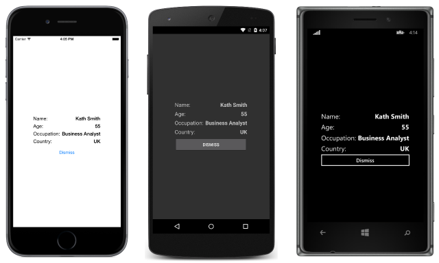

# Xamarin.Forms Modal Pages

[ Download the sample](/samples/xamarin/xamarin-forms-samples/navigation-modal)

_Xamarin.Forms provides support for modal pages. A modal page encourages users to complete a self-contained task that cannot be navigated away from until the task is completed or cancelled. This article demonstrates how to navigate to modal pages._

This article discusses the following topics:

- [Performing navigation](#performing-navigation) – pushing pages to the modal stack, popping pages from the modal stack, disabling the back button, and animating page transitions.
- [Passing data when navigating](#passing-data-when-navigating) – passing data through a page constructor, and through a `BindingContext`.

## Overview

A modal page can be any of the [Page](~/xamarin-forms/user-interface/controls/pages.md) types supported by Xamarin.Forms. To display a modal page the application will push it onto the modal stack, where it will become the active page, as shown in the following diagram:


To return to the previous page the application will pop the current page from the modal stack, and the new topmost page becomes the active page, as shown in the following diagram:


## Performing Navigation

Modal navigation methods are exposed by the [`Navigation`](xref:Xamarin.Forms.NavigableElement.Navigation) property on any [`Page`](xref:Xamarin.Forms.Page) derived types. These methods provide the ability to [push modal pages](#pushing-pages-to-the-modal-stack) onto the modal stack, and [pop modal pages](#popping-pages-from-the-modal-stack) from the modal stack.

The [`Navigation`](xref:Xamarin.Forms.NavigableElement.Navigation) property also exposes a [`ModalStack`](xref:Xamarin.Forms.INavigation.ModalStack) property from which the modal pages in the modal stack can be obtained. However, there is no concept of performing modal stack manipulation, or popping to the root page in modal navigation. This is because these operations are not universally supported on the underlying platforms.

> [!NOTE]
> A [`NavigationPage`](xref:Xamarin.Forms.NavigationPage) instance is not required for performing modal page navigation.

### Pushing Pages to the Modal Stack

To navigate to the `ModalPage` it is necessary to invoke the [`PushModalAsync`](xref:Xamarin.Forms.INavigation.PushModalAsync*) method on the [`Navigation`](xref:Xamarin.Forms.NavigableElement.Navigation) property of the current page, as demonstrated in the following code example:

```csharp
async void OnItemSelected (object sender, SelectedItemChangedEventArgs e)
{
  if (listView.SelectedItem != null) {
    var detailPage = new DetailPage ();
    ...
    await Navigation.PushModalAsync (detailPage);
  }
}
```

This causes the `ModalPage` instance to be pushed onto the modal stack, where it becomes the active page, provided that an item has been selected in the [`ListView`](xref:Xamarin.Forms.ListView) on the `MainPage` instance. The `ModalPage` instance is shown in the following screenshots:



When [`PushModalAsync`](xref:Xamarin.Forms.INavigation.PushModalAsync*) is invoked, the following events occur:

- The page calling `PushModalAsync` has its [`OnDisappearing`](xref:Xamarin.Forms.Page.OnDisappearing) override invoked, provided that the underlying platform isn't Android.
- The page being navigated to has its [`OnAppearing`](xref:Xamarin.Forms.Page.OnAppearing) override invoked.
- The `PushAsync` task completes.
- 
However, the precise order that these events occur is platform dependent. For more information, see [Chapter 24](https://developer.xamarin.com/r/xamarin-forms/book/) of Charles Petzold's Xamarin.Forms book.

> [!NOTE]
> Calls to the [`OnDisappearing`](xref:Xamarin.Forms.Page.OnDisappearing) and [`OnAppearing`](xref:Xamarin.Forms.Page.OnAppearing) overrides cannot be treated as guaranteed indications of page navigation. For example, on iOS, the `OnDisappearing` override is called on the active page when the application terminates.

### Popping Pages from the Modal Stack

The active page can be popped from the modal stack by pressing the *Back* button on the device, regardless of whether this is a physical button on the device or an on-screen button.

To programmatically return to the original page, the `ModalPage` instance must invoke the [`PopModalAsync`](xref:Xamarin.Forms.INavigation.PopModalAsync) method, as demonstrated in the following code example:

```csharp
async void OnDismissButtonClicked (object sender, EventArgs args)
{
  await Navigation.PopModalAsync ();
}
```

This causes the `ModalPage` instance to be removed from the modal stack, with the new topmost page becoming the active page. When [`PopModalAsync`](xref:Xamarin.Forms.INavigation.PopModalAsync) is invoked, the following events occur:

- The page calling `PopModalAsync` has its [`OnDisappearing`](xref:Xamarin.Forms.Page.OnDisappearing) override invoked.
- The page being returned to has its [`OnAppearing`](xref:Xamarin.Forms.Page.OnAppearing) override invoked, provided that the underlying platform isn't Android.
- The `PopModalAsync` task returns.

However, the precise order that these events occur is platform dependent. For more information, see [Chapter 24](https://aka.ms/xamformsebook) of Charles Petzold's Xamarin.Forms book.

### Disabling the Back Button

On Android, the user can always return to the previous page by pressing the standard *Back* button on the device. If the modal page requires the user to complete a self-contained task before leaving the page, the application must disable the *Back* button. This can be accomplished by overriding the [`Page.OnBackButtonPressed`](xref:Xamarin.Forms.Page.OnBackButtonPressed) method on the modal page. For more information see [Chapter 24](https://aka.ms/xamformsebook) of Charles Petzold's Xamarin.Forms book.

### Animating Page Transitions

The [`Navigation`](xref:Xamarin.Forms.NavigableElement.Navigation) property of each page also provides overridden push and pop methods that include a `boolean` parameter that controls whether to display a page animation during navigation, as shown in the following code example:

```csharp
async void OnNextPageButtonClicked (object sender, EventArgs e)
{
  // Page appearance not animated
  await Navigation.PushModalAsync (new DetailPage (), false);
}

async void OnDismissButtonClicked (object sender, EventArgs args)
{
  // Page appearance not animated
  await Navigation.PopModalAsync (false);
}
```

Setting the `boolean` parameter to `false` disables the page-transition animation, while setting the parameter to `true` enables the page-transition animation, provided that it is supported by the underlying platform. However, the push and pop methods that lack this parameter enable the animation by default.

## Passing Data when Navigating

Sometimes it's necessary for a page to pass data to another page during navigation. Two techniques for accomplishing this are by passing data through a page constructor, and by setting the new page's [`BindingContext`](xref:Xamarin.Forms.BindableObject.BindingContext) to the data. Each will now be discussed in turn.

### Passing Data through a Page Constructor

The simplest technique for passing data to another page during navigation is through a page constructor parameter, which is shown in the following code example:

```csharp
public App ()
{
  MainPage = new MainPage (DateTime.Now.ToString ("u")));
}
```

This code creates a `MainPage` instance, passing in the current date and time in ISO8601 format.

The `MainPage` instance receives the data through a constructor parameter, as shown in the following code example:

```csharp
public MainPage (string date)
{
  InitializeComponent ();
  dateLabel.Text = date;
}
```

The data is then displayed on the page by setting the [`Label.Text`](xref:Xamarin.Forms.Label.Text) property.

### Passing Data through a BindingContext

An alternative approach for passing data to another page during navigation is by setting the new page's [`BindingContext`](xref:Xamarin.Forms.BindableObject.BindingContext) to the data, as shown in the following code example:

```csharp
async void OnItemSelected (object sender, SelectedItemChangedEventArgs e)
{
  if (listView.SelectedItem != null) {
    var detailPage = new DetailPage ();
    detailPage.BindingContext = e.SelectedItem as Contact;
    listView.SelectedItem = null;
    await Navigation.PushModalAsync (detailPage);
  }
}
```

This code sets the [`BindingContext`](xref:Xamarin.Forms.BindableObject.BindingContext) of the `DetailPage` instance to the `Contact` instance, and then navigates to the `DetailPage`.

The `DetailPage` then uses data binding to display the `Contact` instance data, as shown in the following XAML code example:

```xaml
<ContentPage xmlns="http://xamarin.com/schemas/2014/forms"
             xmlns:x="http://schemas.microsoft.com/winfx/2009/xaml"
             x:Class="ModalNavigation.DetailPage">
    <ContentPage.Padding>
      <OnPlatform x:TypeArguments="Thickness">
        <On Platform="iOS" Value="0,40,0,0" />
      </OnPlatform>
    </ContentPage.Padding>
    <ContentPage.Content>
        <StackLayout HorizontalOptions="Center" VerticalOptions="Center">
            <StackLayout Orientation="Horizontal">
                <Label Text="Name:" FontSize="Medium" HorizontalOptions="FillAndExpand" />
                <Label Text="{Binding Name}" FontSize="Medium" FontAttributes="Bold" />
            </StackLayout>
              ...
            <Button x:Name="dismissButton" Text="Dismiss" Clicked="OnDismissButtonClicked" />
        </StackLayout>
    </ContentPage.Content>
</ContentPage>
```

The following code example shows how the data binding can be accomplished in C#:

```csharp
public class DetailPageCS : ContentPage
{
  public DetailPageCS ()
  {
    var nameLabel = new Label {
      FontSize = Device.GetNamedSize (NamedSize.Medium, typeof(Label)),
      FontAttributes = FontAttributes.Bold
    };
    nameLabel.SetBinding (Label.TextProperty, "Name");
    ...
    var dismissButton = new Button { Text = "Dismiss" };
    dismissButton.Clicked += OnDismissButtonClicked;

    Thickness padding;
    switch (Device.RuntimePlatform)
    {
        case Device.iOS:
            padding = new Thickness(0, 40, 0, 0);
            break;
        default:
            padding = new Thickness();
            break;
    }

    Padding = padding;
    Content = new StackLayout {
      HorizontalOptions = LayoutOptions.Center,
      VerticalOptions = LayoutOptions.Center,
      Children = {
        new StackLayout {
          Orientation = StackOrientation.Horizontal,
          Children = {
            new Label{ Text = "Name:", FontSize = Device.GetNamedSize (NamedSize.Medium, typeof(Label)), HorizontalOptions = LayoutOptions.FillAndExpand },
            nameLabel
          }
        },
        ...
        dismissButton
      }
    };
  }

  async void OnDismissButtonClicked (object sender, EventArgs args)
  {
    await Navigation.PopModalAsync ();
  }
}
```

The data is then displayed on the page by a series of [`Label`](xref:Xamarin.Forms.Label) controls.

For more information about data binding, see [Data Binding Basics](~/xamarin-forms/xaml/xaml-basics/index.md).

## Summary

This article demonstrated how to navigate to modal pages. A modal page encourages users to complete a self-contained task that cannot be navigated away from until the task is completed or cancelled.

## Related Links

- [Page Navigation](https://aka.ms/xamformsebook)
- [Modal (sample)](/samples/xamarin/xamarin-forms-samples/navigation-modal)
- [PassingData (sample)](/samples/xamarin/xamarin-forms-samples/navigation-passingdata)
