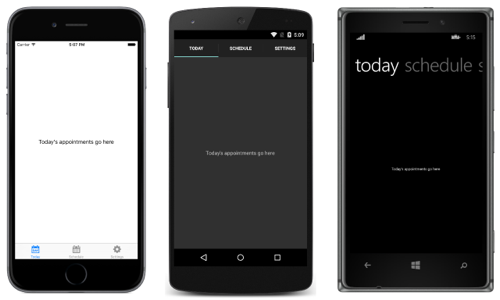
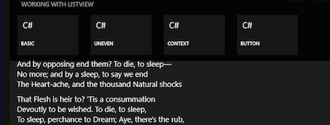
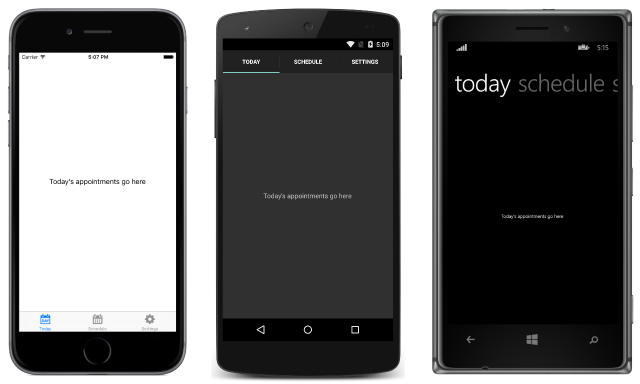
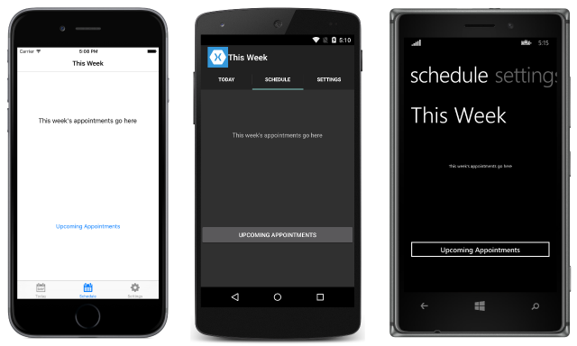
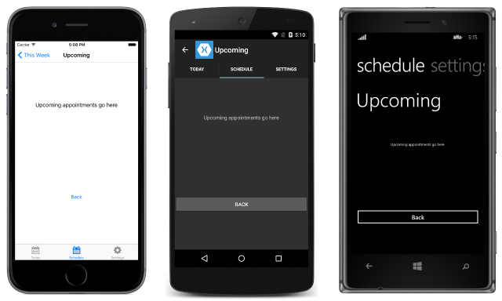
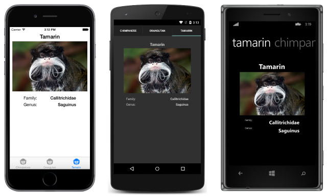

# Xamarin.Forms Tabbed Page

_The Xamarin.Forms TabbedPage consists of a list of tabs and a larger detail area, with each tab loading content into the detail area. This article demonstrates how to use a TabbedPage to navigate through a collection of pages._

## Overview

The following screenshots show a [`TabbedPage`](xref:Xamarin.Forms.TabbedPage) on each platform:



The following screenshots focus on the tab format on each platform:


The layout of a [`TabbedPage`](xref:Xamarin.Forms.TabbedPage), and its tabs, is dependent on the platform:

- On iOS, the list of tabs appears at the bottom of the screen, and the detail area is above. Each tab also has an icon image which should be a 30x30 PNG with transparency for normal resolution, 60x60 for high resolution, and 90x90 for iPhone 6 Plus resolution. If there are more than five tabs, a *More* tab will appear, which can be used to access the additional tabs. For more information about loading images in a Xamarin.Forms application, see [Working with Images](~/xamarin-forms/user-interface/images.md). For more information about icon requirements, see [Creating Tabbed Applications](~/ios/user-interface/controls/creating-tabbed-applications.md).

    > [!NOTE]
  > Note that the `TabbedRenderer` for iOS has an overridable `GetIcon` method that can be used to load tab icons from a specified source. This override makes it possible to use SVG images as icons on a `TabbedPage`. In addition, selected and unselected versions of an icon can be provided.

- On Android, the list of tabs appears at the top of the screen by default, and the detail area is below. However, the tab list can be moved to the bottom of the screen with a platform-specific. For more information, see [Setting TabbedPage Toolbar Placement and Color](~/xamarin-forms/platform/platform-specifics/consuming/android.md#tabbedpage-toolbar).

    > [!NOTE]
  > Note that when using AppCompat on Android, each tab will also display an icon. In addition, the `TabbedPageRenderer` for Android AppCompat has an overridable `SetTabIcon` method that can be used to load tab icons from a custom `Drawable`. This override makes it possible to use SVG images as icons on a `TabbedPage`.

- On Windows tablet form-factors, the tabs aren't always visible and users need to swipe-down (or right-click, if they have a mouse attached) to view the tabs in a `TabbedPage` (as shown below).



## Creating a TabbedPage

Two approaches can be used to create a [`TabbedPage`](xref:Xamarin.Forms.TabbedPage):

- [Populate](#Populating_a_TabbedPage_with_a_Page_Collection) the [`TabbedPage`](xref:Xamarin.Forms.TabbedPage) with a collection of child [`Page`](xref:Xamarin.Forms.Page) objects, such as a collection of [`ContentPage`](xref:Xamarin.Forms.ContentPage) instances.
- [Assign](#Populating_a_TabbedPage_with_a_Template) a collection to the [`ItemsSource`](xref:Xamarin.Forms.MultiPage`1.ItemsSource) property and assign a [`DataTemplate`](xref:Xamarin.Forms.DataTemplate) to the [`ItemTemplate`](xref:Xamarin.Forms.MultiPage`1.ItemTemplate) property to return pages for objects in the collection.

With both approaches, the [`TabbedPage`](xref:Xamarin.Forms.TabbedPage) will display each page as the user selects each tab.

> [!NOTE]
> It's recommended that a [`TabbedPage`](xref:Xamarin.Forms.TabbedPage) should be populated with [`NavigationPage`](xref:Xamarin.Forms.NavigationPage) and [`ContentPage`](xref:Xamarin.Forms.ContentPage)instances only. This will help to ensure a consistent user experience across all platforms.

<a name="Populating_a_TabbedPage_with_a_Page_Collection" />

### Populating a TabbedPage with a Page Collection

The following XAML code example shows a [`TabbedPage`](xref:Xamarin.Forms.TabbedPage) constructed by populating it with a collection of child [`Page`](xref:Xamarin.Forms.Page) objects:

```xaml
<TabbedPage xmlns="http://xamarin.com/schemas/2014/forms"
            xmlns:x="http://schemas.microsoft.com/winfx/2009/xaml"
            xmlns:local="clr-namespace:TabbedPageWithNavigationPage;assembly=TabbedPageWithNavigationPage"
            x:Class="TabbedPageWithNavigationPage.MainPage">
    <TabbedPage.Children>
        <local:TodayPage />
        <NavigationPage Title="Schedule" Icon="schedule.png">
            <x:Arguments>
                <local:SchedulePage />
            </x:Arguments>
        </NavigationPage>
    </TabbedPage.Children>
</TabbedPage>
```

The following code example shows the equivalent [`TabbedPage`](xref:Xamarin.Forms.TabbedPage) created in C#:

```csharp
public class MainPageCS : TabbedPage
{
  public MainPageCS ()
  {
    var navigationPage = new NavigationPage (new SchedulePageCS ());
    navigationPage.Icon = "schedule.png";
    navigationPage.Title = "Schedule";

    Children.Add (new TodayPageCS ());
    Children.Add (navigationPage);
  }
}
```

The [`TabbedPage`](xref:Xamarin.Forms.TabbedPage) is populated with two child [`Page`](xref:Xamarin.Forms.Page) objects. The first child is a
[`ContentPage`](xref:Xamarin.Forms.ContentPage) instance, and the second tab is a [`NavigationPage`](xref:Xamarin.Forms.NavigationPage) containing a `ContentPage` instance.

> [!NOTE]
> The [`TabbedPage`](xref:Xamarin.Forms.TabbedPage) does not support UI virtualization. Therefore, performance may be affected if the `TabbedPage` contains too many child elements.

The following screenshots show the `TodayPage` [`ContentPage`](xref:Xamarin.Forms.ContentPage) instance, which is shown on the *Today* tab:



Selecting the *Schedule* tab displays the `SchedulePage` [`ContentPage`](xref:Xamarin.Forms.ContentPage) instance, which is wrapped in a [`NavigationPage`](xref:Xamarin.Forms.NavigationPage) instance, and is shown in the following screenshot:



For information about the layout of a [`NavigationPage`](xref:Xamarin.Forms.NavigationPage), see [Performing Navigation](~/xamarin-forms/app-fundamentals/navigation/hierarchical.md).

> [!NOTE]
> While it's acceptable to place a [`NavigationPage`](xref:Xamarin.Forms.NavigationPage) into a  [`TabbedPage`](xref:Xamarin.Forms.TabbedPage), it's not recommended to place a `TabbedPage` into a `NavigationPage`. This is because, on iOS, a `UITabBarController` always acts as a wrapper for the `UINavigationController`. For more information, see [Combined View Controller Interfaces](https://developer.apple.com/library/ios/documentation/WindowsViews/Conceptual/ViewControllerCatalog/Chapters/CombiningViewControllers.html) in the iOS Developer Library.

#### Navigation Inside a Tab

Navigation can be performed from the second tab by invoking the [`PushAsync`](xref:Xamarin.Forms.NavigationPage.PushAsync*) method on the [`Navigation`](xref:Xamarin.Forms.VisualElement.Navigation) property of the [`ContentPage`](xref:Xamarin.Forms.ContentPage) instance, as demonstrated in the following code example:

```csharp
async void OnUpcomingAppointmentsButtonClicked (object sender, EventArgs e)
{
  await Navigation.PushAsync (new UpcomingAppointmentsPage ());
}
```

This causes the `UpcomingAppointmentsPage` instance to be pushed onto the navigation stack, where it becomes the active page. This is shown in the following screenshots:



For more information about performing navigation using the [`NavigationPage`](xref:Xamarin.Forms.NavigationPage) class, see [Hierarchical Navigation](~/xamarin-forms/app-fundamentals/navigation/hierarchical.md).

<a name="Populating_a_TabbedPage_with_a_Template" />

### Populating a TabbedPage with a Template

The following XAML code example shows a [`TabbedPage`](xref:Xamarin.Forms.TabbedPage) constructed by assigning a [`DataTemplate`](xref:Xamarin.Forms.DataTemplate) to the [`ItemTemplate`](xref:Xamarin.Forms.MultiPage`1.ItemTemplate) property to return pages for objects in the collection:

```xaml
<TabbedPage xmlns="http://xamarin.com/schemas/2014/forms"
            xmlns:x="http://schemas.microsoft.com/winfx/2006/xaml"
            xmlns:local="clr-namespace:TabbedPageDemo;assembly=TabbedPageDemo"
            x:Class="TabbedPageDemo.TabbedPageDemoPage">
  <TabbedPage.Resources>
    <ResourceDictionary>
      <local:NonNullToBooleanConverter x:Key="booleanConverter" />
    </ResourceDictionary>
  </TabbedPage.Resources>
  <TabbedPage.ItemTemplate>
    <DataTemplate>
      <ContentPage Title="{Binding Name}" Icon="monkeyicon.png">
        <StackLayout Padding="5, 25">
          <Label Text="{Binding Name}" Font="Bold,Large" HorizontalOptions="Center" />
          <Image Source="{Binding PhotoUrl}" WidthRequest="200" HeightRequest="200" />
          <StackLayout Padding="50, 10">
            <StackLayout Orientation="Horizontal">
              <Label Text="Family:" HorizontalOptions="FillAndExpand" />
              <Label Text="{Binding Family}" Font="Bold,Medium" />
            </StackLayout>
            ...
          </StackLayout>
        </StackLayout>
      </ContentPage>
    </DataTemplate>
  </TabbedPage.ItemTemplate>
</TabbedPage>
```

The [`TabbedPage`](xref:Xamarin.Forms.TabbedPage) is populated with data by setting the [`ItemsSource`](xref:Xamarin.Forms.MultiPage`1.ItemsSource) property in the constructor for the code-behind file:

```csharp
public TabbedPageDemoPage ()
{
  ...
  ItemsSource = MonkeyDataModel.All;
}
```

The following code example shows the equivalent [`TabbedPage`](xref:Xamarin.Forms.TabbedPage) created in C#:

```csharp
public class TabbedPageDemoPageCS : TabbedPage
{
  public TabbedPageDemoPageCS ()
  {
    var booleanConverter = new NonNullToBooleanConverter ();

    ItemTemplate = new DataTemplate (() => {
      var nameLabel = new Label {
        FontSize = Device.GetNamedSize (NamedSize.Large, typeof(Label)),
        FontAttributes = FontAttributes.Bold,
        HorizontalOptions = LayoutOptions.Center
      };
      nameLabel.SetBinding (Label.TextProperty, "Name");

      var image = new Image { WidthRequest = 200, HeightRequest = 200 };
      image.SetBinding (Image.SourceProperty, "PhotoUrl");

      var familyLabel = new Label {
        FontSize = Device.GetNamedSize (NamedSize.Medium, typeof(Label)),
        FontAttributes = FontAttributes.Bold
      };
      familyLabel.SetBinding (Label.TextProperty, "Family");
      ...

      var contentPage = new ContentPage {
        Icon = "monkeyicon.png",
        Content = new StackLayout {
          Padding = new Thickness (5, 25),
          Children = {
            nameLabel,
            image,
            new StackLayout {
              Padding = new Thickness (50, 10),
              Children = {
                new StackLayout {
                  Orientation = StackOrientation.Horizontal,
                  Children = {
                    new Label { Text = "Family:", HorizontalOptions = LayoutOptions.FillAndExpand },
                    familyLabel
                  }
                },
                ...
              }
            }
          }
        }
      };
      contentPage.SetBinding (TitleProperty, "Name");
      return contentPage;
    });
    ItemsSource = MonkeyDataModel.All;
  }
}
```

Each tab displays a [`ContentPage`](xref:Xamarin.Forms.ContentPage) that uses a series of [`StackLayout`](xref:Xamarin.Forms.StackLayout) and [`Label`](xref:Xamarin.Forms.Label) instances to display data for the tab. The following screenshots show the content for the *Tamarin* tab:



Selecting another tab then displays content for that tab.

> [!NOTE]
> The [`TabbedPage`](xref:Xamarin.Forms.TabbedPage) does not support UI virtualization. Therefore, performance may be affected if the `TabbedPage` contains too many child elements.

For more information about the [`TabbedPage`](xref:Xamarin.Forms.TabbedPage), see [Chapter 25](https://developer.xamarin.com/r/xamarin-forms/book/chapter25.pdf) of Charles Petzold's Xamarin.Forms book.

## Summary

This article demonstrated how to use a TabbedPage to navigate through a collection of pages. The Xamarin.Forms [`TabbedPage`](xref:Xamarin.Forms.TabbedPage) consists of a list of tabs and a larger detail area, with each tab loading content into the detail area.


## Related Links

- [Page Varieties](https://developer.xamarin.com/r/xamarin-forms/book/chapter25.pdf)
- [TabbedPageWithNavigationPage (sample)](https://developer.xamarin.com/samples/xamarin-forms/Navigation/TabbedPageWithNavigationPage)
- [TabbedPage (sample)](https://developer.xamarin.com/samples/xamarin-forms/Navigation/TabbedPage/)
- [TabbedPage](xref:Xamarin.Forms.TabbedPage)
