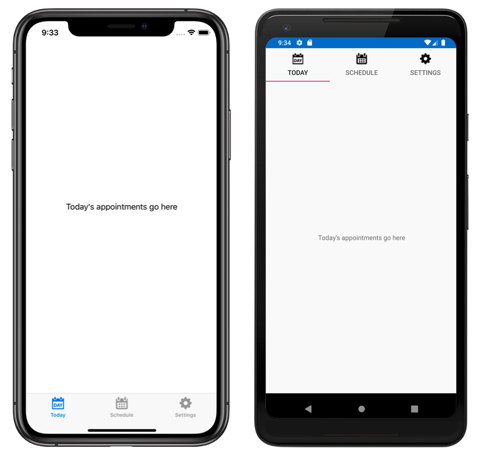
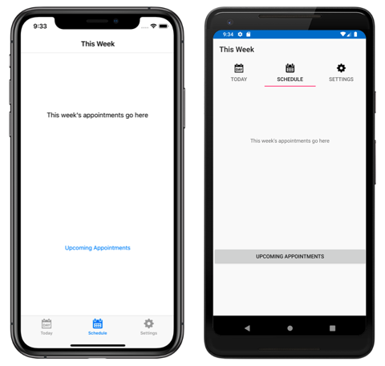
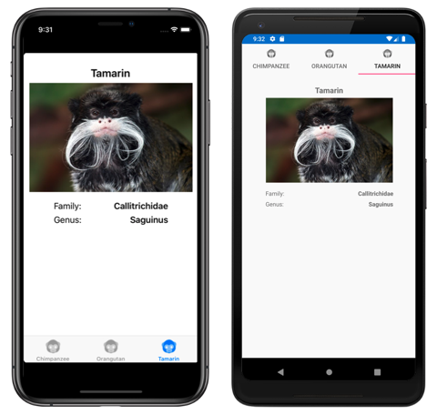

# Xamarin.Forms TabbedPage

[ Download the sample](/samples/xamarin/xamarin-forms-samples/navigation-tabbedpagewithnavigationpage)

The Xamarin.Forms [`TabbedPage`](xref:Xamarin.Forms.TabbedPage) consists of a list of tabs and a larger detail area, with each tab loading content into the detail area. The following screenshots show a `TabbedPage` on iOS and Android:

[](tabbed-page-images/tabbedpage-today-large.png#lightbox "TabbedPage with three tabs")

On iOS, the list of tabs appears at the bottom of the screen, and the detail area is above. Each tab consists of a title and an icon, which should be a PNG file with an alpha channel. In portrait orientation, tab bar icons appear above tab titles. In landscape orientation, icons and titles appear side by side. In addition, a regular or compact tab bar may be displayed, depending on the device and orientation. If there are more than five tabs, a **More** tab will appear, which can be used to access the additional tabs.

On Android, the list of tabs appears at the top of the screen, and the detail area is below. Each tab consists of a title and an icon, which should be a PNG file with an alpha channel. However, the tabs can be moved to the bottom of the screen with a platform-specific. If there are more than five tabs, and the tab list is at the bottom of the screen, a *More* tab will appear that can be used to access the additional tabs. For information about icon requirements, see [Tabs](https://material.io/components/tabs/#) on material.io and [Support different pixel densities](https://developer.android.com/training/multiscreen/screendensities) on developer.android.com. For information about moving the tabs to the bottom of the screen, see [Setting TabbedPage Toolbar Placement and Color](~/xamarin-forms/platform/android/tabbedpage-toolbar-placement-color.md).

On the Universal Windows Platform (UWP), the list of tabs appears at the top of the screen, and the details area is below. Each tab consists of a title. However, icons can be added to each tab with a platform-specific. For more information, see [TabbedPage Icons on Windows](~/xamarin-forms/platform/windows/tabbedpage-icons.md).

> [!TIP]
> Scalable Vector Graphic (SVG) files can be displayed as tab icons on a [`TabbedPage`](xref:Xamarin.Forms.TabbedPage):
>
> - The iOS `TabbedRenderer` class has an overridable `GetIcon` method that can be used to load tab icons from a specified source. In addition, selected and unselected versions of an icon can be provided if required.
> - The Android AppCompat `TabbedPageRenderer` class has an overridable `SetTabIconImageSource` method that can be used to load tab icons from a custom `Drawable`. Alternatively, SVG files can be converted to vector drawable resources, which can automatically be displayed by Xamarin.Forms. For more information about converting SVG files to vector drawable resources, see [Add multi-density vector graphics](https://developer.android.com/studio/write/vector-asset-studio) on developer.android.com.
>
> For more information, see [Xamarin.Forms TabbedPage with SVG tab icons](/samples/xamarin/xamarin-forms-samples/navigation-tabbedpagewithsvgtabicons).

## Create a TabbedPage

Two approaches can be used to create a [`TabbedPage`](xref:Xamarin.Forms.TabbedPage):

- Populate the [`TabbedPage`](xref:Xamarin.Forms.TabbedPage) with a collection of child [`Page`](xref:Xamarin.Forms.Page) objects, such as a collection of [`ContentPage`](xref:Xamarin.Forms.ContentPage) objects. For more information, see [Populate a TabbedPage with a Page Collection](#populate-a-tabbedpage-with-a-page-collection).
- Assign a collection to the [`ItemsSource`](xref:Xamarin.Forms.MultiPage`1.ItemsSource) property and assign a [`DataTemplate`](xref:Xamarin.Forms.DataTemplate) to the [`ItemTemplate`](xref:Xamarin.Forms.MultiPage`1.ItemTemplate) property to return pages for objects in the collection. For more information, see [Populate a TabbedPage with a template](#populate-a-tabbedpage-with-a-template).

With both approaches, the [`TabbedPage`](xref:Xamarin.Forms.TabbedPage) will display each page as the user selects each tab.

> [!IMPORTANT]
> It's recommended that a [`TabbedPage`](xref:Xamarin.Forms.TabbedPage) should be populated with [`NavigationPage`](xref:Xamarin.Forms.NavigationPage) and [`ContentPage`](xref:Xamarin.Forms.ContentPage) instances only. This will help to ensure a consistent user experience across all platforms.

In addition, [`TabbedPage`](xref:Xamarin.Forms.TabbedPage) defines the following properties:

- [`BarBackgroundColor`](xref:Xamarin.Forms.TabbedPage.BarBackgroundColor), of type [`Color`](xref:Xamarin.Forms.Color), the background color of the tab bar.
- [`BarTextColor`](xref:Xamarin.Forms.TabbedPage.BarTextColor), of type [`Color`](xref:Xamarin.Forms.Color), the color of text on the tab bar.
- [`SelectedTabColor`](xref:Xamarin.Forms.TabbedPage.SelectedTabColor), of type [`Color`](xref:Xamarin.Forms.Color), the color of the tab when it's selected.
- [`UnselectedTabColor`](xref:Xamarin.Forms.TabbedPage.UnselectedTabColor), of type [`Color`](xref:Xamarin.Forms.Color), the color of the tab when it's unselected.

All of these properties are backed by [`BindableProperty`](xref:Xamarin.Forms.BindableProperty) objects, which means that they can be styled, and the properties can be the targets of data bindings.

> [!WARNING]
> In a [`TabbedPage`](xref:Xamarin.Forms.TabbedPage), each [`Page`](xref:Xamarin.Forms.Page) object is created when the `TabbedPage` is constructed. This can lead to a poor user experience, particularly if the `TabbedPage` is the root page of the application. However, Xamarin.Forms Shell enables pages accessed through a tab bar to be created on demand, in response to navigation. For more information, see [Xamarin.Forms Shell](~/xamarin-forms/app-fundamentals/shell/index.md).

## Populate a TabbedPage with a Page collection

A [`TabbedPage`](xref:Xamarin.Forms.TabbedPage) can be populated with a collection of child [`Page`](xref:Xamarin.Forms.Page) objects, such as a collection of [`ContentPage`](xref:Xamarin.Forms.ContentPage) objects. This is achieved by adding the `Page` objects to the [`TabbedPage.Children`](xref:Xamarin.Forms.MultiPage`1.Children*) collection. This is accomplished in XAML as follows:

```xaml
<TabbedPage xmlns="http://xamarin.com/schemas/2014/forms"
            xmlns:x="http://schemas.microsoft.com/winfx/2009/xaml"
            xmlns:local="clr-namespace:TabbedPageWithNavigationPage;assembly=TabbedPageWithNavigationPage"
            x:Class="TabbedPageWithNavigationPage.MainPage">
    <local:TodayPage />
    <NavigationPage Title="Schedule" IconImageSource="schedule.png">
        <x:Arguments>
            <local:SchedulePage />
        </x:Arguments>
    </NavigationPage>
</TabbedPage>
```

> [!NOTE]
> The [`Children`](xref:Xamarin.Forms.MultiPage`1.Children*) property of the [`MultiPage<T>`](xref:Xamarin.Forms.MultiPage`1) class, from which [`TabbedPage`](xref:Xamarin.Forms.TabbedPage) derives, is the `ContentProperty` of `MultiPage<T>`. Therefore, in XAML it's not necessary to explicitly assign the [`Page`](xref:Xamarin.Forms.Page) objects to the `Children` property.

The equivalent C# code is:

```csharp
public class MainPageCS : TabbedPage
{
  public MainPageCS ()
  {
    NavigationPage navigationPage = new NavigationPage (new SchedulePageCS ());
    navigationPage.IconImageSource = "schedule.png";
    navigationPage.Title = "Schedule";

    Children.Add (new TodayPageCS ());
    Children.Add (navigationPage);
  }
}
```

In this example, the [`TabbedPage`](xref:Xamarin.Forms.TabbedPage) is populated with two [`Page`](xref:Xamarin.Forms.ContentPage) objects. The first child is a
[`ContentPage`](xref:Xamarin.Forms.ContentPage) object, and the second child is a [`NavigationPage`](xref:Xamarin.Forms.NavigationPage) containing a `ContentPage` object.

The following screenshots show a [`ContentPage`](xref:Xamarin.Forms.ContentPage) object in a [`TabbedPage`](xref:Xamarin.Forms.TabbedPage):

[](tabbed-page-images/tabbedpage-today-large.png#lightbox "TabbedPage with three tabs")

Selecting another tab displays the [`ContentPage`](xref:Xamarin.Forms.ContentPage) object that represents the tab:

[](tabbed-page-images/tabbedpage-week-large.png#lightbox "TabbedPage with tabs")

On the **Schedule** tab, the [`ContentPage`](xref:Xamarin.Forms.ContentPage) object is wrapped in a [`NavigationPage`](xref:Xamarin.Forms.NavigationPage) object.

> [!WARNING]
> While a [`NavigationPage`](xref:Xamarin.Forms.NavigationPage) can be placed in a  [`TabbedPage`](xref:Xamarin.Forms.TabbedPage), it's not recommended to place a `TabbedPage` into a `NavigationPage`. This is because, on iOS, a `UITabBarController` always acts as a wrapper for the `UINavigationController`. For more information, see [Combined View Controller Interfaces](https://developer.apple.com/library/ios/documentation/WindowsViews/Conceptual/ViewControllerCatalog/Chapters/CombiningViewControllers.html) in the iOS Developer Library.

## Navigate within a tab

Navigation can be performed within a tab, provided that the [`ContentPage`](xref:Xamarin.Forms.ContentPage) object is wrapped in a [`NavigationPage`](xref:Xamarin.Forms.NavigationPage) object. This is accomplished by invoking the [`PushAsync`](xref:Xamarin.Forms.NavigationPage.PushAsync*) method on the [`Navigation`](xref:Xamarin.Forms.NavigableElement.Navigation) property of the [`ContentPage`](xref:Xamarin.Forms.ContentPage) object:

```csharp
await Navigation.PushAsync (new UpcomingAppointmentsPage ());
```

The page being navigated to is specified as the argument to the [`PushAsync`](xref:Xamarin.Forms.NavigationPage.PushAsync*) method. In this example, the `UpcomingAppointmentsPage` page is pushed onto the navigation stack, where it becomes the active page:

[](tabbed-page-images/tabbedpage-upcoming-large.png#lightbox "TabbedPage navigation in a tab")

For more information about performing navigation using the [`NavigationPage`](xref:Xamarin.Forms.NavigationPage) class, see [Hierarchical Navigation](~/xamarin-forms/app-fundamentals/navigation/hierarchical.md).

## Populate a TabbedPage with a template

A [`TabbedPage`](xref:Xamarin.Forms.TabbedPage) can be populated with pages by assigning a collection of data to the [`ItemsSource`](xref:Xamarin.Forms.MultiPage`1.ItemsSource) property, and by assigning a [`DataTemplate`](xref:Xamarin.Forms.DataTemplate) to the [`ItemTemplate`](xref:Xamarin.Forms.MultiPage`1.ItemTemplate) property that templates the data as [`Page`](xref:Xamarin.Forms.Page) objects. This is accomplished in XAML as follows:

```xaml
<TabbedPage xmlns="http://xamarin.com/schemas/2014/forms"
            xmlns:x="http://schemas.microsoft.com/winfx/2006/xaml"
            xmlns:local="clr-namespace:TabbedPageDemo;assembly=TabbedPageDemo"
            x:Class="TabbedPageDemo.TabbedPageDemoPage"
            ItemsSource="{x:Static local:MonkeyDataModel.All}">            
  <TabbedPage.Resources>
    <ResourceDictionary>
      <local:NonNullToBooleanConverter x:Key="booleanConverter" />
    </ResourceDictionary>
  </TabbedPage.Resources>
  <TabbedPage.ItemTemplate>
    <DataTemplate>
      <ContentPage Title="{Binding Name}" IconImageSource="monkeyicon.png">
        <StackLayout Padding="5, 25">
          <Label Text="{Binding Name}" Font="Bold,Large" HorizontalOptions="Center" />
          <Image Source="{Binding PhotoUrl}" WidthRequest="200" HeightRequest="200" />
          <StackLayout Padding="50, 10">
            <StackLayout Orientation="Horizontal">
              <Label Text="Family:" HorizontalOptions="FillAndExpand" />
              <Label Text="{Binding Family}" Font="Bold,Medium" />
            </StackLayout>
            ...
          </StackLayout>
        </StackLayout>
      </ContentPage>
    </DataTemplate>
  </TabbedPage.ItemTemplate>
</TabbedPage>
```

The equivalent C# code is:

```csharp
public class TabbedPageDemoPageCS : TabbedPage
{
  public TabbedPageDemoPageCS ()
  {
    var booleanConverter = new NonNullToBooleanConverter ();

    ItemTemplate = new DataTemplate (() =>
    {
      var nameLabel = new Label
      {
        FontSize = Device.GetNamedSize (NamedSize.Large, typeof(Label)),
        FontAttributes = FontAttributes.Bold,
        HorizontalOptions = LayoutOptions.Center
      };
      nameLabel.SetBinding (Label.TextProperty, "Name");

      var image = new Image { WidthRequest = 200, HeightRequest = 200 };
      image.SetBinding (Image.SourceProperty, "PhotoUrl");

      var familyLabel = new Label
      {
        FontSize = Device.GetNamedSize (NamedSize.Medium, typeof(Label)),
        FontAttributes = FontAttributes.Bold
      };
      familyLabel.SetBinding (Label.TextProperty, "Family");
      ...

      var contentPage = new ContentPage
      {
        IconImageSource = "monkeyicon.png",
        Content = new StackLayout {
          Padding = new Thickness (5, 25),
          Children =
          {
            nameLabel,
            image,
            new StackLayout
            {
              Padding = new Thickness (50, 10),
              Children =
              {
                new StackLayout
                {
                  Orientation = StackOrientation.Horizontal,
                  Children =
                  {
                    new Label { Text = "Family:", HorizontalOptions = LayoutOptions.FillAndExpand },
                    familyLabel
                  }
                },
                // ...
              }
            }
          }
        }
      };
      contentPage.SetBinding (TitleProperty, "Name");
      return contentPage;
    });
    ItemsSource = MonkeyDataModel.All;
  }
}
```

In this example, each tab consists of a [`ContentPage`](xref:Xamarin.Forms.ContentPage) object that uses [`Image`](xref:Xamarin.Forms.Image) and [`Label`](xref:Xamarin.Forms.Label) objects to display data for the tab:

[](tabbed-page-images/tabbedpage-template-large.png#lightbox "Templated TabbedPage")

Selecting another tab displays the [`ContentPage`](xref:Xamarin.Forms.ContentPage) object that represents the tab.

## Related links

- [TabbedPageWithNavigationPage (sample)](/samples/xamarin/xamarin-forms-samples/navigation-tabbedpagewithnavigationpage)
- [TabbedPage (sample)](/samples/xamarin/xamarin-forms-samples/navigation-tabbedpage)
- [TabbedPage with SVG tab icons](/samples/xamarin/xamarin-forms-samples/navigation-tabbedpagewithsvgtabicons)
- [Hierarchical Navigation](~/xamarin-forms/app-fundamentals/navigation/hierarchical.md)
- [Page Varieties (chapter 25)](https://developer.xamarin.com/r/xamarin-forms/book/)
- [TabbedPage API](xref:Xamarin.Forms.TabbedPage)
