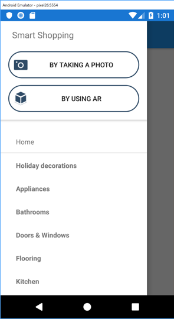
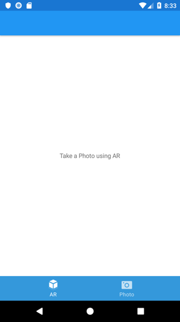
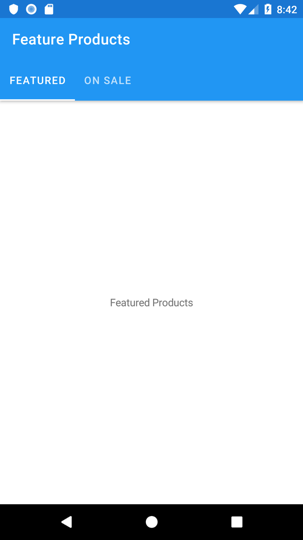
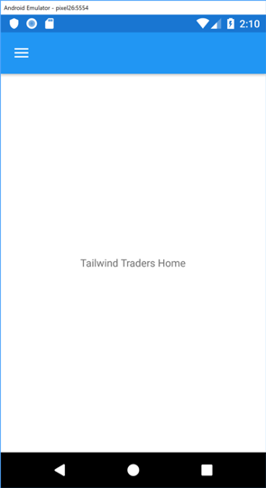
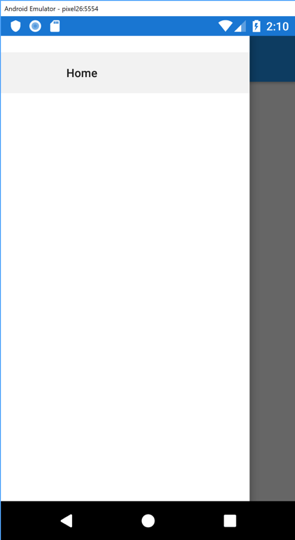
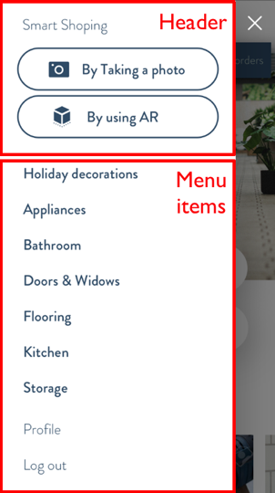
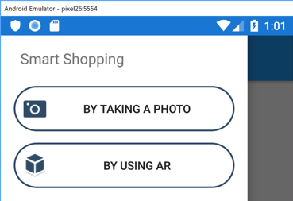
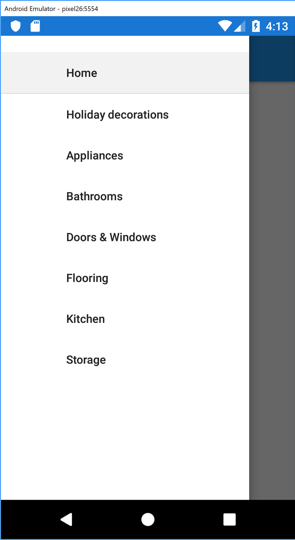
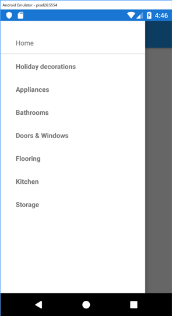

# Xamarin.Forms Shell


[ Download the sample](https://github.com/Microsoft/TailwindTraders-Mobile)

Xamarin.Forms Shell is a container for applications, that provides fundamental UI features that most applications require, leaving you to focus on the application's core workload. Shell applications are provided with the following functionality:

- A single place to describe the visual structure of an application.
- A common navigation user interface.
- A navigation service with deep linking.
- An integrated search handler.

This functionality reduces the complexity of applications, while increasing developer productivity. In addition, Shell is written with rendering speed and memory consumption in mind.

> [!IMPORTANT]
> Existing iOS and Android applications can adopt Shell and benefit immediately from navigation, performance, and extensibility improvements.

Shell provides an opinionated navigation user interface, based on flyouts and tabs. The top level of navigation in a Shell application is a flyout:



The next level of navigation is the bottom tab bar:



When the flyout isn't open the bottom tab bar will be considered the top level of navigation

Within each bottom tab, the next navigation level is the top tab bar, where each tab is a `ContentPage`:



Within each `ContentPage`, additional `ContentPage` instances can be added to and removed from the navigation stack.

## Bootstrapping a Shell application

A Shell application is bootstrapped by setting the `MainPage` property of the `App` class to an instance of a Shell file:

```csharp
namespace TailwindTraders.Mobile
{
    public partial class App : Application
    {
        public App()
        {
            InitializeComponent();

            MainPage = new TheShell();
        }
    }
}
```

The `TheShell` class is a XAML file that describes the visual structure of your application.

> [!IMPORTANT]
> Shell is currently experimental, and can only be used by adding `Forms.SetFlags("Shell_Experimental");` to your platform project, prior to invoking the `Forms.Init` method.

# [Android](#tab/android)

```csharp
public class MainActivity : global::Xamarin.Forms.Platform.Android.FormsAppCompatActivity
{
    protected override void OnCreate(Bundle savedInstanceState)
    {
        global::Xamarin.Forms.Forms.SetFlags("Shell_Experimental");

        TabLayoutResource = Resource.Layout.Tabbar;
        ToolbarResource = Resource.Layout.Toolbar;

        base.OnCreate(savedInstanceState);

        global::Xamarin.Forms.Forms.Init(this, savedInstanceState);
        LoadApplication(new App());
    }
}
```

# [iOS](#tab/ios)

```csharp
public partial class AppDelegate : global::Xamarin.Forms.Platform.iOS.FormsApplicationDelegate
{
    public override bool FinishedLaunching(UIApplication app, NSDictionary options)
    {
        global::Xamarin.Forms.Forms.SetFlags("Shell_Experimental");

        global::Xamarin.Forms.Forms.Init();
        LoadApplication(new App());

        return base.FinishedLaunching(app, options);
    }
}
```

----

## Shell file hierarchy

A Shell file consists of three hierarchical elements:

- `ShellItem`. One or more items in the flyout. Every `ShellItem` is a child of a `Shell`.
- `ShellSection`. Grouped content, navigable by bottom tabs. Every `ShellSection` is a child of a `ShellItem`.
- `ShellContent`. The `ContentPage` instances in your application, which are navigable by top tabs. Every `ShellContent` is a child of a `ShellSection`.

None of these elements represent any user interface, but rather the organization of the application's visual structure. Shell will take these elements and produce the navigation user interface for the content.

The following XAML shows a simple example of a Shell file:

```xaml
<Shell xmlns="http://xamarin.com/schemas/2014/forms"
       xmlns:x="http://schemas.microsoft.com/winfx/2009/xaml"
       xmlns:local="clr-namespace:TailwindTraders.Mobile.Features.Shell"
       x:Class="TailwindTraders.Mobile.Features.Shell.TheShell"
       Title="TailwindTraders">
    <ShellItem Title="Home">
        <ShellSection>
            <ShellContent>
                <local:HomePage />
            </ShellContent>
        </ShellSection>
    </ShellItem>
</Shell>
```

> [!NOTE]
> Each `ShellItem` can also set an `FlyoutIcon` property to an `ImageSource`, which will be displayed to the left of the title.

This XAML displays the `HomePage`, because it's the first item of content declared in the Shell file:



Pressing the hamburger button displays the flyout:



The number of items in the flyout can be increased by adding more `ShellItem` instances to the Shell file. However, note that `HomePage` is created during application startup, and adding additional `ShellItem` instances using this approach will result in these pages also being created during application startup. This can be avoided by setting the `ShellContent.ContentTemplate` property to a `DataTemplate`:

```xaml
<Shell xmlns="http://xamarin.com/schemas/2014/forms"
       xmlns:x="http://schemas.microsoft.com/winfx/2009/xaml"
       xmlns:local="clr-namespace:TailwindTraders.Mobile.Features.Shell"
       x:Class="TailwindTraders.Mobile.Features.Shell.TheShell"
       Title="TailwindTraders">
    <ShellItem Title="Home">
        <ShellSection>
            <ShellContent>
                <local:HomePage />
            </ShellContent>
        </ShellSection>
    <ShellItem>
    <ShellContent Title="Profile"
                  ContentTemplate="{DataTemplate local:ProfilePage}" />
</Shell>
```

With this approach, `ProfilePage` is only created when the user navigates to it, rather than at application startup. In addition, note that for `ProfilePage`, the `ShellItem` and `ShellSection` objects are omitted, with the `Title` property being defined on the `ShellContent` instance. This concise approach requires less markup, with Shell supplying the required logical wrappers (without introducing additional views to the visual tree).

In addition, each `ShellItem` appearance can be customized by setting the `Shell.ItemTemplate` property to a `DataTemplate`:

```xaml
<Shell.ItemTemplate>
    <DataTemplate>
        <ContentView HeightRequest="32">
            <ContentView.Padding>
                <Thickness Left="32"
                           Top="16" />
            </ContentView.Padding>
            <Label Text="{Binding Title}" />
        </ContentView>
    </DataTemplate>
</Shell.ItemTemplate>          
```

This code simply repositions the text for each `ShellItem` within the flyout. Note that Shell provides the `Title` (and `Icon`) properties to the `BindingContext` of the `DataTemplate`.

## Flyout

The flyout is the root menu for the application, and consists of a flyout header, and menu items:



### Flyout behavior

The flyout is accessible through the hamburger button or by swiping from the side of the screen. However, this behavior can be changed by setting the `Shell.FlyoutBehavior` property to one of the `FlyoutBehavior` enumeration members:

```xaml
<Shell ...
       FlyoutBehavior="Disabled">
    ...
</Shell>
```

Setting the `FlyoutBehavior` property to `Disabled` hides the flyout, which is useful when you only have one `ShellItem`. The other valid `FlyoutBehavior` values are `Flyout` (default), and `Locked`.

### Flyout header

The flyout header is the content that optionally appears at the top of the flyout, with its appearance being defined by a `View` that can be set through the `Shell.FlyoutHeader` property value:

```xaml
<Shell.FlyoutHeader>
    <local:FlyoutHeader />
</Shell.FlyoutHeader>
```

Alternatively, the flyout header appearance can be defined by setting the `Shell.FlyoutHeaderTemplate` property to a `DataTemplate`:

```xaml
<Shell.FlyoutHeaderTemplate>
    <DataTemplate>
        <StackLayout HorizontalOptions="Fill"
                     VerticalOptions="Fill"
                     BackgroundColor="White"
                     Padding="16">
            <Label FontSize="Medium"
                   Text="Smart Shopping">
                <Label.Margin>
                    <Thickness Left="8" />
                </Label.Margin>
            </Label>
            <Button Image="photo"
                    Text="By taking a photo">
                <Button.Margin>
                    <Thickness Top="16" />
                </Button.Margin>
            </Button>
            <Button Image="ia"
                    Text="By using AR">
                <Button.Margin>
                    <Thickness Top="8" />
                </Button.Margin>
            </Button>
        </StackLayout>
    </DataTemplate>
</Shell.FlyoutHeaderTemplate>
```

This XAML results in the following flyout header:



By default, the flyout header will be fixed in the flyout while the content below will scroll if there are enough items. However, this behavior can be changed by setting the `Shell.FlyoutHeaderBehavior` property to one of the `FlyoutHeaderBehavior` enumeration members:

```xaml
<Shell ...
       FlyoutHeaderBehavior="CollapseOnScroll">
    ...
</Shell>
```

Setting the `FlyoutHeaderBehavior` to `CollapseOnScroll` collapses the flyout as scrolling occurs. The other valid `FlyoutHeaderBehavior` values are `Default`, `Fixed`, and `Scroll` (scroll with the menu items).

## Menu items

The number of items in the flyout can be increased by adding more `ShellItem` instances. However, it's also possible to add `MenuItem` instances to the flyout. This permits scenarios such as navigating to an identical page while passing data through the `MenuItem.CommandParameter` property.

`MenuItem` instances should be added to the `Shell.MenuItems` collection:

```xaml
<Shell xmlns="http://xamarin.com/schemas/2014/forms"
       xmlns:x="http://schemas.microsoft.com/winfx/2009/xaml"
       xmlns:local="clr-namespace:TailwindTraders.Views"
       x:Class="TailwindTraders.Shell"
       FlyoutHeaderBehavior="Fixed"
       Title="Tailwind Traders"
       ...>
    <Shell.MenuItems>
        <MenuItem Command="{Binding ProductTypeCommand}"
                  CommandParameter="1"
                  Text="Holiday decorations" />
        <MenuItem Command="{Binding ProductTypeCommand}"
                  CommandParameter="2"
                  Text="Appliances" />
        <MenuItem Command="{Binding ProductTypeCommand}"
                  CommandParameter="3"
                  Text="Bathrooms" />
        ...
    </Shell.MenuItems>
    <ShellItem Title="Home">
        <ShellSection>
            <ShellContent>
                <local:HomePage />
            </ShellContent>
        </ShellSection>
    </ShellItem>    
</Shell>
```

> [!NOTE]
> Each `MenuItem` can also set an `Icon` property to a `FileImageSource`, which will be displayed to the left of the text.

This XAML results in the following flyout:



In addition, `MenuItem` appearance can be customized by setting the `Shell.MenuItemTemplate` property to a `DataTemplate`:

```xaml
<Shell.MenuItemTemplate>
    <DataTemplate>
        <ContentView HeightRequest="32">
            <ContentView.Padding>
                <Thickness Left="32"
                           Top="16" />
            </ContentView.Padding>
            <Label Text="{Binding Text}"
                   FontAttributes="Bold" />
        </ContentView>
    </DataTemplate>
</Shell.MenuItemTemplate>
```

This results in `MenuItem` instances having their text rendered in bold:



## Tabs

`ShellSection` instances will be rendered as bottom tabs, provided that there are multiple `ShellSection` instances in a single `ShellItem`:

```xaml
<ShellItem Title="Bottom Tab Sample"
           Style="{StaticResource BaseStyle}">
    <ShellSection Title="AR" Icon="ia.png">
        <ShellContent ContentTemplate="{DataTemplate local:ARPage}"/>
    </ShellSection>
    <ShellSection Title="Photo" Icon="photo.png">
        <ShellContent ContentTemplate="{DataTemplate local:PhotoPage}"/>
    </ShellSection>
</ShellItem>
```

In this example, the `ShellSection` instances will be rendered as bottom tabs:


`ShellContent` items will be rendered as top tabs, provided that there are multiple `ShellContent` instances within a single `ShellSection`:

```xaml
<ShellItem Title="Store Home"
           Shell.TitleView="Store Home"
           Style="{StaticResource BaseStyle}">
    <ShellSection Title="Browse Product">
        <ShellContent Title="Featured"
                      ContentTemplate="{DataTemplate local:FeaturedPage}" />
        <ShellContent Title="On Sale"
                      ContentTemplate="{DataTemplate local:SalePage}" />
    </ShellSection>
</ShellItem>
```

In this example, the `ShellContent` instances will be rendered as top tabs:


Tabs can be styled using XAML styles, or by supplying a custom renderer. For example, the following example shows a XAML style that sets tab color:

```xaml
<Style x:Key="BaseStyle"
       TargetType="Element">
    <Setter Property="Shell.ShellTabBarBackgroundColor"
            Value="#3498DB" />
    <Setter Property="Shell.ShellTabBarTitleColor"
            Value="White" />
    <Setter Property="Shell.ShellTabBarUnselectedColor"
            Value="#B4FFFFFF" />
</Style>
```

## Navigation

Shell includes a URI-based navigation experience. URIs provide an improved navigation experience that permits navigation to any page in the application, without having to follow a set navigation hierarchy. In addition, it also provides the ability to navigate backwards without having to visit all of the pages on the navigation stack.

This URI-based navigation is accomplished with routes, which are URI segments used to navigate within the application. The Shell file must declare a route scheme, a route host, and a route:

```xaml
<Shell ...
       Route="tailwindtraders"
       RouteHost="www.microsoft.com"
       RouteScheme="app">
    ...
</Shell>
```

Combined, the `RouteScheme`, `RouteHost`, and `Route` property values form the `app://www.microsoft.com/tailwindtraders` root URI.

Each element in the Shell file can also define a route property that can be used in programmatic navigation.

In the Shell file constructor, or any other location that runs before a route is invoked, additional routes can be explicitly registered for any pages that aren't represented by a Shell element (such as `MenuItem` instances):

```csharp
Routing.RegisterRoute("productcategory", typeof(ProductCategoryPage));
```

### Implementing navigation

Menu items expose a `Command` property that can be used to implement navigation:

```csharp
public ICommand ProductTypeCommand { get; } = new Command<string>(NavigateToProductType);

static void NavigateToProductType(string typeId)
{
  (App.Current.MainPage as Xamarin.Forms.Shell).GoToAsync($"app:///tailwindtraders/productcategory?id={typeId}", true);
}
```

To invoke navigation, a reference to the application `Shell`, through the `MainPage` property of the `Application` class, must be obtained. Then, navigation can be invoked by calling the `GoToAsync` method, passing a valid URI as an argument. The `GoToAsync` method navigates using a `ShellNavigationState` object, which will be constructed from a `string` or a `Uri`.

### Passing data

Data can be passed between pages through query string parameters. Shell will set the query string parameter values on the `ContentPage` or ViewModel when you add query property attributes to the class:

```csharp
[QueryProperty("TypeID", "id")]
public partial class ProductCategoryPage : ContentPage
{
    private string _typeId;

    public ProductCategoryPage()
    {
        InitializeComponent();

        BindingContext = new ProductCategoryViewModel();
    }

    public string TypeID
    {
        get => _typeId;
        set => MyLabel.Text = value;
    }
}
```

The `QueryProperty` attribute specifies that the `TypeID` will receive the data passed in the `id` query string parameter from the URI in the `GoToAsync` method call.

### Intercepting navigation

Shell provides the ability to hook into the navigation routing before it has completed, and after it has completed. This can be accomplished by registering events handlers for the `Navigating` and `Navigated` events, respectively:

```xaml
<Shell ...
       Navigating="OnShellNavigating">
    ...
</Shell>
```

```csharp
void OnShellNavigating(object sender, ShellNavigatingEventArgs e)
{
  if (...)
  {
    e.Cancel(); // Cancel the navigation
  }
}
```

The `ShellNavigatingEventArgs` class provides the following properties:

| Property | Type | Description |
|---|---|---|
| Current | `ShellNavigationState` | The URI of the current page. |
| Source | `ShellNavigationState` | The URI representing where the navigation originated. |
| Target | `ShellNavigationSource`  | The URI representing where the navigation is destined. |
| CanCancel  | `bool` | A value indicating if it's possible to cancel the navigation. |
| Cancelled  | `bool` | A value indicating if the navigation was cancelled. |

In addition, the `ShellNavigatingEventArgs` class provides a `Cancel` method.

The `ShellNavigatedEventArgs` class provides the following properties:

| Property | Type | Description |
|---|---|---|
| Current | `ShellNavigationState` | The URI of the current page. |
| Previous| `ShellNavigationState` | The URI of the previous page. |
| Source  | `ShellNavigationSource` | The URI representing where the navigation originated. |

In addition, Shell provides an overridable `OnBackButtonPressed` method that can be used to intercept a back button press.

## Related links

- [Tailwind Traders (sample)](https://github.com/Microsoft/TailwindTraders-Mobile)
