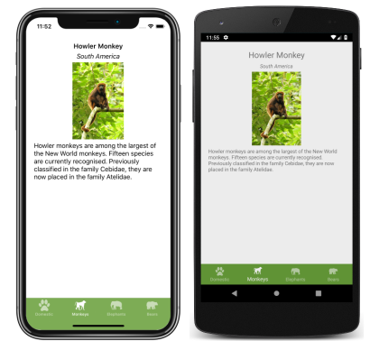
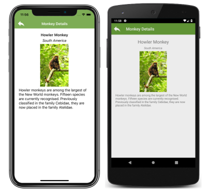

# Xamarin.Forms Shell Page Configuration

[ Download the sample](https://github.com/xamarin/xamarin-forms-samples/tree/master/UserInterface/Xaminals/)

The `Shell` class defines attached properties that can be used to configure the appearance of pages in Xamarin.Forms Shell applications. This includes setting page colors, disabling the navigation bar, disabling the tab bar, and displaying views in the navigation bar.

## Set page colors

The `Shell` class defines the following attached properties that can be used to set page colors in a Shell application:

- `BackgroundColor`, of type `Color`, that defines the background color in the Shell chrome. The color will not fill in behind the Shell content.
- `DisabledColor`, of type `Color`, that defines the color to shade text and icons that are disabled.
- `ForegroundColor`, of type `Color`, that defines the color to shade text and icons.
- `TitleColor`, of type `Color`, that defines the color used for the title of the current page.
- `UnselectedColor`, of type `Color`, that defines the color used for unselected text and icons in the Shell chrome.

All of these properties are backed by [`BindableProperty`](xref:Xamarin.Forms.BindableProperty) objects, which means that the properties can be targets of data bindings, and styled using XAML styles. In addition, the properties can be set using Cascading Style Sheets (CSS). For more information, see [Xamarin.Forms Shell specific properties](~/xamarin-forms/user-interface/styles/css/index.md#xamarinforms-shell-specific-properties).

> [!NOTE]
> There are also properties that enable tab colors to be defined. For more information, see [Tab appearance](tabs.md#tab-appearance).

The following XAML shows setting the color properties in a subclassed `Shell` class:

```xaml
<?xml version="1.0" encoding="UTF-8"?>
<Shell xmlns="http://xamarin.com/schemas/2014/forms"
       xmlns:x="http://schemas.microsoft.com/winfx/2009/xaml"
       x:Class="Xaminals.AppShell"
       BackgroundColor="#455A64"
       ForegroundColor="White"
       TitleColor="White"
       DisabledColor="#B4FFFFFF"
       UnselectedColor="#95FFFFFF">

</Shell>
```

In this example, the color values will be applied to all pages in the Shell application, unless overridden at the page level.

Because the color properties are attached properties, they can also be set on individual pages, to set the colors on that page:

```xaml
<ContentPage ...
             Shell.BackgroundColor="Gray"
             Shell.ForegroundColor="White"
             Shell.TitleColor="Blue"
             Shell.DisabledColor="#95FFFFFF"
             Shell.UnselectedColor="#B4FFFFFF">

</ContentPage>
```

Alternatively, the color properties can be set with a XAML style:

```xaml
<Style x:Key="DomesticShell"
       TargetType="Element" >
    <Setter Property="Shell.BackgroundColor"
            Value="#039BE6" />
    <Setter Property="Shell.ForegroundColor"
            Value="White" />
    <Setter Property="Shell.TitleColor"
            Value="White" />
    <Setter Property="Shell.DisabledColor"
            Value="#B4FFFFFF" />
    <Setter Property="Shell.UnselectedColor"
            Value="#95FFFFFF" />
</Style>
```

For more information about XAML styles, see [Styling Xamarin.Forms Apps using XAML Styles](~/xamarin-forms/user-interface/styles/xaml/index.md).

## Disable the navigation bar

The `Shell` class defines the `NavBarIsVisible` attached property, of type `bool`, that controls if the navigation bar is visible when a page is presented. By default the value of the property is `true`.

While this property can be set on a subclassed `Shell` object, it's typically set on any pages that want to make the navigation bar invisible. For example, the following XAML shows disabling the navigation bar from a [`ContentPage`](xref:Xamarin.Forms.ContentPage):

```xaml
<ContentPage ...
             Shell.NavBarIsVisible="false">
    ...
</ContentPage>
```

This results in the navigation bar becoming invisible when the page is presented:



## Disable the tab bar

The `Shell` class defines the `TabBarIsVisible` attached property, of type `bool`, that controls if the tab bar is visible when a page is presented. By default the value of the property is `true`.

While this property can be set on a subclassed `Shell` object, it's typically set on any pages that want to make the tab bar invisible. For example, the following XAML shows disabling the tab bar from a [`ContentPage`](xref:Xamarin.Forms.ContentPage):

```xaml
<ContentPage ...
             Shell.TabBarIsVisible="false">
    ...
</ContentPage>
```

This results in the tab bar becoming invisible when the page is presented:



## Display views in the navigation bar

The `Shell` class defines the `TitleView` attached property, of type `View`, that enables any Xamarin.Forms [`View`](xref:Xamarin.Forms.View) to be displayed in the navigation bar.

While this property can be set on a subclassed `Shell` object, it can also be set on any pages that want to display a view in the navigation bar. For example, the following XAML shows displaying an [`Image`](xref:Xamarin.Forms.Image) in the navigation bar of a [`ContentPage`](xref:Xamarin.Forms.ContentPage):

```xaml
<ContentPage ...>
    <Shell.TitleView>
        <Image Source="xamarin_logo.png"
               HorizontalOptions="Center"
               VerticalOptions="Center" />
    </Shell.TitleView>
    ...
</ContentPage>
```

This results in an image being displayed in the navigation bar on the page:


> [!IMPORTANT]
> If the navigation bar has been made invisible, with the `NavBarIsVisible` attached property, the title view will not be displayed.

Many views won't appear in the navigation bar unless the size of the view is specified with the [`WidthRequest`](xref:Xamarin.Forms.VisualElement.WidthRequest) and [`HeightRequest`](xref:Xamarin.Forms.VisualElement.HeightRequest) properties, or the location of the view is specified with the [`HorizontalOptions`](xref:Xamarin.Forms.View.HorizontalOptions) and [`VerticalOptions`](xref:Xamarin.Forms.View.VerticalOptions) properties.

Because the [`Layout`](xref:Xamarin.Forms.Layout) class derives from the [`View`](xref:Xamarin.Forms.View) class, the `TitleView` attached property can be set to display a layout class that contains multiple views. Similarly, because the [`ContentView`](xref:Xamarin.Forms.ContentView) class ultimately derives from the [`View`](xref:Xamarin.Forms.View) class, the `TitleView` attached property can be set to display a `ContentView` that contains a single view.

## Related links

- [Xaminals (sample)](https://github.com/xamarin/xamarin-forms-samples/tree/master/UserInterface/Xaminals/)
- [Styling Xamarin.Forms Apps using XAML Styles](~/xamarin-forms/user-interface/styles/xaml/index.md)
- [Xamarin.Forms CSS Shell specific properties](~/xamarin-forms/user-interface/styles/css/index.md#xamarinforms-shell-specific-properties)
