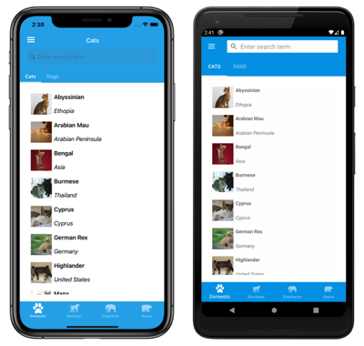
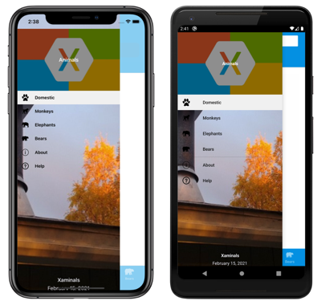

# Create a Xamarin.Forms Shell application

[ Download the sample](/samples/xamarin/xamarin-forms-samples/userinterface-xaminals/)

The process for creating a Xamarin.Forms Shell application is as follows:

1. Create a new Xamarin.Forms application, or load an existing application that you want to convert to a Shell application.
1. Add a XAML file to the shared code project, that subclasses the [`Shell`](xref:Xamarin.Forms.Shell) class. For more information, see [Subclass the Shell class](#subclass-the-shell-class).
1. Set the [`MainPage`](xref:Xamarin.Forms.Application.MainPage) property of the application's `App` class to the subclassed [`Shell`](xref:Xamarin.Forms.Shell) object. For more information, see [Bootstrap the Shell application](#bootstrap-the-shell-application).
1. Describe the visual hierarchy of the application in the subclassed [`Shell`](xref:Xamarin.Forms.Shell) class. For more information, see [Describe the visual hierarchy of the application](#describe-the-visual-hierarchy-of-the-application).

For a step-by-step walkthrough of how to create a Shell application, see [Create a Xamarin.Forms application quickstart](~/get-started/quickstarts/app.md).

## Subclass the Shell class

The first step in creating a Xamarin.Forms Shell application is to add a XAML file to the shared code project that subclasses the [`Shell`](xref:Xamarin.Forms.Shell) class. This file can be named anything, but **AppShell** is recommended. The following code example shows a newly created **AppShell.xaml** file:

```xaml
<Shell xmlns="http://xamarin.com/schemas/2014/forms"
       xmlns:x="http://schemas.microsoft.com/winfx/2009/xaml"
       x:Class="MyApp.AppShell">

</Shell>
```

The following example shows the code-behind file, **AppShell.xaml.cs**:

```csharp
using Xamarin.Forms;

namespace MyApp
{
    public partial class AppShell : Shell
    {
        public AppShell()
        {
            InitializeComponent();
        }
    }
}
```

## Bootstrap the Shell application

After creating the XAML file that subclasses the [`Shell`](xref:Xamarin.Forms.Shell) object, the [`MainPage`](xref:Xamarin.Forms.Application.MainPage) property of the `App` class should be set to the subclassed `Shell` object:

```csharp
namespace MyApp
{
    public partial class App : Application
    {
        public App()
        {
            InitializeComponent();
            MainPage = new AppShell();
        }
        ...
    }
}
```

In this example, the `AppShell` class is the XAML file that derives from the [`Shell`](xref:Xamarin.Forms.Shell) class.

> [!WARNING]
> While a blank Shell application will build, attempting to run it will result in a `InvalidOperationException` being thrown.

## Describe the visual hierarchy of the application

The final step in creating a Xamarin.Forms Shell application is to describe the visual hierarchy of the application, in the subclassed [`Shell`](xref:Xamarin.Forms.Shell) class. A subclassed `Shell` class consists of three main hierarchical objects:

1. [`FlyoutItem`](xref:Xamarin.Forms.FlyoutItem) or [`TabBar`](xref:Xamarin.Forms.TabBar). A `FlyoutItem` represents one or more items in the flyout, and should be used when the navigation pattern for the application requires a flyout. A `TabBar` represents the bottom tab bar, and should be used when the navigation pattern for the application begins with bottom tabs and doesn't require a flyout. Every `FlyoutItem` object or `TabBar` object is a child of the [`Shell`](xref:Xamarin.Forms.Shell) object.
1. [`Tab`](xref:Xamarin.Forms.Tab), which represents grouped content, navigable by bottom tabs. Every `Tab` object is a child of a [`FlyoutItem`](xref:Xamarin.Forms.FlyoutItem) object or [`TabBar`](xref:Xamarin.Forms.TabBar) object.
1. [`ShellContent`](xref:Xamarin.Forms.ShellContent), which represents the [`ContentPage`](xref:Xamarin.Forms.ContentPage) objects for each tab. Every `ShellContent` object is a child of a [`Tab`](xref:Xamarin.Forms.Tab) object. When more than one `ShellContent` object is present in a `Tab`, the objects will be navigable by top tabs.

These objects don't represent any user interface, but rather the organization of the application's visual hierarchy. Shell will take these objects and produce the navigation user interface for the content.

The following XAML shows an example of a subclassed [`Shell`](xref:Xamarin.Forms.Shell) class:

```xaml
<Shell xmlns="http://xamarin.com/schemas/2014/forms"
       xmlns:x="http://schemas.microsoft.com/winfx/2009/xaml"
       xmlns:views="clr-namespace:Xaminals.Views"
       x:Class="Xaminals.AppShell">
    ...
    <FlyoutItem FlyoutDisplayOptions="AsMultipleItems">
        <Tab Title="Domestic"
             Icon="paw.png">
            <ShellContent Title="Cats"
                          Icon="cat.png"
                          ContentTemplate="{DataTemplate views:CatsPage}" />
            <ShellContent Title="Dogs"
                          Icon="dog.png"
                          ContentTemplate="{DataTemplate views:DogsPage}" />
        </Tab>
        <!--
        Shell has implicit conversion operators that enable the Shell visual hierarchy to be simplified.
        This is possible because a subclassed Shell object can only ever contain a FlyoutItem object or a TabBar object,
        which can only ever contain Tab objects, which can only ever contain ShellContent objects.

        The implicit conversion automatically wraps the ShellContent objects below in Tab objects.
        -->
        <ShellContent Title="Monkeys"
                      Icon="monkey.png"
                      ContentTemplate="{DataTemplate views:MonkeysPage}" />
        <ShellContent Title="Elephants"
                      Icon="elephant.png"
                      ContentTemplate="{DataTemplate views:ElephantsPage}" />
        <ShellContent Title="Bears"
                      Icon="bear.png"
                      ContentTemplate="{DataTemplate views:BearsPage}" />
    </FlyoutItem>
    ...
</Shell>
```

When run, this XAML displays the `CatsPage`, because it's the first item of content declared in the subclassed [`Shell`](xref:Xamarin.Forms.Shell) class:

[](create-images/cats-large.png#lightbox)

Pressing the hamburger icon, or swiping from the left, displays the flyout:

[](create-images/flyout-large.png#lightbox)

Multiple items are displayed on the flyout because the [`FlyoutDisplayOptions`](xref:Xamarin.Forms.ShellGroupItem.FlyoutDisplayOptions) property is set to `AsMultipleItems`. For more information, see [Flyout display options](flyout.md#flyout-display-options).

> [!IMPORTANT]
> In a Shell application, pages are created on demand in response to navigation. This is accomplished by using the [`DataTemplate`](xref:Xamarin.Forms.Xaml.DataTemplateExtension) markup extension to set the [`ContentTemplate`](xref:Xamarin.Forms.ShellContent.ContentTemplate) property of each [`ShellContent`](xref:Xamarin.Forms.ShellContent) object to a [`ContentPage`](xref:Xamarin.Forms.ContentPage) object.

## Related links

- [Xaminals (sample)](/samples/xamarin/xamarin-forms-samples/userinterface-xaminals/)
- [Create a Xamarin.Forms application quickstart](~/get-started/quickstarts/app.md)
