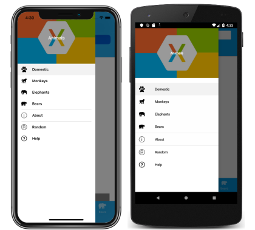

# Xamarin.Forms Shell flyout

[ Download the sample](/samples/xamarin/xamarin-forms-samples/userinterface-xaminals/)

The navigation experience provided by Xamarin.Forms Shell is based on flyouts and tabs. A flyout is the optional root menu for a Shell application, and is fully customizable. It's accessible through an icon or by swiping from the side of the screen. The flyout consists of an optional header, flyout items, optional menu items, and an optional footer:


## Flyout items

One or more flyout items can be added to the flyout, and each flyout item is represented by a [`FlyoutItem`](xref:Xamarin.Forms.FlyoutItem) object. Each `FlyoutItem` object should be a child of the subclassed [`Shell`](xref:Xamarin.Forms.Shell) object. Flyout items appear at the top of the flyout when a flyout header isn't present.

The following example creates a flyout containing two flyout items:

```xaml
<Shell xmlns="http://xamarin.com/schemas/2014/forms"
       xmlns:x="http://schemas.microsoft.com/winfx/2009/xaml"
       xmlns:controls="clr-namespace:Xaminals.Controls"
       xmlns:views="clr-namespace:Xaminals.Views"
       x:Class="Xaminals.AppShell">
    <FlyoutItem Title="Cats"
                Icon="cat.png">
       <Tab>
           <ShellContent ContentTemplate="{DataTemplate views:CatsPage}" />
       </Tab>
    </FlyoutItem>
    <FlyoutItem Title="Dogs"
                Icon="dog.png">
       <Tab>
           <ShellContent ContentTemplate="{DataTemplate views:DogsPage}" />
       </Tab>
    </FlyoutItem>
</Shell>
```

The [`FlyoutItem.Title`](xref:Xamarin.Forms.BaseShellItem.Title) property, of type `string`, defines the title of the flyout item. The [`FlyoutItem.Icon`](xref:Xamarin.Forms.BaseShellItem.Icon) property, of type [`ImageSource`](xref:Xamarin.Forms.ImageSource), defines the icon of the flyout item:

[](flyout-images/two-page-app-flyout-large.png#lightbox)

In this example, each [`ShellContent`](xref:Xamarin.Forms.ShellContent) object can only be accessed through flyout items, and not through tabs. This is because by default, tabs will only be displayed if the flyout item contains more than one tab.

> [!IMPORTANT]
> In a Shell application, pages are created on demand in response to navigation. This is accomplished by using the [`DataTemplate`](xref:Xamarin.Forms.Xaml.DataTemplateExtension) markup extension to set the [`ContentTemplate`](xref:Xamarin.Forms.ShellContent.ContentTemplate) property of each [`ShellContent`](xref:Xamarin.Forms.ShellContent) object to a [`ContentPage`](xref:Xamarin.Forms.ContentPage) object.

Shell has implicit conversion operators that enable the Shell visual hierarchy to be simplified, without introducing additional views into the visual tree. This is possible because a subclassed [`Shell`](xref:Xamarin.Forms.Shell) object can only ever contain [`FlyoutItem`](xref:Xamarin.Forms.FlyoutItem) objects or a [`TabBar`](xref:Xamarin.Forms.TabBar) object, which can only ever contain [`Tab`](xref:Xamarin.Forms.Tab) objects, which can only ever contain [`ShellContent`](xref:Xamarin.Forms.ShellContent) objects. These implicit conversion operators can be used to remove the `FlyoutItem` and `Tab` objects from the previous example:

```xaml
<Shell xmlns="http://xamarin.com/schemas/2014/forms"
       xmlns:x="http://schemas.microsoft.com/winfx/2009/xaml"
       xmlns:controls="clr-namespace:Xaminals.Controls"
       xmlns:views="clr-namespace:Xaminals.Views"
       x:Class="Xaminals.AppShell">
   <ShellContent Title="Cats"
                 Icon="cat.png"
                 ContentTemplate="{DataTemplate views:CatsPage}" />
   <ShellContent Title="Dogs"
                 Icon="dog.png"
                 ContentTemplate="{DataTemplate views:DogsPage}" />
</Shell>
```

This implicit conversion automatically wraps each [`ShellContent`](xref:Xamarin.Forms.ShellContent) object in [`Tab`](xref:Xamarin.Forms.Tab) objects, which are wrapped in [`FlyoutItem`](xref:Xamarin.Forms.FlyoutItem) objects.

> [!NOTE]
> All [`FlyoutItem`](xref:Xamarin.Forms.FlyoutItem) objects in a subclassed [`Shell`](xref:Xamarin.Forms.Shell) object are automatically added to the `Shell.FlyoutItems` collection, which defines the list of items that will be shown in the flyout.

### Flyout display options

The [`FlyoutItem.FlyoutDisplayOptions`](xref:Xamarin.Forms.ShellGroupItem.FlyoutDisplayOptions) property configures how a flyout item and its children are displayed in the flyout. This property should be set to a [`FlyoutDisplayOptions`](xref:Xamarin.Forms.FlyoutDisplayOptions) enumeration member:

- `AsSingleItem`, indicates that the item will be visible as a single item. This is the default value of the [`FlyoutDisplayOptions`](xref:Xamarin.Forms.ShellGroupItem.FlyoutDisplayOptions) property.
- `AsMultipleItems`, indicates that the item and its children will be visible in the flyout as a group of items.

A flyout item for each [`Tab`](xref:Xamarin.Forms.Tab) object within a [`FlyoutItem`](xref:Xamarin.Forms.FlyoutItem) can be displayed by setting the [`FlyoutItem.FlyoutDisplayOptions`](xref:Xamarin.Forms.ShellGroupItem.FlyoutDisplayOptions) property to `AsMultipleItems`:

```xaml
<Shell xmlns="http://xamarin.com/schemas/2014/forms"
       xmlns:x="http://schemas.microsoft.com/winfx/2009/xaml"
       xmlns:controls="clr-namespace:Xaminals.Controls"
       xmlns:views="clr-namespace:Xaminals.Views"
       FlyoutHeaderBehavior="CollapseOnScroll"
       x:Class="Xaminals.AppShell">

    <FlyoutItem FlyoutDisplayOptions="AsMultipleItems">
        <Tab Title="Domestic"
             Icon="paw.png">
            <ShellContent Title="Cats"
                          Icon="cat.png"
                          ContentTemplate="{DataTemplate views:CatsPage}" />
            <ShellContent Title="Dogs"
                          Icon="dog.png"
                          ContentTemplate="{DataTemplate views:DogsPage}" />
        </Tab>
        <ShellContent Title="Monkeys"
                      Icon="monkey.png"
                      ContentTemplate="{DataTemplate views:MonkeysPage}" />
        <ShellContent Title="Elephants"
                      Icon="elephant.png"
                      ContentTemplate="{DataTemplate views:ElephantsPage}" />  
        <ShellContent Title="Bears"
                      Icon="bear.png"
                      ContentTemplate="{DataTemplate views:BearsPage}" />
    </FlyoutItem>

    <ShellContent Title="About"
                  Icon="info.png"
                  ContentTemplate="{DataTemplate views:AboutPage}" />    
</Shell>
```

In this example, flyout items are created for the [`Tab`](xref:Xamarin.Forms.Tab) object that's a child of the [`FlyoutItem`](xref:Xamarin.Forms.FlyoutItem) object, and the [`ShellContent`](xref:Xamarin.Forms.ShellContent) objects that are children of the `FlyoutItem` object. This occurs because each `ShellContent` object that's a child of the `FlyoutItem` object is automatically wrapped in a `Tab` object. In addition, a flyout item is created for the final `ShellContent` object, which is automatically wrapped in a `Tab` object, and then in a `FlyoutItem` object.

> [!NOTE]
> Tabs are displayed when a [`FlyoutItem`](xref:Xamarin.Forms.FlyoutItem) contains more than one [`ShellContent`](xref:Xamarin.Forms.ShellContent) object.

This results in the following flyout items:

[](flyout-images/flyout-reduced-large.png#lightbox "Shell flyout containing FlyoutItem objects")

### Define FlyoutItem appearance

The appearance of each [`FlyoutItem`](xref:Xamarin.Forms.FlyoutItem) can be customized by setting the [`Shell.ItemTemplate`](xref:Xamarin.Forms.Shell.ItemTemplate) attached property to a [`DataTemplate`](xref:Xamarin.Forms.DataTemplate):

```xaml
<Shell ...>
    ...
    <Shell.ItemTemplate>
        <DataTemplate>
            <Grid ColumnDefinitions="0.2*,0.8*">
                <Image Source="{Binding FlyoutIcon}"
                       Margin="5"
                       HeightRequest="45" />
                <Label Grid.Column="1"
                       Text="{Binding Title}"
                       FontAttributes="Italic"
                       VerticalTextAlignment="Center" />
            </Grid>
        </DataTemplate>
    </Shell.ItemTemplate>
</Shell>
```

This example displays the title of each [`FlyoutItem`](xref:Xamarin.Forms.FlyoutItem) object in italics:

[](flyout-images/flyoutitem-templated-large.png#lightbox)

Because [`Shell.ItemTemplate`](xref:Xamarin.Forms.Shell.ItemTemplate) is an attached property, different templates can be attached to specific [`FlyoutItem`](xref:Xamarin.Forms.FlyoutItem) objects.

> [!NOTE]
> Shell provides the [`Title`](xref:Xamarin.Forms.BaseShellItem.Title) and [`FlyoutIcon`](xref:Xamarin.Forms.BaseShellItem.FlyoutIcon) properties to the [`BindingContext`](xref:Xamarin.Forms.BindableObject.BindingContext) of the `ItemTemplate`.

In addition, Shell includes three style classes, which are automatically applied to [`FlyoutItem`](xref:Xamarin.Forms.FlyoutItem) objects. For more information, see [Style FlyoutItem and MenuItem objects](#style-flyoutitem-and-menuitem-objects).

### Default template for FlyoutItems

The default [`DataTemplate`](xref:Xamarin.Forms.DataTemplate) used for each [`FlyoutItem`](xref:Xamarin.Forms.FlyoutItem) is shown below:

```xaml
<DataTemplate x:Key="FlyoutTemplate">
    <Grid x:Name="FlyoutItemLayout"
          HeightRequest="{x:OnPlatform Android=50}"
          ColumnSpacing="{x:OnPlatform UWP=0}"
          RowSpacing="{x:OnPlatform UWP=0}">
        <VisualStateManager.VisualStateGroups>
            <VisualStateGroupList>
                <VisualStateGroup x:Name="CommonStates">
                    <VisualState x:Name="Normal" />
                    <VisualState x:Name="Selected">
                        <VisualState.Setters>
                            <Setter Property="BackgroundColor"
                                    Value="{x:OnPlatform Android=#F2F2F2, iOS=#F2F2F2}" />
                        </VisualState.Setters>
                    </VisualState>
                </VisualStateGroup>
            </VisualStateGroupList>
        </VisualStateManager.VisualStateGroups>
        <Grid.ColumnDefinitions>
            <ColumnDefinition Width="{x:OnPlatform Android=54, iOS=50, UWP=Auto}" />
            <ColumnDefinition Width="*" />
        </Grid.ColumnDefinitions>
        <Image x:Name="FlyoutItemImage"
               Source="{Binding FlyoutIcon}"
               VerticalOptions="Center"
               HorizontalOptions="{x:OnPlatform Default=Center, UWP=Start}"
               HeightRequest="{x:OnPlatform Android=24, iOS=22, UWP=16}"
               WidthRequest="{x:OnPlatform Android=24, iOS=22, UWP=16}">
            <Image.Margin>
                <OnPlatform x:TypeArguments="Thickness">
                    <OnPlatform.Platforms>
                        <On Platform="UWP"
                            Value="12,0,12,0" />
                    </OnPlatform.Platforms>
                </OnPlatform>
            </Image.Margin>
        </Image>
        <Label x:Name="FlyoutItemLabel"
               Grid.Column="1"
               Text="{Binding Title}"
               FontSize="{x:OnPlatform Android=14, iOS=Small}"
               HorizontalOptions="{x:OnPlatform UWP=Start}"
               HorizontalTextAlignment="{x:OnPlatform UWP=Start}"
               FontAttributes="{x:OnPlatform iOS=Bold}"
               VerticalTextAlignment="Center">
            <Label.TextColor>
                <OnPlatform x:TypeArguments="Color">
                    <OnPlatform.Platforms>
                        <On Platform="Android"
                            Value="#D2000000" />
                    </OnPlatform.Platforms>
                </OnPlatform>
            </Label.TextColor>
            <Label.Margin>
                <OnPlatform x:TypeArguments="Thickness">
                    <OnPlatform.Platforms>
                        <On Platform="Android"
                            Value="20, 0, 0, 0" />
                    </OnPlatform.Platforms>
                </OnPlatform>
            </Label.Margin>
            <Label.FontFamily>
                <OnPlatform x:TypeArguments="x:String">
                    <OnPlatform.Platforms>
                        <On Platform="Android"
                            Value="sans-serif-medium" />
                    </OnPlatform.Platforms>
                </OnPlatform>
            </Label.FontFamily>
        </Label>
    </Grid>
</DataTemplate>
```

This template can be used for as a basis for making alterations to the existing flyout layout, and also shows the visual states that are implemented for flyout items.

In addition, the [`Grid`](xref:Xamarin.Forms.Grid), [`Image`](xref:Xamarin.Forms.Image), and [`Label`](xref:Xamarin.Forms.Label) elements all have `x:Name` values and so can be targeted with the Visual State Manager. For more information, see [Set state on multiple elements](~/xamarin-forms/user-interface/visual-state-manager.md#set-state-on-multiple-elements).

> [!NOTE]
> The same template can also be used for [`MenuItem`](xref:Xamarin.Forms.MenuItem) objects.

### Replace flyout content

Flyout items, which represent the flyout content, can optionally be replaced with your own content by setting the `Shell.FlyoutContent` bindable property to an `object`:

```xaml
<Shell ...
       x:Name="shell">
    ...
    <Shell.FlyoutContent>
        <CollectionView BindingContext="{x:Reference shell}"
                        IsGrouped="True"
                        ItemsSource="{Binding FlyoutItems}">
            <CollectionView.ItemTemplate>
                <DataTemplate>
                    <Label Text="{Binding Title}"
                           TextColor="White"
                           FontSize="Large" />
                </DataTemplate>
            </CollectionView.ItemTemplate>
        </CollectionView>
    </Shell.FlyoutContent>
</Shell>
```

In this example, the flyout content is replaced with a [`CollectionView`](xref:Xamarin.Forms.CollectionView) that displays the title of each item in the `FlyoutItems` collection.

> [!NOTE]
> The `FlyoutItems` property, in the [`Shell`](xref:Xamarin.Forms.Shell) class, is a read-only collection of flyout items.

Alternatively, flyout content can be defined by setting the `Shell.FlyoutContentTemplate` bindable property to a [`DataTemplate`](xref:Xamarin.Forms.DataTemplate):

```xaml
<Shell ...
       x:Name="shell">
    ...
    <Shell.FlyoutContentTemplate>
        <DataTemplate>
            <CollectionView BindingContext="{x:Reference shell}"
                            IsGrouped="True"
                            ItemsSource="{Binding FlyoutItems}">
                <CollectionView.ItemTemplate>
                    <DataTemplate>
                        <Label Text="{Binding Title}"
                               TextColor="White"
                               FontSize="Large" />
                    </DataTemplate>
                </CollectionView.ItemTemplate>
            </CollectionView>
        </DataTemplate>
    </Shell.FlyoutContentTemplate>
</Shell>
```

> [!IMPORTANT]
> A flyout header can optionally be displayed above your flyout content, and a flyout footer can optionally be displayed below your flyout content. If your flyout content is scrollable, Shell will attempt to honor the scroll behavior of your flyout header.

## Menu items

Menu items can be optionally added to the flyout, and each menu item is represented by a [`MenuItem`](xref:Xamarin.Forms.MenuItem) object. The position of `MenuItem` objects on the flyout is dependent upon their declaration order in the Shell visual hierarchy. Therefore, any `MenuItem` objects declared before [`FlyoutItem`](xref:Xamarin.Forms.FlyoutItem) objects will appear before the `FlyoutItem` objects in the flyout, and any `MenuItem` objects declared after `FlyoutItem` objects will appear after the `FlyoutItem` objects in the flyout.

The [`MenuItem`](xref:Xamarin.Forms.MenuItem) class has a [`Clicked`](xref:Xamarin.Forms.MenuItem.Clicked) event, and a [`Command`](xref:Xamarin.Forms.MenuItem.Command) property. Therefore, `MenuItem` objects enable scenarios that execute an action in response to the `MenuItem` being tapped.

[`MenuItem`](xref:Xamarin.Forms.MenuItem) objects can be added to the flyout as shown in the following example:

```xaml
<Shell ...>
    ...            
    <MenuItem Text="Help"
              IconImageSource="help.png"
              Command="{Binding HelpCommand}"
              CommandParameter="https://learn.microsoft.com/xamarin/xamarin-forms/app-fundamentals/shell" />    
</Shell>
```

This example adds a [`MenuItem`](xref:Xamarin.Forms.MenuItem) object to the flyout, beneath all the flyout items:

[](flyout-images/flyout-large.png#lightbox)

The [`MenuItem`](xref:Xamarin.Forms.MenuItem) object executes an `ICommand` named `HelpCommand`, which opens the URL specified by the `CommandParameter` property in the system web browser.

> [!NOTE]
> The [`BindingContext`](xref:Xamarin.Forms.BindableObject.BindingContext) of each [`MenuItem`](xref:Xamarin.Forms.MenuItem) is inherited from the subclassed [`Shell`](xref:Xamarin.Forms.Shell) object.

### Define MenuItem appearance

The appearance of each [`MenuItem`](xref:Xamarin.Forms.MenuItem) can be customized by setting the [`Shell.MenuItemTemplate`](xref:Xamarin.Forms.Shell.MenuItemTemplate) attached property to a [`DataTemplate`](xref:Xamarin.Forms.DataTemplate):

```xaml
<Shell ...>
    <Shell.MenuItemTemplate>
        <DataTemplate>
            <Grid ColumnDefinitions="0.2*,0.8*">
                <Image Source="{Binding Icon}"
                       Margin="5"
                       HeightRequest="45" />
                <Label Grid.Column="1"
                       Text="{Binding Text}"
                       FontAttributes="Italic"
                       VerticalTextAlignment="Center" />
            </Grid>
        </DataTemplate>
    </Shell.MenuItemTemplate>
    ...
    <MenuItem Text="Help"
              IconImageSource="help.png"
              Command="{Binding HelpCommand}"
              CommandParameter="https://learn.microsoft.com/xamarin/xamarin-forms/app-fundamentals/shell" />  
</Shell>
```

This example attaches the [`DataTemplate`](xref:Xamarin.Forms.DataTemplate) to each [`MenuItem`](xref:Xamarin.Forms.MenuItem) object, displaying the title of the `MenuItem` object in italics:

[](flyout-images/menuitem-templated-large.png#lightbox)

Because [`Shell.MenuItemTemplate`](xref:Xamarin.Forms.Shell.ItemTemplate) is an attached property, different templates can be attached to specific [`MenuItem`](xref:Xamarin.Forms.MenuItem) objects.

> [!NOTE]
> Shell provides the [`Text`](xref:Xamarin.Forms.MenuItem.Text) and [`IconImageSource`](xref:Xamarin.Forms.MenuItem.IconImageSource) properties to the [`BindingContext`](xref:Xamarin.Forms.BindableObject.BindingContext) of the [`MenuItemTemplate`](xref:Xamarin.Forms.Shell.MenuItemTemplate). You can also use `Title` in place of `Text` and `Icon` in place of `IconImageSource` which will let you reuse the same template for menu items and flyout items.

The default template for [`FlyoutItem`](xref:Xamarin.Forms.FlyoutItem) objects can also be used for [`MenuItem`](xref:Xamarin.Forms.MenuItem) objects. For more information, see [Default template for FlyoutItems](#default-template-for-flyoutitems).

## Style FlyoutItem and MenuItem objects

Shell includes three style classes, which are automatically applied to [`FlyoutItem`](xref:Xamarin.Forms.FlyoutItem) and [`MenuItem`](xref:Xamarin.Forms.MenuItem) objects. The style class names are `FlyoutItemLabelStyle`, `FlyoutItemImageStyle`, and `FlyoutItemLayoutStyle`.

The following XAML shows an example of defining styles for these style classes:

```xaml
<Style TargetType="Label"
       Class="FlyoutItemLabelStyle">
    <Setter Property="TextColor"
            Value="Black" />
    <Setter Property="HeightRequest"
            Value="100" />
</Style>

<Style TargetType="Image"
       Class="FlyoutItemImageStyle">
    <Setter Property="Aspect"
            Value="Fill" />
</Style>

<Style TargetType="Layout"
       Class="FlyoutItemLayoutStyle"
       ApplyToDerivedTypes="True">
    <Setter Property="BackgroundColor"
            Value="Teal" />
</Style>
```

These styles will automatically be applied to [`FlyoutItem`](xref:Xamarin.Forms.FlyoutItem) and [`MenuItem`](xref:Xamarin.Forms.MenuItem) objects, without having to set their [`StyleClass`](xref:Xamarin.Forms.NavigableElement.StyleClass) properties to the style class names.

In addition, custom style classes can be defined and applied to [`FlyoutItem`](xref:Xamarin.Forms.FlyoutItem) and [`MenuItem`](xref:Xamarin.Forms.MenuItem) objects. For more information about style classes, see [Xamarin.Forms Style Classes](~/xamarin-forms/user-interface/styles/xaml/style-class.md).

## Flyout header

The flyout header is the content that optionally appears at the top of the flyout, with its appearance being defined by an `object` that can be set with the [`Shell.FlyoutHeader`](xref:Xamarin.Forms.Shell.FlyoutHeader) bindable property:

```xaml
<Shell ...>
    <Shell.FlyoutHeader>
        <controls:FlyoutHeader />
    </Shell.FlyoutHeader>
</Shell>
```

The `FlyoutHeader` type is shown in the following example:

```xaml
<ContentView xmlns="http://xamarin.com/schemas/2014/forms"
             xmlns:x="http://schemas.microsoft.com/winfx/2009/xaml"
             x:Class="Xaminals.Controls.FlyoutHeader"
             HeightRequest="200">
    <Grid BackgroundColor="Black">
        <Image Aspect="AspectFill"
               Source="xamarinstore.jpg"
               Opacity="0.6" />
        <Label Text="Animals"
               TextColor="White"
               FontAttributes="Bold"
               HorizontalTextAlignment="Center"
               VerticalTextAlignment="Center" />
    </Grid>
</ContentView>
```

This results in the following flyout header:


Alternatively, the flyout header appearance can be defined by setting the [`Shell.FlyoutHeaderTemplate`](xref:Xamarin.Forms.Shell.FlyoutHeaderTemplate) bindable property to a [`DataTemplate`](xref:Xamarin.Forms.DataTemplate):

```xaml
<Shell ...>
    <Shell.FlyoutHeaderTemplate>
        <DataTemplate>
            <Grid BackgroundColor="Black"
                  HeightRequest="200">
                <Image Aspect="AspectFill"
                       Source="xamarinstore.jpg"
                       Opacity="0.6" />
                <Label Text="Animals"
                       TextColor="White"
                       FontAttributes="Bold"
                       HorizontalTextAlignment="Center"
                       VerticalTextAlignment="Center" />
            </Grid>            
        </DataTemplate>
    </Shell.FlyoutHeaderTemplate>
</Shell>
```

By default, the flyout header will be fixed in the flyout while the content below will scroll if there are enough items. However, this behavior can be changed by setting the [`Shell.FlyoutHeaderBehavior`](xref:Xamarin.Forms.Shell.FlyoutHeaderBehavior) bindable property to one of the [`FlyoutHeaderBehavior`](xref:Xamarin.Forms.FlyoutHeaderBehavior) enumeration members:

- `Default` – indicates that the default behavior for the platform will be used. This is the default value of the [`FlyoutHeaderBehavior`](xref:Xamarin.Forms.Shell.FlyoutHeaderBehavior) property.
- `Fixed` – indicates that the flyout header remains visible and unchanged at all times.
- `Scroll` – indicates that the flyout header scrolls out of view as the user scrolls the items.
- `CollapseOnScroll` – indicates that the flyout header collapses to a title only, as the user scrolls the items.

The following example shows how to collapse the flyout header as the user scrolls:

```xaml
<Shell ...
       FlyoutHeaderBehavior="CollapseOnScroll">
    ...
</Shell>
```

## Flyout footer

The flyout footer is the content that optionally appears at the bottom of the flyout, with its appearance being defined by an `object` that can be set with the `Shell.FlyoutFooter` bindable property:

```xaml
<Shell ...>
    <Shell.FlyoutFooter>
        <controls:FlyoutFooter />
    </Shell.FlyoutFooter>
</Shell>
```

The `FlyoutFooter` type is shown in the following example:

```xaml
<ContentView xmlns="http://xamarin.com/schemas/2014/forms"
             xmlns:x="http://schemas.microsoft.com/winfx/2009/xaml"
             xmlns:sys="clr-namespace:System;assembly=netstandard"
             x:Class="Xaminals.Controls.FlyoutFooter">
    <StackLayout>
        <Label Text="Xaminals"
               TextColor="GhostWhite"
               FontAttributes="Bold"
               HorizontalOptions="Center" />
        <Label Text="{Binding Source={x:Static sys:DateTime.Now}, StringFormat='{0:MMMM dd, yyyy}'}"
               TextColor="GhostWhite"
               HorizontalOptions="Center" />
    </StackLayout>
</ContentView>
```

This results in the following flyout footer:


Alternatively, the flyout footer appearance can be defined by setting the `Shell.FlyoutFooterTemplate` property to a [`DataTemplate`](xref:Xamarin.Forms.DataTemplate):

```xaml
<Shell ...>
    <Shell.FlyoutFooterTemplate>
        <DataTemplate>
            <StackLayout>
                <Label Text="Xaminals"
                       TextColor="GhostWhite"
                       FontAttributes="Bold"
                       HorizontalOptions="Center" />
                <Label Text="{Binding Source={x:Static sys:DateTime.Now}, StringFormat='{0:MMMM dd, yyyy}'}"
                       TextColor="GhostWhite"
                       HorizontalOptions="Center" />
            </StackLayout>
        </DataTemplate>
    </Shell.FlyoutFooterTemplate>
</Shell>
```

The flyout footer is fixed to the bottom of the flyout, and can be any height. In addition, the footer never obscures any menu items.

## Flyout width and height

The width and height of the flyout can be customized by setting the `Shell.FlyoutWidth` and `Shell.FlyoutHeight` attached properties to `double` values:

```xaml
<Shell ...
       FlyoutWidth="400"
       FlyoutHeight="200">
    ...
</Shell>
```

This enables scenarios such as expanding the flyout across the entire screen, or reducing the height of the flyout so that it doesn't obscure the tab bar.

## Flyout icon

By default, Shell applications have a hamburger icon which, when pressed, opens the flyout. This icon can be changed by setting the [`Shell.FlyoutIcon`](xref:Xamarin.Forms.Shell.FlyoutIcon) bindable property, of type [`ImageSource`](xref:Xamarin.Forms.ImageSource), to an appropriate icon:

```xaml
<Shell ...
       FlyoutIcon="flyouticon.png">
    ...       
</Shell>
```

## Flyout background

The background color of the flyout can be set with the [`Shell.FlyoutBackgroundColor`](xref:Xamarin.Forms.Shell.FlyoutBackgroundColor) bindable property:

```xaml
<Shell ...
       FlyoutBackgroundColor="AliceBlue">
    ...
</Shell>
```

> [!NOTE]
> The [`Shell.FlyoutBackgroundColor`](xref:Xamarin.Forms.Shell.FlyoutBackgroundColor) can also be set from a Cascading Style Sheet (CSS). For more information, see [Xamarin.Forms Shell specific properties](~/xamarin-forms/user-interface/styles/css/index.md#xamarinforms-shell-specific-properties).

Alternatively, the background of the flyout can be specified by setting the [`Shell.FlyoutBackground`](xref:Xamarin.Forms.Shell.FlyoutBackground) bindable property to a [`Brush`](xref:Xamarin.Forms.Brush):

```xaml
<Shell ...
       FlyoutBackground="LightGray">
    ...
</Shell>
```

In this example, the flyout background is painted with a light gray [`SolidColorBrush`](xref:Xamarin.Forms.SolidColorBrush).

The following example shows setting the flyout background to a [`LinearGradientBrush`](xref:Xamarin.Forms.LinearGradientBrush):

```xaml
<Shell ...>
    <Shell.FlyoutBackground>
        <LinearGradientBrush StartPoint="0,0"
                             EndPoint="1,1">
            <GradientStop Color="#8A2387"
                          Offset="0.1" />
            <GradientStop Color="#E94057"
                          Offset="0.6" />
            <GradientStop Color="#F27121"
                          Offset="1.0" />
        </LinearGradientBrush>
    </Shell.FlyoutBackground>
    ...
</Shell>
```

For more information about brushes, see [Xamarin.Forms Brushes](~/xamarin-forms/user-interface/brushes/index.md).

## Flyout background image

The flyout can have an optional background image, which appears beneath the flyout header and behind any flyout items, menu items, and the flyout footer. The background image can be specified by setting the [`FlyoutBackgroundImage`](xref:Xamarin.Forms.Shell.FlyoutBackgroundImage) bindable property, of type [`ImageSource`](xref:Xamarin.Forms.ImageSource), to a file, embedded resource, URI, or stream.

The aspect ratio of the background image can be configured by setting the [`FlyoutBackgroundImageAspect`](xref:Xamarin.Forms.Shell.FlyoutBackgroundImageAspect) bindable property, of type [`Aspect`](xref:Xamarin.Forms.Aspect), to one of the `Aspect` enumeration members:

- [`AspectFill`](xref:Xamarin.Forms.Aspect.AspectFill) - clips the image so that it fills the display area while preserving the aspect ratio.
- [`AspectFit`](xref:Xamarin.Forms.Aspect.AspectFit) - letterboxes the image, if required, so that the image fits into the display area, with blank space added to the top/bottom or sides depending on whether the image is wide or tall. This is the default value of the [`FlyoutBackgroundImageAspect`](xref:Xamarin.Forms.Shell.FlyoutBackgroundImageAspect) property.
- [`Fill`](xref:Xamarin.Forms.Aspect.Fill) - stretches the image to completely and exactly fill the display area. This may result in image distortion.

The following example shows setting these properties:

```xaml
<Shell ...
       FlyoutBackgroundImage="photo.jpg"
       FlyoutBackgroundImageAspect="AspectFill">
    ...
</Shell>
```

This results in a background image appearing in the flyout, below the flyout header:


## Flyout backdrop

The backdrop of the flyout, which is the appearance of the flyout overlay, can be specified by setting the [`Shell.FlyoutBackdrop`](xref:Xamarin.Forms.Shell.FlyoutBackdrop) attached property to a [`Brush`](xref:Xamarin.Forms.Brush):

```xaml
<Shell ...
       FlyoutBackdrop="Silver">
    ...
</Shell>
```

In this example, the flyout backdrop is painted with a silver [`SolidColorBrush`](xref:Xamarin.Forms.SolidColorBrush).

> [!IMPORTANT]
> The [`FlyoutBackdrop`](xref:Xamarin.Forms.Shell.FlyoutBackdrop) attached property can be set on any Shell element, but will only be applied when it's set on `Shell`, `FlyoutItem`, or `TabBar` objects.

The following example shows setting the flyout backdrop to a [`LinearGradientBrush`](xref:Xamarin.Forms.LinearGradientBrush):

```xaml
<Shell ...>
    <Shell.FlyoutBackdrop>
        <LinearGradientBrush StartPoint="0,0"
                             EndPoint="1,1">
            <GradientStop Color="#8A2387"
                          Offset="0.1" />
            <GradientStop Color="#E94057"
                          Offset="0.6" />
            <GradientStop Color="#F27121"
                          Offset="1.0" />
        </LinearGradientBrush>
    </Shell.FlyoutBackdrop>
    ...
</Shell>
```

For more information about brushes, see [Xamarin.Forms Brushes](~/xamarin-forms/user-interface/brushes/index.md).

## Flyout behavior

The flyout can be accessed through the hamburger icon or by swiping from the side of the screen. However, this behavior can be changed by setting the [`Shell.FlyoutBehavior`](xref:Xamarin.Forms.Shell.FlyoutBehavior) attached property to one of the [`FlyoutBehavior`](xref:Xamarin.Forms.FlyoutBehavior) enumeration members:

- `Disabled` – indicates that the flyout can't be opened by the user.
- `Flyout` – indicates that the flyout can be opened and closed by the user. This is the default value for the [`FlyoutBehavior`](xref:Xamarin.Forms.Shell.FlyoutBehavior) property.
- `Locked` – indicates that the flyout can't be closed by the user, and that it doesn't overlap content.

The following example shows how to disable the flyout:

```xaml
<Shell ...
       FlyoutBehavior="Disabled">
    ...
</Shell>
```

> [!NOTE]
> The `FlyoutBehavior` attached property can be set on `Shell`, `FlyoutItem`, `ShellContent`, and page objects, to override the default flyout behavior.

## Flyout vertical scroll

By default, a flyout can be scrolled vertically when the flyout items don't fit in the flyout. This behavior can be changed by setting the [`Shell.FlyoutVerticalScrollMode`](xref:Xamarin.Forms.Shell.FlyoutVerticalScrollMode) bindable property to one of the [`ScrollMode`](xref:Xamarin.Forms.ScrollMode) enumeration members:

- `Disabled` – indicates that vertical scrolling will be disabled.
- `Enabled` – indicates that vertical scrolling will be enabled.
- `Auto` – indicates that vertical scrolling will be enabled if the flyout items don't fit in the flyout. This is the default value of the [`FlyoutVerticalScrollMode`](xref:Xamarin.Forms.Shell.FlyoutVerticalScrollMode) property.

The following example shows how to disable vertical scrolling:

```xaml
<Shell ...
       FlyoutVerticalScrollMode="Disabled">
    ...
</Shell>
```

## FlyoutItem tab order

By default, the tab order of [`FlyoutItem`](xref:Xamarin.Forms.FlyoutItem) objects is the same order in which they are listed in XAML, or programmatically added to a child collection. This order is the order in which the `FlyoutItem` objects will be navigated through with a keyboard, and often this default order is the best order.

The default tab order can be changed by setting the [`FlyoutItem.TabIndex`](xref:Xamarin.Forms.BaseShellItem.TabIndex) property, which indicates the order in which [`FlyoutItem`](xref:Xamarin.Forms.FlyoutItem) objects receive focus when the user navigates through items by pressing the Tab key. The default value of the property is 0, and it can be set to any `int` value.

The following rules apply when using the default tab order, or setting the [`TabIndex`](xref:Xamarin.Forms.BaseShellItem.TabIndex) property:

- [`FlyoutItem`](xref:Xamarin.Forms.FlyoutItem) objects with a [`TabIndex`](xref:Xamarin.Forms.BaseShellItem.TabIndex) equal to 0 are added to the tab order based on their declaration order in XAML or child collections.
- [`FlyoutItem`](xref:Xamarin.Forms.FlyoutItem) objects with a [`TabIndex`](xref:Xamarin.Forms.BaseShellItem.TabIndex) greater than 0 are added to the tab order based on their `TabIndex` value.
- [`FlyoutItem`](xref:Xamarin.Forms.FlyoutItem) objects with a [`TabIndex`](xref:Xamarin.Forms.BaseShellItem.TabIndex) less than 0 are added to the tab order and appear before any zero value.
- Conflicts on a [`TabIndex`](xref:Xamarin.Forms.BaseShellItem.TabIndex) are resolved by declaration order.

After defining a tab order, pressing the Tab key will cycle the focus through [`FlyoutItem`](xref:Xamarin.Forms.FlyoutItem) objects in ascending [`TabIndex`](xref:Xamarin.Forms.BaseShellItem.TabIndex) order, wrapping around to the beginning once the final object is reached.

In addition to setting the tab order of [`FlyoutItem`](xref:Xamarin.Forms.FlyoutItem) objects, it may be necessary to exclude some objects from the tab order. This can be achieved with the [`FlyoutItem.IsTabStop`](xref:Xamarin.Forms.BaseShellItem.IsTabStop) property, which indicates whether a `FlyoutItem` is included in tab navigation. Its default value is `true`, and when its value is `false` the `FlyoutItem` is ignored by the tab-navigation infrastructure, irrespective if a [`TabIndex`](xref:Xamarin.Forms.BaseShellItem.TabIndex) is set.

## FlyoutItem selection

When a Shell application that uses a flyout is first run, the [`Shell.CurrentItem`](xref:Xamarin.Forms.Shell.CurrentItem) property will be set to the first `FlyoutItem` object in the subclassed [`Shell`](xref:Xamarin.Forms.Shell) object. However, the property can be set to another `FlyoutItem`, as shown in the following example:

```xaml
<Shell ...
       CurrentItem="{x:Reference aboutItem}">
    <FlyoutItem FlyoutDisplayOptions="AsMultipleItems">
        ...
    </FlyoutItem>
    <ShellContent x:Name="aboutItem"
                  Title="About"
                  Icon="info.png"
                  ContentTemplate="{DataTemplate views:AboutPage}" />
</Shell>
```

This example sets the [`CurrentItem`](xref:Xamarin.Forms.Shell.CurrentItem) property to the [`ShellContent`](xref:Xamarin.Forms.ShellContent) object named `aboutItem`, which results in it being selected and displayed. In this example, an implicit conversion is used to wrap the `ShellContent` object in a [`Tab`](xref:Xamarin.Forms.Tab) object, which is wrapped in a [`FlyoutItem`](xref:Xamarin.Forms.FlyoutItem) object.

The equivalent C# code, given a [`ShellContent`](xref:Xamarin.Forms.ShellContent) object named `aboutItem`, is:

```csharp
CurrentItem = aboutItem;
```

In this example, the [`CurrentItem`](xref:Xamarin.Forms.Shell.CurrentItem) property is set in the subclassed [`Shell`](xref:Xamarin.Forms.Shell) class. Alternatively, the `CurrentItem` property can be set in any class through the `Shell.Current` static property:

```csharp
Shell.Current.CurrentItem = aboutItem;
```

> [!NOTE]
> An application may enter a state where selecting a flyout item is not a valid operation. In such cases, the [`FlyoutItem`](xref:Xamarin.Forms.FlyoutItem) can be disabled by setting its `IsEnabled` property to `false`. This will prevent users from being able to select the flyout item.

## FlyoutItem visibility

Flyout items are visible in the flyout by default. However, an item can be hidden in the flyout with the `FlyoutItemIsVisible` property, and removed from the flyout with the [`IsVisible`](xref:Xamarin.Forms.BaseShellItem.IsVisible) property:

- `FlyoutItemIsVisible`, of type `bool`, indicates if the item is hidden in the flyout, but is still reachable with the [`GoToAsync`](xref:Xamarin.Forms.Shell.GoToAsync*) navigation method. The default value of this property is `true`.
- [`IsVisible`](xref:Xamarin.Forms.BaseShellItem.IsVisible), of type `bool`, indicates if the item should be removed from the visual tree and therefore not appear in the flyout. Its default value is `true`.

The following example shows hiding an item in the flyout:

```xaml
<Shell ...>
    <FlyoutItem ...
                FlyoutItemIsVisible="False">
        ...
    </FlyoutItem>
</Shell>
```

> [!NOTE]
> There's also a `Shell.FlyoutItemIsVisible` attached property, which can be set on [`FlyoutItem`](xref:Xamarin.Forms.FlyoutItem), [`MenuItem`](xref:Xamarin.Forms.MenuItem), [`Tab`](xref:Xamarin.Forms.Tab), and [`ShellContent`](xref:Xamarin.Forms.ShellContent) objects.

## Open and close the flyout programmatically

The flyout can be programmatically opened and closed by setting the [`Shell.FlyoutIsPresented`](xref:Xamarin.Forms.Shell.FlyoutIsPresented) bindable property to a `boolean` value that indicates whether the flyout is currently open:

```xaml
<Shell ...
       FlyoutIsPresented="{Binding IsFlyoutOpen}">
</Shell>
```

Alternatively, this can be performed in code:

```csharp
Shell.Current.FlyoutIsPresented = false;
```

## Related links

- [Xaminals (sample)](/samples/xamarin/xamarin-forms-samples/userinterface-xaminals/)
- [Xamarin.Forms style classes](~/xamarin-forms/user-interface/styles/xaml/style-class.md)
- [Xamarin.Forms visual state manager](~/xamarin-forms/user-interface/visual-state-manager.md)
- [Xamarin.Forms brushes](~/xamarin-forms/user-interface/brushes/index.md)
- [Xamarin.Forms Shell specific properties](~/xamarin-forms/user-interface/styles/css/index.md#xamarinforms-shell-specific-properties)
