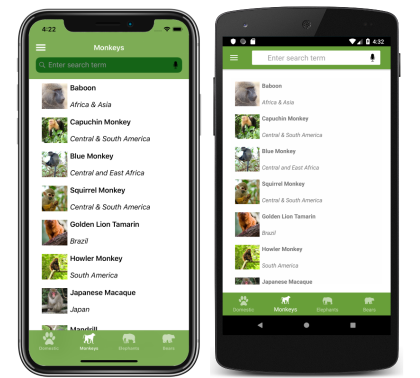
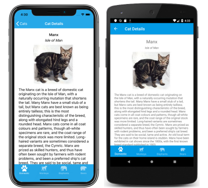

# Xamarin.Forms Shell Introduction

[ Download the sample](/samples/xamarin/xamarin-forms-samples/userinterface-xaminals/)

Xamarin.Forms Shell reduces the complexity of mobile application development by providing the fundamental features that most mobile applications require, including:

- A single place to describe the visual hierarchy of an application.
- A common navigation user experience.
- A URI-based navigation scheme that permits navigation to any page in the application.
- An integrated search handler.

In addition, Shell applications benefit from an increased rendering speed, and reduced memory consumption.

> [!IMPORTANT]
> Existing applications can adopt Shell and benefit immediately from navigation, performance, and extensibility improvements.

## Platform support

Xamarin.Forms Shell is fully available on iOS and Android, but only partially available on the Universal Windows Platform (UWP). In addition, Shell is currently experimental on UWP and can only be used by adding the following line of code to the `App` class in your UWP project, before calling `Forms.Init`:

```csharp
global::Xamarin.Forms.Forms.SetFlags("Shell_UWP_Experimental");
```

For more information about the status of Shell on UWP, see [Xamarin.Forms Shell Project Board](https://github.com/xamarin/Xamarin.Forms/projects/54) on github.com.

## Shell navigation experience

Shell provides an opinionated navigation experience, based on flyouts and tabs. The top level of navigation in a Shell application is either a flyout or a bottom tab bar, depending on the navigation requirements of the application. The following example shows an application where the top level of navigation is a flyout:

[](introduction-images/flyout-large.png#lightbox "Shell flyout")

Selecting a flyout item results in the bottom tab that represents the item being selected and displayed:

[](introduction-images/monkeys-large.png#lightbox "Shell bottom tabs")

> [!NOTE]
> When the flyout isn't open the bottom tab bar can be considered to be the top level of navigation in the application.

Each tab displays a [`ContentPage`](xref:Xamarin.Forms.ContentPage). However, if a bottom tab contains more than one page, the pages are navigable by the top tab bar:

[](introduction-images/cats-large.png#lightbox "Shell top tabs")

Within each tab, additional [`ContentPage`](xref:Xamarin.Forms.ContentPage) objects can be navigated to:

[](introduction-images/cat-details-large.png#lightbox "Shell app navigation")

## Related links

- [Xaminals (sample)](/samples/xamarin/xamarin-forms-samples/userinterface-xaminals/)
