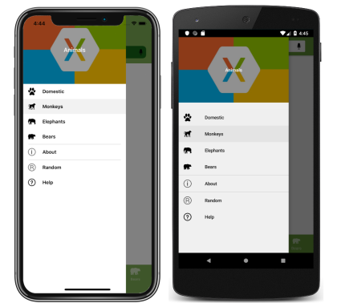
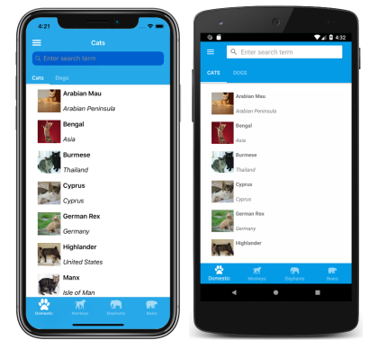

# Xamarin.Forms Shell introduction

[ Download the sample](/samples/xamarin/xamarin-forms-samples/userinterface-xaminals/)

Xamarin.Forms Shell reduces the complexity of mobile application development by providing the fundamental features that most mobile applications require, including:

- A single place to describe the visual hierarchy of an application.
- A common navigation user experience.
- A URI-based navigation scheme that permits navigation to any page in the application.
- An integrated search handler.

In addition, Shell applications benefit from an increased rendering speed, and reduced memory consumption.

> [!IMPORTANT]
> Existing applications can adopt Shell and benefit immediately from navigation, performance, and extensibility improvements.

## Application visual hierarchy

In a Xamarin.Forms Shell application, the visual hierarchy of the application is described in a class that subclasses the [`Shell`](xref:Xamarin.Forms.Shell) class. This class can consist of three main hierarchical objects:

1. [`FlyoutItem`](xref:Xamarin.Forms.FlyoutItem) or [`TabBar`](xref:Xamarin.Forms.TabBar). A `FlyoutItem` represents one or more items in the flyout, and should be used when the navigation pattern for the application requires a flyout. A `TabBar` represents the bottom tab bar, and should be used when the navigation pattern for the application begins with bottom tabs and doesn't require a flyout.
1. [`Tab`](xref:Xamarin.Forms.Tab), which represents grouped content, navigable by bottom tabs.
1. [`ShellContent`](xref:Xamarin.Forms.ShellContent), which represents the [`ContentPage`](xref:Xamarin.Forms.ContentPage) objects for each tab.

These objects don't represent any user interface, but rather the organization of the application's visual hierarchy. Shell will take these objects and produce the navigation user interface for the content.

> [!NOTE]
> Pages are created on demand in Shell applications, in response to navigation.

For more information, see [Create a Xamarin.Forms Shell application](~/xamarin-forms/app-fundamentals/shell/create.md).

## Navigation user experience

The navigation experience provided by Xamarin.Forms Shell is based on flyouts and tabs. The top level of navigation in a Shell application is either a flyout or a bottom tab bar, depending on the navigation requirements of the application. The following example shows an application where the top level of navigation is a flyout:

[](introduction-images/flyout-large.png#lightbox)

In this example, some flyout items are duplicated as tab bar items. However, there are also items that can only be accessed from the flyout. Selecting a flyout item results in the bottom tab that represents the item being selected and displayed:

[](introduction-images/cats-large.png#lightbox)

> [!NOTE]
> When the flyout isn't open the bottom tab bar can be considered to be the top level of navigation in the application.

Each tab on the tab bar displays a [`ContentPage`](xref:Xamarin.Forms.ContentPage). However, if a bottom tab contains more than one page, the pages are navigable by the top tab bar:

[](introduction-images/dogs-large.png#lightbox)

Within each tab, additional [`ContentPage`](xref:Xamarin.Forms.ContentPage) objects that are known as detail pages, can be navigated to:

[](introduction-images/dogdetails-large.png#lightbox)

Shell uses a URI-based navigation experience that uses routes to navigate to any page in the application, without having to follow a set navigation hierarchy. In addition, it also provides the ability to navigate backwards without having to visit all of the pages on the navigation stack. For more information, see [Xamarin.Forms Shell navigation](~/xamarin-forms/app-fundamentals/shell/navigation.md).

## Search

Xamarin.Forms Shell includes integrated search functionality that's provided by the [`SearchHandler`](xref:Xamarin.Forms.SearchHandler) class. Search capability can be added to a page by adding a subclassed `SearchHandler` object to it. This results in a search box being added at the top of the page. When data is entered into the search box, the search suggestions area is populated with data:

[](introduction-images/search-large.png#lightbox)

Then, when a result is selected from the search suggestions area, custom logic can be executed such as navigating to a detail page.

For more information, see [Xamarin.Forms Shell search](~/xamarin-forms/app-fundamentals/shell/search.md).

## Platform support

Xamarin.Forms Shell is fully available on iOS and Android, but only partially available on the Universal Windows Platform (UWP). In addition, Shell is currently experimental on UWP and can only be used by adding the following line of code to the `App` class in your UWP project, before calling `Forms.Init`:

```csharp
global::Xamarin.Forms.Forms.SetFlags("Shell_UWP_Experimental");
```

For more information about the status of Shell on UWP, see [Xamarin.Forms Shell Project Board](https://github.com/xamarin/Xamarin.Forms/projects/54) on github.com.

## Related links

- [Xaminals (sample)](/samples/xamarin/xamarin-forms-samples/userinterface-xaminals/)
- [Create a Xamarin.Forms Shell application](~/xamarin-forms/app-fundamentals/shell/create.md)
- [Xamarin.Forms Shell navigation](~/xamarin-forms/app-fundamentals/shell/navigation.md)
- [Xamarin.Forms Shell search](~/xamarin-forms/app-fundamentals/shell/search.md)
