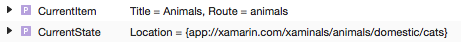

# Xamarin.Forms Shell navigation

[ Download the sample](/samples/xamarin/xamarin-forms-samples/userinterface-xaminals/)

Xamarin.Forms Shell includes a URI-based navigation experience that uses routes to navigate to any page in the application, without having to follow a set navigation hierarchy. In addition, it also provides the ability to navigate backwards without having to visit all of the pages on the navigation stack.

The [`Shell`](xref:Xamarin.Forms.Shell) class defines the following navigation-related properties:

- [`BackButtonBehavior`](xref:Xamarin.Forms.Shell.BackButtonBehaviorProperty), of type [`BackButtonBehavior`](xref:Xamarin.Forms.BackButtonBehavior), an attached property that defines the behavior of the back button.
- [`CurrentItem`](xref:Xamarin.Forms.Shell.CurrentItem), of type [`ShellItem`](xref:Xamarin.Forms.ShellItem), the currently selected item.
- [`CurrentPage`](xref:Xamarin.Forms.Shell.CurrentPage), of type [`Page`](xref:Xamarin.Forms.Page), the currently presented page.
- [`CurrentState`](xref:Xamarin.Forms.Shell.CurrentState), of type [`ShellNavigationState`](xref:Xamarin.Forms.ShellNavigationState), the current navigation state of the [`Shell`](xref:Xamarin.Forms.Shell).
- [`Current`](xref:Xamarin.Forms.Shell.Current), of type [`Shell`](xref:Xamarin.Forms.Shell), a type-casted alias for `Application.Current.MainPage`.

The [`BackButtonBehavior`](xref:Xamarin.Forms.Shell.BackButtonBehaviorProperty), [`CurrentItem`](xref:Xamarin.Forms.Shell.CurrentItem), and [`CurrentState`](xref:Xamarin.Forms.Shell.CurrentState) properties are backed by [`BindableProperty`](xref:Xamarin.Forms.BindableProperty) objects, which means that these properties can be targets of data bindings.

Navigation is performed by invoking the [`GoToAsync`](xref:Xamarin.Forms.Shell.GoToAsync*) method, from the [`Shell`](xref:Xamarin.Forms.Shell) class. When navigation is about to be performed, the [`Navigating`](xref:Xamarin.Forms.Shell.Navigating) event is fired, and the [`Navigated`](xref:Xamarin.Forms.Shell.Navigated) event is fired when navigation completes.

> [!NOTE]
> Navigation can still be performed between pages in a Shell application by using the [Navigation](xref:Xamarin.Forms.NavigableElement.Navigation) property. For more information, see [Hierarchical Navigation](~/xamarin-forms/app-fundamentals/navigation/hierarchical.md).

## Routes

Navigation is performed in a Shell application by specifying a URI to navigate to. Navigation URIs can have three components:

- A *route*, which defines the path to content that exists as part of the Shell visual hierarchy.
- A *page*. Pages that don't exist in the Shell visual hierarchy can be pushed onto the navigation stack from anywhere within a Shell application. For example, a details page won't be defined in the Shell visual hierarchy, but can be pushed onto the navigation stack as required.
- One or more *query parameters*. Query parameters are parameters that can be passed to the destination page while navigating.

When a navigation URI includes all three components, the structure is: //route/page?queryParameters

### Register routes

Routes can be defined on [`FlyoutItem`](xref:Xamarin.Forms.FlyoutItem), [`TabBar`](xref:Xamarin.Forms.TabBar), [`Tab`](xref:Xamarin.Forms.Tab), and [`ShellContent`](xref:Xamarin.Forms.ShellContent) objects, through their `Route` properties:

```xaml
<Shell ...>
    <FlyoutItem ...
                Route="animals">
        <Tab ...
             Route="domestic">
            <ShellContent ...
                          Route="cats" />
            <ShellContent ...
                          Route="dogs" />
        </Tab>
        <ShellContent ...
                      Route="monkeys" />
        <ShellContent ...
                      Route="elephants" />  
        <ShellContent ...
                      Route="bears" />
    </FlyoutItem>
    <ShellContent ...
                  Route="about" />                  
    ...
</Shell>
```

> [!NOTE]
> All items in the Shell hierarchy have a route associated with them. If you don't set a route, one is generated at runtime. However, generated routes are not guaranteed to be consistent across different application sessions.

The above example creates the following route hierarchy, which can be used in programmatic navigation:

```
animals
  domestic
    cats
    dogs
  monkeys
  elephants
  bears
about
```

To navigate to the [`ShellContent`](xref:Xamarin.Forms.ShellContent) object for the `dogs` route, the absolute route URI is `//animals/domestic/dogs`. Similarly, to navigate to the `ShellContent` object for the `about` route, the absolute route URI is `//about`.

> [!WARNING]
> An `ArgumentException` will be thrown on application startup if a duplicate route is detected. This exception will also be thrown if two or more routes at the same level in the hierarchy share a route name.

### Register detail page routes

In the [`Shell`](xref:Xamarin.Forms.Shell) subclass constructor, or any other location that runs before a route is invoked, additional routes can be explicitly registered for any detail pages that aren't represented in the Shell visual hierarchy. This is accomplished with the [`Routing.RegisterRoute`](xref:Xamarin.Forms.Routing.RegisterRoute*) method:

```csharp
Routing.RegisterRoute("monkeydetails", typeof(MonkeyDetailPage));
Routing.RegisterRoute("beardetails", typeof(BearDetailPage));
Routing.RegisterRoute("catdetails", typeof(CatDetailPage));
Routing.RegisterRoute("dogdetails", typeof(DogDetailPage));
Routing.RegisterRoute("elephantdetails", typeof(ElephantDetailPage));
```

This example registers detail pages, that aren't defined in the [`Shell`](xref:Xamarin.Forms.Shell) subclass, as routes. These detail pages can then be navigated to using URI-based navigation, from anywhere within the application. The routes for such pages are known as *global routes*.

> [!WARNING]
> An `ArgumentException` will be thrown if the [`Routing.RegisterRoute`](xref:Xamarin.Forms.Routing.RegisterRoute*) method attempts to register the same route to two or more different types.

Alternatively, pages can be registered at different route hierarchies if required:

```csharp
Routing.RegisterRoute("monkeys/details", typeof(MonkeyDetailPage));
Routing.RegisterRoute("bears/details", typeof(BearDetailPage));
Routing.RegisterRoute("cats/details", typeof(CatDetailPage));
Routing.RegisterRoute("dogs/details", typeof(DogDetailPage));
Routing.RegisterRoute("elephants/details", typeof(ElephantDetailPage));
```

This example enables contextual page navigation, where navigating to the `details` route from the page for the `monkeys` route displays the `MonkeyDetailPage`. Similarly, navigating to the `details` route from the page for the `elephants` route displays the `ElephantDetailPage`. For more information, see [Contextual navigation](#contextual-navigation).

> [!NOTE]
> Pages whose routes have been registered with the [`Routing.RegisterRoute`](xref:Xamarin.Forms.Routing.RegisterRoute*) method can be deregistered with the [`Routing.UnRegisterRoute`](xref:Xamarin.Forms.Routing.UnRegisterRoute*) method, if required.

## Perform navigation

To perform navigation, a reference to the [`Shell`](xref:Xamarin.Forms.Shell) subclass must first be obtained. This reference can be obtained by casting the `App.Current.MainPage` property to a `Shell` object, or through the [`Shell.Current`](xref:Xamarin.Forms.Shell.Current) property. Navigation can then be performed by calling the [`GoToAsync`](xref:Xamarin.Forms.Shell.GoToAsync*) method on the `Shell` object. This method navigates to a [`ShellNavigationState`](xref:Xamarin.Forms.ShellNavigationState) and returns a `Task` that will complete once the navigation animation has completed. The `ShellNavigationState` object is constructed by the `GoToAsync` method, from a `string`, or a `Uri`, and it has its `Location` property set to the `string` or `Uri` argument.

> [!IMPORTANT]
> When a route from the Shell visual hierarchy is navigated to, a navigation stack isn't created. However, when a page that's not in the Shell visual hierarchy is navigated to, a navigation stack is created.

The current navigation state of the [`Shell`](xref:Xamarin.Forms.Shell) object can be retrieved through the [`Shell.Current.CurrentState`](xref:Xamarin.Forms.Shell.CurrentState) property, which includes the URI of the displayed route in the `Location` property.

### Absolute routes

Navigation can be performed by specifying a valid absolute URI as an argument to the [`GoToAsync`](xref:Xamarin.Forms.Shell.GoToAsync*) method:

```csharp
await Shell.Current.GoToAsync("//animals/monkeys");
```

This example navigates to the page for the `monkeys` route, with the route being defined on a [`ShellContent`](xref:Xamarin.Forms.ShellContent) object. The `ShellContent` object that represents the `monkeys` route is a child of a [`FlyoutItem`](xref:Xamarin.Forms.FlyoutItem) object, whose route is `animals`.

### Relative routes

Navigation can also be performed by specifying a valid relative URI as an argument to the [`GoToAsync`](xref:Xamarin.Forms.Shell.GoToAsync*) method. The routing system will attempt to match the URI to a [`ShellContent`](xref:Xamarin.Forms.ShellContent) object. Therefore, if all the routes in an application are unique, navigation can be performed by only specifying the unique route name as a relative URI.

The following relative route formats are supported:

| Format | Description |
| --- | --- |
| *route* | The route hierarchy will be searched for the specified route, upwards from the current position. The matching page will be pushed to the navigation stack. |
| /*route* | The route hierarchy will be searched from the specified route, downwards from the current position. The matching page will be pushed to the navigation stack. |
| //*route* | The route hierarchy will be searched for the specified route, upwards from the current position. The matching page will replace the navigation stack. |
| ///*route* | The route hierarchy will be searched for the specified route, downwards from the current position. The matching page will replace the navigation stack. |

The following example navigates to the page for the `monkeydetails` route:

```csharp
await Shell.Current.GoToAsync("monkeydetails");
```

In this example, the `monkeyDetails` route is searched for up the hierarchy until the matching page is found. When the page is found, it's pushed to the navigation stack.

#### Contextual navigation

Relative routes enable contextual navigation. For example, consider the following route hierarchy:

```
monkeys
  details
bears
  details
```

When the registered page for the `monkeys` route is displayed, navigating to the `details` route will display the registered page for the `monkeys/details` route. Similarly, when the registered page for the `bears` route is displayed, navigating to the `details` route will display the registered page for the `bears/details` route. For information on how to register the routes in this example, see [Register page routes](#register-detail-page-routes).

### Backwards navigation

Backwards navigation can be performed by specifying ".." as the argument to the [`GoToAsync`](xref:Xamarin.Forms.Shell.GoToAsync*) method:

```csharp
await Shell.Current.GoToAsync("..");
```

Backwards navigation with ".." can also be combined with a route:

```csharp
await Shell.Current.GoToAsync("../route");
```

In this example, backwards navigation is performed, and then navigation to the specified route.

> [!IMPORTANT]
> Navigating backwards and into a specified route is only possible if the backwards navigation places you at the current location in the route hierarchy to navigate to the specified route.

Similarly, it's possible to navigate backwards multiple times, and then navigate to a specified route:

```csharp
await Shell.Current.GoToAsync("../../route");
```

In this example, backwards navigation is performed twice, and then navigation to the specified route.

In addition, data can be passed through query properties when navigating backwards:

```csharp
await Shell.Current.GoToAsync($"..?parameterToPassBack={parameterValueToPassBack}");
```

In this example, backwards navigation is performed, and the query parameter value is passed to the query parameter on the previous page.

> [!NOTE]
> Query parameters can be appended to any backwards navigation request.

For more information about passing data when navigating, see [Pass data](#pass-data).

### Invalid routes

The following route formats are invalid:

| Format | Explanation |
| --- | --- |
| //*page* or ///*page* | Global routes currently can't be the only page on the navigation stack. Therefore, absolute routing to global routes is unsupported. |

Use of these route formats results in an `Exception` being thrown.

> [!WARNING]
> Attempting to navigate to a non-existent route results in an `ArgumentException` exception being thrown.

### Debugging navigation

Some of the Shell classes are decorated with the `DebuggerDisplayAttribute`, which specifies how a class or field is displayed by the debugger. This can help to debug navigation requests by displaying data related to the navigation request. For example, the following screenshot shows the [`CurrentItem`](xref:Xamarin.Forms.Shell.CurrentItem) and [`CurrentState`](xref:Xamarin.Forms.Shell.CurrentState) properties of the [`Shell.Current`](xref:Xamarin.Forms.Shell.Current) object:



In this example, the [`CurrentItem`](xref:Xamarin.Forms.Shell.CurrentItem) property, of type [`FlyoutItem`](xref:Xamarin.Forms.FlyoutItem), displays the title and route of the `FlyoutItem` object. Similarly, the [`CurrentState`](xref:Xamarin.Forms.Shell.CurrentState) property, of type [`ShellNavigationState`](xref:Xamarin.Forms.ShellNavigationState), displays the URI of the displayed route within the Shell application.

### Navigation stack

The [`Tab`](xref:Xamarin.Forms.Tab) class defines a [`Stack`](xref:Xamarin.Forms.ShellSection.Stack) property, of type `IReadOnlyList<Page>`, which represents the current navigation stack within the `Tab`. The class also provides the following overridable navigation methods:

- [`GetNavigationStack`](xref:Xamarin.Forms.ShellSection.GetNavigationStack*), returns `IReadOnlyList<Page>`, the current navigation stack.
- [`OnInsertPageBefore`](xref:Xamarin.Forms.ShellSection.OnInsertPageBefore*), that's called when `INavigation.InsertPageBefore` is called.
- [`OnPopAsync`](xref:Xamarin.Forms.ShellSection.OnPopAsync*), returns `Task<Page>`, and is called when `INavigation.PopAsync` is called.
- [`OnPopToRootAsync`](xref:Xamarin.Forms.ShellSection.OnPopToRootAsync*), returns `Task`, and is called when `INavigation.OnPopToRootAsync` is called.
- [`OnPushAsync`](xref:Xamarin.Forms.ShellSection.OnPushAsync*), returns `Task`, and is called when `INavigation.PushAsync` is called.
- [`OnRemovePage`](xref:Xamarin.Forms.ShellSection.OnRemovePage*), that's called when `INavigation.RemovePage` is called.

The following example shows how to override the [`OnRemovePage`](xref:Xamarin.Forms.ShellSection.OnRemovePage*) method:

```csharp
public class MyTab : Tab
{
    protected override void OnRemovePage(Page page)
    {
        base.OnRemovePage(page);

        // Custom logic
    }
}
```

In this example, `MyTab` objects should be consumed in your Shell visual hierarchy instead of [`Tab`](xref:Xamarin.Forms.Tab) objects.

## Navigation events

The [`Shell`](xref:Xamarin.Forms.Shell) class defines the [`Navigating`](xref:Xamarin.Forms.Shell.Navigating) event, which is fired when navigation is about to be performed, either due to programmatic navigation or user interaction. The [`ShellNavigatingEventArgs`](xref:Xamarin.Forms.ShellNavigatingEventArgs) object that accompanies the `Navigating` event provides the following properties:

| Property | Type | Description |
|---|---|---|
| [`Current`](xref:Xamarin.Forms.ShellNavigatingEventArgs.Current) | [`ShellNavigationState`](xref:Xamarin.Forms.ShellNavigationState) | The URI of the current page. |
| [`Source`](xref:Xamarin.Forms.ShellNavigatingEventArgs.Source) | [`ShellNavigationSource`](xref:Xamarin.Forms.ShellNavigationSource) | The type of navigation that occurred. |
| [`Target`](xref:Xamarin.Forms.ShellNavigatingEventArgs.Target) | [`ShellNavigationState`](xref:Xamarin.Forms.ShellNavigationState) | The URI representing where the navigation is destined. |
| [`CanCancel`](xref:Xamarin.Forms.ShellNavigatingEventArgs.CanCancel)  | `bool` | A value indicating if it's possible to cancel the navigation. |
| [`Cancelled`](xref:Xamarin.Forms.ShellNavigatingEventArgs.Cancelled)  | `bool` | A value indicating if the navigation was canceled. |

In addition, the [`ShellNavigatingEventArgs`](xref:Xamarin.Forms.ShellNavigatingEventArgs) class provides a [`Cancel`](xref:Xamarin.Forms.ShellNavigatingEventArgs.Cancel*) method that can be used to cancel navigation, and a [`GetDeferral`](xref:Xamarin.Forms.ShellNavigatingEventArgs.GetDeferral*) method that returns a [`ShellNavigatingDeferral`](xref:Xamarin.Forms.ShellNavigatingDeferral) token that can be used to complete navigation. For more information about navigation deferral, see [Navigation deferral](#navigation-deferral).

The [`Shell`](xref:Xamarin.Forms.Shell) class also defines the [`Navigated`](xref:Xamarin.Forms.Shell.Navigated) event, which is fired when navigation has completed. The [`ShellNavigatedEventArgs`](xref:Xamarin.Forms.ShellNavigatedEventArgs) object that accompanies the `Navigated` event provides the following properties:

| Property | Type | Description |
|---|---|---|
| [`Current`](xref:Xamarin.Forms.ShellNavigatedEventArgs.Current)  | [`ShellNavigationState`](xref:Xamarin.Forms.ShellNavigationState) | The URI of the current page. |
| [`Previous`](xref:Xamarin.Forms.ShellNavigatedEventArgs.Previous) | [`ShellNavigationState`](xref:Xamarin.Forms.ShellNavigationState) | The URI of the previous page. |
| [`Source`](xref:Xamarin.Forms.ShellNavigatedEventArgs.Source) | [`ShellNavigationSource`](xref:Xamarin.Forms.ShellNavigationState) | The type of navigation that occurred. |

> [!IMPORTANT]
> The `OnNavigating` method is called when the [`Navigating`](xref:Xamarin.Forms.Shell.Navigating) event fires. Similarly, the `OnNavigated` method is called when the [`Navigated`](xref:Xamarin.Forms.Shell.Navigated) event fires. Both methods can be overridden in your [`Shell`](xref:Xamarin.Forms.Shell) subclass to intercept navigation requests.

The [`ShellNavigatedEventArgs`](xref:Xamarin.Forms.ShellNavigatedEventArgs) and [`ShellNavigatingEventArgs`](xref:Xamarin.Forms.ShellNavigatingEventArgs) classes both have `Source` properties, of type [`ShellNavigationSource`](xref:Xamarin.Forms.ShellNavigationSource). This enumeration provides the following values:

- `Unknown`
- `Push`
- `Pop`
- `PopToRoot`
- `Insert`
- `Remove`
- `ShellItemChanged`
- `ShellSectionChanged`
- `ShellContentChanged`

Therefore, navigation can be intercepted in an `OnNavigating` override and actions can be performed based on the navigation source. For example, the following code shows how to cancel backwards navigation if the data on the page is unsaved:

```csharp
protected override void OnNavigating(ShellNavigatingEventArgs args)
{
    base.OnNavigating(args);

    // Cancel any back navigation.
    if (args.Source == ShellNavigationSource.Pop)
    {
        args.Cancel();
    }
// }
```

## Navigation deferral

Shell navigation can be intercepted and completed or canceled based on user choice. This can be achieved by overriding the `OnNavigating` method in your [`Shell`](xref:Xamarin.Forms.Shell) subclass, and by calling the [`GetDeferral`](xref:Xamarin.Forms.ShellNavigatingEventArgs.GetDeferral*) method on the [`ShellNavigatingEventArgs`](xref:Xamarin.Forms.ShellNavigatingEventArgs) object. This method returns a [`ShellNavigatingDeferral`](xref:Xamarin.Forms.ShellNavigatingDeferral) token that has a [`Complete`](xref:Xamarin.Forms.ShellNavigatingDeferral.Complete*) method, which can be used to complete the navigation request:

```csharp
public MyShell : Shell
{
    // ...
    protected override async void OnNavigating(ShellNavigatingEventArgs args)
    {
        base.OnNavigating(args);

        ShellNavigatingDeferral token = args.GetDeferral();

        var result = await DisplayActionSheet("Navigate?", "Cancel", "Yes", "No");
        if (result != "Yes")
        {
            args.Cancel();
        }
        token.Complete();
    }    
}
```

In this example, an action sheet is displayed that invites the user to complete the navigation request, or cancel it. Navigation is canceled by invoking the [`Cancel`](xref:Xamarin.Forms.ShellNavigatingEventArgs.Cancel*) method on the [`ShellNavigatingEventArgs`](xref:Xamarin.Forms.ShellNavigatingEventArgs) object. Navigation is completed by invoking the [`Complete`](xref:Xamarin.Forms.ShellNavigatingDeferral.Complete*) method on the [`ShellNavigatingDeferral`](xref:Xamarin.Forms.ShellNavigatingDeferral) token that was retrieved by the `GetDeferral` method on the `ShellNavigatingEventArgs` object.

> [!WARNING]
> The [`GoToAsync`](xref:Xamarin.Forms.Shell.GoToAsync*) method will throw a `InvalidOperationException` if a user tries to navigate while there is a pending navigation deferral.

## Pass data

Data can be passed as query parameters when performing URI-based programmatic navigation. This is achieved by appending `?` after a route, followed by a query parameter id, `=`, and a value. For example, the following code is executed in the sample application when a user selects an elephant on the `ElephantsPage`:

```csharp
async void OnCollectionViewSelectionChanged(object sender, SelectionChangedEventArgs e)
{
    string elephantName = (e.CurrentSelection.FirstOrDefault() as Animal).Name;
    await Shell.Current.GoToAsync($"elephantdetails?name={elephantName}");
}
```

This code example retrieves the currently selected elephant in the [`CollectionView`](xref:Xamarin.Forms.CollectionView), and navigates to the `elephantdetails` route, passing `elephantName` as a query parameter.

There are two approaches to receiving navigation data:

1. The class that represents the page being navigated to, or the class for the page's [`BindingContext`](xref:Xamarin.Forms.BindableObject.BindingContext), can be decorated with a [`QueryPropertyAttribute`](xref:Xamarin.Forms.QueryPropertyAttribute) for each query parameter. For more information, see [Process navigation data using query property attributes](#process-navigation-data-using-query-property-attributes).
1. The class that represents the page being navigated to, or the class for the page's [`BindingContext`](xref:Xamarin.Forms.BindableObject.BindingContext), can implement the [`IQueryAttributable`](xref:Xamarin.Forms.IQueryAttributable) interface. For more information, see [Process navigation data using a single method](#process-navigation-data-using-a-single-method).

### Process navigation data using query property attributes

Navigation data can be received by decorating the receiving class with a [`QueryPropertyAttribute`](xref:Xamarin.Forms.QueryPropertyAttribute) for each query parameter:

```csharp
[QueryProperty(nameof(Name), "name")]
public partial class ElephantDetailPage : ContentPage
{
    public string Name
    {
        set
        {
            LoadAnimal(value);
        }
    }
    ...

    void LoadAnimal(string name)
    {
        try
        {
            Animal animal = ElephantData.Elephants.FirstOrDefault(a => a.Name == name);
            BindingContext = animal;
        }
        catch (Exception)
        {
            Console.WriteLine("Failed to load animal.");
        }
    }    
}
```

The first argument for the [`QueryPropertyAttribute`](xref:Xamarin.Forms.QueryPropertyAttribute) specifies the name of the property that will receive the data, with the second argument specifying the query parameter id. Therefore, the `QueryPropertyAttribute` in the above example specifies that the `Name` property will receive the data passed in the `name` query parameter from the URI in the [`GoToAsync`](xref:Xamarin.Forms.Shell.GoToAsync*) method call. The `Name` property setter calls the `LoadAnimal` method to retrieve the `Animal` object for the `name`, and sets it as the [`BindingContext`](xref:Xamarin.Forms.BindableObject.BindingContext) of the page.

> [!NOTE]
> Query parameter values that are received via the [`QueryPropertyAttribute`](xref:Xamarin.Forms.QueryPropertyAttribute) are automatically URL decoded.

### Process navigation data using a single method

Navigation data can be received by implementing the [`IQueryAttributable`](xref:Xamarin.Forms.IQueryAttributable) interface on the receiving class. The [`IQueryAttributable`](xref:Xamarin.Forms.IQueryAttributable) interface specifies that the implementing class must implement the [`ApplyQueryAttributes`](xref:Xamarin.Forms.IQueryAttributable.ApplyQueryAttributes*) method. This method has a `query` argument, of type `IDictionary<string, string>`, that contains any data passed during navigation. Each key in the dictionary is a query parameter id, with its value being the query parameter value. The advantage of using this approach is that navigation data can be processed using a single method, which can be useful when you have multiple items of navigation data that require processing as a whole.

The following example shows a view model class that implements the [`IQueryAttributable`](xref:Xamarin.Forms.IQueryAttributable) interface:

```csharp
public class MonkeyDetailViewModel : IQueryAttributable, INotifyPropertyChanged
{
    public Animal Monkey { get; private set; }

    public void ApplyQueryAttributes(IDictionary<string, string> query)
    {
        // The query parameter requires URL decoding.
        string name = HttpUtility.UrlDecode(query["name"]);
        LoadAnimal(name);
    }

    void LoadAnimal(string name)
    {
        try
        {
            Monkey = MonkeyData.Monkeys.FirstOrDefault(a => a.Name == name);
            OnPropertyChanged("Monkey");
        }
        catch (Exception)
        {
            Console.WriteLine("Failed to load animal.");
        }
    }
    ...
}
```

In this example, the [`ApplyQueryAttributes`](xref:Xamarin.Forms.IQueryAttributable.ApplyQueryAttributes*) method retrieves the value of the `name` query parameter from the URI in the [`GoToAsync`](xref:Xamarin.Forms.Shell.GoToAsync*) method call. Then, the `LoadAnimal` method is called to retrieve the `Animal` object, where its set as the value of the `Monkey` property that is data bound to.

> [!IMPORTANT]
> Query parameter values that are received via the [`IQueryAttributable`](xref:Xamarin.Forms.IQueryAttributable) interface aren't automatically URL decoded.

#### Pass and process multiple query parameters

Multiple query parameters can be passed by connecting them with `&`. For example, the following code passes two data items:

```csharp
async void OnCollectionViewSelectionChanged(object sender, SelectionChangedEventArgs e)
{
    string elephantName = (e.CurrentSelection.FirstOrDefault() as Animal).Name;
    string elephantLocation = (e.CurrentSelection.FirstOrDefault() as Animal).Location;
    await Shell.Current.GoToAsync($"elephantdetails?name={elephantName}&location={elephantLocation}");
}
```

This code example retrieves the currently selected elephant in the [`CollectionView`](xref:Xamarin.Forms.CollectionView), and navigates to the `elephantdetails` route, passing `elephantName` and `elephantLocation` as query parameters.

To receive multiple items of data, the class that represents the page being navigated to, or the class for the page's [`BindingContext`](xref:Xamarin.Forms.BindableObject.BindingContext), can be decorated with a [`QueryPropertyAttribute`](xref:Xamarin.Forms.QueryPropertyAttribute) for each query parameter:

```csharp
[QueryProperty(nameof(Name), "name")]
[QueryProperty(nameof(Location), "location")]
public partial class ElephantDetailPage : ContentPage
{
    public string Name
    {
        set
        {
            // Custom logic
        }
    }

    public string Location
    {
        set
        {
            // Custom logic
        }
    }
    ...    
}
```

In this example, the class is decorated with a [`QueryPropertyAttribute`](xref:Xamarin.Forms.QueryPropertyAttribute) for each query parameter. The first `QueryPropertyAttribute` specifies that the `Name` property will receive the data passed in the `name` query parameter, while the second `QueryPropertyAttribute` specifies that the `Location` property will receive the data passed in the `location` query parameter. In both cases, the query parameter values are specified in the URI in the [`GoToAsync`](xref:Xamarin.Forms.Shell.GoToAsync*) method call.

Alternatively, navigation data can be processed by a single method by implementing the [`IQueryAttributable`](xref:Xamarin.Forms.IQueryAttributable) interface on the class that represents the page being navigated to, or the class for the page's [`BindingContext`](xref:Xamarin.Forms.BindableObject.BindingContext):

```csharp
public class ElephantDetailViewModel : IQueryAttributable, INotifyPropertyChanged
{
    public Animal Elephant { get; private set; }

    public void ApplyQueryAttributes(IDictionary<string, string> query)
    {
        string name = HttpUtility.UrlDecode(query["name"]);
        string location = HttpUtility.UrlDecode(query["location"]);
        ...        
    }
    ...
}
```

In this example, the [`ApplyQueryAttributes`](xref:Xamarin.Forms.IQueryAttributable.ApplyQueryAttributes*) method retrieves the value of the `name` and `location` query parameters from the URI in the [`GoToAsync`](xref:Xamarin.Forms.Shell.GoToAsync*) method call.

## Back button behavior

Back button appearance and behavior can be redefined by setting the [`BackButtonBehavior`](xref:Xamarin.Forms.Shell.BackButtonBehaviorProperty) attached property to a [`BackButtonBehavior`](xref:Xamarin.Forms.BackButtonBehavior) object. The [`BackButtonBehavior`](xref:Xamarin.Forms.BackButtonBehavior) class defines the following properties:

- [`Command`](xref:Xamarin.Forms.BackButtonBehavior.Command), of type `ICommand`, which is executed when the back button is pressed.
- [`CommandParameter`](xref:Xamarin.Forms.BackButtonBehavior.CommandParameter), of type `object`, which is the parameter that's passed to the `Command`.
- [`IconOverride`](xref:Xamarin.Forms.BackButtonBehavior.IconOverride), of type [`ImageSource`](xref:Xamarin.Forms.ImageSource), the icon used for the back button.
- [`IsEnabled`](xref:Xamarin.Forms.BackButtonBehavior.IsEnabled), of type `boolean`, indicates whether the back button is enabled. The default value is `true`.
- [`TextOverride`](xref:Xamarin.Forms.BackButtonBehavior.TextOverride), of type `string`, the text used for the back button.

All of these properties are backed by [`BindableProperty`](xref:Xamarin.Forms.BindableProperty) objects, which means that the properties can be targets of data bindings.

The following code shows an example of redefining back button appearance and behavior:

```xaml
<ContentPage ...>    
    <Shell.BackButtonBehavior>
        <BackButtonBehavior Command="{Binding BackCommand}"
                            IconOverride="back.png" />   
    </Shell.BackButtonBehavior>
    ...
</ContentPage>
```

The equivalent C# code is:

```csharp
Shell.SetBackButtonBehavior(this, new BackButtonBehavior
{
    Command = new Command(() =>
    {
        ...
    }),
    IconOverride = "back.png"
});
```

The [`Command`](xref:Xamarin.Forms.BackButtonBehavior.Command) property is set to an `ICommand` to be executed when the back button is pressed, and the `IconOverride` property is set to the icon that's used for the back button:

[](navigation-images/back-button-large.png#lightbox)

## Related links

- [Xaminals (sample)](/samples/xamarin/xamarin-forms-samples/userinterface-xaminals/)
