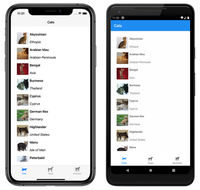
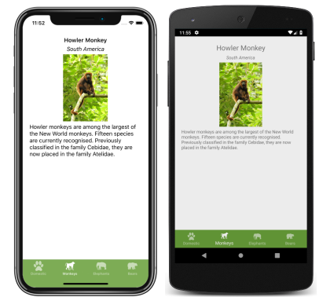

# Xamarin.Forms Shell pages

[ Download the sample](/samples/xamarin/xamarin-forms-samples/userinterface-xaminals/)

A [`ShellContent`](xref:Xamarin.Forms.ShellContent) object represents the [`ContentPage`](xref:Xamarin.Forms.ContentPage) object for each [`FlyoutItem`](xref:Xamarin.Forms.FlyoutItem) or [`Tab`](xref:Xamarin.Forms.Tab). When more than one `ShellContent` object is present in a `Tab` object, the `ContentPage` objects will be navigable by top tabs. Within a page, additional `ContentPage` objects that are known as detail pages, can be navigated to.

In addition, the [`Shell`](xref:Xamarin.Forms.Shell) class defines attached properties that can be used to configure the appearance of pages in Xamarin.Forms Shell applications. This includes setting page colors, setting the page presentation mode, disabling the navigation bar, disabling the tab bar, and displaying views in the navigation bar.

## Display pages

In Xamarin.Forms Shell applications, pages are typically created on demand in response to navigation. This is accomplished by using the [`DataTemplate`](xref:Xamarin.Forms.Xaml.DataTemplateExtension) markup extension to set the [`ContentTemplate`](xref:Xamarin.Forms.ShellContent.ContentTemplate) property of each [`ShellContent`](xref:Xamarin.Forms.ShellContent) object to a [`ContentPage`](xref:Xamarin.Forms.ContentPage) object:

```xaml
<Shell xmlns="http://xamarin.com/schemas/2014/forms"
       xmlns:x="http://schemas.microsoft.com/winfx/2009/xaml"
       xmlns:views="clr-namespace:Xaminals.Views"
       x:Class="Xaminals.AppShell">
    <TabBar>
       <ShellContent Title="Cats"
                     Icon="cat.png"
                     ContentTemplate="{DataTemplate views:CatsPage}" />
       <ShellContent Title="Dogs"
                     Icon="dog.png"
                     ContentTemplate="{DataTemplate views:DogsPage}" />
       <ShellContent Title="Monkeys"
                     Icon="monkey.png"
                     ContentTemplate="{DataTemplate views:MonkeysPage}" />
    </TabBar>
</Shell>
```

In this example, Shell's implicit conversion operators are used to remove the [`Tab`](xref:Xamarin.Forms.Tab) objects from the visual hierarchy. However, each [`ShellContent`](xref:Xamarin.Forms.ShellContent) object is rendered in a tab:

[](pages-images/three-pages-large.png#lightbox)

> [!NOTE]
> The [`BindingContext`](xref:Xamarin.Forms.BindableObject.BindingContext) of each [`ShellContent`](xref:Xamarin.Forms.ShellContent) object is inherited from the parent [`Tab`](xref:Xamarin.Forms.Tab) object.

Within each [`ContentPage`](xref:Xamarin.Forms.ContentPage) object, additional `ContentPage` objects can be navigated to. For more information about navigation, see [Xamarin.Forms Shell navigation](navigation.md).

## Load pages at application startup

In a Shell application, each [`ContentPage`](xref:Xamarin.Forms.ContentPage) object is typically created on demand, in response to navigation. However, it's also possible to create `ContentPage` objects at application startup.

> [!WARNING]
> [`ContentPage`](xref:Xamarin.Forms.ContentPage) objects that are created at application startup can lead to a poor startup experience.

[`ContentPage`](xref:Xamarin.Forms.ContentPage) objects can be created at application startup by setting the [`ShellContent.Content`](xref:Xamarin.Forms.ShellContent.Content) properties to `ContentPage` objects:

```xaml
<Shell xmlns="http://xamarin.com/schemas/2014/forms"
       xmlns:x="http://schemas.microsoft.com/winfx/2009/xaml"
       xmlns:views="clr-namespace:Xaminals.Views"
       x:Class="Xaminals.AppShell">
    <TabBar>
     <ShellContent Title="Cats"
                   Icon="cat.png">
         <views:CatsPage />
     </ShellContent>
     <ShellContent Title="Dogs"
                   Icon="dog.png">
         <views:DogsPage />
     </ShellContent>
     <ShellContent Title="Monkeys"
                   Icon="monkey.png">
         <views:MonkeysPage />
     </ShellContent>
    </TabBar>
</Shell>
```

In this example, `CatsPage`, `DogsPage`, and `MonkeysPage` are all created at application startup, rather than on demand in response to navigation.

> [!NOTE]
> The [`Content`](xref:Xamarin.Forms.ShellContent.Content) property is the content property of the [`ShellContent`](xref:Xamarin.Forms.ShellContent) class, and therefore does not need to be explicitly set.

## Set page colors

The [`Shell`](xref:Xamarin.Forms.Shell) class defines the following attached properties that can be used to set page colors in a Shell application:

- [`BackgroundColor`](xref:Xamarin.Forms.Shell.BackgroundColorProperty), of type [`Color`](xref:Xamarin.Forms.Color), that defines the background color in the Shell chrome. The color will not fill in behind the Shell content.
- [`DisabledColor`](xref:Xamarin.Forms.Shell.DisabledColorProperty), of type [`Color`](xref:Xamarin.Forms.Color), that defines the color to shade text and icons that are disabled.
- [`ForegroundColor`](xref:Xamarin.Forms.Shell.ForegroundColorProperty), of type [`Color`](xref:Xamarin.Forms.Color), that defines the color to shade text and icons.
- [`TitleColor`](xref:Xamarin.Forms.Shell.TitleColorProperty), of type [`Color`](xref:Xamarin.Forms.Color), that defines the color used for the title of the current page.
- [`UnselectedColor`](xref:Xamarin.Forms.Shell.UnselectedColorProperty), of type [`Color`](xref:Xamarin.Forms.Color), that defines the color used for unselected text and icons in the Shell chrome.

All of these properties are backed by [`BindableProperty`](xref:Xamarin.Forms.BindableProperty) objects, which mean that the properties can be targets of data bindings, and styled using XAML styles. In addition, the properties can be set using Cascading Style Sheets (CSS). For more information, see [Xamarin.Forms Shell specific properties](~/xamarin-forms/user-interface/styles/css/index.md#xamarinforms-shell-specific-properties).

> [!NOTE]
> There are also properties that enable tab colors to be defined. For more information, see [Tab appearance](tabs.md#tab-appearance).

The following XAML shows setting the color properties in a subclassed [`Shell`](xref:Xamarin.Forms.Shell) class:

```xaml
<Shell xmlns="http://xamarin.com/schemas/2014/forms"
       xmlns:x="http://schemas.microsoft.com/winfx/2009/xaml"
       x:Class="Xaminals.AppShell"
       BackgroundColor="#455A64"
       ForegroundColor="White"
       TitleColor="White"
       DisabledColor="#B4FFFFFF"
       UnselectedColor="#95FFFFFF">

</Shell>
```

In this example, the color values will be applied to all pages in the Shell application, unless overridden at the page level.

Because the color properties are attached properties, they can also be set on individual pages, to set the colors on that page:

```xaml
<ContentPage ...
             Shell.BackgroundColor="Gray"
             Shell.ForegroundColor="White"
             Shell.TitleColor="Blue"
             Shell.DisabledColor="#95FFFFFF"
             Shell.UnselectedColor="#B4FFFFFF">

</ContentPage>
```

Alternatively, the color properties can be set with a XAML style:

```xaml
<Style x:Key="DomesticShell"
       TargetType="Element" >
    <Setter Property="Shell.BackgroundColor"
            Value="#039BE6" />
    <Setter Property="Shell.ForegroundColor"
            Value="White" />
    <Setter Property="Shell.TitleColor"
            Value="White" />
    <Setter Property="Shell.DisabledColor"
            Value="#B4FFFFFF" />
    <Setter Property="Shell.UnselectedColor"
            Value="#95FFFFFF" />
</Style>
```

For more information about XAML styles, see [Styling Xamarin.Forms Apps using XAML Styles](~/xamarin-forms/user-interface/styles/xaml/index.md).

## Set page presentation mode

By default, a small navigation animation occurs when a page is navigated to with the [`GoToAsync`](xref:Xamarin.Forms.Shell.GoToAsync*) method. However, this behavior can be changed by setting the [`Shell.PresentationMode`](xref:Xamarin.Forms.Shell.PresentationModeProperty) attached property on a [`ContentPage`](xref:Xamarin.Forms.ContentPage) to one of the [`PresentationMode`](xref:Xamarin.Forms.PresentationMode) enumeration members:

- `NotAnimated` indicates that the page will be displayed without a navigation animation.
- `Animated` indicates that the page will be displayed with a navigation animation. This is the default value of the `Shell.PresentationMode` attached property.
- `Modal` indicates that the page will be displayed as a modal page.
- `ModalAnimated` indicates that the page will be displayed as a modal page, with a navigation animation.
- `ModalNotAnimated` indicates that the page will be displayed as a modal page, without a navigation animation.

> [!IMPORTANT]
> The `PresentationMode` type is a flags enumeration. This means that a combination of enumeration members can be applied in code. However, for ease of use in XAML, the `ModalAnimated` member is a combination of the `Animated` and `Modal` members, and the `ModalNotAnimated` member is a combination of the `NotAnimated` and `Modal` members. For more information about flag enumerations, see [Enumeration types as bit flags](/dotnet/csharp/language-reference/builtin-types/enum#enumeration-types-as-bit-flags).

The following XAML example sets the [`Shell.PresentationMode`](xref:Xamarin.Forms.Shell.PresentationModeProperty) attached property on a [`ContentPage`](xref:Xamarin.Forms.ContentPage):

```xaml
<ContentPage ...
             Shell.PresentationMode="Modal">
    ...             
</ContentPage>
```

In this example, the [`ContentPage`](xref:Xamarin.Forms.ContentPage) is set to be displayed as a modal page, when the page is navigated to with the [`GoToAsync`](xref:Xamarin.Forms.Shell.GoToAsync*) method.

## Enable navigation bar shadow

The [`Shell.NavBarHasShadow`](xref:Xamarin.Forms.Shell.NavBarHasShadowProperty) attached property, of type `bool`, controls whether the navigation bar has a shadow. By default the value of the property is `false` on iOS, and `true` on Android.

While this property can be set on a subclassed [`Shell`](xref:Xamarin.Forms.Shell) object, it can also be set on any pages that want to enable the navigation bar shadow. For example, the following XAML shows enabling the navigation bar shadow from a [`ContentPage`](xref:Xamarin.Forms.ContentPage):

```xaml
<ContentPage ...
             Shell.NavBarHasShadow="true">
    ...
</ContentPage>
```

This results in the navigation bar shadow being enabled.

## Disable the navigation bar

The [`Shell.NavBarIsVisible`](xref:Xamarin.Forms.Shell.NavBarIsVisibleProperty) attached property, of type `bool`, controls if the navigation bar is visible when a page is presented. By default the value of the property is `true`.

While this property can be set on a subclassed [`Shell`](xref:Xamarin.Forms.Shell) object, it's typically set on any pages that want to make the navigation bar invisible. For example, the following XAML shows disabling the navigation bar from a [`ContentPage`](xref:Xamarin.Forms.ContentPage):

```xaml
<ContentPage ...
             Shell.NavBarIsVisible="false">
    ...
</ContentPage>
```

This results in the navigation bar becoming invisible when the page is presented:



## Display views in the navigation bar

The [`Shell.TitleView`](xref:Xamarin.Forms.Shell.TitleViewProperty) attached property, of type [`View`](xref:Xamarin.Forms.View), enables any `View` to be displayed in the navigation bar.

While this property can be set on a subclassed [`Shell`](xref:Xamarin.Forms.Shell) object, it can also be set on any pages that want to display a view in the navigation bar. For example, the following XAML shows displaying an [`Image`](xref:Xamarin.Forms.Image) in the navigation bar of a [`ContentPage`](xref:Xamarin.Forms.ContentPage):

```xaml
<ContentPage ...>
    <Shell.TitleView>
        <Image Source="xamarin_logo.png"
               HorizontalOptions="Center"
               VerticalOptions="Center" />
    </Shell.TitleView>
    ...
</ContentPage>
```

This results in an image being displayed in the navigation bar on the page:


> [!IMPORTANT]
> If the navigation bar has been made invisible, with the [`NavBarIsVisible`](xref:Xamarin.Forms.Shell.NavBarIsVisibleProperty) attached property, the title view will not be displayed.

Many views won't appear in the navigation bar unless the size of the view is specified with the [`WidthRequest`](xref:Xamarin.Forms.VisualElement.WidthRequest) and [`HeightRequest`](xref:Xamarin.Forms.VisualElement.HeightRequest) properties, or the location of the view is specified with the [`HorizontalOptions`](xref:Xamarin.Forms.View.HorizontalOptions) and [`VerticalOptions`](xref:Xamarin.Forms.View.VerticalOptions) properties.

Because the [`Layout`](xref:Xamarin.Forms.Layout) class derives from the [`View`](xref:Xamarin.Forms.View) class, the [`TitleView`](xref:Xamarin.Forms.Shell.TitleViewProperty) attached property can be set to display a layout class that contains multiple views. Similarly, because the [`ContentView`](xref:Xamarin.Forms.ContentView) class ultimately derives from the [`View`](xref:Xamarin.Forms.View) class, the `TitleView` attached property can be set to display a `ContentView` that contains a single view.

## Page visibility

Shell respects page visibility, set with the [`IsVisible`](xref:Xamarin.Forms.VisualElement.IsVisible) property. Therefore, when a page's `IsVisible` property is set to `false` it won't be visible in the Shell application and it won't be possible to navigate to it.

## Related links

- [Xaminals (sample)](/samples/xamarin/xamarin-forms-samples/userinterface-xaminals/)
- [Xamarin.Forms Shell navigation](navigation.md)
- [Styling Xamarin.Forms Apps using XAML Styles](~/xamarin-forms/user-interface/styles/xaml/index.md)
- [Xamarin.Forms CSS Shell specific properties](~/xamarin-forms/user-interface/styles/css/index.md#xamarinforms-shell-specific-properties)
