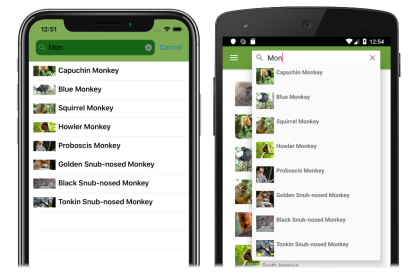

# Xamarin.Forms Shell search

[ Download the sample](/samples/xamarin/xamarin-forms-samples/userinterface-xaminals/)

Xamarin.Forms Shell includes integrated search functionality that's provided by the [`SearchHandler`](xref:Xamarin.Forms.SearchHandler) class. Search capability can be added to a page by setting the [`Shell.SearchHandler`](xref:Xamarin.Forms.SearchHandler) attached property to a subclassed `SearchHandler` object. This results in a search box being added at the top of the page:

[](search-images/searchhandler-large.png#lightbox)

When a query is entered into the search box, the [`Query`](xref:Xamarin.Forms.SearchHandler.Query) property is updated, and on each update the [`OnQueryChanged`](xref:Xamarin.Forms.SearchHandler.OnQueryChanged*) method is executed. This method can be overridden to populate the search suggestions area with data:

[](search-images/search-suggestions-large.png#lightbox)

Then, when a result is selected from the search suggestions area, the [`OnItemSelected`](xref:Xamarin.Forms.SearchHandler.OnItemSelected*) method is executed. This method can be overridden to respond appropriately, such as by navigating to a detail page.

## Create a SearchHandler

Search functionality can be added to a Shell application by subclassing the [`SearchHandler`](xref:Xamarin.Forms.SearchHandler) class, and overriding the [`OnQueryChanged`](xref:Xamarin.Forms.SearchHandler.OnQueryChanged*) and [`OnItemSelected`](xref:Xamarin.Forms.SearchHandler.OnItemSelected*) methods:

```csharp
public class AnimalSearchHandler : SearchHandler
{
    public IList<Animal> Animals { get; set; }
    public Type SelectedItemNavigationTarget { get; set; }

    protected override void OnQueryChanged(string oldValue, string newValue)
    {
        base.OnQueryChanged(oldValue, newValue);

        if (string.IsNullOrWhiteSpace(newValue))
        {
            ItemsSource = null;
        }
        else
        {
            ItemsSource = Animals
                .Where(animal => animal.Name.ToLower().Contains(newValue.ToLower()))
                .ToList<Animal>();
        }
    }

    protected override async void OnItemSelected(object item)
    {
        base.OnItemSelected(item);

        // Let the animation complete
        await Task.Delay(1000);

        ShellNavigationState state = (App.Current.MainPage as Shell).CurrentState;
        // The following route works because route names are unique in this application.
        await Shell.Current.GoToAsync($"{GetNavigationTarget()}?name={((Animal)item).Name}");
    }

    string GetNavigationTarget()
    {
        return (Shell.Current as AppShell).Routes.FirstOrDefault(route => route.Value.Equals(SelectedItemNavigationTarget)).Key;
    }
}
```

The [`OnQueryChanged`](xref:Xamarin.Forms.SearchHandler.OnQueryChanged*) override has two arguments: `oldValue`, which contains the previous search query, and `newValue`, which contains the current search query. The search suggestions area can be updated by setting the [`SearchHandler.ItemsSource`](xref:Xamarin.Forms.SearchHandler.ItemsSource) property to an `IEnumerable` collection that contains items that match the current search query.

When a search result is selected by the user, the [`OnItemSelected`](xref:Xamarin.Forms.SearchHandler.OnItemSelected*) override is executed and the [`SelectedItem`](xref:Xamarin.Forms.SearchHandler.SelectedItem) property is set. In this example, the method navigates to another page that displays data about the selected `Animal`. For more information about navigation, see [Xamarin.Forms Shell navigation](navigation.md).

> [!NOTE]
> Additional [`SearchHandler`](xref:Xamarin.Forms.SearchHandler) properties can be set to control the search box appearance.

## Consume a SearchHandler

The subclassed [`SearchHandler`](xref:Xamarin.Forms.SearchHandler) can be consumed by setting the [`Shell.SearchHandler`](xref:Xamarin.Forms.SearchHandler) attached property to an object of the subclassed type, on the consuming page:

```xaml
<ContentPage ...
             xmlns:controls="clr-namespace:Xaminals.Controls">
    <Shell.SearchHandler>
        <controls:AnimalSearchHandler Placeholder="Enter search term"
                                      ShowsResults="true"
                                      DisplayMemberName="Name" />
    </Shell.SearchHandler>
    ...
</ContentPage>
```

The equivalent C# code is:

```csharp
Shell.SetSearchHandler(this, new AnimalSearchHandler
{
    Placeholder = "Enter search term",
    ShowsResults = true,
    DisplayMemberName = "Name"
});
```

The `AnimalSearchHandler.OnQueryChanged` method returns a `List` of `Animal` objects. The [`DisplayMemberName`](xref:Xamarin.Forms.SearchHandler.DisplayMemberName) property is set to the `Name` property of each `Animal` object, and so the data displayed in the suggestions area will be each animal name.

The [`ShowsResults`](xref:Xamarin.Forms.SearchHandler.ShowsResults) property is set to `true`, so that search suggestions are displayed as the user enters a search query:

[](search-images/search-results-large.png#lightbox)

As the search query changes, the search suggestions area is updated:

[](search-images/search-results-change-large.png#lightbox)

When a search result is selected, the `MonkeyDetailPage` is navigated to, and a detail page about the selected monkey is displayed:

[](search-images/detailpage-large.png#lightbox)

## Define search results item appearance

In addition to displaying `string` data in the search results, the appearance of each search result item can be defined by setting the [`SearchHandler.ItemTemplate`](xref:Xamarin.Forms.SearchHandler.ItemTemplate) property to a [`DataTemplate`](xref:Xamarin.Forms.DataTemplate):

```xaml
<ContentPage ...
             xmlns:controls="clr-namespace:Xaminals.Controls">    
    <Shell.SearchHandler>
        <controls:AnimalSearchHandler Placeholder="Enter search term"
                                      ShowsResults="true">
            <controls:AnimalSearchHandler.ItemTemplate>
                <DataTemplate>
                    <Grid Padding="10"
                          ColumnDefinitions="0.15*,0.85*">
                        <Image Source="{Binding ImageUrl}"
                               HeightRequest="40"
                               WidthRequest="40" />
                        <Label Grid.Column="1"
                               Text="{Binding Name}"
                               FontAttributes="Bold"
                               VerticalOptions="Center" />
                    </Grid>
                </DataTemplate>
            </controls:AnimalSearchHandler.ItemTemplate>
       </controls:AnimalSearchHandler>
    </Shell.SearchHandler>
    ...
</ContentPage>
```

The equivalent C# code is:

```csharp
Shell.SetSearchHandler(this, new AnimalSearchHandler
{
    Placeholder = "Enter search term",
    ShowsResults = true,
    ItemTemplate = new DataTemplate(() =>
    {
        Grid grid = new Grid { Padding = 10 };
        grid.ColumnDefinitions.Add(new ColumnDefinition { Width = new GridLength(0.15, GridUnitType.Star) });
        grid.ColumnDefinitions.Add(new ColumnDefinition { Width = new GridLength(0.85, GridUnitType.Star) });

        Image image = new Image { HeightRequest = 40, WidthRequest = 40 };
        image.SetBinding(Image.SourceProperty, "ImageUrl");
        Label nameLabel = new Label { FontAttributes = FontAttributes.Bold, VerticalOptions = LayoutOptions.Center };
        nameLabel.SetBinding(Label.TextProperty, "Name");

        grid.Children.Add(image);
        grid.Children.Add(nameLabel, 1, 0);
        return grid;
    })
});
```

The elements specified in the [`DataTemplate`](xref:Xamarin.Forms.DataTemplate) define the appearance of each item in the suggestions area. In this example, layout within the `DataTemplate` is managed by a [`Grid`](xref:Xamarin.Forms.Grid). The `Grid` contains an [`Image`](xref:Xamarin.Forms.Image) object, and a [`Label`](xref:Xamarin.Forms.Label) object, that both bind to properties of each `Monkey` object.

The following screenshots show the result of templating each item in the suggestions area:

[](search-images/search-results-template-large.png#lightbox)

For more information about data templates, see [Xamarin.Forms data templates](~/xamarin-forms/app-fundamentals/templates/data-templates/index.md).

## Search box visibility

By default, when a [`SearchHandler`](xref:Xamarin.Forms.SearchHandler) is added at the top of a page, the search box is visible and fully expanded. However, this behavior can be changed by setting the [`SearchHandler.SearchBoxVisibility`](xref:Xamarin.Forms.SearchHandler.SearchBoxVisibility) property to one of the [`SearchBoxVisibility`](xref:Xamarin.Forms.SearchBoxVisibility) enumeration members:

- `Hidden` – the search box is not visible or accessible.
- `Collapsible` – the search box is hidden until the user performs an action to reveal it. On iOS the search box is revealed by vertically bouncing the page content, and on Android the search box is revealed by tapping the question mark icon.
- `Expanded` – the search box is visible and fully expanded. This is the default value of the [`SearchBoxVisibility`](xref:Xamarin.Forms.SearchHandler.SearchBoxVisibility) property.

> [!IMPORTANT]
> On iOS, a collapsible search box requires iOS 11 or greater.

The following example shows to how to hide the search box:

```xaml
<ContentPage ...
             xmlns:controls="clr-namespace:Xaminals.Controls">
    <Shell.SearchHandler>
        <controls:AnimalSearchHandler SearchBoxVisibility="Hidden"
                                      ... />
    </Shell.SearchHandler>
    ...
</ContentPage>
```

## Search box focus

Tapping in a search box invokes the onscreen keyboard, with the search box gaining input focus. This can also be achieved programmatically by calling the [`Focus`](xref:Xamarin.Forms.SearchHandler.Focus) method, which attempts to set input focus on the search box, and returns `true` if successful. When a search box gains focus, the [`Focused`](xref:Xamarin.Forms.SearchHandler.Focused) event is fired and the overridable `OnFocused` method is called.

When a search box has input focus, tapping elsewhere on the screen dismisses the onscreen keyboard, and the search box loses input focus. This can also be achieved programmatically by calling the [`Unfocus`](xref:Xamarin.Forms.SearchHandler.Unfocus) method. When a search box loses focus, the [`Unfocused`](xref:Xamarin.Forms.SearchHandler.Unfocused) event is fired and the overridable `OnUnfocus` method is called.

The focus state of a search box can be retrieved through the [`IsFocused`](xref:Xamarin.Forms.SearchHandler.IsFocused) property, which returns `true` if a [`SearchHandler`](xref:Xamarin.Forms.SearchHandler) currently has input focus.

## SearchHandler keyboard

The keyboard that's presented when users interact with a [`SearchHandler`](xref:Xamarin.Forms.SearchHandler) can be set programmatically via the [`Keyboard`](xref:Xamarin.Forms.SearchHandler.Keyboard) property, to one of the following properties from the [`Keyboard`](xref:Xamarin.Forms.Keyboard) class:

- [`Chat`](xref:Xamarin.Forms.Keyboard.Chat) – used for texting and places where emoji are useful.
- [`Default`](xref:Xamarin.Forms.Keyboard.Default) – the default keyboard.
- [`Email`](xref:Xamarin.Forms.Keyboard.Email) – used when entering email addresses.
- [`Numeric`](xref:Xamarin.Forms.Keyboard.Numeric) – used when entering numbers.
- [`Plain`](xref:Xamarin.Forms.Keyboard.Plain) – used when entering text, without any [`KeyboardFlags`](xref:Xamarin.Forms.KeyboardFlags) specified.
- [`Telephone`](xref:Xamarin.Forms.Keyboard.Telephone) – used when entering telephone numbers.
- [`Text`](xref:Xamarin.Forms.Keyboard.Text) – used when entering text.
- [`Url`](xref:Xamarin.Forms.Keyboard.Url) – used for entering file paths & web addresses.

This can be accomplished in XAML as follows:

```xaml
<SearchHandler Keyboard="Email" />
```

The equivalent C# code is:

```csharp
SearchHandler searchHandler = new SearchHandler { Keyboard = Keyboard.Email };
```

The [`Keyboard`](xref:Xamarin.Forms.Keyboard) class also has a [`Create`](xref:Xamarin.Forms.Keyboard.Create*) factory method that can be used to customize a keyboard by specifying capitalization, spellcheck, and suggestion behavior. [`KeyboardFlags`](xref:Xamarin.Forms.KeyboardFlags) enumeration values are specified as arguments to the method, with a customized `Keyboard` being returned. The `KeyboardFlags` enumeration contains the following values:

- [`None`](xref:Xamarin.Forms.KeyboardFlags.None) – no features are added to the keyboard.
- [`CapitalizeSentence`](xref:Xamarin.Forms.KeyboardFlags.CapitalizeSentence) – indicates that the first letter of the first word of each entered sentence will be automatically capitalized.
- [`Spellcheck`](xref:Xamarin.Forms.KeyboardFlags.Spellcheck) – indicates that spellcheck will be performed on entered text.
- [`Suggestions`](xref:Xamarin.Forms.KeyboardFlags.Suggestions) – indicates that word completions will be offered on entered text.
- [`CapitalizeWord`](xref:Xamarin.Forms.KeyboardFlags.CapitalizeWord) – indicates that the first letter of each word will be automatically capitalized.
- [`CapitalizeCharacter`](xref:Xamarin.Forms.KeyboardFlags.CapitalizeCharacter) – indicates that every character will be automatically capitalized.
- [`CapitalizeNone`](xref:Xamarin.Forms.KeyboardFlags.CapitalizeNone) – indicates that no automatic capitalization will occur.
- [`All`](xref:Xamarin.Forms.KeyboardFlags.All) – indicates that spellcheck, word completions, and sentence capitalization will occur on entered text.

The following XAML code example shows how to customize the default [`Keyboard`](xref:Xamarin.Forms.Keyboard) to offer word completions and capitalize every entered character:

```xaml
<SearchHandler Placeholder="Enter search terms">
    <SearchHandler.Keyboard>
        <Keyboard x:FactoryMethod="Create">
            <x:Arguments>
                <KeyboardFlags>Suggestions,CapitalizeCharacter</KeyboardFlags>
            </x:Arguments>
        </Keyboard>
    </SearchHandler.Keyboard>
</SearchHandler>
```

The equivalent C# code is:

```csharp
SearchHandler searchHandler = new SearchHandler { Placeholder = "Enter search terms" };
searchHandler.Keyboard = Keyboard.Create(KeyboardFlags.Suggestions | KeyboardFlags.CapitalizeCharacter);
```

## Related links

- [Xaminals (sample)](/samples/xamarin/xamarin-forms-samples/userinterface-xaminals/)
- [Xamarin.Forms Shell navigation](navigation.md)
