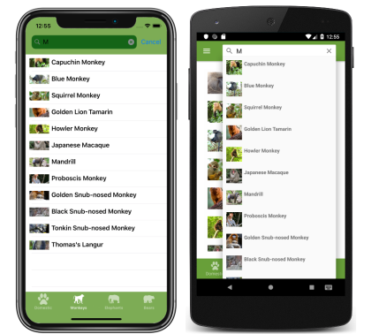

# Xamarin.Forms Shell

[ Download the sample](https://github.com/xamarin/xamarin-forms-samples/tree/master/UserInterface/Xaminals/)

Xamarin.Forms Shell includes integrated search functionality that's provided by the `SearchHandler` class. Search capability can be added to a page by setting the `Shell.SearchHandler` attached property to a sub-classed `SearchHandler` object. This results in a search box being added at the top of the page:

[](search-images/searchhandler-large.png#lightbox "Shell SearchHandler")

When a query is entered into the search box, the search suggestions area can be populated with data:

[](search-images/search-suggestions-large.png#lightbox "Shell SearchHandler search results")

Then, when a search result is selected, the application can respond appropriately, such as by navigating to another page.

## SearchHandler class

The `SearchHandler` class defines the following properties that control its appearance and behavior:

- `ClearIcon`, of type [`ImageSource`](xref:Xamarin.Forms.ImageSource), the icon displayed to clear the contents of the search box.
- `ClearIconHelpText`, of type `string`, the accessible help text for the clear icon.
- `ClearIconName`, of type `string`, the name of the clear icon for use with screen readers.
- `ClearPlaceholderCommand`, of type `ICommand`, which is executed when the `ClearPlaceholderIcon` is tapped.
- `ClearPlaceholderCommandParameter`, of type `object`, which is the parameter that's passed to the `ClearPlaceholderCommand`.
- `ClearPlaceholderEnabled`, of type `bool`, which determines whether the `ClearPlaceholderCommand` can be executed. The default value is `true`.
- `ClearPlaceholderHelpText`, of type `string`, the accessible help text for the clear placeholder icon.
- `ClearPlaceholderIcon`, of type [`ImageSource`](xref:Xamarin.Forms.ImageSource), the clear placeholder icon displayed when the search box is empty.
- `ClearPlaceholderName`, of type `string`, the name of the clear placeholder icon for use with screen readers.
- `Command`, of type `ICommand`, which is executed when the search query is confirmed.
- `CommandParameter`, of type `object`, which is the parameter that's passed to the `Command`.
- `DisplayMemberName`, of type `string`, representing the name or path of the property that's displayed for each item of data in the `ItemsSource` collection.
- `IsSearchEnabled`, of type `bool`, representing the enabled state of the search box. The default value is `true`.
- `ItemsSource`, of type `IEnumerable`, specifies the collection of items to be displayed in the suggestion area, and has a default value of `null`.
- `ItemTemplate`, of type [`DataTemplate`](xref:Xamarin.Forms.DataTemplate), specifies the template to apply to each item in the collection of items to be displayed in the suggestion area.
- `Placeholder`, of type `string`, the text to display when the search box is empty.
- `Query`, of type `string`, the user entered text in the search box.
- `QueryIcon`, of type [`ImageSource`](xref:Xamarin.Forms.ImageSource), the icon used to indicate to the user that search is available.
- `QueryIconHelpText`, of type `string`, the accessible help text for the query icon.
- `QueryIconName`, of type `string`, the name of the query icon for use with screen readers.
- `SearchBoxVisibility`, of type `SearchBoxVisibility`, the visibility of the search box. By default, the search box is visible and fully expanded.
- `SelectedItem`, of type `object`, the selected item in the search results. This property is read only, and has a default value of `null`.
- `ShowsResults`, of type `bool`, indicates whether search results should be expected in the suggestion area, on text entry. The default value is `false`.

All of these properties are backed by [`BindableProperty`](xref:Xamarin.Forms.BindableProperty) objects, which means that the properties can be targets of data bindings.

In addition, the `SearchHandler` class provides the following overridable methods:

- `OnClearPlaceholderClicked`, that's called whenever the `ClearPlaceholderIcon` is tapped.
- `OnItemSelected`, that's called whenever a search result is selected by the user.
- `OnQueryChanged`, that's called when the `Query` property changes.
- `OnQueryConfirmed`, that's called whenever the user presses enter or confirms their query in the search box.

When a user enters a query into the search box, the `Query` property is updated, and on each update the `OnQueryChanged` method is executed. This method can be used to update the suggestions area that appears below the search box. When a user selects a result from the suggestions area, the `OnItemSelected` method is executed.

## Create a SearchHandler

Search functionality can be added to a Shell application by subclassing the `SearchHandler` class, and overriding the `OnQueryChanged` and `OnItemSelected` methods:

```csharp
public class MonkeySearchHandler : SearchHandler
{
    protected override void OnQueryChanged(string oldValue, string newValue)
    {
        base.OnQueryChanged(oldValue, newValue);

        if (string.IsNullOrWhiteSpace(newValue))
        {
            ItemsSource = null;
        }
        else
        {
            ItemsSource = MonkeyData.Monkeys
                .Where(monkey => monkey.Name.ToLower().Contains(newValue.ToLower()))
                .ToList<Animal>();
        }
    }

    protected override async void OnItemSelected(object item)
    {
        base.OnItemSelected(item);

        // Note: strings will be URL encoded for navigation (e.g. "Blue Monkey" becomes "Blue%20Monkey"). Therefore, decode at the receiver.
        await (App.Current.MainPage as Xamarin.Forms.Shell).GoToAsync($"monkeydetails?name={((Animal)item).Name}");
    }
}
```

The `OnQueryChanged` override has two arguments: `oldValue`, which contains the previous search query, and `newValue`, which contains the current search query. The search suggestions area can be updated by setting the `SearchHandler.ItemsSource` property to an `IEnumerable` collection that contains items that match the current search query.

When a search result is selected by the user, the `OnItemSelected` override is executed and the `SelectedItem` property is set. In this example, the method navigates to another page that displays data about the selected `Animal`. For more information about navigation, see [Xamarin.Forms Shell Navigation](navigation.md).

> [!NOTE]
> Additional `SearchHandler` properties can be set to control the search box appearance.

## Consume a SearchHandler

The subclassed `SearchHandler` can be consumed by setting the `Shell.SearchHandler` attached property to an object of the subclassed type:

```xaml
<ContentPage ...
             xmlns:controls="clr-namespace:Xaminals.Controls">
    <Shell.SearchHandler>
        <controls:MonkeySearchHandler Placeholder="Enter search term"
                                      ShowsResults="true"
                                      DisplayMemberName="Name" />
    </Shell.SearchHandler>
    ...
</ContentPage>
```

The equivalent C# code is:

```csharp
Shell.SetSearchHandler(this, new MonkeySearchHandler
{
    Placeholder = "Enter search term",
    ShowsResults = true,
    DisplayMemberName = "Name"
});
```

The `MonkeySearchHandler.OnQueryChanged` method returns a `List` of `Animal` objects. The `DisplayMemberName` property is set to the `Name` property of each `Animal` object, and so the data displayed in the suggestions area will be each animal name.

The `ShowsResults` property is set to `true`, so that search suggestions are displayed as the user enters a search query:

[](search-images/search-results-large.png#lightbox "Shell SearchHandler search results")

As the search query changes, the search suggestions area is updated:

[](search-images/search-results-change-large.png#lightbox "Shell SearchHandler search results")

When a search result is selected, the `MonkeyDetailPage` is navigated to, and data about the selected monkey is displayed:

[](search-images/detailpage-large.png#lightbox "Monkey details")

## Define search results item appearance

In addition to displaying `string` data in the search results, the appearance of each search result item can be defined by setting the `SearchHandler.ItemTemplate` property to a [`DataTemplate`](xref:Xamarin.Forms.DataTemplate):

```xaml
<ContentPage ...
             xmlns:controls="clr-namespace:Xaminals.Controls">    
    <Shell.SearchHandler>
        <controls:MonkeySearchHandler Placeholder="Enter search term"
                                      ShowsResults="true">
            <controls:MonkeySearchHandler.ItemTemplate>
                <DataTemplate>
                    <Grid Padding="10">
                        <Grid.ColumnDefinitions>
                            <ColumnDefinition Width="0.15*" />
                            <ColumnDefinition Width="0.85*" />
                        </Grid.ColumnDefinitions>
                        <Image Source="{Binding ImageUrl}"
                               Aspect="AspectFill"
                               HeightRequest="40"
                               WidthRequest="40" />
                        <Label Grid.Column="1"
                               Text="{Binding Name}"
                               FontAttributes="Bold" />
                    </Grid>
                </DataTemplate>
            </controls:MonkeySearchHandler.ItemTemplate>
       </controls:MonkeySearchHandler>
    </Shell.SearchHandler>
    ...
</ContentPage>
```

The equivalent C# code is:

```csharp
Shell.SetSearchHandler(this, new MonkeySearchHandler
{
    Placeholder = "Enter search term",
    ShowsResults = true,
    DisplayMemberName = "Name",
    ItemTemplate = new DataTemplate(() =>
    {
        Grid grid = new Grid { Padding = 10 };
        grid.ColumnDefinitions.Add(new ColumnDefinition { Width = new GridLength(0.15, GridUnitType.Star) });
        grid.ColumnDefinitions.Add(new ColumnDefinition { Width = new GridLength(0.85, GridUnitType.Star) });

        Image image = new Image { Aspect = Aspect.AspectFill, HeightRequest = 40, WidthRequest = 40 };
        image.SetBinding(Image.SourceProperty, "ImageUrl");
        Label nameLabel = new Label { FontAttributes = FontAttributes.Bold };
        nameLabel.SetBinding(Label.TextProperty, "Name");

        grid.Children.Add(image);
        grid.Children.Add(nameLabel, 1, 0);
        return grid;
    })
});
```

The elements specified in the [`DataTemplate`](xref:Xamarin.Forms.DataTemplate) define the appearance of each item in the suggestions area. In this example, layout within the `DataTemplate` is managed by a [`Grid`](xref:Xamarin.Forms.Grid). The `Grid` contains an [`Image`](xref:Xamarin.Forms.Image) object, and a [`Label`](xref:Xamarin.Forms.Label) object, that both bind to properties of each `Monkey` object.

The following screenshots show the result of templating each item in the suggestions area:

[](search-images/search-results-template-large.png#lightbox "Shell SearchHandler templated search results")

For more information about data templates, see [Xamarin.Forms Data Templates](~/xamarin-forms/app-fundamentals/templates/data-templates/index.md).

## SearchBox visibility

When a search box is added at the top of a page, by default the search box is visible and fully expanded. However, this behavior can be changed by setting the `SearchHandler.SearchBoxVisibility` property to one of the `SearchBoxVisibility` enumeration members:

- `Hidden` – the search box is not visible or accessible.
- `Collapsible` – the search box is hidden until the user performs an action to reveal it.
- `Expanded` – the search box is visible and fully expanded.

The following example shows to how to hide the search box:

```xaml
<ContentPage ...
             xmlns:controls="clr-namespace:Xaminals.Controls">
    <Shell.SearchHandler>
        <controls:MonkeySearchHandler SearchBoxVisibility="Hidden"
                                      ... />
    </Shell.SearchHandler>
    ...
</ContentPage>
```

## Related links

- [Xaminals (sample)](https://github.com/xamarin/xamarin-forms-samples/tree/master/UserInterface/Xaminals/)
- [Xamarin.Forms Shell Navigation](navigation.md)
