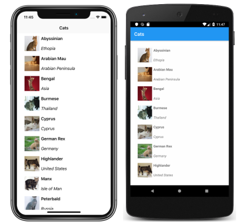
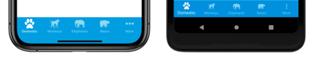
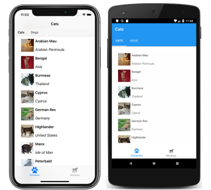

# Xamarin.Forms Shell tabs

[ Download the sample](/samples/xamarin/xamarin-forms-samples/userinterface-xaminals/)

The navigation experience provided by Xamarin.Forms Shell is based on flyouts and tabs. The top level of navigation in a Shell application is either a flyout or a bottom tab bar, depending on the navigation requirements of the application. When the navigation experience for an application begins with bottom tabs, the child of the subclassed [`Shell`](xref:Xamarin.Forms.Shell) object should be a [`TabBar`](xref:Xamarin.Forms.TabBar) object, which represents the bottom tab bar.

A [`TabBar`](xref:Xamarin.Forms.TabBar) object can contain one or more [`Tab`](xref:Xamarin.Forms.Tab) objects, with each `Tab` object representing a tab on the bottom tab bar. Each `Tab` object can contain one or more [`ShellContent`](xref:Xamarin.Forms.ShellContent) objects, with each `ShellContent` object displaying a single [`ContentPage`](xref:Xamarin.Forms.ContentPage). When more than one `ShellContent` object is present in a `Tab` object, the `ContentPage` objects will be navigable by top tabs. Within a tab, additional `ContentPage` objects that are known as detail pages, can be navigated to.

> [!IMPORTANT]
> The [`TabBar`](xref:Xamarin.Forms.TabBar) type disables the flyout.

## Single page

A single page Shell application can be created by adding a [`Tab`](xref:Xamarin.Forms.Tab) object to a [`TabBar`](xref:Xamarin.Forms.TabBar) object. Within the `Tab` object, a [`ShellContent`](xref:Xamarin.Forms.ShellContent) object should be set to a [`ContentPage`](xref:Xamarin.Forms.ContentPage) object:

```xaml
<Shell xmlns="http://xamarin.com/schemas/2014/forms"
       xmlns:x="http://schemas.microsoft.com/winfx/2009/xaml"
       xmlns:views="clr-namespace:Xaminals.Views"
       x:Class="Xaminals.AppShell">
    <TabBar>
       <Tab>
           <ShellContent ContentTemplate="{DataTemplate views:CatsPage}" />
       </Tab>
    </TabBar>
</Shell>
```

This code example results in the following single page application:

[](tabs-images/single-page-app-large.png#lightbox)

Shell has implicit conversion operators that enable the Shell visual hierarchy to be simplified, without introducing additional views into the visual tree. This is possible because a subclassed `Shell` object can only ever contain [`FlyoutItem`](xref:Xamarin.Forms.FlyoutItem) objects or a [`TabBar`](xref:Xamarin.Forms.TabBar) object, which can only ever contain [`Tab`](xref:Xamarin.Forms.Tab) objects, which can only ever contain [`ShellContent`](xref:Xamarin.Forms.ShellContent) objects. These implicit conversion operators can be used to remove the `Tab` objects from the previous example:

```xaml
<Shell xmlns="http://xamarin.com/schemas/2014/forms"
       xmlns:x="http://schemas.microsoft.com/winfx/2009/xaml"
       xmlns:views="clr-namespace:Xaminals.Views"
       x:Class="Xaminals.AppShell">
    <Tab>
        <ShellContent ContentTemplate="{DataTemplate views:CatsPage}" />
    </Tab>
</Shell>
```

This implicit conversion automatically wraps the [`ShellContent`](xref:Xamarin.Forms.ShellContent) object in a [`Tab`](xref:Xamarin.Forms.Tab) object, which is wrapped in a [`TabBar`](xref:Xamarin.Forms.TabBar) object.

> [!IMPORTANT]
> In a Shell application, pages are created on demand in response to navigation. This is accomplished by using the [`DataTemplate`](xref:Xamarin.Forms.Xaml.DataTemplateExtension) markup extension to set the [`ContentTemplate`](xref:Xamarin.Forms.ShellContent.ContentTemplate) property of each [`ShellContent`](xref:Xamarin.Forms.ShellContent) object to a [`ContentPage`](xref:Xamarin.Forms.ContentPage) object.

## Bottom tabs

[`Tab`](xref:Xamarin.Forms.Tab) objects are rendered as bottom tabs, provided that there are multiple `Tab` objects in a single [`TabBar`](xref:Xamarin.Forms.TabBar) object:

```xaml
<Shell xmlns="http://xamarin.com/schemas/2014/forms"
       xmlns:x="http://schemas.microsoft.com/winfx/2009/xaml"
       xmlns:views="clr-namespace:Xaminals.Views"
       x:Class="Xaminals.AppShell">
    <TabBar>
       <Tab Title="Cats"
            Icon="cat.png">
           <ShellContent ContentTemplate="{DataTemplate views:CatsPage}" />
       </Tab>
       <Tab Title="Dogs"
            Icon="dog.png">
           <ShellContent ContentTemplate="{DataTemplate views:DogsPage}" />
       </Tab>
    </TabBar>
</Shell>
```

The [`Title`](xref:Xamarin.Forms.BaseShellItem.Title) property, of type `string`, defines the tab title. The [`Icon`](xref:Xamarin.Forms.BaseShellItem.Icon) property, of type [`ImageSource`](xref:Xamarin.Forms.ImageSource), defines the tab icon:

[](tabs-images/two-page-app-bottom-tabs-large.png#lightbox)

When there are more than five tabs on a [`TabBar`](xref:Xamarin.Forms.TabBar), a **More** tab will appear, which can be used to access the additional tabs:

[](tabs-images/more-tabs-large.png#lightbox)

In addition, Shell's implicit conversion operators can be used to remove the [`ShellContent`](xref:Xamarin.Forms.ShellContent) and [`Tab`](xref:Xamarin.Forms.Tab) objects from the previous example:

```xaml
<Shell xmlns="http://xamarin.com/schemas/2014/forms"
       xmlns:x="http://schemas.microsoft.com/winfx/2009/xaml"
       xmlns:views="clr-namespace:Xaminals.Views"
       x:Class="Xaminals.AppShell">
    <TabBar>
       <ShellContent Title="Cats"
                     Icon="cat.png"
                     ContentTemplate="{DataTemplate views:CatsPage}" />
       <ShellContent Title="Dogs"
                     Icon="dog.png"
                     ContentTemplate="{DataTemplate views:DogsPage}" />
    </TabBar>
</Shell>
```

This implicit conversion automatically wraps each [`ShellContent`](xref:Xamarin.Forms.ShellContent) object in a [`Tab`](xref:Xamarin.Forms.Tab) object.

> [!IMPORTANT]
> In a Shell application, pages are created on demand in response to navigation. This is accomplished by using the [`DataTemplate`](xref:Xamarin.Forms.Xaml.DataTemplateExtension) markup extension to set the [`ContentTemplate`](xref:Xamarin.Forms.ShellContent.ContentTemplate) property of each [`ShellContent`](xref:Xamarin.Forms.ShellContent) object to a [`ContentPage`](xref:Xamarin.Forms.ContentPage) object.

## Bottom and top tabs

When more than one [`ShellContent`](xref:Xamarin.Forms.ShellContent) object is present in a [`Tab`](xref:Xamarin.Forms.Tab) object, a top tab bar is added to the bottom tab, through which the [`ContentPage`](xref:Xamarin.Forms.ContentPage) objects are navigable:

```xaml
<Shell xmlns="http://xamarin.com/schemas/2014/forms"
       xmlns:x="http://schemas.microsoft.com/winfx/2009/xaml"
       xmlns:views="clr-namespace:Xaminals.Views"
       x:Class="Xaminals.AppShell">
    <TabBar>
       <Tab Title="Domestic"
            Icon="paw.png">
           <ShellContent Title="Cats"
                         ContentTemplate="{DataTemplate views:CatsPage}" />
           <ShellContent Title="Dogs"
                         ContentTemplate="{DataTemplate views:DogsPage}" />
       </Tab>
       <Tab Title="Monkeys"
            Icon="monkey.png">
           <ShellContent ContentTemplate="{DataTemplate views:MonkeysPage}" />
       </Tab>
    </TabBar>
</Shell>
```

This results in the layout shown in the following screenshots:

[](tabs-images/two-page-app-top-tabs-large.png#lightbox "Shell two page app with top and bottom tabs")

In addition, Shell's implicit conversion operators can be used to remove the second [`Tab`](xref:Xamarin.Forms.Tab) object from the previous example:

```xaml
<Shell xmlns="http://xamarin.com/schemas/2014/forms"
       xmlns:x="http://schemas.microsoft.com/winfx/2009/xaml"
       xmlns:views="clr-namespace:Xaminals.Views"
       x:Class="Xaminals.AppShell">
    <TabBar>
       <Tab Title="Domestic"
            Icon="paw.png">
           <ShellContent Title="Cats"
                         Icon="cat.png"
                         ContentTemplate="{DataTemplate views:CatsPage}" />
           <ShellContent Title="Dogs"
                         Icon="dog.png"
                         ContentTemplate="{DataTemplate views:DogsPage}" />
       </Tab>
       <ShellContent Title="Monkeys"
                     Icon="monkey.png"
                     ContentTemplate="{DataTemplate views:MonkeysPage}" />
    </TabBar>
</Shell>
```

This implicit conversion automatically wraps the third [`ShellContent`](xref:Xamarin.Forms.ShellContent) object in a [`Tab`](xref:Xamarin.Forms.Tab) object.

## Tab appearance

The [`Shell`](xref:Xamarin.Forms.Shell) class defines the following attached properties that control the appearance of tabs:

- [`TabBarBackgroundColor`](xref:Xamarin.Forms.Shell.TabBarBackgroundColorProperty), of type [`Color`](xref:Xamarin.Forms.Color), that defines the background color for the tab bar. If the property is unset, the `BackgroundColor` property value is used.
- [`TabBarDisabledColor`](xref:Xamarin.Forms.Shell.TabBarDisabledColorProperty), of type [`Color`](xref:Xamarin.Forms.Color), that defines the disabled color for the tab bar. If the property is unset, the `DisabledColor` property value is used.
- [`TabBarForegroundColor`](xref:Xamarin.Forms.Shell.TabBarForegroundColorProperty), of type [`Color`](xref:Xamarin.Forms.Color), that defines the foreground color for the tab bar. If the property is unset, the `ForegroundColor` property value is used.
- [`TabBarTitleColor`](xref:Xamarin.Forms.Shell.TabBarTitleColorProperty), of type [`Color`](xref:Xamarin.Forms.Color), that defines the title color for the tab bar. If the property is unset, the `TitleColor` property value will be used.
- [`TabBarUnselectedColor`](xref:Xamarin.Forms.Shell.TabBarUnselectedColorProperty), of type [`Color`](xref:Xamarin.Forms.Color), that defines the unselected color for the tab bar. If the property is unset, the `UnselectedColor` property value is used.

All of these properties are backed by [`BindableProperty`](xref:Xamarin.Forms.BindableProperty) objects, which means that the properties can be targets of data bindings, and styled.

The following example shows a XAML style that sets different tab bar color properties:

```xaml
<Style TargetType="TabBar">
    <Setter Property="Shell.TabBarBackgroundColor"
            Value="CornflowerBlue" />
    <Setter Property="Shell.TabBarTitleColor"
            Value="Black" />
    <Setter Property="Shell.TabBarUnselectedColor"
            Value="AntiqueWhite" />
</Style>
```

In addition, tabs can also be styled using Cascading Style Sheets (CSS). For more information, see [Xamarin.Forms Shell specific properties](~/xamarin-forms/user-interface/styles/css/index.md#xamarinforms-shell-specific-properties).

## Tab selection

When a Shell application that uses a tab bar is first run, the [`Shell.CurrentItem`](xref:Xamarin.Forms.Shell.CurrentItem) property will be set to the first [`Tab`](xref:Xamarin.Forms.Tab) object in the subclassed [`Shell`](xref:Xamarin.Forms.Shell) object. However, the property can be set to another `Tab`, as shown in the following example:

```xaml
<Shell ...
       CurrentItem="{x:Reference dogsItem}">
    <TabBar>
        <ShellContent Title="Cats"
                      Icon="cat.png"
                      ContentTemplate="{DataTemplate views:CatsPage}" />
        <ShellContent x:Name="dogsItem"
                      Title="Dogs"
                      Icon="dog.png"
                      ContentTemplate="{DataTemplate views:DogsPage}" />
    </TabBar>
</Shell>
```

This example sets the [`CurrentItem`](xref:Xamarin.Forms.Shell.CurrentItem) property to the [`ShellContent`](xref:Xamarin.Forms.ShellContent) object named `dogsItem`, which results in it being selected and displayed. In this example, an implicit conversion is used to wrap each `ShellContent` object in a [`Tab`](xref:Xamarin.Forms.Tab) object.

The equivalent C# code, given a [`ShellContent`](xref:Xamarin.Forms.ShellContent) object named `dogsItem`, is:

```csharp
CurrentItem = dogsItem;
```

In this example, the [`CurrentItem`](xref:Xamarin.Forms.Shell.CurrentItem) property is set in the subclassed [`Shell`](xref:Xamarin.Forms.Shell) class. Alternatively, the `CurrentItem` property can be set in any class through the `Shell.Current` static property:

```csharp
Shell.Current.CurrentItem = dogsItem;
```

## TabBar and Tab visibility

The tab bar and tabs are visible in Shell applications by default. However, the tab bar can be hidden by setting the [`Shell.TabBarIsVisible`](xref:Xamarin.Forms.Shell.TabBarIsVisibleProperty) attached property to `false`.

While this property can be set on a subclassed [`Shell`](xref:Xamarin.Forms.Shell) object, it's typically set on any [`ShellContent`](xref:Xamarin.Forms.ShellContent) or [`ContentPage`](xref:Xamarin.Forms.ContentPage) objects that want to make the tab bar invisible:

```xaml
<TabBar>
   <Tab Title="Domestic"
        Icon="paw.png">
       <ShellContent Title="Cats"
                     ContentTemplate="{DataTemplate views:CatsPage}" />
       <ShellContent Shell.TabBarIsVisible="false"
                     Title="Dogs"
                     ContentTemplate="{DataTemplate views:DogsPage}" />
   </Tab>
   <Tab Title="Monkeys"
        Icon="monkey.png">
       <ShellContent ContentTemplate="{DataTemplate views:MonkeysPage}" />
   </Tab>
</TabBar>
```

In this example, the tab bar is hidden when the upper **Dogs** tab is selected.

In addition, [`Tab`](xref:Xamarin.Forms.Tab) objects can be hidden by setting the [`IsVisible`](xref:Xamarin.Forms.BaseShellItem.IsVisible) bindable property to `false`:

```xaml
<TabBar>
    <ShellContent Title="Cats"
                  Icon="cat.png"
                  ContentTemplate="{DataTemplate views:CatsPage}" />
    <ShellContent Title="Dogs"
                  Icon="dog.png"
                  ContentTemplate="{DataTemplate views:DogsPage}"
                  IsVisible="False" />
    <ShellContent Title="Monkeys"
                  Icon="monkey.png"
                  ContentTemplate="{DataTemplate views:MonkeysPage}" />
</TabBar>
```

In this example, the second tab is hidden.

## Related links

- [Xaminals (sample)](/samples/xamarin/xamarin-forms-samples/userinterface-xaminals/)
- [Xamarin.Forms Shell navigation](navigation.md)
- [Xamarin.Forms CSS Shell specific properties](~/xamarin-forms/user-interface/styles/css/index.md#xamarinforms-shell-specific-properties)
