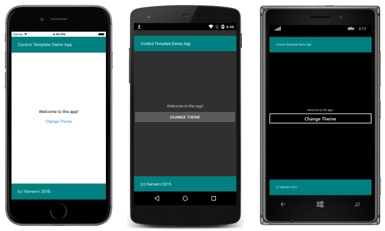
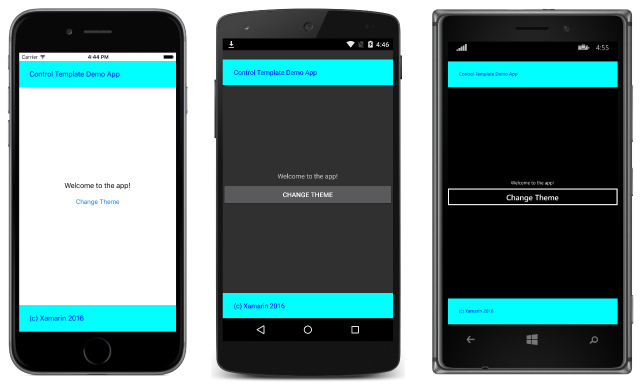

# Creating a ControlTemplate

[ Download the sample](https://developer.xamarin.com/samples/xamarin-forms/templates/controltemplates/simpletheme/)

_Control templates can be defined at the application level or page level. This article demonstrates how to create and consume control templates._

## Creating a ControlTemplate in XAML

To define a [`ControlTemplate`](xref:Xamarin.Forms.ControlTemplate) at the application level, a [`ResourceDictionary`](xref:Xamarin.Forms.ResourceDictionary) must be added to the `App` class. By default, all Xamarin.Forms applications created from a template use the **App** class to implement the [`Application`](xref:Xamarin.Forms.Application) subclass. To declare a `ControlTemplate` at the application level, in the application's `ResourceDictionary` using XAML, the default **App** class must be replaced with a XAML **App** class and associated code-behind, as shown in the following code example:

```xaml
<Application xmlns="http://xamarin.com/schemas/2014/forms" xmlns:x="http://schemas.microsoft.com/winfx/2009/xaml" x:Class="SimpleTheme.App">
    <Application.Resources>
        <ResourceDictionary>
            <ControlTemplate x:Key="TealTemplate">
                <Grid>
                    ...
                    <BoxView ... />
                    <Label Text="Control Template Demo App"
                           TextColor="White"
                           VerticalOptions="Center" ... />
                    <ContentPresenter ... />
                    <BoxView Color="Teal" ... />
                    <Label Text="(c) Xamarin 2016"
                           TextColor="White"
                           VerticalOptions="Center" ... />
                </Grid>
            </ControlTemplate>
            <ControlTemplate x:Key="AquaTemplate">
                ...
            </ControlTemplate>
        </ResourceDictionary>
    </Application.Resources>
</Application>
```

Each [`ControlTemplate`](xref:Xamarin.Forms.ControlTemplate) instance is created as a reusable object in a [`ResourceDictionary`](xref:Xamarin.Forms.ResourceDictionary).  This is achieved by giving each declaration a unique `x:Key` attribute, which provides it with a descriptive key in the `ResourceDictionary`.

The following code example shows the associated `App` code-behind:

```csharp
public partial class App : Application
{
  public App ()
  {
    InitializeComponent ();
    MainPage = new HomePage ();
  }
}
```

As well as setting the [`MainPage`](xref:Xamarin.Forms.Application.MainPage) property, the code-behind must also call the `InitializeComponent` method to load and parse the associated XAML.

The following code example shows a [`ContentPage`](xref:Xamarin.Forms.ContentPage) applying the `TealTemplate` to the [`ContentView`](xref:Xamarin.Forms.ContentView):

```xaml
<ContentPage xmlns="http://xamarin.com/schemas/2014/forms" xmlns:x="http://schemas.microsoft.com/winfx/2009/xaml" x:Class="SimpleTheme.HomePage">
    <ContentView x:Name="contentView" Padding="0,20,0,0"
                 ControlTemplate="{StaticResource TealTemplate}">
        <StackLayout VerticalOptions="CenterAndExpand">
            <Label Text="Welcome to the app!" HorizontalOptions="Center" />
            <Button Text="Change Theme" Clicked="OnButtonClicked" />
        </StackLayout>
    </ContentView>
</ContentPage>
```

The `TealTemplate` is assigned to the [`ContentView.ControlTemplate`](xref:Xamarin.Forms.TemplatedView.ControlTemplate) property by using the `StaticResource` markup extension. The [`ContentView.Content`](xref:Xamarin.Forms.ContentView.Content) property is set to a [`StackLayout`](xref:Xamarin.Forms.StackLayout) that defines the content to be displayed on the [`ContentPage`](xref:Xamarin.Forms.ContentPage). This content will be displayed by the [`ContentPresenter`](xref:Xamarin.Forms.ContentPresenter) contained in the `TealTemplate`. This results in the appearance shown in the following screenshots:



### Re-theming an Application at Runtime

Clicking the **Change Theme** button executes the `OnButtonClicked` method, which is shown in the following code example:

```csharp
void OnButtonClicked (object sender, EventArgs e)
{
  originalTemplate = !originalTemplate;
  contentView.ControlTemplate = (originalTemplate) ? tealTemplate : aquaTemplate;
}
```

This method replaces the active [`ControlTemplate`](xref:Xamarin.Forms.ControlTemplate) instance with the alternative `ControlTemplate` instance, resulting in the following screenshot:



> [!NOTE]
> On a `ContentPage`, the `Content` property can be assigned and the `ControlTemplate` property can also be set. When this occurs, if the `ControlTemplate` contains a `ContentPresenter` instance, the content assigned to the `Content` property will be presented by the `ContentPresenter` within the `ControlTemplate`.

### Setting a ControlTemplate with a Style

A [`ControlTemplate`](xref:Xamarin.Forms.ControlTemplate) can also be applied via a [`Style`](xref:Xamarin.Forms.Style) to further expand theme ability. This can be achieved by creating an *implicit* or *explicit* style for the target view in a [`ResourceDictionary`](xref:Xamarin.Forms.ResourceDictionary), and setting the `ControlTemplate` property of the target view in the [`Style`](xref:Xamarin.Forms.Style) instance. The following code example shows an *implicit* style that's been added to the application level [`ResourceDictionary`](xref:Xamarin.Forms.ResourceDictionary):

```xaml
<Style TargetType="ContentView">
    <Setter Property="ControlTemplate" Value="{StaticResource TealTemplate}" />
</Style>
```

Because the [`Style`](xref:Xamarin.Forms.Style) instance is *implicit*, it will be applied to all `ContentView` instances in the application. Therefore, it's no longer necessary to set the [`ContentView.ControlTemplate`](xref:Xamarin.Forms.TemplatedView.ControlTemplate) property, as demonstrated in the following code example:

```xaml
<ContentPage xmlns="http://xamarin.com/schemas/2014/forms" xmlns:x="http://schemas.microsoft.com/winfx/2009/xaml" x:Class="SimpleTheme.HomePage">
    <ContentView x:Name="contentView" Padding="0,20,0,0">
      ...
    </ContentView>
</ContentPage>
```

For more information about styles, see [Styles](~/xamarin-forms/user-interface/styles/index.md).

### Creating a ControlTemplate at Page Level

In addition to creating [`ControlTemplate`](xref:Xamarin.Forms.ControlTemplate) instances at the application level, they can also be created at the page level, as shown in the following code example:

```xaml
<ContentPage xmlns="http://xamarin.com/schemas/2014/forms" xmlns:x="http://schemas.microsoft.com/winfx/2009/xaml" x:Class="SimpleTheme.HomePage">
    <ContentPage.Resources>
        <ResourceDictionary>
            <ControlTemplate x:Key="TealTemplate">
                ...
            </ControlTemplate>
            <ControlTemplate x:Key="AquaTemplate">
                ...
            </ControlTemplate>
        </ResourceDictionary>
    </ContentPage.Resources>
    <ContentView ... ControlTemplate="{StaticResource TealTemplate}">
        ...
    </ContentView>
</ContentPage>
```

When adding a [`ControlTemplate`](xref:Xamarin.Forms.ControlTemplate) at the page level, a [`ResourceDictionary`](xref:Xamarin.Forms.ResourceDictionary) is added to the [`ContentPage`](xref:Xamarin.Forms.ContentPage), and then the `ControlTemplate` instances are included in the `ResourceDictionary`.

## Creating a ControlTemplate in C&#35;

To define a [`ControlTemplate`](xref:Xamarin.Forms.ControlTemplate) at the application level, a `class` must be created that represents the `ControlTemplate`. The class should derive from the [layout](~/xamarin-forms/user-interface/layouts/index.md) being used for the template, as shown in the following code example:

```csharp
class TealTemplate : Grid
{
  public TealTemplate ()
  {
    ...
    var contentPresenter = new ContentPresenter ();
    Children.Add (contentPresenter, 0, 1);
    Grid.SetColumnSpan (contentPresenter, 2);
    ...
  }
}

class AquaTemplate : Grid
{
  ...
}
```

The `AquaTemplate` class is identical to the `TealTemplate` class, except that different colors are used for the [`BoxView.Color`](xref:Xamarin.Forms.BoxView.Color) and [`Label.TextColor`](xref:Xamarin.Forms.Label.TextColor) properties.

The following code example shows a [`ContentPage`](xref:Xamarin.Forms.ContentPage) applying the `TealTemplate` to the [`ContentView`](xref:Xamarin.Forms.ContentView):

```csharp
public class HomePageCS : ContentPage
{
  ...
  ControlTemplate tealTemplate = new ControlTemplate (typeof(TealTemplate));
  ControlTemplate aquaTemplate = new ControlTemplate (typeof(AquaTemplate));

  public HomePageCS ()
  {
    var button = new Button { Text = "Change Theme" };
    var contentView = new ContentView {
      Padding = new Thickness (0, 20, 0, 0),
      Content = new StackLayout {
        VerticalOptions = LayoutOptions.CenterAndExpand,
        Children = {
          new Label { Text = "Welcome to the app!", HorizontalOptions = LayoutOptions.Center },
          button
        }
      },
      ControlTemplate = tealTemplate
    };
    ...
    Content = contentView;
  }
}
```

The [`ControlTemplate`](xref:Xamarin.Forms.ControlTemplate) instances are created by specifying the type of the classes that define the control templates, in the `ControlTemplate` constructor.

The [`ContentView.Content`](xref:Xamarin.Forms.ContentView.Content) property is set to a [`StackLayout`](xref:Xamarin.Forms.StackLayout) that defines the content to be displayed on the [`ContentPage`](xref:Xamarin.Forms.ContentPage). This content will be displayed by the [`ContentPresenter`](xref:Xamarin.Forms.ContentPresenter) contained in the `TealTemplate`. The same mechanism outlined previously is used to change the theme at runtime to the `AquaTheme`.

## Summary

This article demonstrated how to create and consume control templates. Control templates can be defined at the application level or page level.


## Related Links

- [Styles](~/xamarin-forms/user-interface/styles/index.md)
- [Simple Theme (sample)](https://developer.xamarin.com/samples/xamarin-forms/templates/controltemplates/simpletheme/)
- [ControlTemplate](xref:Xamarin.Forms.ControlTemplate)
- [ContentPresenter](xref:Xamarin.Forms.ContentPresenter)
- [ContentView](xref:Xamarin.Forms.ContentView)
- [ResourceDictionary](xref:Xamarin.Forms.ResourceDictionary)
