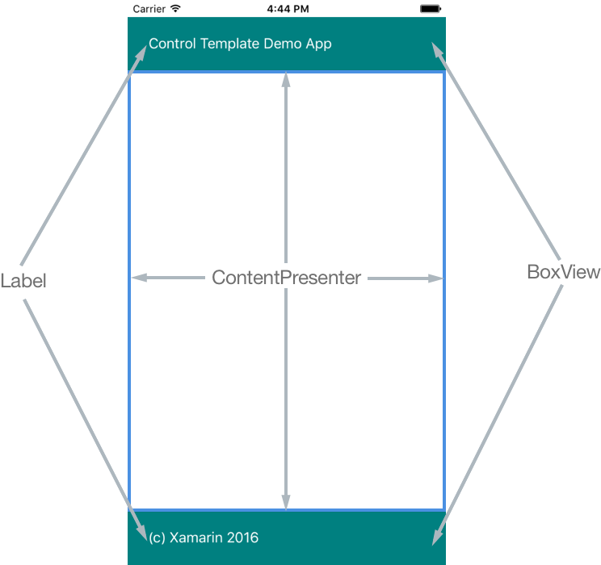

# Introduction to Xamarin.Forms Control Templates

_Xamarin.Forms control templates provide the ability to easily theme and re-theme application pages at runtime. This article provides an introduction to control templates._

Controls have different properties, such as `BackgroundColor` and `TextColor`, that can define aspects of the control's appearance. These properties can be set using [styles](~/xamarin-forms/user-interface/styles/index.md), which can be changed at runtime to implement basic theming. However, styles don't maintain a clean separation between the appearance of a page and its content, and the changes that can be made by setting such properties are limited.

Control templates provide a clean separation between the appearance of a page and its content, therefore enabling the creation of pages that can easily be themed. For example, an application may contain application-level control templates that provide a dark theme and a light theme. Each [`ContentPage`](xref:Xamarin.Forms.ContentPage) in the application can be themed by applying one of the control templates without changing the content being displayed by each page. In addition, the themes provided by control templates aren't limited to changing the properties of controls. They can also change the controls used to implement the theme.

## Creating a ControlTemplate

A [`ControlTemplate`](xref:Xamarin.Forms.ControlTemplate) specifies the appearance of a page or view, and contains a root layout, and within the layout, the controls that implement the template. Typically, a `ControlTemplate` will utilize a [`ContentPresenter`](xref:Xamarin.Forms.ContentPresenter) to mark where the content to be displayed by the page or view will appear. The page or view that consumes the `ControlTemplate` will then define content to be displayed by the `ContentPresenter`. The following diagram illustrates a `ControlTemplate` for a page that contains a number of controls, including a `ContentPresenter` marked by a blue rectangle:

A [`ControlTemplate`](xref:Xamarin.Forms.ControlTemplate) can be applied to the following types by setting their `ControlTemplate` properties:

- [`ContentPage`](xref:Xamarin.Forms.ContentPage)
- [`ContentView`](xref:Xamarin.Forms.ContentView)
- [`TemplatedPage`](xref:Xamarin.Forms.TemplatedPage)
- [`TemplatedView`](xref:Xamarin.Forms.TemplatedView)

When a [`ControlTemplate`](xref:Xamarin.Forms.ControlTemplate) is created and assigned to these types, any existing appearance is replaced with the appearance defined in the `ControlTemplate`. In addition, as well as setting appearance by using the `ControlTemplate` property, control templates can also be applied by using styles to further expand theme ability.

> [!NOTE]
>  *What are the `TemplatedPage` and `TemplatedView` types?* `TemplatedPage` is the base class for `ContentPage`, and is the most basic page type provided by Xamarin.Forms. Unlike `ContentPage`, `TemplatedPage` does not have a `Content` property. Therefore, content can't be directly added to a `TemplatedPage` instance. Instead, content is added by setting the control template for the `TemplatedPage` instance. Similarly, `TemplatedView` is the base class for `ContentView`. Unlike `ContentView`, `TemplatedView` does not have a `Content` property. Therefore, content can't be directly added to a `TemplatedView` instance. Instead, content is added by setting the control template for the `TemplatedView` instance.

Control templates can be created in XAML and in C#:

- Control templates created in XAML are defined in a [`ResourceDictionary`](xref:Xamarin.Forms.ResourceDictionary) that's assigned to the [`Resources`](xref:Xamarin.Forms.VisualElement.Resources) collection of a page, or more typically to the [`Resources`](xref:Xamarin.Forms.Application.Resources) collection of the application.
- Control templates created in C# are typically defined in the page's class, or in a class that can be globally accessed.

Choosing where to define a [`ControlTemplate`](xref:Xamarin.Forms.ControlTemplate) instance impacts where it can be used:

- [`ControlTemplate`](xref:Xamarin.Forms.ControlTemplate) instances defined at the page-level can only be applied to the page.
- [`ControlTemplate`](xref:Xamarin.Forms.ControlTemplate) instances defined at the application-level can be applied to pages throughout the application.

Control templates lower in the view hierarchy take precedence over those defined higher up. For example, a [`ControlTemplate`](xref:Xamarin.Forms.ControlTemplate) named `DarkTheme` that's defined at the page-level will take precedence over an identically named template defined at the application-level. Therefore, a control template that defines a theme to be applied to each page in an application should be defined at the application-level.

## Related Links

- [Styles](~/xamarin-forms/user-interface/styles/index.md)
- [ControlTemplate](xref:Xamarin.Forms.ControlTemplate)
- [ContentPresenter](xref:Xamarin.Forms.ContentPresenter)
