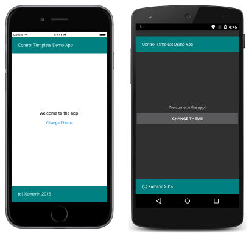

# Binding from a Xamarin.Forms ControlTemplate

[ Download the sample](https://developer.xamarin.com/samples/xamarin-forms/templates/controltemplates/simplethemewithtemplatebinding/)

_Template bindings allow controls in a control template to data bind to public properties, enabling property values on controls in the control template to be easily changed. This article demonstrates using template bindings to perform data binding from a control template._

A [`TemplateBinding`](xref:Xamarin.Forms.TemplateBinding) is used to bind a control's property in a control template to a bindable property on the parent of the *target* view that owns the control template. For example, rather than defining the text displayed by [`Label`](xref:Xamarin.Forms.Label) instances inside the [`ControlTemplate`](xref:Xamarin.Forms.ControlTemplate), you could use a template binding to bind the [`Label.Text`](xref:Xamarin.Forms.Label.Text) property to bindable properties that define the text to be displayed.

A [`TemplateBinding`](xref:Xamarin.Forms.TemplateBinding) is similar to an existing [`Binding`](xref:Xamarin.Forms.Binding), except that the *source* of a `TemplateBinding` is always automatically set to the parent of the *target* view that owns the control template. However, note that using a `TemplateBinding` outside of a [`ControlTemplate`](xref:Xamarin.Forms.ControlTemplate) is not supported.

## Creating a TemplateBinding in XAML

In XAML, a [`TemplateBinding`](xref:Xamarin.Forms.TemplateBinding) is created using the [`TemplateBinding`](xref:Xamarin.Forms.Xaml.TemplateBindingExtension) markup extension, as demonstrated in the following code example:

```xaml
<ControlTemplate x:Key="TealTemplate">
  <Grid>
    ...
    <Label Text="{TemplateBinding Parent.HeaderText}" ... />
    ...
    <Label Text="{TemplateBinding Parent.FooterText}" ... />
  </Grid>
</ControlTemplate>
```

Rather than set the [`Label.Text`](xref:Xamarin.Forms.Label.Text) properties to static text, the properties can use template bindings to bind to bindable properties on the parent of the *target* view that owns the [`ControlTemplate`](xref:Xamarin.Forms.ControlTemplate). However, note that the template bindings bind to `Parent.HeaderText` and `Parent.FooterText`, rather than `HeaderText` and `FooterText`. This is because in this example, the bindable properties are defined on the grandparent of the *target* view, rather than the parent, as demonstrated in the following code example:

```xaml
<ContentPage ...>
    <ContentView ... ControlTemplate="{StaticResource TealTemplate}">
          ...
    </ContentView>
</ContentPage>
```

The *source* of the template binding is always automatically set to the parent of the *target* view that owns the control template, which here is the [`ContentView`](xref:Xamarin.Forms.ContentView) instance. The template binding uses the [`Parent`](xref:Xamarin.Forms.Element.Parent) property to return the parent element of the `ContentView` instance, which is the [`ContentPage`](xref:Xamarin.Forms.ContentPage) instance. Therefore, using a [`TemplateBinding`](xref:Xamarin.Forms.TemplateBinding) in the [`ControlTemplate`](xref:Xamarin.Forms.ControlTemplate) to bind to `Parent.HeaderText` and `Parent.FooterText` locates the bindable properties that are defined on the `ContentPage`, as demonstrated in the following code example:

```csharp
public static readonly BindableProperty HeaderTextProperty =
  BindableProperty.Create ("HeaderText", typeof(string), typeof(HomePage), "Control Template Demo App");
public static readonly BindableProperty FooterTextProperty =
  BindableProperty.Create ("FooterText", typeof(string), typeof(HomePage), "(c) Xamarin 2016");

public string HeaderText {
  get { return (string)GetValue (HeaderTextProperty); }
}

public string FooterText {
  get { return (string)GetValue (FooterTextProperty); }
}
```

This results in the appearance shown in the following screenshots:



## Creating a TemplateBinding in C&#35;

In C#, a [`TemplateBinding`](xref:Xamarin.Forms.TemplateBinding) is created by using the `TemplateBinding` constructor, as demonstrated in the following code example:

```csharp
class TealTemplate : Grid
{
  public TealTemplate ()
  {
    ...
    var topLabel = new Label { TextColor = Color.White, VerticalOptions = LayoutOptions.Center };
    topLabel.SetBinding (Label.TextProperty, new TemplateBinding ("Parent.HeaderText"));
    ...
    var bottomLabel = new Label { TextColor = Color.White, VerticalOptions = LayoutOptions.Center };
    bottomLabel.SetBinding (Label.TextProperty, new TemplateBinding ("Parent.FooterText"));
    ...
  }
}
```

Rather than set the [`Label.Text`](xref:Xamarin.Forms.Label.Text) properties to static text, the properties can use template bindings to bind to bindable properties on the parent of the *target* view that owns the [`ControlTemplate`](xref:Xamarin.Forms.ControlTemplate). The template binding is created by using the [`SetBinding`](xref:Xamarin.Forms.BindableObject.SetBinding(Xamarin.Forms.BindableProperty,Xamarin.Forms.BindingBase)) method, specifying a [`TemplateBinding`](xref:Xamarin.Forms.TemplateBinding) instance as the second parameter. Note that the template bindings bind to `Parent.HeaderText` and `Parent.FooterText`, because the bindable properties are defined on the grandparent of the *target* view, rather than the parent, as demonstrated in the following code example:

```csharp
public class HomePageCS : ContentPage
{
  ...
  public HomePageCS ()
  {
    Content = new ContentView {
      ControlTemplate = tealTemplate,
      Content = new StackLayout {
        ...
      },
      ...
    };
    ...
  }
}
```

The bindable properties are defined on the `ContentPage`, as outlined earlier.

### Binding a BindableProperty to a ViewModel Property

As previously stated, a [`TemplateBinding`](xref:Xamarin.Forms.TemplateBinding) binds a control's property in a control template to a bindable property on the parent of the *target* view that owns the control template. In turn, these bindable properties can be bound to properties in ViewModels.

The following code example defines two properties on a ViewModel:

```csharp
public class HomePageViewModel
{
  public string HeaderText { get { return "Control Template Demo App"; } }
  public string FooterText { get { return "(c) Xamarin 2016"; } }
}
```

The `HeaderText` and `FooterText` ViewModel properties can be bound to, as shown in the following XAML code example:

```xaml
<ContentPage xmlns:local="clr-namespace:SimpleTheme;assembly=SimpleTheme"
             HeaderText="{Binding HeaderText}" FooterText="{Binding FooterText}" ...>
    <ContentPage.BindingContext>
        <local:HomePageViewModel />
    </ContentPage.BindingContext>
    <ContentView ControlTemplate="{StaticResource TealTemplate}" ...>
    ...
    </ContentView>
</ContentPage>
```

The `HeaderText` and `FooterText` bindable properties are bound to the `HomePageViewModel.HeaderText` and `HomePageViewModel.FooterText` properties, due to setting the [`BindingContext`](xref:Xamarin.Forms.BindableObject.BindingContext) to an instance of the `HomePageViewModel` class. Overall, this results in control properties in the [`ControlTemplate`](xref:Xamarin.Forms.ControlTemplate) being bound to [`BindableProperty`](xref:Xamarin.Forms.BindableProperty) instances on the [`ContentPage`](xref:Xamarin.Forms.ContentPage), which in turn bind to ViewModel properties.

The equivalent C# code is shown in the following code example:

```csharp
public class HomePageCS : ContentPage
{
  ...
  public HomePageCS ()
  {
    BindingContext = new HomePageViewModel ();
    this.SetBinding (HeaderTextProperty, "HeaderText");
    this.SetBinding (FooterTextProperty, "FooterText");
    ...
  }
}
```

You can also bind to the view model properties directly, so that you don't need to declare `BindableProperty`s for `HeaderText` and `FooterText` on the `ContentPage`, by binding the control template to Parent.BindingContext._PropertyName_ e.g.:

```xaml
<ControlTemplate x:Key="TealTemplate">
  <Grid>
    ...
    <Label Text="{TemplateBinding Parent.BindingContext.HeaderText}" ... />
    ...
    <Label Text="{TemplateBinding Parent.BindingContext.FooterText}" ... />
  </Grid>
</ControlTemplate>
```

For more information about data binding to ViewModels, see [From Data Bindings to MVVM](~/xamarin-forms/xaml/xaml-basics/data-bindings-to-mvvm.md).

## Summary

This article demonstrated using template bindings to perform data binding from a control template. Template bindings allow controls in a control template to data bind to public properties, enabling property values on controls in the control template to be easily changed.

## Related Links

- [Data Binding Basics](~/xamarin-forms/xaml/xaml-basics/data-binding-basics.md)
- [From Data Bindings to MVVM](~/xamarin-forms/xaml/xaml-basics/data-bindings-to-mvvm.md)
- [Simple Theme with Template Binding (sample)](https://developer.xamarin.com/samples/xamarin-forms/templates/controltemplates/simplethemewithtemplatebinding/)
- [Simple Theme with Template Binding and ViewModel (sample)](https://developer.xamarin.com/samples/xamarin-forms/templates/controltemplates/simplethemewithtemplatebindingandviewmodel/)
- [TemplateBinding](xref:Xamarin.Forms.TemplateBinding)
- [ControlTemplate](xref:Xamarin.Forms.ControlTemplate)
- [ContentView](xref:Xamarin.Forms.ContentView)
