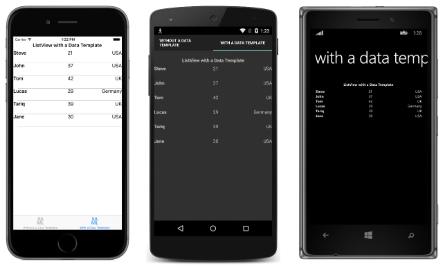

# Creating a Xamarin.Forms DataTemplate

[ Download the sample](/samples/xamarin/xamarin-forms-samples/templates-datatemplates)

_Data templates can be created inline, in a ResourceDictionary, or from a custom type or appropriate Xamarin.Forms cell type. This article explores each technique._

A common usage scenario for a [`DataTemplate`](xref:Xamarin.Forms.DataTemplate) is displaying data from a collection of objects in a [`ListView`](xref:Xamarin.Forms.ListView). The appearance of the data for each cell in the [`ListView`](xref:Xamarin.Forms.ListView) can be managed by setting the [`ListView.ItemTemplate`](xref:Xamarin.Forms.ItemsView`1) property to a [`DataTemplate`](xref:Xamarin.Forms.DataTemplate). There are a number of techniques that can be used to accomplish this:

- [Creating an Inline DataTemplate](#creating-an-inline-datatemplate).
- [Creating a DataTemplate with a Type](#creating-a-datatemplate-with-a-type).
- [Creating a DataTemplate as a Resource](#creating-a-datatemplate-as-a-resource).

Regardless of the technique being used, the result is that the appearance of each cell in the [`ListView`](xref:Xamarin.Forms.ListView) is defined by a [`DataTemplate`](xref:Xamarin.Forms.DataTemplate), as shown in the following screenshots:



## Creating an Inline DataTemplate

The [`ListView.ItemTemplate`](xref:Xamarin.Forms.ItemsView`1) property can be set to an inline [`DataTemplate`](xref:Xamarin.Forms.DataTemplate). An inline template, which is one that's placed as a direct child of an appropriate control property, should be used if there's no need to reuse the data template elsewhere. The elements specified in the `DataTemplate` define the appearance of each cell, as shown in the following XAML code example:

```xaml
<ListView Margin="0,20,0,0">
    <ListView.ItemsSource>
        <x:Array Type="{x:Type local:Person}">
            <local:Person Name="Steve" Age="21" Location="USA" />
            <local:Person Name="John" Age="37" Location="USA" />
            <local:Person Name="Tom" Age="42" Location="UK" />
            <local:Person Name="Lucas" Age="29" Location="Germany" />
            <local:Person Name="Tariq" Age="39" Location="UK" />
            <local:Person Name="Jane" Age="30" Location="USA" />
        </x:Array>
    </ListView.ItemsSource>
    <ListView.ItemTemplate>
        <DataTemplate>
            <ViewCell>
                <Grid>
                    ...
                    <Label Text="{Binding Name}" FontAttributes="Bold" />
                    <Label Grid.Column="1" Text="{Binding Age}" />
                    <Label Grid.Column="2" Text="{Binding Location}" HorizontalTextAlignment="End" />
                </Grid>
            </ViewCell>
        </DataTemplate>
    </ListView.ItemTemplate>
</ListView>
```

The child of an inline [`DataTemplate`](xref:Xamarin.Forms.DataTemplate) must be of, or derive from, type [`Cell`](xref:Xamarin.Forms.Cell). This example uses a [`ViewCell`](xref:Xamarin.Forms.ViewCell), which derives from `Cell`. Layout inside the `ViewCell` is managed here by a [`Grid`](xref:Xamarin.Forms.Grid). The `Grid` contains three [`Label`](xref:Xamarin.Forms.Label) instances that bind their [`Text`](xref:Xamarin.Forms.Label.Text) properties to the appropriate properties of each `Person` object in the collection.

The equivalent C# code is shown in the following code example:

```csharp
public class WithDataTemplatePageCS : ContentPage
{
    public WithDataTemplatePageCS()
    {
        ...
        var people = new List<Person>
        {
            new Person { Name = "Steve", Age = 21, Location = "USA" },
            ...
        };

        var personDataTemplate = new DataTemplate(() =>
        {
            var grid = new Grid();
            ...
            var nameLabel = new Label { FontAttributes = FontAttributes.Bold };
            var ageLabel = new Label();
            var locationLabel = new Label { HorizontalTextAlignment = TextAlignment.End };

            nameLabel.SetBinding(Label.TextProperty, "Name");
            ageLabel.SetBinding(Label.TextProperty, "Age");
            locationLabel.SetBinding(Label.TextProperty, "Location");

            grid.Children.Add(nameLabel);
            grid.Children.Add(ageLabel, 1, 0);
            grid.Children.Add(locationLabel, 2, 0);

            return new ViewCell { View = grid };
        });

        Content = new StackLayout
        {
            Margin = new Thickness(20),
            Children = {
                ...
                new ListView { ItemsSource = people, ItemTemplate = personDataTemplate, Margin = new Thickness(0, 20, 0, 0) }
            }
        };
    }
}
```

In C#, the inline [`DataTemplate`](xref:Xamarin.Forms.DataTemplate) is created using a constructor overload that specifies a `Func` argument.

## Creating a DataTemplate with a Type

The [`ListView.ItemTemplate`](xref:Xamarin.Forms.ItemsView`1) property can also be set to a [`DataTemplate`](xref:Xamarin.Forms.DataTemplate) that's created from a cell type. The advantage of this approach is that the appearance defined by the cell type can be reused by multiple data templates throughout the application. The following XAML code shows an example of this approach:

```xaml
<ContentPage xmlns="http://xamarin.com/schemas/2014/forms"
             xmlns:x="http://schemas.microsoft.com/winfx/2009/xaml"
             xmlns:local="clr-namespace:DataTemplates"
             ...>
    <StackLayout Margin="20">
        ...
        <ListView Margin="0,20,0,0">
           <ListView.ItemsSource>
                <x:Array Type="{x:Type local:Person}">
                    <local:Person Name="Steve" Age="21" Location="USA" />
                    ...
                </x:Array>
            </ListView.ItemsSource>
            <ListView.ItemTemplate>
                <DataTemplate>
                    <local:PersonCell />
                </DataTemplate>
            </ListView.ItemTemplate>
        </ListView>
    </StackLayout>
</ContentPage>
```

Here, the [`ListView.ItemTemplate`](xref:Xamarin.Forms.ItemsView`1) property is set to a [`DataTemplate`](xref:Xamarin.Forms.DataTemplate) that's created from a custom type that defines the cell appearance. The custom type must derive from type [`ViewCell`](xref:Xamarin.Forms.ViewCell), as shown in the following code example:

```xaml
<ViewCell xmlns="http://xamarin.com/schemas/2014/forms"
          xmlns:x="http://schemas.microsoft.com/winfx/2009/xaml"
          x:Class="DataTemplates.PersonCell">
     <Grid>
        <Grid.ColumnDefinitions>
            <ColumnDefinition Width="0.5*" />
            <ColumnDefinition Width="0.2*" />
            <ColumnDefinition Width="0.3*" />
        </Grid.ColumnDefinitions>
        <Label Text="{Binding Name}" FontAttributes="Bold" />
        <Label Grid.Column="1" Text="{Binding Age}" />
        <Label Grid.Column="2" Text="{Binding Location}" HorizontalTextAlignment="End" />
    </Grid>
</ViewCell>
```

Within the [`ViewCell`](xref:Xamarin.Forms.ViewCell), layout is managed here by a [`Grid`](xref:Xamarin.Forms.Grid). The `Grid` contains three [`Label`](xref:Xamarin.Forms.Label) instances that bind their [`Text`](xref:Xamarin.Forms.Label.Text) properties to the appropriate properties of each `Person` object in the collection.

The equivalent C# code is shown in the following example:

```csharp
public class WithDataTemplatePageFromTypeCS : ContentPage
{
    public WithDataTemplatePageFromTypeCS()
    {
        ...
        var people = new List<Person>
        {
            new Person { Name = "Steve", Age = 21, Location = "USA" },
            ...
        };

        Content = new StackLayout
        {
            Margin = new Thickness(20),
            Children = {
                ...
                new ListView { ItemTemplate = new DataTemplate(typeof(PersonCellCS)), ItemsSource = people, Margin = new Thickness(0, 20, 0, 0) }
            }
        };
    }
}
```

In C#, the [`DataTemplate`](xref:Xamarin.Forms.DataTemplate) is created using a constructor overload that specifies the cell type as an argument. The cell type must derive from type [`ViewCell`](xref:Xamarin.Forms.ViewCell), as shown in the following code example:

```csharp
public class PersonCellCS : ViewCell
{
    public PersonCellCS()
    {
        var grid = new Grid();
        ...
        var nameLabel = new Label { FontAttributes = FontAttributes.Bold };
        var ageLabel = new Label();
        var locationLabel = new Label { HorizontalTextAlignment = TextAlignment.End };

        nameLabel.SetBinding(Label.TextProperty, "Name");
        ageLabel.SetBinding(Label.TextProperty, "Age");
        locationLabel.SetBinding(Label.TextProperty, "Location");

        grid.Children.Add(nameLabel);
        grid.Children.Add(ageLabel, 1, 0);
        grid.Children.Add(locationLabel, 2, 0);

        View = grid;
    }
}
```

> [!NOTE]
> Note that Xamarin.Forms also includes cell types that can be used to display simple data in [`ListView`](xref:Xamarin.Forms.ListView) cells. For more information, see [Cell Appearance](~/xamarin-forms/user-interface/listview/customizing-cell-appearance.md).

## Creating a DataTemplate as a Resource

Data templates can also be created as reusable objects in a [`ResourceDictionary`](xref:Xamarin.Forms.ResourceDictionary). This is achieved by giving each declaration a unique `x:Key` attribute, which provides it with a descriptive key in the `ResourceDictionary`, as shown in the following XAML code example:

```xaml
<ContentPage xmlns="http://xamarin.com/schemas/2014/forms"
             xmlns:x="http://schemas.microsoft.com/winfx/2009/xaml"
             ...>
    <ContentPage.Resources>
        <ResourceDictionary>
            <DataTemplate x:Key="personTemplate">
                 <ViewCell>
                    <Grid>
                        ...
                    </Grid>
                </ViewCell>
            </DataTemplate>
        </ResourceDictionary>
    </ContentPage.Resources>
    <StackLayout Margin="20">
        ...
        <ListView ItemTemplate="{StaticResource personTemplate}" Margin="0,20,0,0">
            <ListView.ItemsSource>
                <x:Array Type="{x:Type local:Person}">
                    <local:Person Name="Steve" Age="21" Location="USA" />
                    ...
                </x:Array>
            </ListView.ItemsSource>
        </ListView>
    </StackLayout>
</ContentPage>
```

The [`DataTemplate`](xref:Xamarin.Forms.DataTemplate) is assigned to the [`ListView.ItemTemplate`](xref:Xamarin.Forms.ItemsView`1) property by using the `StaticResource` markup extension. Note that while the `DataTemplate` is defined in the page's [`ResourceDictionary`](xref:Xamarin.Forms.ResourceDictionary), it could also be defined at the control level or application level.

The following code example shows the equivalent page in C#:

```csharp
public class WithDataTemplatePageCS : ContentPage
{
  public WithDataTemplatePageCS ()
  {
    ...
    var personDataTemplate = new DataTemplate (() => {
      var grid = new Grid ();
      ...
      return new ViewCell { View = grid };
    });

    Resources = new ResourceDictionary ();
    Resources.Add ("personTemplate", personDataTemplate);

    Content = new StackLayout {
      Margin = new Thickness(20),
      Children = {
        ...
        new ListView { ItemTemplate = (DataTemplate)Resources ["personTemplate"], ItemsSource = people };
      }
    };
  }
}
```

The [`DataTemplate`](xref:Xamarin.Forms.DataTemplate) is added to the [`ResourceDictionary`](xref:Xamarin.Forms.ResourceDictionary) using the [`Add`](xref:Xamarin.Forms.ResourceDictionary.Add(System.String,System.Object)) method, which specifies a `Key` string that is used to reference the `DataTemplate` when retrieving it.

## Summary

This article has explained how to create data templates, inline, from a custom type, or in a [`ResourceDictionary`](xref:Xamarin.Forms.ResourceDictionary). An inline template should be used if there's no need to reuse the data template elsewhere. Alternatively, a data template can be reused by defining it as a custom type, or as a control-level, page-level, or application-level resource.

## Related Links

- [Cell Appearance](~/xamarin-forms/user-interface/listview/customizing-cell-appearance.md)
- [Data Templates (sample)](/samples/xamarin/xamarin-forms-samples/templates-datatemplates)
- [DataTemplate](xref:Xamarin.Forms.DataTemplate)