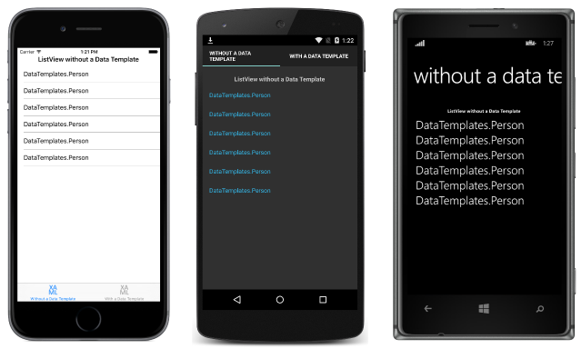
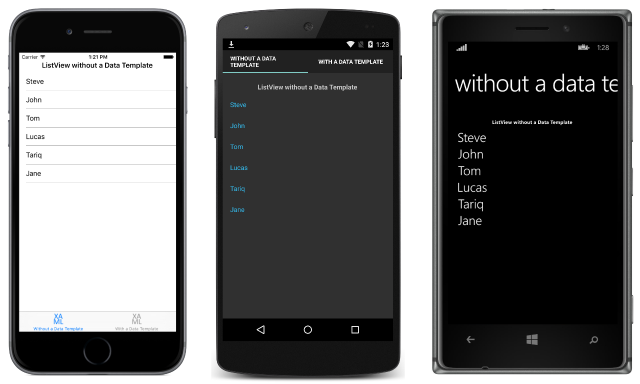

# Introduction to Xamarin.Forms Data Templates

[ Download the sample](/samples/xamarin/xamarin-forms-samples/templates-datatemplates)

_Xamarin.Forms data templates provide the ability to define the presentation of data on supported controls. This article provides an introduction to data templates, examining why they are necessary._

Consider a [`ListView`](xref:Xamarin.Forms.ListView) that displays a collection of `Person` objects. The following code example shows the definition of the `Person` class:

```csharp
public class Person
{
    public string Name { get; set; }
    public int Age { get; set; }
    public string Location { get; set; }
}
```

The `Person` class defines `Name`, `Age`, and `Location` properties, which can be set when a `Person` object is created. The [`ListView`](xref:Xamarin.Forms.ListView) is used to display the collection of `Person` objects, as shown in the following XAML code example:

```xaml
<ContentPage xmlns="http://xamarin.com/schemas/2014/forms"
             xmlns:x="http://schemas.microsoft.com/winfx/2009/xaml"
             xmlns:local="clr-namespace:DataTemplates"
             ...>
    <StackLayout Margin="20">
        ...
        <ListView Margin="0,20,0,0">
            <ListView.ItemsSource>
                <x:Array Type="{x:Type local:Person}">
                    <local:Person Name="Steve" Age="21" Location="USA" />
                    <local:Person Name="John" Age="37" Location="USA" />
                    <local:Person Name="Tom" Age="42" Location="UK" />
                    <local:Person Name="Lucas" Age="29" Location="Germany" />
                    <local:Person Name="Tariq" Age="39" Location="UK" />
                    <local:Person Name="Jane" Age="30" Location="USA" />
                </x:Array>
            </ListView.ItemsSource>
        </ListView>
    </StackLayout>
</ContentPage>
```

Items are added to the [`ListView`](xref:Xamarin.Forms.ListView) in XAML by initializing the [`ItemsSource`](xref:Xamarin.Forms.ItemsView`1.ItemsSource) property from an array of `Person` instances.

> [!NOTE]
> Note that the `x:Array` element requires a `Type` attribute indicating the type of the items in the array.

The equivalent C# page is shown in the following code example, which initializes the [`ItemsSource`](xref:Xamarin.Forms.ItemsView`1.ItemsSource) property to a `List` of `Person` instances:

```csharp
public WithoutDataTemplatePageCS()
{
    ...
    var people = new List<Person>
    {
        new Person { Name = "Steve", Age = 21, Location = "USA" },
        new Person { Name = "John", Age = 37, Location = "USA" },
        new Person { Name = "Tom", Age = 42, Location = "UK" },
        new Person { Name = "Lucas", Age = 29, Location = "Germany" },
        new Person { Name = "Tariq", Age = 39, Location = "UK" },
        new Person { Name = "Jane", Age = 30, Location = "USA" }
    };

    Content = new StackLayout
    {
        Margin = new Thickness(20),
        Children = {
            ...
            new ListView { ItemsSource = people, Margin = new Thickness(0, 20, 0, 0) }
        }
    };
}
```

The [`ListView`](xref:Xamarin.Forms.ListView) calls `ToString` when displaying the objects in the collection. Because there is no `Person.ToString` override, `ToString` returns the type name of each object, as shown in the following screenshots:



The `Person` object can override the `ToString` method to display meaningful data, as shown in the following code example:

```csharp
public class Person
{
  ...
  public override string ToString ()
  {
    return Name;
  }
}
```

This results in the [`ListView`](xref:Xamarin.Forms.ListView) displaying the `Person.Name` property value for each object in the collection, as shown in the following screenshots:



The `Person.ToString` override could return a formatted string consisting of the `Name`, `Age`, and `Location` properties. However, this approach offers only a limited control over the appearance of each item of data. For more flexibility, a [`DataTemplate`](xref:Xamarin.Forms.DataTemplate) can be created that defines the appearance of the data.

## Creating a DataTemplate

A [`DataTemplate`](xref:Xamarin.Forms.DataTemplate) is used to specify the appearance of data, and typically uses data binding to display data. Its common usage scenario is when displaying data from a collection of objects in a [`ListView`](xref:Xamarin.Forms.ListView). For example, when a `ListView` is bound to a collection of `Person` objects, the `ListView.ItemTemplate` property will be set to a `DataTemplate` that defines the appearance of each `Person` object in the `ListView`. The `DataTemplate` will contain elements that bind to property values of each `Person` object. For more information about data binding, see [Data Binding Basics](~/xamarin-forms/xaml/xaml-basics/data-binding-basics.md).

A [`DataTemplate`](xref:Xamarin.Forms.DataTemplate) that's placed as a direct child of the properties listed above is known as an *inline template*. Alternatively, a `DataTemplate` can be defined as a control-level, page-level, or application-level resource. Choosing where to define a [`DataTemplate`](xref:Xamarin.Forms.DataTemplate) impacts where it can be used:

- A [`DataTemplate`](xref:Xamarin.Forms.DataTemplate) defined at the control level can only be applied to the control.
- A [`DataTemplate`](xref:Xamarin.Forms.DataTemplate) defined at the page level can be applied to multiple valid controls on the page.
- A [`DataTemplate`](xref:Xamarin.Forms.DataTemplate) defined at the application level can be applied to valid controls throughout the application.

Data templates lower in the view hierarchy take precedence over those defined higher up when they share `x:Key` attributes. For example, an application-level data template will be overridden by a page-level data template, and a page-level data template will be overridden by a control-level data template, or an inline data template.

## Related Links

- [Cell Appearance](~/xamarin-forms/user-interface/listview/customizing-cell-appearance.md)
- [Data Templates (sample)](/samples/xamarin/xamarin-forms-samples/templates-datatemplates)
- [DataTemplate](xref:Xamarin.Forms.DataTemplate)