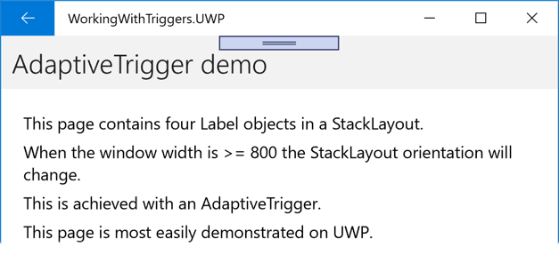

# Xamarin.Forms Triggers

[ Download the sample](/samples/xamarin/xamarin-forms-samples/workingwithtriggers)

Triggers allow you to express actions declaratively in XAML that change the appearance of controls based on events or property changes. In addition, state triggers, which are a specialized group of triggers, define when a [`VisualState`](xref:Xamarin.Forms.VisualState) should be applied.

You can assign a trigger directly to a control, or add it to a page-level or app-level resource dictionary to be applied to multiple controls.

## Property triggers

A simple trigger can be expressed purely in XAML, adding
    a `Trigger` element to a control's triggers collection.
    This example shows a trigger that changes an `Entry`
    background color when it receives focus:

```xaml
<Entry Placeholder="enter name">
    <Entry.Triggers>
        <Trigger TargetType="Entry"
                 Property="IsFocused" Value="True">
            <Setter Property="BackgroundColor" Value="Yellow" />
            <!-- multiple Setters elements are allowed -->
        </Trigger>
    </Entry.Triggers>
</Entry>
```

The important parts of the trigger's declaration are:

- **TargetType** - the control type that the trigger applies to.

- **Property** - the property on the control that is monitored.

- **Value** - the value, when it occurs for the monitored property,
    that causes the trigger to activate.

- **Setter** - a collection of `Setter` elements can be added
    and when the trigger condition is met. You must specify
    the `Property` and `Value` to set.

- **EnterActions and ExitActions** (not shown) - are written in
    code and can be used in
    addition to (or instead of) `Setter` elements. They
    are [described below](#enteractions-and-exitactions).

### Applying a trigger using a style

Triggers can also be added to a `Style` declaration
    on a control, in a page, or an application `ResourceDictionary`. This
    example declares an implicit style (i.e. no `Key` is
    set) which means it will apply to all `Entry` controls
    on the page.

```xaml
<ContentPage.Resources>
    <ResourceDictionary>
        <Style TargetType="Entry">
                        <Style.Triggers>
                <Trigger TargetType="Entry"
                         Property="IsFocused" Value="True">
                    <Setter Property="BackgroundColor" Value="Yellow" />
                    <!-- multiple Setters elements are allowed -->
                </Trigger>
            </Style.Triggers>
        </Style>
    </ResourceDictionary>
</ContentPage.Resources>
```

## Data triggers

Data triggers use data binding to monitor another control
    to cause the `Setter`s to get called. Instead of
    the `Property` attribute in a property trigger, set the
    `Binding` attribute to monitor for the
    specified value.

The example below uses the data binding syntax
    `{Binding Source={x:Reference entry}, Path=Text.Length}`
    which is how we refer to another control's properties. When the
    length of the `entry` is zero, the trigger is activated. In this
    sample the trigger disables the button when the input is empty.

```xaml
<!-- the x:Name is referenced below in DataTrigger-->
<!-- tip: make sure to set the Text="" (or some other default) -->
<Entry x:Name="entry"
       Text=""
       Placeholder="required field" />

<Button x:Name="button" Text="Save"
        FontSize="Large"
        HorizontalOptions="Center">
    <Button.Triggers>
        <DataTrigger TargetType="Button"
                     Binding="{Binding Source={x:Reference entry},
                                       Path=Text.Length}"
                     Value="0">
            <Setter Property="IsEnabled" Value="False" />
            <!-- multiple Setters elements are allowed -->
        </DataTrigger>
    </Button.Triggers>
</Button>
```

> [!TIP]
> When evaluating `Path=Text.Length` always provide a
> default value for the target property (eg. `Text=""`)
> because otherwise it will be `null` and the trigger
> won't work like you expect.

In addition to specifying `Setter`s you can also provide
    [`EnterActions` and `ExitActions`](#enteractions-and-exitactions).

## Event triggers

The `EventTrigger` element
    requires only an `Event` property, such as `"Clicked"`
    in the example below.

```xaml
<EventTrigger Event="Clicked">
    <local:NumericValidationTriggerAction />
</EventTrigger>
```

Notice that there are no `Setter` elements but rather
    a reference to a class defined by `local:NumericValidationTriggerAction`
    which requires the `xmlns:local` to be declared in
    the page's XAML:

```xaml
<ContentPage xmlns="http://xamarin.com/schemas/2014/forms"
             xmlns:x="http://schemas.microsoft.com/winfx/2009/xaml"
             xmlns:local="clr-namespace:WorkingWithTriggers;assembly=WorkingWithTriggers"
```

The class itself implements `TriggerAction` which means it should
    provide an override for the `Invoke` method that is called
    whenever the trigger event occurs.

A trigger action implementation should:

- Implement the generic `TriggerAction<T>` class, with the generic
    parameter corresponding with the type of control the trigger
    will be applied to. You can use superclasses such as `VisualElement`
    to write trigger actions that work with a variety of controls,
    or specify a control type like `Entry`.

- Override the `Invoke` method - this is called whenever the trigger
    criteria are met.

- Optionally expose properties that can be set in the XAML
    when the trigger is declared. For an example of this, see the `VisualElementPopTriggerAction` class in the accompanying sample application.

```csharp
public class NumericValidationTriggerAction : TriggerAction<Entry>
{
    protected override void Invoke (Entry entry)
    {
        double result;
        bool isValid = Double.TryParse (entry.Text, out result);
        entry.TextColor = isValid ? Color.Default : Color.Red;
    }
}
```

The event trigger can then be consumed from XAML:

```xaml
<EventTrigger Event="TextChanged">
    <local:NumericValidationTriggerAction />
</EventTrigger>
```

Be careful when sharing triggers in a `ResourceDictionary`,
    one instance will be shared among controls so any state
    that is configured once will apply to them all.

Note that event triggers do not support `EnterActions`
    and `ExitActions`    [described below](#enteractions-and-exitactions).

## Multi triggers

A `MultiTrigger` looks similar to a `Trigger` or `DataTrigger`
    except there can be more than one condition. All the conditions
    must be true before the `Setter`s are triggered.

Here's an example of a trigger for a button that binds to
    two different inputs (`email` and `phone`):

```xaml
<MultiTrigger TargetType="Button">
    <MultiTrigger.Conditions>
        <BindingCondition Binding="{Binding Source={x:Reference email},
                                   Path=Text.Length}"
                               Value="0" />
        <BindingCondition Binding="{Binding Source={x:Reference phone},
                                   Path=Text.Length}"
                               Value="0" />
    </MultiTrigger.Conditions>
    <Setter Property="IsEnabled" Value="False" />
    <!-- multiple Setter elements are allowed -->
</MultiTrigger>
```

The `Conditions` collection could also contain
    `PropertyCondition` elements like this:

```xaml
<PropertyCondition Property="Text" Value="OK" />
```

### Building a "require all" multi trigger

The multi trigger only updates its control when all conditions
    are true. Testing for "all field lengths are zero" (such as
    a login page where all inputs must be complete) is tricky
    because you want a condition "where Text.Length > 0" but
    this can't be expressed in XAML.

This can be done with an `IValueConverter`. The converter
    code below transforms the `Text.Length` binding into a
    `bool` that indicates whether a field is empty or not:

```csharp
public class MultiTriggerConverter : IValueConverter
{
    public object Convert(object value, Type targetType,
        object parameter, CultureInfo culture)
    {
        if ((int)value > 0) // length > 0 ?
            return true;            // some data has been entered
        else
            return false;            // input is empty
    }

    public object ConvertBack(object value, Type targetType,
        object parameter, CultureInfo culture)
    {
        throw new NotSupportedException ();
    }
}
```

To use this converter in a multi trigger, first add it
    to the page's resource dictionary (along with a custom
    `xmlns:local` namespace definition):

```xaml
<ResourceDictionary>
   <local:MultiTriggerConverter x:Key="dataHasBeenEntered" />
</ResourceDictionary>
```

The XAML is shown below. Note the following differences
    from the first multi trigger example:

- The button has `IsEnabled="false"` set by default.
- The multi trigger conditions use the converter to
    turn the `Text.Length` value into a `boolean`.
- When all the conditions are `true`, the setter
    makes the button's `IsEnabled` property `true`.

```xaml
<Entry x:Name="user" Text="" Placeholder="user name" />

<Entry x:Name="pwd" Text="" Placeholder="password" />

<Button x:Name="loginButton" Text="Login"
        FontSize="Large"
        HorizontalOptions="Center"
        IsEnabled="false">
  <Button.Triggers>
    <MultiTrigger TargetType="Button">
      <MultiTrigger.Conditions>
        <BindingCondition Binding="{Binding Source={x:Reference user},
                              Path=Text.Length,
                              Converter={StaticResource dataHasBeenEntered}}"
                          Value="true" />
        <BindingCondition Binding="{Binding Source={x:Reference pwd},
                              Path=Text.Length,
                              Converter={StaticResource dataHasBeenEntered}}"
                          Value="true" />
      </MultiTrigger.Conditions>
      <Setter Property="IsEnabled" Value="True" />
    </MultiTrigger>
  </Button.Triggers>
</Button>
```

These screenshots show the difference between the two multi
    trigger examples above. In the top part of the screens, text input in
    just one `Entry` is enough to enable the **Save** button.
    In the bottom part of the screens, the **Login** button
    remains inactive until both fields contain data.


## EnterActions and ExitActions

Another way to implement changes when a trigger occurs is by adding `EnterActions` and `ExitActions` collections and specifying `TriggerAction<T>` implementations.

The [`EnterActions`](xref:Xamarin.Forms.TriggerBase.EnterActions) collection is used to define an `IList` of [`TriggerAction`](xref:Xamarin.Forms.TriggerAction) objects that will be invoked when the trigger condition is met. The [`ExitActions`](xref:Xamarin.Forms.TriggerBase.ExitActions) collection is used to define an `IList` of `TriggerAction` objects that will be invoked after the trigger condition is no longer met.

> [!NOTE]
> The [`TriggerAction`](xref:Xamarin.Forms.TriggerAction) objects defined in the `EnterActions` and `ExitActions` collections are ignored by the [`EventTrigger`](xref:Xamarin.Forms.EventTrigger) class.    

You can provide *both* `EnterActions` and `ExitActions` as  well as `Setter`s in a trigger, but be aware that the `Setter`s are called immediately (they do not wait for the `EnterAction` or `ExitAction` to complete). Alternatively you can perform everything in the code and not use `Setter`s at all.

```xaml
<Entry Placeholder="enter job title">
    <Entry.Triggers>
        <Trigger TargetType="Entry"
                 Property="Entry.IsFocused" Value="True">
            <Trigger.EnterActions>
                <local:FadeTriggerAction StartsFrom="0" />
            </Trigger.EnterActions>

            <Trigger.ExitActions>
                <local:FadeTriggerAction StartsFrom="1" />
            </Trigger.ExitActions>
            <!-- You can use both Enter/Exit and Setter together if required -->
        </Trigger>
    </Entry.Triggers>
</Entry>
```

As always, when a class is referenced in XAML you should declare a namespace such as `xmlns:local` as shown here:

```xaml
<ContentPage xmlns="http://xamarin.com/schemas/2014/forms"
             xmlns:x="http://schemas.microsoft.com/winfx/2009/xaml"
             xmlns:local="clr-namespace:WorkingWithTriggers;assembly=WorkingWithTriggers"
```

The `FadeTriggerAction` code is shown below:

```csharp
public class FadeTriggerAction : TriggerAction<VisualElement>
{
    public int StartsFrom { set; get; }

    protected override void Invoke(VisualElement sender)
    {
        sender.Animate("FadeTriggerAction", new Animation((d) =>
        {
            var val = StartsFrom == 1 ? d : 1 - d;
            // so i was aiming for a different color, but then i liked the pink :)
            sender.BackgroundColor = Color.FromRgb(1, val, 1);
        }),
        length: 1000, // milliseconds
        easing: Easing.Linear);
    }
}
```

## State triggers

State triggers are a specialized group of triggers that define the conditions under which a [`VisualState`](xref:Xamarin.Forms.VisualState) should be applied.

State triggers are added to the [`StateTriggers`](xref:Xamarin.Forms.VisualState.StateTriggers) collection of a [`VisualState`](xref:Xamarin.Forms.VisualState). This collection can contain a single state trigger, or multiple state triggers. A [`VisualState`](xref:Xamarin.Forms.VisualState) will be applied when any state triggers in the collection are active.

When using state triggers to control visual states, Xamarin.Forms uses the following precedence rules to determine which trigger (and corresponding [`VisualState`](xref:Xamarin.Forms.VisualState)) will be active:

1. Any trigger that derives from [`StateTriggerBase`](xref:Xamarin.Forms.StateTriggerBase).
1. An [`AdaptiveTrigger`](xref:Xamarin.Forms.AdaptiveTrigger) activated due to the [`MinWindowWidth`](xref:Xamarin.Forms.AdaptiveTrigger.MinWindowWidth) condition being met.
1. An [`AdaptiveTrigger`](xref:Xamarin.Forms.AdaptiveTrigger) activated due to the [`MinWindowHeight`](xref:Xamarin.Forms.AdaptiveTrigger.MinWindowHeight) condition being met.

If multiple triggers are simultaneously active (for example, two custom triggers) then the first trigger declared in the markup takes precedence.

> [!NOTE]
> State triggers can be set in a [`Style`](xref:Xamarin.Forms.Style), or directly on elements.

For more information about visual states, see [Xamarin.Forms Visual State Manager](~/xamarin-forms/user-interface/visual-state-manager.md).

### State trigger

The [`StateTrigger`](xref:Xamarin.Forms.StateTrigger) class, which derives from the [`StateTriggerBase`](xref:Xamarin.Forms.StateTriggerBase) class, has an [`IsActive`](xref:Xamarin.Forms.StateTrigger.IsActive) bindable property. A `StateTrigger` triggers a [`VisualState`](xref:Xamarin.Forms.VisualState) change when the `IsActive` property changes value.

The [`StateTriggerBase`](xref:Xamarin.Forms.StateTriggerBase) class, which is the base class for all state triggers, has an [`IsActive`](xref:Xamarin.Forms.StateTriggerBase.IsActive) property and an [`IsActiveChanged`](xref:Xamarin.Forms.StateTriggerBase.IsActiveChanged) event. This event fires whenever a [`VisualState`](xref:Xamarin.Forms.VisualState) change occurs. In addition, the `StateTriggerBase` class has overridable `OnAttached` and `OnDetached` methods.

> [!IMPORTANT]
> The [`StateTrigger.IsActive`](xref:Xamarin.Forms.StateTrigger.IsActive) bindable property hides the inherited [`StateTriggerBase.IsActive`](xref:Xamarin.Forms.StateTriggerBase.IsActive) property.

The following XAML example shows a [`Style`](xref:Xamarin.Forms.Style) that includes [`StateTrigger`](xref:Xamarin.Forms.StateTrigger) objects:

```xaml
<Style TargetType="Grid">
    <Setter Property="VisualStateManager.VisualStateGroups">
        <VisualStateGroupList>
            <VisualStateGroup>
                <VisualState x:Name="Checked">
                    <VisualState.StateTriggers>
                        <StateTrigger IsActive="{Binding IsToggled}"
                                      IsActiveChanged="OnCheckedStateIsActiveChanged" />
                    </VisualState.StateTriggers>
                    <VisualState.Setters>
                        <Setter Property="BackgroundColor"
                                Value="Black" />
                    </VisualState.Setters>
                </VisualState>
                <VisualState x:Name="Unchecked">
                    <VisualState.StateTriggers>
                        <StateTrigger IsActive="{Binding IsToggled, Converter={StaticResource inverseBooleanConverter}}"
                                      IsActiveChanged="OnUncheckedStateIsActiveChanged" />
                    </VisualState.StateTriggers>
                    <VisualState.Setters>
                        <Setter Property="BackgroundColor"
                                Value="White" />
                    </VisualState.Setters>
                </VisualState>
            </VisualStateGroup>
        </VisualStateGroupList>
    </Setter>
</Style>
```

In this example, the implicit [`Style`](xref:Xamarin.Forms.Style) targets [`Grid`](xref:Xamarin.Forms.Grid) objects. When the `IsToggled` property of the bound object is `true`, the background color of the `Grid` is set to black. When the `IsToggled` property of the bound object becomes `false`, a [`VisualState`](xref:Xamarin.Forms.VisualState) change is triggered, and the background color of the `Grid` becomes white.

In addition, every time a [`VisualState`](xref:Xamarin.Forms.VisualState) change occurs, the [`IsActiveChanged`](xref:Xamarin.Forms.StateTriggerBase.IsActiveChanged) event for the `VisualState` is fired. Each `VisualState` registers an event handler for this event:

```csharp
void OnCheckedStateIsActiveChanged(object sender, EventArgs e)
{
    StateTriggerBase stateTrigger = sender as StateTriggerBase;
    Console.WriteLine($"Checked state active: {stateTrigger.IsActive}");
}

void OnUncheckedStateIsActiveChanged(object sender, EventArgs e)
{
    StateTriggerBase stateTrigger = sender as StateTriggerBase;
    Console.WriteLine($"Unchecked state active: {stateTrigger.IsActive}");
}
```

In this example, when a handler for the [`IsActiveChanged`](xref:Xamarin.Forms.StateTriggerBase.IsActiveChanged) event is fired, the handler outputs whether the [`VisualState`](xref:Xamarin.Forms.VisualState) is active or not. For example, the following messages are output to the console window when changing from the `Checked` visual state to the `Unchecked` visual state:

```
Checked state active: False
Unchecked state active: True
```

> [!NOTE]
> Custom state triggers can be created by deriving from the [`StateTriggerBase`](xref:Xamarin.Forms.StateTriggerBase) class, and overriding the `OnAttached` and `OnDetached` methods to perform any required registrations and cleanup.

### Adaptive trigger

An [`AdaptiveTrigger`](xref:Xamarin.Forms.AdaptiveTrigger) triggers a [`VisualState`](xref:Xamarin.Forms.VisualState) change when the window is a specified height or width. This trigger has two bindable properties:

- [`MinWindowHeight`](xref:Xamarin.Forms.AdaptiveTrigger.MinWindowHeight), of type `double`, which indicates the minimum window height at which the [`VisualState`](xref:Xamarin.Forms.VisualState) should be applied.
- [`MinWindowWidth`](xref:Xamarin.Forms.AdaptiveTrigger.MinWindowHeight), of type `double`, which indicates the minimum window width at which the [`VisualState`](xref:Xamarin.Forms.VisualState) should be applied.

> [!NOTE]
> The [`AdaptiveTrigger`](xref:Xamarin.Forms.AdaptiveTrigger) derives from the [`StateTriggerBase`](xref:Xamarin.Forms.StateTriggerBase) class and can therefore attach an event handler to the [`IsActiveChanged`](xref:Xamarin.Forms.StateTriggerBase.IsActiveChanged) event.

The following XAML example shows a [`Style`](xref:Xamarin.Forms.Style) that includes [`AdaptiveTrigger`](xref:Xamarin.Forms.AdaptiveTrigger) objects:

```xaml
<Style TargetType="StackLayout">
    <Setter Property="VisualStateManager.VisualStateGroups">
        <VisualStateGroupList>
            <VisualStateGroup>
                <VisualState x:Name="Vertical">
                    <VisualState.StateTriggers>
                        <AdaptiveTrigger MinWindowWidth="0" />
                    </VisualState.StateTriggers>
                    <VisualState.Setters>
                        <Setter Property="Orientation"
                                Value="Vertical" />
                    </VisualState.Setters>
                </VisualState>
                <VisualState x:Name="Horizontal">
                    <VisualState.StateTriggers>
                        <AdaptiveTrigger MinWindowWidth="800" />
                    </VisualState.StateTriggers>
                    <VisualState.Setters>
                        <Setter Property="Orientation"
                                Value="Horizontal" />
                    </VisualState.Setters>
                </VisualState>
            </VisualStateGroup>
        </VisualStateGroupList>
    </Setter>
</Style>
```

In this example, the implicit [`Style`](xref:Xamarin.Forms.Style) targets [`StackLayout`](xref:Xamarin.Forms.StackLayout) objects. When the window width is between 0 and 800 device-independent units, `StackLayout` objects to which the `Style` is applied will have a vertical orientation. When the window width is >= 800 device-independent units, the [`VisualState`](xref:Xamarin.Forms.VisualState) change is triggered, and the `StackLayout` orientation changes to horizontal:




The [`MinWindowHeight`](xref:Xamarin.Forms.AdaptiveTrigger.MinWindowHeight) and [`MinWindowWidth`](xref:Xamarin.Forms.AdaptiveTrigger.MinWindowHeight) properties can be used independently or in conjunction with each other. The following XAML shows an example of setting both properties:

```xaml
<AdaptiveTrigger MinWindowWidth="800"
                 MinWindowHeight="1200"/>
```

In this example, the [`AdaptiveTrigger`](xref:Xamarin.Forms.AdaptiveTrigger) indicates that the corresponding [`VisualState`](xref:Xamarin.Forms.VisualState) will be applied when the current window width is >= 800 device-independent units and the current window height is >= 1200 device-independent units.

### Compare state trigger

The [`CompareStateTrigger`](xref:Xamarin.Forms.CompareStateTrigger) triggers a [`VisualState`](xref:Xamarin.Forms.VisualState) change when a property is equal to a specific value. This trigger has two bindable properties:

- [`Property`](xref:Xamarin.Forms.CompareStateTrigger.Property), of type `object`, which indicates the property being compared by the trigger.
- [`Value`](xref:Xamarin.Forms.CompareStateTrigger.Value), of type `object`, which indicates the value at which the [`VisualState`](xref:Xamarin.Forms.VisualState) should be applied.

> [!NOTE]
> The [`CompareStateTrigger`](xref:Xamarin.Forms.CompareStateTrigger) derives from the [`StateTriggerBase`](xref:Xamarin.Forms.StateTriggerBase) class and can therefore attach an event handler to the [`IsActiveChanged`](xref:Xamarin.Forms.StateTriggerBase.IsActiveChanged) event.

The following XAML example shows a [`Style`](xref:Xamarin.Forms.Style) that includes [`CompareStateTrigger`](xref:Xamarin.Forms.CompareStateTrigger) objects:

```xaml
<Style TargetType="Grid">
    <Setter Property="VisualStateManager.VisualStateGroups">
        <VisualStateGroupList>
            <VisualStateGroup>
                <VisualState x:Name="Checked">
                    <VisualState.StateTriggers>
                        <CompareStateTrigger Property="{Binding Source={x:Reference checkBox}, Path=IsChecked}"
                                             Value="True" />
                    </VisualState.StateTriggers>
                    <VisualState.Setters>
                        <Setter Property="BackgroundColor"
                                Value="Black" />
                    </VisualState.Setters>
                </VisualState>
                <VisualState x:Name="Unchecked">
                    <VisualState.StateTriggers>
                        <CompareStateTrigger Property="{Binding Source={x:Reference checkBox}, Path=IsChecked}"
                                             Value="False" />
                    </VisualState.StateTriggers>
                    <VisualState.Setters>
                        <Setter Property="BackgroundColor"
                                Value="White" />
                    </VisualState.Setters>
                </VisualState>
            </VisualStateGroup>
        </VisualStateGroupList>
    </Setter>
</Style>
...
<Grid>
    <Frame BackgroundColor="White"
           CornerRadius="12"
           Margin="24"
           HorizontalOptions="Center"
           VerticalOptions="Center">
        <StackLayout Orientation="Horizontal">
            <CheckBox x:Name="checkBox"
                      VerticalOptions="Center" />
            <Label Text="Check the CheckBox to modify the Grid background color."
                   VerticalOptions="Center" />
        </StackLayout>
    </Frame>
</Grid>
```

In this example, the implicit [`Style`](xref:Xamarin.Forms.Style) targets [`Grid`](xref:Xamarin.Forms.Grid) objects. When the [`IsChecked`](xref:Xamarin.Forms.CheckBox.IsChecked) property of the [`CheckBox`](xref:Xamarin.Forms.CheckBox) is `false`, the background color of the `Grid` is set to white. When the `CheckBox.IsChecked` property becomes `true`, a [`VisualState`](xref:Xamarin.Forms.VisualState) change is triggered, and the background color of the `Grid` becomes black:

[](triggers-images/comparestatetrigger-unchecked-large.png#lightbox "CompareStateTrigger example")
[](triggers-images/comparestatetrigger-checked-large.png#lightbox "CompareStateTrigger example")

### Device state trigger

The [`DeviceStateTrigger`](xref:Xamarin.Forms.DeviceStateTrigger) triggers a [`VisualState`](xref:Xamarin.Forms.VisualState) change based on the device platform the app is running on. This trigger has a single bindable property:

- [`Device`](xref:Xamarin.Forms.DeviceStateTrigger.Device), of type `string`, which indicates the device platform on which the [`VisualState`](xref:Xamarin.Forms.VisualState) should be applied.

> [!NOTE]
> The [`DeviceStateTrigger`](xref:Xamarin.Forms.DeviceStateTrigger) derives from the [`StateTriggerBase`](xref:Xamarin.Forms.StateTriggerBase) class and can therefore attach an event handler to the [`IsActiveChanged`](xref:Xamarin.Forms.StateTriggerBase.IsActiveChanged) event.

The following XAML example shows a [`Style`](xref:Xamarin.Forms.Style) that includes `DeviceStateTrigger` objects:

```xaml
<Style x:Key="DeviceStateTriggerPageStyle"
       TargetType="ContentPage">
    <Setter Property="VisualStateManager.VisualStateGroups">
        <VisualStateGroupList>
            <VisualStateGroup>
                <VisualState x:Name="iOS">
                    <VisualState.StateTriggers>
                        <DeviceStateTrigger Device="iOS" />
                    </VisualState.StateTriggers>
                    <VisualState.Setters>
                        <Setter Property="BackgroundColor"
                                Value="Silver" />
                    </VisualState.Setters>
                </VisualState>
                <VisualState x:Name="Android">
                    <VisualState.StateTriggers>
                        <DeviceStateTrigger Device="Android" />
                    </VisualState.StateTriggers>
                    <VisualState.Setters>
                        <Setter Property="BackgroundColor"
                                Value="#2196F3" />
                    </VisualState.Setters>
                </VisualState>
                <VisualState x:Name="UWP">
                    <VisualState.StateTriggers>
                        <DeviceStateTrigger Device="UWP" />
                    </VisualState.StateTriggers>
                    <VisualState.Setters>
                        <Setter Property="BackgroundColor"
                                Value="Aquamarine" />
                    </VisualState.Setters>
                </VisualState>
            </VisualStateGroup>
        </VisualStateGroupList>
    </Setter>
</Style>
```

In this example, the explicit [`Style`](xref:Xamarin.Forms.Style) targets [`ContentPage`](xref:Xamarin.Forms.ContentPage) objects. `ContentPage` objects that consume the style set their background color to silver on iOS, to pale blue on Android, and to aquamarine on UWP. The following screenshots show the resulting pages on iOS and Android:

[](triggers-images/devicestatetrigger-large.png#lightbox "DeviceStateTrigger example")

### Orientation state trigger

The [`OrientationStateTrigger`](xref:Xamarin.Forms.OrientationStateTrigger) triggers a [`VisualState`](xref:Xamarin.Forms.VisualState) change when the orientation of the device changes. This trigger has a single bindable property:

- [`Orientation`](xref:Xamarin.Forms.OrientationStateTrigger.Orientation), of type [`DeviceOrientation`](xref:Xamarin.Forms.Internals.DeviceOrientation), which indicates the orientation to which the [`VisualState`](xref:Xamarin.Forms.VisualState) should be applied.

> [!NOTE]
> The [`OrientationStateTrigger`](xref:Xamarin.Forms.OrientationStateTrigger) derives from the [`StateTriggerBase`](xref:Xamarin.Forms.StateTriggerBase) class and can therefore attach an event handler to the [`IsActiveChanged`](xref:Xamarin.Forms.StateTriggerBase.IsActiveChanged) event.

The following XAML example shows a [`Style`](xref:Xamarin.Forms.Style) that includes `OrientationStateTrigger` objects:

```xaml
<Style x:Key="OrientationStateTriggerPageStyle"
       TargetType="ContentPage">
    <Setter Property="VisualStateManager.VisualStateGroups">
        <VisualStateGroupList>
            <VisualStateGroup>
                <VisualState x:Name="Portrait">
                    <VisualState.StateTriggers>
                        <OrientationStateTrigger Orientation="Portrait" />
                    </VisualState.StateTriggers>
                    <VisualState.Setters>
                        <Setter Property="BackgroundColor"
                                Value="Silver" />
                    </VisualState.Setters>
                </VisualState>
                <VisualState x:Name="Landscape">
                    <VisualState.StateTriggers>
                        <OrientationStateTrigger Orientation="Landscape" />
                    </VisualState.StateTriggers>
                    <VisualState.Setters>
                        <Setter Property="BackgroundColor"
                                Value="White" />
                    </VisualState.Setters>
                </VisualState>
            </VisualStateGroup>
        </VisualStateGroupList>
    </Setter>
</Style>
```

In this example, the explicit [`Style`](xref:Xamarin.Forms.Style) targets [`ContentPage`](xref:Xamarin.Forms.ContentPage) objects. `ContentPage` objects that consume the style set their background color to silver when the orientation is portrait, and set their background color to white when the orientation is landscape.

## Related links

- [Triggers Sample](/samples/xamarin/xamarin-forms-samples/workingwithtriggers)
- [Xamarin.Forms Visual State Manager](~/xamarin-forms/user-interface/visual-state-manager.md)
- [Xamarin.Forms Trigger API](xref:Xamarin.Forms.TriggerAction`1)