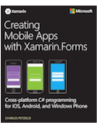

# Creating Mobile Apps with Xamarin.Forms book

[ Download the sample](https://github.com/xamarin/xamarin-forms-book-samples)

The book
*Creating Mobile Apps with Xamarin.Forms* by Charles Petzold is a guide for learning how to write Xamarin.Forms applications. The only prerequisite is knowledge of the C# programming language. The book provides an extensive exploration into the Xamarin.Forms user interface and also covers animation, MVVM, triggers, behaviors, custom layouts, custom renderers, and much more.

The book was published in the spring of 2016, and has not been updated since then. There is much in the book that remains valuable, but some of the [material is outdated](#ways-in-which-the-book-is-outdated), and some topics are no longer entirely correct or complete.

## Download eBook for free

Download your preferred eBook format from Microsoft Virtual Academy:

- [**PDF (56Mb)**](https://aka.ms/xamformsebook)

- [**ePub (151Mb)**](https://aka.ms/xamebook/epub)

- [**Kindle edition (325Mb)**](https://aka.ms/xamebook/mobi)

You can also download individual chapter summaries as PDF files.

## Samples

The samples are [available on github](https://github.com/xamarin/xamarin-forms-book-samples), and include projects for iOS, Android, and the Universal Windows Platform (UWP). (Xamarin.Forms no longer supports Windows 10 Mobile, but Xamarin.Forms applications will run on the Windows 10 desktop.)

## Chapter summaries

Chapter summaries are available in the chapter table shown below. These summaries describe the contents of each chapter, and include several types of links:

- Link to the actual eBook (Free dpwnload)

- Links to all the samples in the [**xamarin-forms-book-samples**](https://github.com/xamarin/xamarin-forms-book-samples) GitHub repository

- Links to the API documentation for more detailed descriptions of Xamarin.Forms classes, structures, properties, enumerations, and so forth

These summaries also indicate when material in the chapter might be [somewhat outdated](#ways-in-which-the-book-is-outdated).

## Download entire eBook or view a chapter summary

| Chapter | Complete eBook | Chapter Summary |
| ------- | ------------- | ------- |
| Chapter 1. How Does Xamarin.Forms Fit In? | [Download book PDF](https://aka.ms/xamformsebook) | [Summary](summaries/chapter01.md) |
| Chapter 2. Anatomy of an App | [Download book PDF](https://aka.ms/xamformsebook) | [Summary](summaries/chapter02.md) |
| Chapter 3. Deeper into Text | [Download book PDF](https://aka.ms/xamformsebook) | [Summary](summaries/chapter03.md) |
| Chapter 4. Scrolling the Stack | [Download book PDF](https://aka.ms/xamformsebook) | [Summary](summaries/chapter04.md) |
| Chapter 5. Dealing with Sizes | [Download book PDF](https://aka.ms/xamformsebook) | [Summary](summaries/chapter05.md) |
| Chapter 6. Button Clicks | [Download book PDF](https://aka.ms/xamformsebook) | [Summary](summaries/chapter06.md) |
| Chapter 7. XAML vs. Code | [Download book PDF](https://aka.ms/xamformsebook) | [Summary](summaries/chapter07.md) |
| Chapter 8. Code and XAML in Harmony | [Download book PDF](https://aka.ms/xamformsebook) | [Summary](summaries/chapter08.md) |
| Chapter 9. Platform-Specific API Calls | [Download book PDF](https://aka.ms/xamformsebook) | [Summary](summaries/chapter09.md) |
| Chapter 10. XAML Markup Extensions | [Download book PDF](https://aka.ms/xamformsebook) | [Summary](summaries/chapter10.md) |
| Chapter 11. The Bindable Infrastructure | [Download book PDF](https://aka.ms/xamformsebook) | [Summary](summaries/chapter11.md) |
| Chapter 12. Styles | [Download book PDF](https://aka.ms/xamformsebook) | [Summary](summaries/chapter12.md) |
| Chapter 13. Bitmaps | [Download book PDF](https://aka.ms/xamformsebook) | [Summary](summaries/chapter13.md) |
| Chapter 14. Absolute Layout | [Download book PDF](https://aka.ms/xamformsebook) | [Summary](summaries/chapter14.md) |
| Chapter 15. The Interactive Interface | [Download book PDF](https://aka.ms/xamformsebook) | [Summary](summaries/chapter15.md) |
| Chapter 16. Data Binding | [Download book PDF](https://aka.ms/xamformsebook) | [Summary](summaries/chapter16.md) |
| Chapter 17. Mastering the Grid | [Download book PDF](https://aka.ms/xamformsebook) | [Summary](summaries/chapter17.md) |
| Chapter 18. MVVM | [Download book PDF](https://aka.ms/xamformsebook) | [Summary](summaries/chapter18.md) |
| Chapter 19. Collection Views | [Download book PDF](https://aka.ms/xamformsebook) | [Summary](summaries/chapter19.md) |
| Chapter 20. Async and File I/O | [Download book PDF](https://aka.ms/xamformsebook) | [Summary](summaries/chapter20.md) |
| Chapter 21. Transforms | [Download book PDF](https://aka.ms/xamformsebook) | [Summary](summaries/chapter21.md) |
| Chapter 22. Animation | [Download book PDF](https://aka.ms/xamformsebook) | [Summary](summaries/chapter22.md) |
| Chapter 23. Triggers and Behaviors | [Download book PDF](https://aka.ms/xamformsebook) | [Summary](summaries/chapter23.md) |
| Chapter 24. Page Navigation | [Download book PDF](https://aka.ms/xamformsebook) | [Summary](summaries/chapter24.md) |
| Chapter 25. Page Varieties | [Download book PDF](https://aka.ms/xamformsebook) | [Summary](summaries/chapter25.md) |
| Chapter 26. Custom Layouts | [Download book PDF](https://aka.ms/xamformsebook) | [Summary](summaries/chapter26.md) |
| Chapter 27. Custom renderers | [Download book PDF](https://aka.ms/xamformsebook) | [Summary](summaries/chapter27.md) |
| Chapter 28. Location and Maps | [Download book PDF](https://aka.ms/xamformsebook) | [Summary](summaries/chapter28.md) |

## Ways in which the book is outdated

Since the publication of *Creating Mobile Apps with Xamarin.Forms*, several new features have been added to Xamarin.Forms. These new features are described in individual articles in the [Xamarin.Forms](../../index.yml) documentation.

Other changes have caused some of the content of the book to be outdated:

### .NET Standard 2.0 libraries have replaced Portable Class Libraries

A Xamarin.Forms application generally uses a library to share code among the different platforms. Originally, this was a Portable Class Library (PCL). There are many references to PCLs throughout the book and the chapter summaries.

The Portable Class Library has been replaced with a .NET Standard 2.0 library, as described in the article [.NET Standard 2.0 Support in Xamarin.Forms](~/xamarin-forms/internals/net-standard.md). All the [sample code](https://github.com/xamarin/xamarin-forms-book-samples) from the book has been updated to use .NET Standard 2.0 libraries.

Most of the information in the book concerning the role of the Portable Class Library remains the same for a .NET Standard 2.0 library. One difference is that only a PCL has a numeric "profile." Also, there are some advantages to .NET Standard 2.0 libraries. For example, Chapter 20, [Async and File I/O](summaries/chapter20.md) describes how to use the underlying platforms for performing file I/O. This is no longer necessary. The .NET Standard 2.0 library supports the familiar [System.IO](xref:System.IO) classes for all Xamarin.Forms platforms.

The .NET Standard 2.0 library also allows Xamarin.Forms applications to use [`HttpClient`](xref:System.Net.Http.HttpClient) to access files over the Internet rather than [`WebRequest`](xref:System.Net.WebRequest) or other classes.

### The role of XAML has been elevated

*Creating Mobile Apps with Xamarin.Forms* begins by describing how to write Xamarin.Forms applications using C#. The Extensible Application Markup Language (XAML) isn't introduced until [Chapter 7. XAML vs. Code](summaries/chapter07.md).

XAML now has a much larger role in Xamarin.Forms. The Xamarin.Forms solution templates distributed with Visual Studio create XAML-based page files. A developer using Xamarin.Forms should become familiar with XAML as early as possible. The [eXtensible Application Markup Language (XAML)](~/xamarin-forms/xaml/index.yml) section of the Xamarin.Forms documentation contains several articles about XAML to get you started.

### Supported platforms

Xamarin.Forms no longer supports Windows 8.1 and Windows Phone 8.1.

The book sometimes makes references to the _Windows Runtime_. This is a term that encompasses the Windows API used in several versions of Windows and Windows Phone. More recent versions of Xamarin.Forms restricts itself to supporting the Universal Windows Platform, which is the API for Windows 10 and Windows 10 Mobile.

A .NET Standard 2.0 library does not support any version of Windows 10 Mobile. Therefore, a Xamarin.Forms application using a .NET Standard library will not run on a Windows 10 Mobile device. Xamarin.Forms applications continue to run on the Windows 10 desktop, versions 10.0.16299.0 and above.

Xamarin.Forms has preview support for the [Mac](~/xamarin-forms/platform/other/mac.md), [WPF](~/xamarin-forms/platform/other/wpf.md), [GTK#](~/xamarin-forms/platform/other/gtk.md), and [Tizen](~/xamarin-forms/platform/other/tizen.md) platforms.

### Chapter summaries

The chapter summaries include information concerning changes in Xamarin.Forms since the book was written. These are often in the form of notes:

> [!NOTE]
> Notes on each page indicate where Xamarin.Forms has diverged from the material presented in the book.

### Samples

In the [**xamarin-forms-book-samples**](https://github.com/xamarin/xamarin-forms-book-samples) GitHub repository, the **original-code-from-book** branch contains program samples consistent with the book. The main branch contains projects that have been upgraded to remove deprecated APIs and reflect enhanced APIs. In addition, the Android projects in the main branch have been upgraded for Android [Material Design via AppCompat](~/xamarin-forms/platform/android/index.md) and will generally display black text on a white background.

## Related Links

- [MS Press blog](/archive/blogs/microsoft_press/free-ebook-creating-mobile-apps-with-xamarin-forms)
- [Sample code from book](https://github.com/xamarin/xamarin-forms-book-samples)