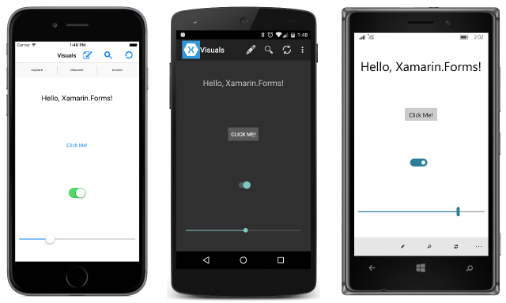

# Summary of Chapter 1. How does Xamarin.Forms fit in?

[ Download the sample](https://github.com/xamarin/xamarin-forms-book-samples/tree/master/Chapter01)

> [!NOTE]
> This book was published in the spring of 2016, and has not been updated since then. There is much in the book that remains valuable, but some of the material is outdated, and some topics are no longer entirely correct or complete.

One of the most unpleasant jobs in programming is porting a code base from one platform to another, particularly if that platform involves a different programming language. There is a temptation when porting the code to refactor it as well, but if both platforms must be maintained in parallel, then the differences between the two code bases will make future maintenance more difficult.

## Cross-platform mobile development

This problem is common when targeting mobile platforms. Currently, there exist two major mobile platforms, the Apple family of iPhones and iPads running the iOS operating system, and the Android operating system that runs on a variety of phones and tablets. Another significant platform is Microsoft's Universal Windows Platform (UWP), which allows a single program to target both Windows 10.

A software vendor that wishes to target these platforms must deal with different user-interface paradigms, three different development environments, three different programming interfaces, and&mdash;perhaps most awkwardly&mdash;three different programming languages: Objective-C for the iPhone and iPad, Java for Android, and C# for Windows.

## The C# and .NET solution

Although Objective-C, Java, and C# are all derived from the C programming language, they have evolved by very different paths. C# is the most recent of these languages and has been maturing in very useful ways. Moreover, C# is closely associated with an entire programming infrastructure called .NET, which provides support for math, debugging, reflection, collections, globalization, file I/O, networking, security, threading, web services, data handling, and XML and JSON reading and writing.

Xamarin currently provides tools to target the native Mac, iOS, and Android APIs using C# and .NET. These tools are called Xamarin.Mac, Xamarin.iOS, and Xamarin.Android, collectively known as the Xamarin platform. These are libraries and bindings that express the native APIs of these platforms with .NET idioms.

Developers can use the Xamarin platform to write applications in C# that target Mac, iOS, or Android. But when targeting more than one platform, it makes a lot of sense to share some of the code among the target platforms. This involves separating the program into platform-dependent code (generally involving the user interface), and platform-independent code, which generally requires only the base .NET framework. This platform-independent code can either reside in a Portable Class Library (PCL), or a shared project, often called a Shared Asset Project or SAP.

> [!NOTE]
> Portable Class Libraries have been replaced by .NET Standard libraries. All the sample code from the book has been converted to use .NET standard libraries.

## Introducing Xamarin.Forms

When targeting multiple mobile platforms, Xamarin.Forms allows even more code sharing. A single program written for Xamarin.Forms can target these platforms:

- iOS for programs that run on the iPhone, iPad, and iPod touch
- Android for programs that run on Android phones and tablets
- the Universal Windows Platform to target Windows 10

> [!NOTE]
> Xamarin.Forms no longer supports Windows 8.1, Windows Phone 8.1, or Windows 10 Mobile, but Xamarin.Forms applications do run on the Windows 10 desktop. There is also preview support for the [Mac](~/xamarin-forms/platform/other/mac.md), [WPF](~/xamarin-forms/platform/other/wpf.md), [GTK#](~/xamarin-forms/platform/other/gtk.md), and [Tizen](~/xamarin-forms/platform/other/tizen.md) platforms.

The bulk of a Xamarin.Forms program exists in a library or an SAP. Each of the platforms consists of a small application stub that calls into this shared code.

The Xamarin.Forms APIs map to native controls on each platform, so that each platform maintains its characteristic look and feel:

The screenshots from left to right show an iPhone and an Android phone:

On each screen, the page contains a Xamarin.Forms [`Label`](xref:Xamarin.Forms.Label) for displaying text, a [`Button`](xref:Xamarin.Forms.Button) for initiating actions, a [`Switch`](xref:Xamarin.Forms.Switch) for choosing an on/off value, and a [`Slider`](xref:Xamarin.Forms.Slider) for specifying a value within a continuous range. All four of those views are children of a [`StackLayout`](xref:Xamarin.Forms.StackLayout) on a [`ContentPage`](xref:Xamarin.Forms.ContentPage).

Also attached to the page is a Xamarin.Forms toolbar consisting of several [`ToolbarItem`](xref:Xamarin.Forms.ToolbarItem) objects. These are visible as icons on the top of the iOS and Android screens, and on the bottom of the Windows 10 Mobile screen.

Xamarin.Forms also supports XAML, the Extensible Application Markup Language developed at Microsoft for several application platforms. All the visuals of the program shown above are defined in XAML as demonstrated in the [**PlatformVisuals**](https://github.com/xamarin/xamarin-forms-book-samples/tree/master/Chapter01/PlatformVisuals) sample.

A Xamarin.Forms program can determine what platform it is running on and execute different code accordingly. More powerfully, developers can write custom code for the various platforms and run that code from a Xamarin.Forms program in a platform-independent manner. Developers can also create additional controls by writing renderers for each platform.

While Xamarin.Forms is a good solution for line-of-business applications, or for prototyping, or making a quick proof-of-concept demonstration, it is less ideal for applications that require vector graphics or complex touch interaction.

## Your development environment

Your development environment depends on what platforms you want to target and what machines you want to use.

If you want to target iOS, you will need a Mac with Xcode and the Xamarin platform installed. Supporting Android as well requires installing Java and the required SDKs. You can then target both iOS and Android using Visual Studio for Mac.

Installing Visual Studio allows on the PC you to target iOS, Android, and all the Windows platforms. However, targeting iOS from Visual Studio still requires a Mac with Xcode and the Xamarin platform installed.

You can test programs on either an actual device connected by USB to the computer, or on a simulator.

## Installation

Before creating and building a Xamarin.Forms application, you should try to create and build separately an iOS application, an Android application, and a UWP application, depending on the platforms you want to target and your development environment.

The Xamarin and Microsoft web sites contain information on how to do this:

- [Getting Started with iOS](~/ios/get-started/index.md)
- [Getting Started with Android](~/android/get-started/index.md)
- [Windows Dev Center](https://dev.windows.com)

Once you can create and run projects for these individual platforms, you should have no problem creating and running a Xamarin.Forms application.

## Related links

- [Full eBook text (PDF)](https://aka.ms/xamformsebook)
- [Chapter 1 sample](https://github.com/xamarin/xamarin-forms-book-samples/tree/master/Chapter01)
