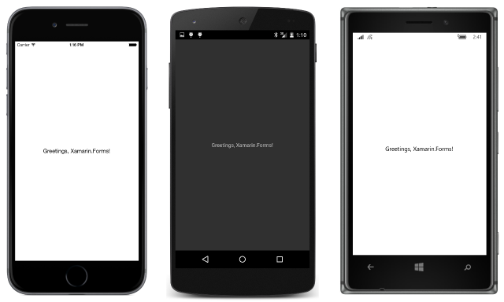

# Summary of Chapter 2. Anatomy of an app

[ Download the sample](https://github.com/xamarin/xamarin-forms-book-samples/tree/master/Chapter02)

> [!NOTE]
> This book was published in the spring of 2016, and has not been updated since then. There is much in the book that remains valuable, but some of the material is outdated, and some topics are no longer entirely correct or complete.

In a Xamarin.Forms application, objects that occupy space on the screen are known as *visual elements*, encapsulated by the [`VisualElement`](xref:Xamarin.Forms.VisualElement) class. Visual Elements can be split into three categories corresponding to these classes:

- [Page](xref:Xamarin.Forms.Page)
- [Layout](xref:Xamarin.Forms.Layout)
- [View](xref:Xamarin.Forms.View)

A `Page` derivative occupies the entire screen, or nearly the entire screen. Often, the child of a page is a `Layout` derivative to organize child visual elements. The children of the `Layout` can be other `Layout` classes or `View` derivatives (often called *elements*), which are familiar objects such as text, bitmaps, sliders, buttons, list boxes, and so on.

This chapter demonstrates how to create an application by focusing on the [`Label`](xref:Xamarin.Forms.Label), which is the `View` derivative that displays text.

## Say hello

With the Xamarin platform installed, you can create a new Xamarin.Forms solution in Visual Studio or Visual Studio for Mac. The [**Hello**](https://github.com/xamarin/xamarin-forms-book-samples/tree/master/Chapter02/Hello) solution uses a Portable Class Library for the common code.

> [!NOTE]
> Portable Class Libraries have been replaced by .NET Standard libraries. All the sample code from the book has been converted to use .NET standard libraries.

This sample demonstrates a Xamarin.Forms solution created in Visual Studio with no modifications. The solution consists of four projects:

- [**Hello**](https://github.com/xamarin/xamarin-forms-book-samples/tree/master/Chapter02/Hello/Hello/Hello), a Portable Class Library (PCL) shared by the other projects
- [**Hello.Droid**](https://github.com/xamarin/xamarin-forms-book-samples/tree/master/Chapter02/Hello/Hello/Hello.Droid), an application project for Android
- [**Hello.iOS**](https://github.com/xamarin/xamarin-forms-book-samples/tree/master/Chapter02/Hello/Hello/Hello.iOS), an application project for iOS
- [**Hello.UWP**](https://github.com/xamarin/xamarin-forms-book-samples/tree/master/Chapter02/Hello/Hello/Hello.UWP), an application project for the Universal Windows Platform (Windows 10 and Windows 10 Mobile)

> [!NOTE]
> Xamarin.Forms no longer supports Windows 8.1, Windows Phone 8.1, or Windows 10 Mobile, but Xamarin.Forms applications do run on the Windows 10 desktop.

You can make any of these application projects the startup project, and then build and run the program on a device or simulator.

In many of your Xamarin.Forms programs, you won't be modifying the application projects. These often remain tiny stubs just to start up the program. Most of your focus will be the library common to all the applications.

## Inside the files

The visuals displayed by the **Hello** program are defined in the constructor of the [`App`](https://github.com/xamarin/xamarin-forms-book-samples/blob/master/Chapter02/Hello/Hello/Hello/App.cs) class. `App` derives from the Xamarin.Forms class [`Application`](xref:Xamarin.Forms.Application).

> [!NOTE]
> The Visual Studio solution templates for Xamarin.Forms create a page with a XAML file. XAML is not covered in this book until [Chapter 7](chapter07.md).

The **References** section of the **Hello** PCL project includes the following Xamarin.Forms assemblies:

- **Xamarin.Forms.Core**
- **Xamarin.Forms.Xaml**
- **Xamarin.Forms.Platform**

The **References** sections of the five application projects include additional assemblies that apply to the individual platforms:

- **Xamarin.Forms.Platform.Android**
- **Xamarin.Forms.Platform.iOS**
- **Xamarin.Forms.Platform.UWP**
- **Xamarin.Forms.Platform.WinRT**
- **Xamarin.Forms.Platform.WinRT.Tablet**
- **Xamarin.Forms.Platform.WinRT.Phone**

> [!NOTE]
> The **References** sections of these projects no longer list the assemblies. Instead, the project file contains a **PackageReference** tags referencing the Xamarin.Forms NuGet package. The **References** section in Visual Studio lists the **Xamarin.Forms** package rather than the Xamarin.Forms assemblies.

Each of the application projects contains a call to the static `Forms.Init` method in the `Xamarin.Forms` namespace. This initializes the Xamarin.Forms library. A different version of `Forms.Init` is defined for each platform. The calls to this method can be found in the following classes:

- iOS: [`AppDelegate`](https://github.com/xamarin/xamarin-forms-book-samples/blob/master/Chapter02/Hello/Hello/Hello.iOS/AppDelegate.cs)
- Android: [`MainActivity`](https://github.com/xamarin/xamarin-forms-book-samples/blob/master/Chapter02/Hello/Hello/Hello.Droid/MainActivity.cs)
- UWP: [`App` class, `OnLaunched` method](https://github.com/xamarin/xamarin-forms-book-samples/blob/master/Chapter02/Hello/Hello/Hello.Droid/MainActivity.cs)

In addition, each platform must instantiate the `App` class location in the shared library. This occurs in a call to `LoadApplication` in the following classes:

- iOS: [`AppDelegate`](https://github.com/xamarin/xamarin-forms-book-samples/blob/master/Chapter02/Hello/Hello/Hello.iOS/AppDelegate.cs)
- Android: [`MainActivity`](https://github.com/xamarin/xamarin-forms-book-samples/blob/master/Chapter02/Hello/Hello/Hello.Droid/MainActivity.cs)
- UWP: [`MainPage`](https://github.com/xamarin/xamarin-forms-book-samples/blob/master/Chapter02/Hello/Hello/Hello.UWP/MainPage.xaml.cs)

Otherwise, these application projects are normal "do nothing" programs.

## PCL or SAP?

It's possible to create a Xamarin.Forms solution with the common code in either a Portable Class Library (PCL) or a Shared Asset Project (SAP). To create an SAP solution, select the Shared option in Visual Studio. The  [**HelloSap**](https://github.com/xamarin/xamarin-forms-book-samples/tree/master/Chapter02/HelloSap) solution demonstrates the SAP template with no modifications.

> [!NOTE]
> Portable Class Libraries has been replaced by .NET Standard libraries. All the sample code from the book has been converted to use .NET standard libraries. Otherwise, the PCL and .NET Standard libraries are conceptually very similar.

The library approach bundles all the common code in a library project referenced by the platform application projects. With the SAP approach, the common code effectively exists in all the platform application projects and is shared among them.

Most Xamarin.Forms developers prefer the library approach. In this book, most of the solutions use a library. Those that use SAP include an **Sap** suffix in the project name.

With the SAP approach the code in the shared project can execute different code for the various platforms by using C# preprocessor directives (`#if`, #`elif`, and `#endif`) with these predefined identifiers:

- iOS: `__IOS__`
- Android: `__ANDROID__`
- UWP: `WINDOWS_UWP`

In a shared library, you can determine what platform you're running on at runtime, as you'll see later in this chapter.

## Labels for text

The [**Greetings**](https://github.com/xamarin/xamarin-forms-book-samples/tree/master/Chapter02/Greetings) solution demonstrates how to add a new C# file to the **Greetings** project. This file defines a class named `GreetingsPage` that derives from `ContentPage`. In this book, most projects contain a single `ContentPage` derivative whose name is the name of the project with the suffix `Page` appended.

The `GreetingsPage` constructor instantiates a [`Label`](xref:Xamarin.Forms.Label) view, which is the Xamarin.Forms view that displays text. The [`Text`](xref:Xamarin.Forms.Label.Text) property is set to the text displayed by the `Label`. This program sets the `Label` to the `Content` property of `ContentPage`. The constructor of the `App` class then instantiates `GreetingsPage` and sets it to its `MainPage` property.

The text is displayed in the upper-left corner of the page. On iOS, this means that it overlaps the page's status bar. There are several solutions to this problem:

### Solution 1. Include padding on the page

Set a [`Padding`](xref:Xamarin.Forms.Page.Padding) property on the page. `Padding` is of type [`Thickness`](xref:Xamarin.Forms.Thickness), a structure with four properties:

- [`Left`](xref:Xamarin.Forms.Thickness.Left)
- [`Top`](xref:Xamarin.Forms.Thickness.Top)
- [`Right`](xref:Xamarin.Forms.Thickness.Right)
- [`Bottom`](xref:Xamarin.Forms.Thickness.Bottom)

`Padding` defines an area inside a page where content is excluded. This allows the `Label` to avoid overwriting the iOS status bar.

### Solution 2. Include padding just for iOS (SAP only)

Set a 'Padding' property only on iOS using an SAP with a C# preprocessor directive. This is demonstrated in the [**GreetingsSap**](https://github.com/xamarin/xamarin-forms-book-samples/tree/master/Chapter02/GreetingsSap) solution.

### Solution 3. Include padding just for iOS (PCL or SAP)

In the version of Xamarin.Forms used for the book, a `Padding` property specific to iOS in either a PCL or SAP can be selected using the [`Device.OnPlatform`](xref:Xamarin.Forms.Device.OnPlatform(System.Action,System.Action,System.Action,System.Action)) or [`Device.OnPlatform<T>`](xref:Xamarin.Forms.Device.OnPlatform*) static method. These methods are now deprecated

The `Device.OnPlatform` methods are used to run platform-specific code or to select platform-specific values. Internally, they make use of the [`Device.OS`](xref:Xamarin.Forms.Device.OS) static read-only property, which returns a member of the [`TargetPlatform`](xref:Xamarin.Forms.TargetPlatform) enumeration:

- [`iOS`](xref:Xamarin.Forms.TargetPlatform.iOS)
- [`Android`](xref:Xamarin.Forms.TargetPlatform.Android)
- [`Windows`](xref:Xamarin.Forms.TargetPlatform.Windows) for UWP devices.

The `Device.OnPlatform` methods, the `Device.OS` property, and the `TargetPlatform` enumeration are all now deprecated. Instead, use the [`Device.RuntimePlatform`](xref:Xamarin.Forms.Device.RuntimePlatform) property and compare the `string` return value with the following static fields:

- [`iOS`](xref:Xamarin.Forms.Device.iOS), the string "iOS"
- [`Android`](xref:Xamarin.Forms.Device.Android), the string "Android"
- [`UWP`](xref:Xamarin.Forms.Device.UWP), the string "UWP", referring to the Universal Windows Platform

The [`Device.Idiom`](xref:Xamarin.Forms.Device.Idiom) static read-only property is related. This returns a member of the [`TargetIdiom`](xref:Xamarin.Forms.TargetIdiom), which has these members:

- [`Desktop`](xref:Xamarin.Forms.TargetIdiom.Desktop)
- [`Tablet`](xref:Xamarin.Forms.TargetIdiom.Tablet)
- [`Phone`](xref:Xamarin.Forms.TargetIdiom.Phone)
- [`Unsupported`](xref:Xamarin.Forms.TargetIdiom.Unsupported) is unused

For iOS and Android, the cutoff between `Tablet` and `Phone` is a portrait width of 600 units. For the Windows platform, `Desktop` indicates a UWP application running under Windows 10, and `Phone` indicates a UWP application running under Windows 10 application.

## Solution 3a. Set margin on the Label

The [`Margin`](xref:Xamarin.Forms.View.Margin) property was introduced too late to be included in the book, but it is also of type `Thickness` and you can set it on the `Label` to define an area outside the view that is included in the calculation of the view's layout.

The `Padding` property is only available on [`Layout`](xref:Xamarin.Forms.Layout) and [`Page`](xref:Xamarin.Forms.Page) derivatives. The `Margin` property is available on all [`View`](xref:Xamarin.Forms.View) derivatives.

## Solution 4. Center the label within the page

You can center the `Label` within the `Page` (or put it in one of eight other places) by setting the [`HorizontalOptions`](xref:Xamarin.Forms.View.HorizontalOptions) and [`VerticalOptions`](xref:Xamarin.Forms.View.VerticalOptions) properties of the `Label` to a value of type [`LayoutOptions`](xref:Xamarin.Forms.LayoutOptions). The `LayoutOptions` structure defines two properties:

- An [`Alignment`](xref:Xamarin.Forms.LayoutOptions.Alignment) property of type [`LayoutAlignment`](xref:Xamarin.Forms.LayoutAlignment), an enumeration with four members: [`Start`](xref:Xamarin.Forms.LayoutAlignment.Start), which means left or top depending on the orientation, [`Center`](xref:Xamarin.Forms.LayoutAlignment.Center), [`End`](xref:Xamarin.Forms.LayoutAlignment.End), which means right or bottom depending on the orientation, and [`Fill`](xref:Xamarin.Forms.LayoutAlignment.Fill).

- An [`Expands`](xref:Xamarin.Forms.LayoutOptions.Expands) property of type `bool`.

Generally these properties are not used directly. Instead, combinations of these two properties are provided by eight static read-only properties of type `LayoutOptions`:

- [`LayoutOptions.Start`](xref:Xamarin.Forms.LayoutOptions.Start)
- [`LayoutOptions.Center`](xref:Xamarin.Forms.LayoutOptions.Center)
- [`LayoutOptions.End`](xref:Xamarin.Forms.LayoutOptions.End)
- [`LayoutOptions.Fill`](xref:Xamarin.Forms.LayoutOptions.Fill)
- [`LayoutOptions.StartAndExpand`](xref:Xamarin.Forms.LayoutOptions.StartAndExpand)
- [`LayoutOptions.CenterAndExpand`](xref:Xamarin.Forms.LayoutOptions.CenterAndExpand)
- [`LayoutOptions.EndAndExpand`](xref:Xamarin.Forms.LayoutOptions.EndAndExpand)
- [`LayoutOptions.FillAndExpand`](xref:Xamarin.Forms.LayoutOptions.FillAndExpand)

`HorizontalOptions` and `VerticalOptions` are the most important properties in Xamarin.Forms layout, and are discussed in more detail in [**Chapter 4. Scrolling the Stack**](chapter04.md).

Here's the result with the `HorizontalOptions` and `VerticalOptions` properties of `Label` both set to `LayoutOptions.Center`:

## Solution 5. Center the text within the Label

You can also center the text (or place it in eight other locations on the page) by setting the [`HorizontalTextAlignment`](xref:Xamarin.Forms.Label.HorizontalTextAlignment) and [`VerticalTextAlignment`](xref:Xamarin.Forms.Label.VerticalTextAlignment) properties of `Label` to a member of the [`TextAlignment`](xref:Xamarin.Forms.TextAlignment) enumeration:

- [`Start`](xref:Xamarin.Forms.TextAlignment.Start), meaning left or top (depending on orientation)
- [`Center`](xref:Xamarin.Forms.TextAlignment.Center)
- [`End`](xref:Xamarin.Forms.TextAlignment.End), meaning right or bottom (depending on orientation)

These two properties are defined only by `Label`, whereas the `HorizontalAlignment` and `VerticalAlignment` properties are defined by `View` and inherited by all `View` derivatives. The visual results might seem similar, but they are very different as the next chapter demonstrates.

## Related links

- [Full eBook text (PDF)](https://aka.ms/xamformsebook)
- [Chapter 2 samples](https://github.com/xamarin/xamarin-forms-book-samples/tree/master/Chapter02)
- [Chapter 2 F# samples](https://github.com/xamarin/xamarin-forms-book-samples/tree/master/Chapter02/FS)
- [Getting Started with Xamarin.Forms](~/get-started/index.yml)
