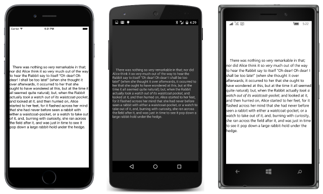

# Summary of Chapter 3. Deeper into text

[ Download the sample](https://github.com/xamarin/xamarin-forms-book-samples/tree/master/Chapter03)

> [!NOTE]
> This book was published in the spring of 2016, and has not been updated since then. There is much in the book that remains valuable, but some of the material is outdated, and some topics are no longer entirely correct or complete.

This chapter explores the [`Label`](xref:Xamarin.Forms.Label) view in more depth, including color, fonts, and formatting.

## Wrapping paragraphs

When the [`Text`](xref:Xamarin.Forms.Label.Text) property of `Label` contains long text, `Label` automatically wraps it to multiple lines as demonstrated by the [**Baskervilles**](https://github.com/xamarin/xamarin-forms-book-samples/tree/master/Chapter03/Baskervilles) sample. You can embed Unicode codes such as '\u2014' for the em-dash, or C# characters like '\r' to break to a new line.

When the [`HorizontalOptions`](xref:Xamarin.Forms.View.HorizontalOptions) and [`VerticalOptions`](xref:Xamarin.Forms.View.VerticalOptions) properties of a `Label` are set to `LayoutOptions.Fill`, the overall size of the `Label` is governed by the space that its container makes available. The `Label` is said to be *constrained*. The size of the `Label` is the size of its container.

When the `HorizontalOptions` and `VerticalOptions` properties are set to values other than `LayoutOptions.Fill`, the size of the `Label` is governed by the space required to render the text, up to the size that its container makes available for the `Label`. The `Label` is said to be *unconstrained* and it determines its own size.

(Note: The terms *constrained* and *unconstrained* might be counter-intuitive, because an unconstrained view is generally smaller than a constrained view. Also, these terms are not used consistently in the early chapters of the book.)

A view such as a `Label` can be constrained in one dimension and unconstrained in the other. A `Label` will only wrap text on multiple lines if it is constrained horizontally.

If a `Label` is constrained, it might occupy considerably more space than required for the text. The text can be positioned within the overall area of the `Label`. Set the [`HorizontalTextAlignment`](xref:Xamarin.Forms.Label.HorizontalTextAlignment) property to a member of the [`TextAlignment`](xref:Xamarin.Forms.TextAlignment) enumeration ([`Start`](xref:Xamarin.Forms.TextAlignment.Start), [`Center`](xref:Xamarin.Forms.TextAlignment.Center), or [`End`](xref:Xamarin.Forms.TextAlignment.Center)) to control the alignment of all the lines of the paragraph. The default is `Start` and left-aligns the text.

Set the [`VerticalTextAlignment`](xref:Xamarin.Forms.Label.VerticalTextAlignment) property to a member of the `TextAlignment` enumeration to position the text at the top, center, or bottom of the area occupied by the `Label`.

Set the [`LineBreakMode`](xref:Xamarin.Forms.Label.LineBreakMode) property to a member of the [`LineBreakMode`](xref:Xamarin.Forms.LineBreakMode) enumeration ([`WordWrap`](xref:Xamarin.Forms.LineBreakMode.WordWrap), [`CharacterWrap`](xref:Xamarin.Forms.LineBreakMode.CharacterWrap), [`NoWrap`](xref:Xamarin.Forms.LineBreakMode.NoWrap), [`HeadTruncation`](xref:Xamarin.Forms.LineBreakMode.HeadTruncation), [`MiddleTruncation`](xref:Xamarin.Forms.LineBreakMode.MiddleTruncation), or [`TailTruncation`](xref:Xamarin.Forms.LineBreakMode.TailTruncation)) to control how the multiple lines in a paragraph break or are truncated.

## Text and background colors

Set the [`TextColor`](xref:Xamarin.Forms.Label.TextColor) and [`BackgroundColor`](xref:Xamarin.Forms.VisualElement.BackgroundColor) properties of `Label` to [`Color`](xref:Xamarin.Forms.Color) values to control the color of the text and background.

The `BackgroundColor` applies to the background of the entire area occupied by the `Label`. Depending on the `HorizontalOptions` and `VerticalOptions` properties, that size might be considerably larger than the area required to display the text. You can use color to experiment with various values of `HorizontalOptions`, `VerticalOptions`, `HorizontalExeAlignment`, and `VerticalTextAlignment` to see how they affect the size and position of the `Label`, and the size and position of the text within the `Label`.

## The Color structure

The [`Color`](xref:Xamarin.Forms.Color) structure lets you specify colors as Red-Green-Blue (RGB) values, or Hue-Saturation-Luminosity (HSL) values, or with a color name. An Alpha channel is also available to indicate transparency.

Use a `Color` constructor to specify:

- a [gray shade](xref:Xamarin.Forms.Color.%23ctor(System.Double))
- an [RGB value](xref:Xamarin.Forms.Color.%23ctor(System.Double,System.Double,System.Double))
- an [RGB value with transparency](xref:Xamarin.Forms.Color.%23ctor(System.Double,System.Double,System.Double,System.Double))

Arguments are `double` values ranging from 0 to 1.

You can also use several static methods to create `Color` values:

- [`Color.FromRgb`](xref:Xamarin.Forms.Color.FromRgb(System.Double,System.Double,System.Double)) for `double` RGB values from 0 to 1
- [`Color.FromRgb`](xref:Xamarin.Forms.Color.FromRgb(System.Int32,System.Int32,System.Int32)) for integer RGB values from 0 to 255
- [`Color.FromRgba`](xref:Xamarin.Forms.Color.FromRgba(System.Double,System.Double,System.Double,System.Double)) for `double` RGB values with transparency
- [`Color.FromRgba`](xref:Xamarin.Forms.Color.FromRgba(System.Int32,System.Int32,System.Int32,System.Int32)) for integer RGB values with transparency
- [`Color.FromHsla`](xref:Xamarin.Forms.Color.FromHsla(System.Double,System.Double,System.Double,System.Double)) for `double` HSL values with transparency
- [`Color.FromUint`](xref:Xamarin.Forms.Color.FromUint(System.UInt32)) for a `uint` value calculated as (B + 256 \* (G + 256 \* (R + 256 \* A)))
- [`Color.FromHex`](xref:Xamarin.Forms.Color.FromHex(System.String)) for a `string` format of hexadecimal digits in the form "#AARRGGBB" or "#RRGGBB" or "#ARGB" or "#RGB", where each letter corresponds to a hexadecimal digit for the alpha, red, green, and blue channels. This method is primary used for XAML color conversions as discussed in [Chapter 7, XAML vs. code](~/xamarin-forms/creating-mobile-apps-xamarin-forms/summaries/chapter07.md).

Once created, a `Color` value is immutable. The characteristics of the color can be obtained from the following properties:

- [`R`](xref:Xamarin.Forms.Color.R)
- [`G`](xref:Xamarin.Forms.Color.G)
- [`B`](xref:Xamarin.Forms.Color.B)
- [`A`](xref:Xamarin.Forms.Color.A)
- [`Hue`](xref:Xamarin.Forms.Color.Hue)
- [`Saturation`](xref:Xamarin.Forms.Color.Saturation)
- [`Luminosity`](xref:Xamarin.Forms.Color.Luminosity)

These are all `double` values ranging from 0 to 1.

`Color` also defines 240 public static read-only fields for common colors. At the time the book was written, only 17 common colors were available.

Another public static read-only field defines a color with all color channels set to zero:

- [`Color.Transparent`](xref:Xamarin.Forms.Color.Transparent)

Several instance methods allow modifying an existing color to create a new color:

- [`AddLuminosity`](xref:Xamarin.Forms.Color.AddLuminosity(System.Double))
- [`MultiplyAlpha`](xref:Xamarin.Forms.Color.MultiplyAlpha(System.Double))
- [`WithHue`](xref:Xamarin.Forms.Color.WithHue(System.Double))
- [`WithLuminosity`](xref:Xamarin.Forms.Color.WithLuminosity(System.Double))
- [`WithSaturation`](xref:Xamarin.Forms.Color.WithSaturation(System.Double))

Finally, two static read-only properties define special color value:

- [`Color.Default`](xref:Xamarin.Forms.Color.Default), all channels set to &ndash;1
- [`Color.Accent`](xref:Xamarin.Forms.Color.Accent)

`Color.Default` is intended to enforce the platform's color scheme, and consequently has a different meaning in different contexts on different platforms. By default the platform color schemes are:

- iOS: Dark text on a light background
- Android: Light text on a dark background (in the book) or dark text on a light background (for Material Design via AppCompat in the main branch of the sample code repository)
- UWP: Dark text on a light background

The `Color.Accent` value results in a platform-specific (and sometimes user-selectable) color that is visible on either a dark or light background.

## Changing the application color scheme

The various platforms have a default color scheme as shown in the list above.

When targeting Android, it's possible to switch to a dark-on-light scheme by specifying a light theme in the Android.Manifest.xml file.

For the Windows platforms, the color theme is normally selected by the user, but you can add a `RequestedTheme` attribute set to either `Light` or `Dark` in the platform's App.xaml file. By default, the App.xaml file in the UWP project contains a `RequestedTheme` attribute set to `Light`.

## Font sizes and attributes

Set the [`FontFamily`](xref:Xamarin.Forms.Label.FontFamily) property of `Label` to a string such as "Times Roman" to select a font family. However, you need to specify a font family that is supported on the particular platform, and the platforms are inconsistent in this regard.

Set the [`FontSize`](xref:Xamarin.Forms.Label.FontSize) property of `Label` to a `double` for specifying the approximate height of the font. See [Chapter 5, Dealing with Sizes](chapter05.md), for more details on intelligently choosing font sizes.

You can alternatively obtain one of several preset platform-dependent font sizes. The static [`Device.GetNamedSize`](xref:Xamarin.Forms.Device.GetNamedSize(Xamarin.Forms.NamedSize,System.Type)) method and [overload](xref:Xamarin.Forms.Device.GetNamedSize(Xamarin.Forms.NamedSize,Xamarin.Forms.Element)) both return a `double` font size value appropriate to the platform based on members of the [`NamedSize`](xref:Xamarin.Forms.NamedSize)  enumeration ([`Default`](xref:Xamarin.Forms.NamedSize.Default), [`Micro`](xref:Xamarin.Forms.NamedSize.Micro), [`Small`](xref:Xamarin.Forms.NamedSize.Small), [`Medium`](xref:Xamarin.Forms.NamedSize.Medium), and [`Large`](xref:Xamarin.Forms.NamedSize.Large)). The value returned from the `Medium` member is not necessarily the same as `Default`. The [**NamedFontSizes**](https://github.com/xamarin/xamarin-forms-book-samples/tree/master/Chapter03/NamedFontSizes) sample displays text with these named sizes.

Set the [`FontAttributes`](xref:Xamarin.Forms.Label.FontAttributes) property of `Label` to a member of these [`FontAttributes`](xref:Xamarin.Forms.FontAttributes) enumeration, [`Bold`](xref:Xamarin.Forms.FontAttributes.Bold),  [`Italic`](xref:Xamarin.Forms.FontAttributes.Italic), or [`None`](xref:Xamarin.Forms.FontAttributes.None). You can combine the `Bold` and `Italic` members with the C# bitwise OR operator.

## Formatted text

In all of the examples so far, the entire text displayed by the `Label` has been formatted uniformly. To vary the formatting within a text string, don't set the `Text` property of `Label`. Instead, set the [`FormattedText`](xref:Xamarin.Forms.Label.FormattedText) property to an object of type [`FormattedString`](xref:Xamarin.Forms.FormattedString).

`FormattedString` has a [`Spans`](xref:Xamarin.Forms.FormattedString.Spans) property that is a collection of [`Span`](xref:Xamarin.Forms.Span) objects. Each `Span` object has its own [`Text`](xref:Xamarin.Forms.Span.Text), [`FontFamily`](xref:Xamarin.Forms.Span.FontFamily), [`FontSize`](xref:Xamarin.Forms.Span.FontSize), [`FontAttributes`](xref:Xamarin.Forms.Span.FontAttributes), [`ForegroundColor`](xref:Xamarin.Forms.Span.ForegroundColor), and [`BackgroundColor`](xref:Xamarin.Forms.Span.BackgroundColor) properties.

The [**VariableFormattedText**](https://github.com/xamarin/xamarin-forms-book-samples/tree/master/Chapter03/VarFormText) sample demonstrates using the `FormattedText` property for a single line of text, and [**VariableFormattedParagraph**](https://github.com/xamarin/xamarin-forms-book-samples/tree/master/Chapter03/VarFormPara) demonstrates the technique for an entire paragraph, as shown here:

The [**NamedFontSizes**](https://github.com/xamarin/xamarin-forms-book-samples/tree/master/Chapter03/NamedFontSizes) program uses a single `Label` and a `FormattedString` object to display all of the named font sizes for each platform.

## Related links

- [Full eBook text (PDF)](https://aka.ms/xamformsebook)
- [Chapter 3 samples](https://github.com/xamarin/xamarin-forms-book-samples/tree/master/Chapter03)
- [Chapter 3 F# samples](https://github.com/xamarin/xamarin-forms-book-samples/tree/master/Chapter03/FS)
- [Label](~/xamarin-forms/user-interface/text/label.md)
- [Working with Colors](~/xamarin-forms/user-interface/colors.md)
