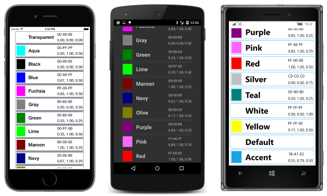

# Summary of Chapter 4. Scrolling the stack

This chapter is primarily devoted to introducing the concept of *layout*, which is the overall term for the classes and techniques that Xamarin.Forms uses to organize the visual display of multiple views on the page.

Layout involves several classes that derive from [`Layout`](https://developer.xamarin.com/api/type/Xamarin.Forms.Layout/) and  [`Layout<T>`](https://developer.xamarin.com/api/type/Xamarin.Forms.Layout%3CT%3E/). This chapter focuses on [`StackLayout`](https://developer.xamarin.com/api/type/Xamarin.Forms.StackLayout/).

Also introduced in this chapter are the [`ScrollView`](https://developer.xamarin.com/api/type/Xamarin.Forms.ScrollView/), [`Frame`](https://developer.xamarin.com/api/type/Xamarin.Forms.Frame/), and [`BoxView`](https://developer.xamarin.com/api/type/Xamarin.Forms.BoxView/) classes.

## Stacks of views

[`StackLayout`](https://developer.xamarin.com/api/type/Xamarin.Forms.StackLayout/) derives from `Layout<View>` and inherits a [`Children`](https://developer.xamarin.com/api/type/Xamarin.Forms.Layout%3CT%3E/) property of type `IList<View>`. You add multiple view items to this collection, and `StackLayout` displays them in a horizontal or vertical stack.

Set the [`Orientation`](https://developer.xamarin.com/api/property/Xamarin.Forms.StackLayout.Orientation/) property of `StackLayout` to a member of the [`StackOrientation`](https://developer.xamarin.com/api/type/Xamarin.Forms.StackOrientation/) enumeration, either [`Vertical`](https://developer.xamarin.com/api/field/Xamarin.Forms.StackOrientation.Vertical/) or [`Horizontal`](https://developer.xamarin.com/api/field/Xamarin.Forms.StackOrientation.Horizontal/). The default is `Vertical`.

Set the [`Spacing`](https://developer.xamarin.com/api/property/Xamarin.Forms.StackLayout.Spacing/) property of `StackLayout` to a `double` value to specify a spacing between the children. The default value is 6.

In code, you can add items to the `Children` collection of `StackLayout` in a `for` or `foreach` loop as demonstrated in the
[**ColorLoop**](https://github.com/xamarin/xamarin-forms-book-samples/tree/master/Chapter04/ColorLoop) sample, or you can initialize the `Children` collection with a list of the individual views as demonstrated in
[**ColorList**](https://github.com/xamarin/xamarin-forms-book-samples/tree/master/Chapter04/ColorList). The children must derive from `View` but can include other `StackLayout` objects.

## Scrolling content

If a `StackLayout` contains too many children to display on a page, you can put the `StackLayout` in a [`ScrollView`](https://developer.xamarin.com/api/type/Xamarin.Forms.ScrollView/) to allow scrolling.

Set the [`Content`](https://developer.xamarin.com/api/property/Xamarin.Forms.ScrollView.Content/) property of `ScrollView` to the view you want to scroll. This is often a `StackLayout`, but it can be any view.

Set the [`Orientation`](https://developer.xamarin.com/api/property/Xamarin.Forms.ScrollView.Orientation/) property of `ScrollView` to a member of the [`ScrollOrientation`](https://developer.xamarin.com/api/type/Xamarin.Forms.ScrollOrientation/) property, [`Vertical`](https://developer.xamarin.com/api/field/Xamarin.Forms.ScrollOrientation.Vertical/), [`Horizontal`](https://developer.xamarin.com/api/field/Xamarin.Forms.ScrollOrientation.Horizontal/), or [`Both`](https://developer.xamarin.com/api/field/Xamarin.Forms.ScrollOrientation.Both/). The default is `Vertical`. If the content of a `ScrollView` is a `StackLayout`, the two orientations should be consistent.

The [**ReflectedColors**](https://github.com/xamarin/xamarin-forms-book-samples/tree/master/Chapter04/ReflectedColors) sample demonstrates the use of `ScrollView` and `StackLayout` to display the available colors. The sample also demonstrates how to use .NET reflection to obtain all the public static properties and fields of the `Color` structure without the need to explicitly list them.

## The Expands option

When a `StackLayout` stacks its children, each child occupies a particular slot within the total height of the `StackLayout` that depends on the child's size and the settings of its `HorizontalOptions` and `VerticalOptions` properties. These properties are assigned values of type [`LayoutOptions`](http://developer.xamstage.com/api/type/Xamarin.Forms.LayoutOptions/).

The `LayoutOptions` structure defines two properties:

- [`Alignment`](https://developer.xamarin.com/api/property/Xamarin.Forms.LayoutOptions.Alignment/) of the enumeration type [`LayoutAlignment`](https://developer.xamarin.com/api/type/Xamarin.Forms.LayoutAlignment/) with four members, [`Start`](https://developer.xamarin.com/api/field/Xamarin.Forms.LayoutAlignment.Start/), [`Center`](https://developer.xamarin.com/api/field/Xamarin.Forms.LayoutAlignment.Center/), [`End`](https://developer.xamarin.com/api/field/Xamarin.Forms.LayoutAlignment.End/), and [`Fill`](https://developer.xamarin.com/api/field/Xamarin.Forms.LayoutAlignment.Fill/)
- [`Expands`](https://developer.xamarin.com/api/property/Xamarin.Forms.LayoutOptions.Expands/) of type `bool`

For your convenience, the `LayoutOptions` structure also defines eight static read-only fields of type `LayoutOptions` that encompass all combinations of the two instance properties:

- [`LayoutOptions.Start`](https://developer.xamarin.com/api/field/Xamarin.Forms.LayoutOptions.Start/)
- [`LayoutOptions.Center`](https://developer.xamarin.com/api/field/Xamarin.Forms.LayoutOptions.Center/)
- [`LayoutOptions.End`](https://developer.xamarin.com/api/field/Xamarin.Forms.LayoutOptions.End/)
- [`LayoutOptions.Fill`](https://developer.xamarin.com/api/field/Xamarin.Forms.LayoutOptions.Fill/)
- [`LayoutOptions.StartAndExpand`](https://developer.xamarin.com/api/field/Xamarin.Forms.LayoutOptions.StartAndExpand/)
- [`LayoutOptions.CenterAndExpand`](https://developer.xamarin.com/api/field/Xamarin.Forms.LayoutOptions.CenterAndExpand/)
- [`LayoutOptions.EndAndExpand`](https://developer.xamarin.com/api/field/Xamarin.Forms.LayoutOptions.EndAndExpand/)
- [`LayoutOptions.FillAndExpand`](https://developer.xamarin.com/api/field/Xamarin.Forms.LayoutOptions.FillAndExpand/)

The following discussion involves a `StackLayout` with a default vertical orientation. The horizontal `StackLayout` is analogous.

For a vertical `StackLayout`, the `HorizontalOptions` setting determines how a child is horizontally positioned within the width of the `StackLayout`. An `Alignment` setting of `Start`, `Center`, or `End` causes the child to be horizontally unconstrained. The child determines its own width and is positioned at the left, center, or right of the `StackLayout`. The `Fill` option causes the child to be horizontally constrained and fills the width of the `StackLayout`.

For a vertical `StackLayout`, each child is vertically unconstrained and gets a vertical slot depending on the child's height, in which case the `VerticalOptions` setting is irrelevant.

If the vertical `StackLayout` itself is unconstrained&#x2014;that is if its `VerticalOptions` setting is `Start`, `Center`, or `End`, then the height of the `StackLayout` is the total height of its children.

However, if the vertical `StackLayout` is vertically constrained&#x2014;if its `VerticalOptions` setting is `Fill`&#x2014;then the height of the `StackLayout` will be the height of its container, which might be greater than the total height of its children. If that is the case, and if at least one child has a `VerticalOptions` setting with an `Expands` flag of `true`, then the extra space in the `StackLayout` is allocated equally among all those children with an `Expands` flag of `true`. The total height of the children will then equal the height of the `StackLayout`, and the `Alignment` part of the `VerticalOptions` setting determines how the child is vertically positioned in its slot.

This is demonstrated in the [**VerticalOptionsDemo**](https://github.com/xamarin/xamarin-forms-book-samples/tree/master/Chapter04/VerticalOptionsDemo) sample.

## Frame and BoxView

These two rectangular views are often used for presentation purposes.

The [`Frame`](https://developer.xamarin.com/api/type/Xamarin.Forms.Frame/) view displays a rectangular frame around another view, which can be a layout such as `StackLayout`. `Frame` inherits a [`Content`](https://developer.xamarin.com/api/property/Xamarin.Forms.ContentView.Content/) property from [`ContentView`](https://developer.xamarin.com/api/type/Xamarin.Forms.ContentView/) that you set to the view to be displayed within the `Frame`. The `Frame` is transparent by default. Set the following three properties to customize the frame's appearance:

- The [`OutlineColor`](https://developer.xamarin.com/api/property/Xamarin.Forms.Frame.OutlineColor/) property to make it visible. It is common to set `OutlineColor` to `Color.Accent` when you don't know the underlying color scheme.
- The [`HasShadow`](https://developer.xamarin.com/api/property/Xamarin.Forms.Frame.HasShadow/) property can be set to `true` to display a black shadow on iOS devices.
- Set the [`Padding`](https://developer.xamarin.com/api/property/Xamarin.Forms.Layout.Padding/) property to a `Thickness` value to leave a space between the frame and the frame's content. The default value is 20 units on all sides.

The `Frame` has default `HorizontalOptions` and `VerticalOptions` values of `LayoutOptions.Fill`, which means that the `Frame` will fill its container. With other settings, the size of the `Frame` is based on the size of its content.

The `Frame` is demonstrated in the [**FramedText**](https://github.com/xamarin/xamarin-forms-book-samples/tree/master/Chapter04/FramedText) sample.

The [`BoxView`](https://developer.xamarin.com/api/type/Xamarin.Forms.BoxView/) displays a rectangular area of color specified by its [`Color`](https://developer.xamarin.com/api/property/Xamarin.Forms.BoxView.Color/) property.

If the `BoxView` is constrained (its `HorizontalOptions` and `VerticalOptions` properties have their default settings of `LayoutOptions.Fill`), the `BoxView` fills the space available for it. If the `BoxView` is unconstrained (with `HorizontalOptions` and `LayoutOptions` settings of `Start`, `Center`, or `End`), it has a default dimension of 40 units square. A `BoxView` can be constrained in one dimension and unconstrained in the other.

Often, you'll set the the [`WidthRequest`](https://developer.xamarin.com/api/property/Xamarin.Forms.VisualElement.WidthRequest/) and [`HeightRequest`](https://developer.xamarin.com/api/property/Xamarin.Forms.VisualElement.HeightRequest/) properties of `BoxView` to give it a specific size. This is illustrated by the [**SizedBoxView**](https://github.com/xamarin/xamarin-forms-book-samples/tree/master/Chapter04/SizedBoxView) sample.

You can use several instances of `StackLayout` to combine a `BoxView` and several `Label` instances in a `Frame` to display a particular color, and then put each of these views in a `StackLayout` in a `ScrollView` to create the attractive list of colors shown in the [**ColorBlocks**](https://github.com/xamarin/xamarin-forms-book-samples/tree/master/Chapter04/ColorBlocks) sample:

## A ScrollView in a StackLayout?

Putting a `StackLayout` in a `ScrollView` is common, but putting a `ScrollView` in a `StackLayout` is also sometimes convenient. In theory, this shouldn't be possible because the children of a vertical `StackLayout` are vertically unconstrained. But a `ScrollView` must be vertically constrained. It must be given a specific height so that it can then determine the size of its child for scrolling.

The trick is to give the `ScrollView` child of the `StackLayout` a `VerticalOptions` setting of `FillAndExpand`. This is demonstrated in the [**BlackCat**](https://github.com/xamarin/xamarin-forms-book-samples/tree/master/Chapter04/BlackCat) sample.

The **BlackCat** sample also demonstrates how to define and access program resources that are embedded in the Portable Class Library (PCL). This can also be achieved with Shared Asset Projects (SAPs) but the process is a little trickier, as the [**BlackCatSap**](https://github.com/xamarin/xamarin-forms-book-samples/tree/master/Chapter04/BlackCatSap) sample demonstrates.

## Related Links

- [Chapter 4 full text (PDF)](https://download.xamarin.com/developer/xamarin-forms-book/XamarinFormsBook-Ch04-Apr2016.pdf)
- [Chapter 4 samples](https://github.com/xamarin/xamarin-forms-book-samples/tree/master/Chapter04)
- [Chapter 4 F# samples](https://github.com/xamarin/xamarin-forms-book-samples/tree/master/Chapter04/FS)
- [StackLayout](~/xamarin-forms/user-interface/layouts/stack-layout.md)
- [ScrollView](~/xamarin-forms/user-interface/layouts/scroll-view.md)
