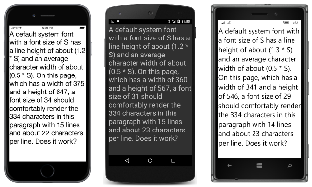

# Summary of Chapter 5. Dealing with sizes

[ Download the sample](https://github.com/xamarin/xamarin-forms-book-samples/tree/master/Chapter05)

> [!NOTE]
> This book was published in the spring of 2016, and has not been updated since then. There is much in the book that remains valuable, but some of the material is outdated, and some topics are no longer entirely correct or complete.

Several sizes in Xamarin.Forms have been encountered so far:

- The height of the iOS status bar is 20
- The `BoxView` has a default width and height of 40
- The default `Padding` in a `Frame` is 20
- The default `Spacing` on the `StackLayout` is 6
- The `Device.GetNamedSize` method returns a numeric font size

These sizes are not pixels. Instead, they are device-independent units recognized independently by each platform.

## Pixels, points, dps, DIPs, and DIUs

Early in the histories of the Apple Mac and Microsoft Windows, programmers worked in units of pixels. However, the advent of higher-resolution displays required a more virtualized and abstract approach to screen coordinates. In the Mac world, programmers worked in units of *points*, traditionally 1/72 inch, while Windows developers used *device-independent units* (DIUs) based on 1/96 inch.

Mobile devices, however, are generally held much closer to the face and have a higher resolution than desktop screens, which implies that a greater pixel density can be tolerated.

Programmers targeting Apple iPhone and iPad devices continue to work in units of *points*, but there are 160 of these points to the inch. Depending on the device, there may be 1, 2, or 3 pixels to the point.

Android is similar. Programmers work in units of *density-independent pixels* (dps), and the relationship between dps and pixels is based on 160 dps to the inch.

Windows phones and mobile devices have also established scaling factors that imply something close to 160 device-independent units to the inch.

> [!NOTE]
> Xamarin.Forms no longer supports any Windows-based phone or mobile device.

In summary, a Xamarin.Forms programmer targeting phones and tablets can assume that all units of measurement are based on the following criterion:

- 160 units to the inch, equivalent to
- 64 units to the centimeter

The read-only [`Width`](xref:Xamarin.Forms.VisualElement.Width) and [`Height`](xref:Xamarin.Forms.VisualElement.Height) properties defined by `VisualElement` have default "mock" values of &ndash;1. Only when an element has been sized and accommodated in layout will these properties reflect the actual size of the element in device-independent units. This size includes any `Padding` set on the element but not the `Margin`.

A visual element fires the [`SizeChanged`](xref:Xamarin.Forms.VisualElement.SizeChanged) event when its `Width` or `Height` has changed. The [**WhatSize**](https://github.com/xamarin/xamarin-forms-book-samples/tree/master/Chapter05/WhatSize) sample uses this event to display the size of the program's screen.

## Metrical sizes

The [**MetricalBoxView**](https://github.com/xamarin/xamarin-forms-book-samples/tree/master/Chapter05/MetricalBoxView) uses [`WidthRequest`](xref:Xamarin.Forms.VisualElement.WidthRequest) and [`HeightRequest`](xref:Xamarin.Forms.VisualElement.HeightRequest) to display a `BoxView` one inch tall and one centimeter wide.

## Estimated font sizes

The [**FontSizes**](https://github.com/xamarin/xamarin-forms-book-samples/tree/master/Chapter05/FontSizes) sample shows how to use the 160-units-to-the-inch rule to specify font sizes in units of points. The visual consistency among the platforms using this technique is better than `Device.GetNamedSize`.

## Fitting text to available size

It's possible to fit a block of text within a particular rectangle by calculating a `FontSize` of the `Label` using the following criteria:

- Line spacing is 120% of the font size (130% on the Windows platforms).
- Average character width is 50% of the font size.

The [**EstimatedFontSize**](https://github.com/xamarin/xamarin-forms-book-samples/tree/master/Chapter05/EstimatedFontSize) sample demonstrates this technique. This program was written before the [`Margin`](xref:Xamarin.Forms.View.Margin) property was available, so it uses a [`ContentView`](xref:Xamarin.Forms.ContentView) with a [`Padding`](xref:Xamarin.Forms.Layout.Padding) setting to simulate a margin.

## A fit-to-size clock

The [**FitToSizeClock**](https://github.com/xamarin/xamarin-forms-book-samples/tree/master/Chapter05/FitToSizeClock) sample demonstrates using  [`Device.StartTimer`](xref:Xamarin.Forms.Device.StartTimer(System.TimeSpan,System.Func{System.Boolean})) to start a timer that periodically notifies the application when it's time to update the clock. The font size is set to one-sixth of the page width to make the display as large as possible.

## Accessibility issues

The **EstimatedFontSize** program and the **FitToSizeClock** program both contain a subtle flaw: If the user changes the phone's accessibility settings on Android or Windows 10 Mobile, the program no longer can estimate how large the text is rendered based on the font size. The [**AccessibilityTest**](https://github.com/xamarin/xamarin-forms-book-samples/tree/master/Chapter05/AccessibilityTest) sample demonstrates this problem.

## Empirically fitting text

Another way to fit text to a rectangle is to empirically calculate the rendered text size and adjust it up or down. The program in the book calls [`GetSizeRequest`](xref:Xamarin.Forms.VisualElement.GetSizeRequest(System.Double,System.Double)) on a visual element to obtain the element's desired size. That method has been deprecated, and programs should instead call [`Measure`](xref:Xamarin.Forms.VisualElement.Measure(System.Double,System.Double,Xamarin.Forms.MeasureFlags)).

For a `Label`, the first argument should be the width of the container (to allow wrapping), while the second argument should be set to `Double.PositiveInfinity` to make the height unconstrained. The [**EmpiricalFontSize**](https://github.com/xamarin/xamarin-forms-book-samples/tree/master/Chapter05/EmpiricalFontSize) sample demonstrates this technique.

## Related links

- [Full eBook text (PDF)](https://aka.ms/xamformsebook)
- [Chapter 5 samples](https://github.com/xamarin/xamarin-forms-book-samples/tree/master/Chapter05)
- [Chapter 5 F# samples](https://github.com/xamarin/xamarin-forms-book-samples/tree/master/Chapter05/FS)
