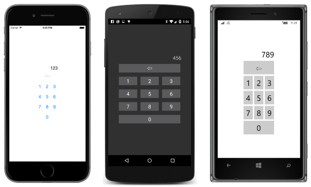

# Summary of Chapter 6. Button clicks

[ Download the sample](https://github.com/xamarin/xamarin-forms-book-samples/tree/master/Chapter06)

> [!NOTE]
> This book was published in the spring of 2016, and has not been updated since then. There is much in the book that remains valuable, but some of the material is outdated, and some topics are no longer entirely correct or complete.

The [`Button`](xref:Xamarin.Forms.Button) is the view that allows the user to initiate a command. A `Button` is identified by text (and optionally an image as demonstrated in [Chapter 13, Bitmaps](chapter13.md)). Consequently, `Button` defines many of the same properties as `Label`:

- [`Text`](xref:Xamarin.Forms.Button.Text)
- [`FontFamily`](xref:Xamarin.Forms.Button.FontFamily)
- [`FontSize`](xref:Xamarin.Forms.Button.FontSize)
- [`FontAttributes`](xref:Xamarin.Forms.Button.FontAttributes)
- [`TextColor`](xref:Xamarin.Forms.Button.TextColor)

`Button` also defines three properties that govern the appearance of its border, but the support of these properties and their mutual independence is platform specific:

- [`BorderColor`](xref:Xamarin.Forms.Button.BorderColor) of type `Color`
- [`BorderWidth`](xref:Xamarin.Forms.Button.BorderWidth) of type `Double`
- [`BorderRadius`](xref:Xamarin.Forms.Button.BorderRadius) of type `Double`

`Button` also inherits all the properties of `VisualElement` and `View`, including `BackgroundColor`, `HorizontalOptions`, and `VerticalOptions`.

## Processing the click

The `Button` class defines a [`Clicked`](xref:Xamarin.Forms.Button.Clicked) event that is fired when the user taps the `Button`. The `Click` handler is of type `EventHandler`. The first argument is the `Button` object generating the event; the second argument is an `EventArgs` object that provides no additional information.

The [**ButtonLogger**](https://github.com/xamarin/xamarin-forms-book-samples/tree/master/Chapter06/ButtonLogger) sample demonstrates simple `Clicked` handling.

## Sharing button clicks

Multiple `Button` views can share the same `Clicked` handler, but the handler generally needs to determine which `Button` is responsible for a particular event. One approach is to store the various `Button` objects as fields and check which one is firing the event in the handler.

The [**TwoButtons**](https://github.com/xamarin/xamarin-forms-book-samples/tree/master/Chapter06/TwoButtons) sample demonstrates this technique. The program also demonstrates how to set the [`IsEnabled`](xref:Xamarin.Forms.VisualElement.IsEnabled) property of a `Button` to `false` when pressing the `Button` is no longer valid. A disabled `Button` does not generate a `Clicked` event.

## Anonymous event handlers

It is possible to define `Clicked` handlers as anonymous lambda functions, as the [**ButtonLambdas**](https://github.com/xamarin/xamarin-forms-book-samples/tree/master/Chapter06/ButtonLambdas) sample demonstrates. However, anonymous handlers can't be shared without some messy reflection code.

## Distinguishing views with IDs

Multiple `Button` objects can also be distinguished by setting the [`StyleId`](xref:Xamarin.Forms.Element.StyleId) property or [`AutomationId`](xref:Xamarin.Forms.Element.AutomationId) property to a `string`. This property is defined by `Element` but it is not used within Xamarin.Forms. It is intended to be used solely by application programs.

The [**SimplestKeypad**](https://github.com/xamarin/xamarin-forms-book-samples/tree/master/Chapter06/SimplestKeypad) sample uses the same event handler for all 10 number keys on a numeric keypad and distinguishes between them with the `StyleId` property:

## Saving transient data

Many applications need to save data when a program is terminated and to reload that data when the program starts up again. The [`Application`](xref:Xamarin.Forms.Application) class defines several members that help your program save and restore transient data:

- The [`Properties`](xref:Xamarin.Forms.Application.Properties) property is a dictionary with `string` keys and `object` items. The contents of the dictionary are automatically saved in application local storage prior to program termination, and reloaded when the program starts up.
- The `Application` class defines three protected virtual methods that the program's standard `App` class overrides: [`OnStart`](xref:Xamarin.Forms.Application.OnStart), [`OnSleep`](xref:Xamarin.Forms.Application.OnSleep), and [`OnResume`](xref:Xamarin.Forms.Application.OnResume). These refer to *application lifecycle* events.
- The [`SavePropertiesAsync`](xref:Xamarin.Forms.Application.SavePropertiesAsync) method saves the contents of the dictionary.

It is not necessary to call `SavePropertiesAsync`. The contents of the dictionary are automatically saved prior to program termination and retrieved before program startup. It's useful during program testing to save data if the program crashes.

Also useful is:

- [`Application.Current`](xref:Xamarin.Forms.Application.Current), a static property that returns the current `Application` object that you can then use to obtain the `Properties` dictionary.

The first step is to identify all the variables on the page that you want to persist when the program terminates. If you know all the places where those variables change, you can simply add them to the `Properties` dictionary at that point. In the page's constructor, you can set the variables from the `Properties` dictionary if the key exists.

A larger program will probably need to deal with application lifecycle events. The most important is the `OnSleep` method. A call to this method indicates that the program has left the foreground. Perhaps the user has pressed the **Home** button on the device, or displayed all the applications, or is shutting down the phone. A call to `OnSleep` is the only notification that a program receives before it is terminated. The program should take this opportunity to ensure that the `Properties` dictionary is up to date.

A call to `OnResume` indicates that the program did not terminate following the last call to `OnSleep` but is now running in the foreground again. The program might use this opportunity to refresh internet connections (for example).

A call to `OnStart` occurs during program startup. It is not necessary to wait until this method call to access the `Properties` dictionary because the contents have already been restored when the `App` constructor is called.

The [**PersistentKeypad**](https://github.com/xamarin/xamarin-forms-book-samples/tree/master/Chapter06/PersistentKeypad) sample is very similar to **SimplestKeypad** except that the program uses the `OnSleep` override to save the current keypad entry, and the page constructor to restore that data.

> [!NOTE]
> Another approach to saving program settings is provided by the Xamarin.Essentials [Preferences](~/essentials/preferences.md) class.

## Related links

- [Full eBook text (PDF)](https://aka.ms/xamformsebook)
- [Chapter 6 samples](https://github.com/xamarin/xamarin-forms-book-samples/tree/master/Chapter06)
- [Chapter 6 F# samples](https://github.com/xamarin/xamarin-forms-book-samples/tree/master/Chapter06/FS)
- [Xamarin.Forms Button](~/xamarin-forms/user-interface/button.md)
